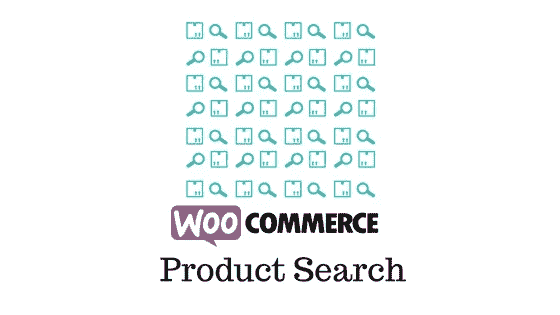
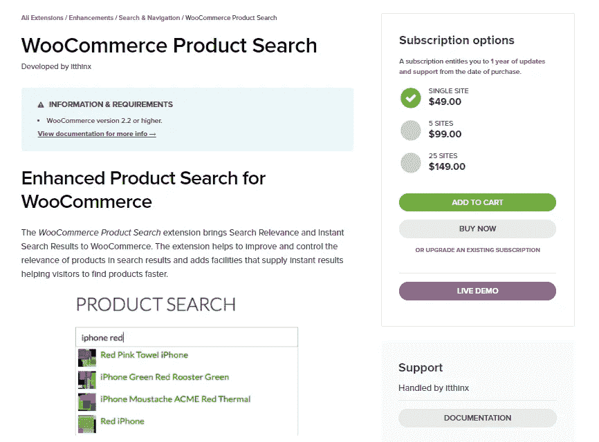
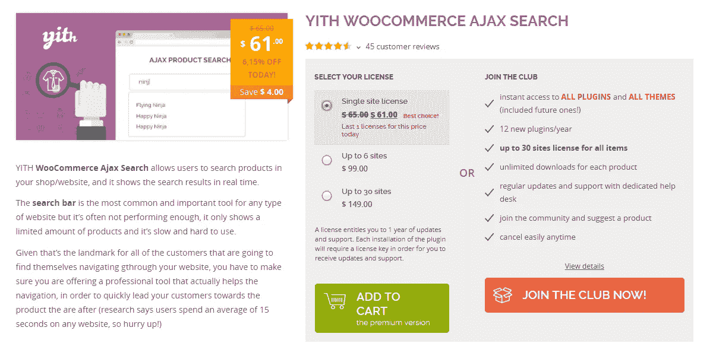
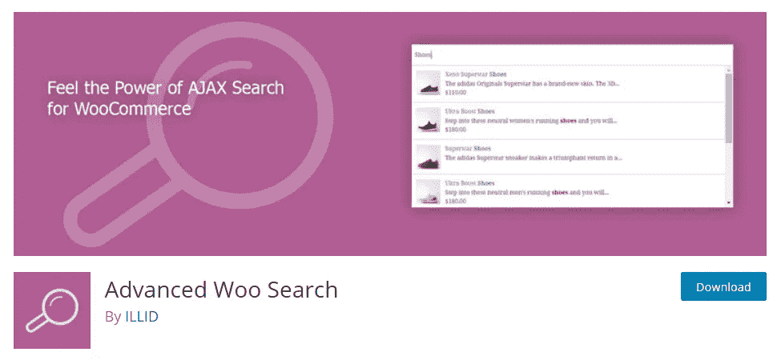
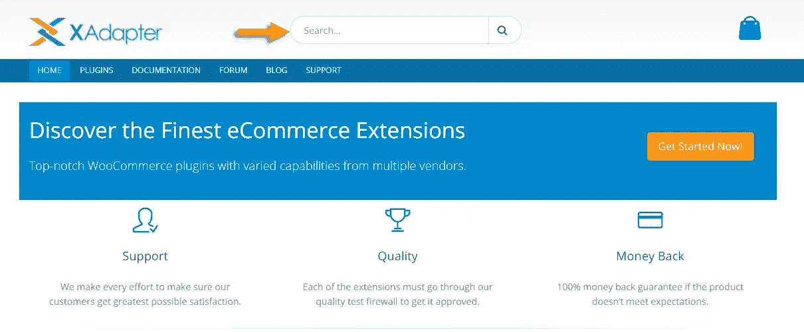
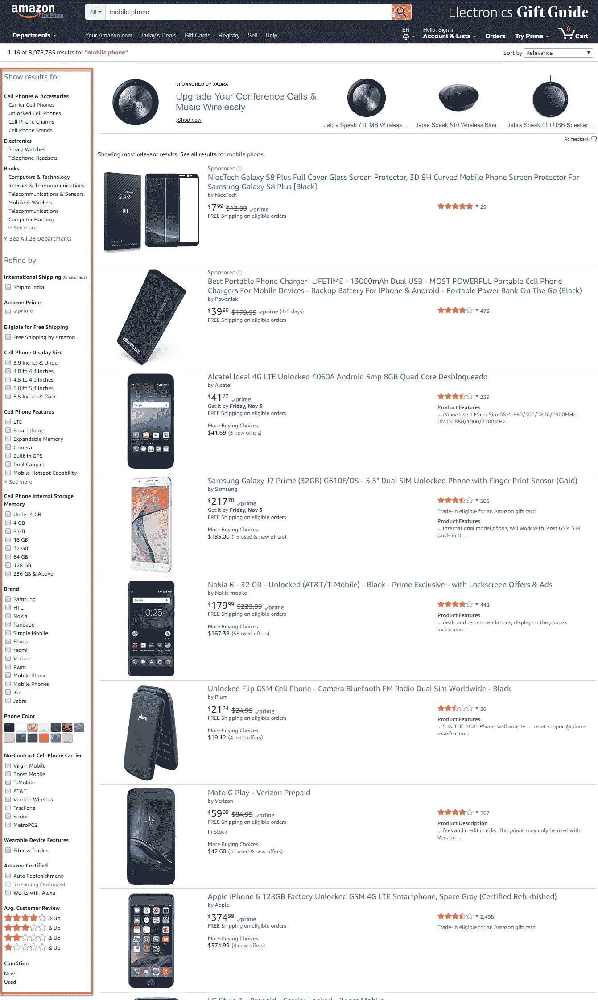

# 通过更好的 WooCommerce 产品搜索提高转化率

> 原文：<https://medium.com/hackernoon/increase-conversions-with-better-woocommerce-product-search-e03ec7f23ff7>

你的 WooCommerce 商店更好的搜索功能可以有效地促进你的转化。然而，它并不像电子邮件营销等其他流行策略那样受到高度重视。如果你稍微注意优化你的商店的搜索，你可以保证你的商店有更好的客户体验。WooCommerce 基础版有搜索字段，但在提供相关结果方面往往有所欠缺。相比之下，有相当多的扩展可以为你的 WooCommerce 产品搜索增加更多的相关性和更快的结果。本文研究了其中的一些，并探索了优化搜索特性的明显优势。

# [WooCommerce 扩展](https://woocommerce.com/products/woocommerce-product-search/)

在 WooCommerce 产品搜索扩展的帮助下，您可以为您的商店带来更多相关性和即时搜索结果。因此，您的访问者将能够在您的网站上找到他们正在搜索的产品。这反过来会对你的店铺转化率产生积极影响。

搜索结果的显著改进是通过利用搜索权重来实现的。您可以通过在产品标题、摘录、内容和标签中查找关键字匹配来设置搜索结果的优先级。基本上，如果你想设置一个产品在另一个之前显示，你可以在搜索权重中给一个更高的值。如果产品标题的搜索权重设置为 50，则每当用户键入一个关键字时，相关性就会增加。例如，如果你的产品是蛇果苹果，当用户键入“红苹果”时，相关性增加 100 (50+50)。您可以类似地为其他方面设置权重，如产品简短描述、内容、标签等。

# 根据你产品的性质设定搜索策略

作为商店所有者，这可以让您更好地管理商店的搜索结果。此外，该扩展提供了新的控件，可以增加产品类别以及单个产品搜索的相关性。

还有实时搜索选项，访问者可以开始输入他们要找的内容，扩展会显示相关结果。这将有助于顾客更快地在你的商店找到产品。这个扩展的另一个很棒的方面是你可以把搜索字段放在网站的任何地方。您可以通过使用小部件、短代码和模板 API 函数来实现这一点。

该插件可以以 49 美元的价格购买，用于单一站点订阅。

# [YITH AJAX 搜索](https://yithemes.com/themes/plugins/yith-woocommerce-ajax-search/)

如果你的商店的搜索栏非常有限，并且并不总是给出相关的结果，你就需要立即增强它。当用户在你的商店中搜索产品时，这个插件在为他们提供快速结果方面帮助很大。如果潜在客户在你的网站上找不到他们想要的东西，他们可能会去别的地方。YITH Ajax 搜索插件有助于管理您网站上的产品搜索，以获得更好的销售结果。

你也可以利用商店的产品搜索功能来有效地推广插件。通常，用户使用关键词进行搜索，您可以在产品标题、类别和标签中有策略地设置这些关键词。如果你能在搜索结果中很好地总结你的产品特征，包括任何折扣，转化的机会就更大。

# 显示产品预览以获得更好的转化率

在这个插件的帮助下，你可以在搜索结果中显示带有描述、价格和图片的产品预览。这非常有助于引起人们对你的产品的兴趣。而且，如果你有任何折扣优惠，那么在搜索结果中显示它会增加转化的机会。同样，您也可以创建自定义标签，以表明某个特定产品是正在进行的促销活动的一部分。此外，还有高级搜索设置，让您的用户选择他们想要的搜索方式。例如，可以专门在类别、标签、摘录等方面进行搜索。

它兼容 WooCommerce 多厂商插件和 WPML。这个插件的普通许可费是 65 美元。

# [高级 Woo 搜索](https://wordpress.org/plugins/advanced-woo-search/)

这是一个强大的 WordPress 插件，可以帮助你在 WooCommerce 商店上进行实时搜索。有了这个插件，你可以在你的商店里搜索所有的 WooCommerce 产品。您将能够在产品标题、类别、标签、sku、产品描述和简短描述中设置搜索。要么选择在所有这些参数中一起搜索，要么只在几个特定的参数中搜索。此外，该插件提供了短代码，可以将搜索字段放在网站的任何地方。

该插件还有助于在搜索结果中包含产品图片和价格。如前所述，这是促进网站销售的一个很好的选择。还有一种高级的组织策略，按照搜索源的优先级排列结果。这有点类似于 WooCommerce 插件的搜索权重。例如，假设在一个产品的产品标题和另一个产品的描述中找到了搜索关键字。它将优先考虑标题中有关键字的内容，因为这自然会提高相关性。

这个插件非常用户友好，你可以用最少的努力来设置它，不需要额外的技术知识。你可以从 WordPress 插件库中免费下载这个插件。它兼容 WPML 和谷歌分析，并支持各种产品。

# 获取高级版本以获得更多高级功能

高级 Woo 搜索插件有一个 [pro 版本](https://advanced-woo-search.com/)，提供了更多的附加功能。其中包括搜索结果的多种布局，以及在不同选项卡中显示多个搜索结果的过滤器。您还可以根据需要创建多个定制的搜索表单。专业版也有一个选项，根据类别或标签排除特定产品。此外，您可以为显示的产品图像设置一个源。例如，您可以从特色图片、图库、产品描述等中选择图片。

# WooCommerce 产品搜索的最佳实践

产品搜索是任何电子商务业务的一个重要方面。当在你的 WooCommerce 商店中以优化的方式提供时，它可以帮助显著提高销售和转化率。让我们来看看 WooCommerce 产品搜索的一些最佳实践，它们能为你带来好的结果。

# 将注意力吸引到搜索栏上

决定网站用户体验的一个最重要的方面是导航性。登陆你网站的用户和潜在客户应该能够很容易地找到他们正在寻找的产品。我们已经知道上面提到的插件是如何帮助改进搜索功能的。然而，你在商店中放置搜索栏的方式在邀请人们使用它方面起着重要的作用。大多数在线商店都有一个导航菜单，根据类别和子类别进行组织。虽然这很有帮助，但有时可能会给用户留下很多工作。如果用户不能理解你的类别结构，这可能会让他们感到困惑。

解决这个问题的办法是在你的网站上设置一个有用的搜索栏。然而，仅仅将搜索字段隐藏在一个角落是不行的。你需要把它放在主页上显眼的地方，并鼓励网站访问者使用它。如果你使用吸引人的配色方案，对比你的网站的整体色调，它可以吸引更多的注意力。此外，在搜索字段中保留一些文本，让用户识别其功能也会有所帮助。例如，它应该完全不同于电子邮件注册表单。

此外，搜索结果应该是组织良好的形式，帮助用户区分每个产品。试着在你的网站上加入有用的信息来激励访问者更快地做出购买决定。

# 帮助用户自动完成

即使在用户完成输入之前，用变化来提示你的产品也是非常有用的。通常情况下，顾客会很高兴他们正在寻找的特定产品在你的商店里有售。此外，研究表明，当用户登陆自动完成推荐的产品页面时，转化的机会会增加许多倍。这是你可以通过根据你的客户正在搜索的可能的长尾关键词优化你的网站搜索来实现的。对你的网站上的用户的搜索词做一个好的分析会对设计这样一个策略有很大的帮助。如果你的商店有多个品牌、产品和品种，这一点尤为重要。

# 过滤搜索结果的能力

电子商务客户在搜索产品时通常会不耐烦。因此，提供良好的过滤选项来帮助他们缩小搜索范围是很重要的。如果你的一个产品类别可能有大量的变化，这一点尤其重要。例如，让我们来看一个简单的手机搜索。在下面的截图中，你可以看到页面左侧的过滤选项。选择范围从品牌到规格到颜色。

*Amazon provides extensive filtering options to a simple search term ‘mobile phone’.*

同样，您的用户应该能够使用过滤器选项来找出他们在您的商店中寻找什么。明显的排序选项，基于产品属性(例如，颜色大小等。)还不够。新时代的网上购物者很可能更喜欢基于折扣、新鲜库存等的分类选项。总的来说，一旦用户习惯了在你的网站上找东西，他们就更有可能回来。诀窍是把这变成你的优势。

# 专业处理特定搜索

长搜索词意味着用户正在寻找特定的结果。这适用于任何正在建设搜索排名的站点。如果一个网站能够对这样的长尾关键词进行很好的排名，用户就有更多的机会在那里找到有用的内容。这也适用于特定的站点搜索。将产品标题、类别和变化属性放在一个可搜索的组合中是很重要的。尝试在不同的层次上包含所有可能的与产品相关的搜索词。例如，您可以在“标签”部分对同一属性使用替代词。这样你可以确保你的产品在不同的搜索中显示。

此外，使用长而具体的关键词进行搜索的用户更有可能是认真的购物者。因此，他们获得相关的结果尤为重要。事实上，这将有助于处理购物车放弃，这是网上购物不可避免的现实。

# 有益的面包屑

通常，客户会进行搜索或点击自动完成建议来进入产品页面。向他们提供后退一步的选择尤为重要。这是因为客户在最终确定产品之前会经历多个提炼阶段。在这种情况下，面包屑的有用显示将是一个很好的解决方案。它帮助用户返回到他们的搜索流程的适当级别。这有助于他们以更有条理的方式整理出可用的选项。

# 结论

商品搜索选项经常被店主忽略。但是它在提高用户体验和网站销售转化率方面有很大的潜力。它帮助用户在你的网站上轻松导航，并找到他们正在寻找的产品。像智能自动完成这样的高级工具在这方面肯定会有所帮助。WooCommerce 提供多种解决方案，帮助您建立有效的产品搜索策略。这篇文章试图向你介绍一些最好的 WooCommerce 产品搜索插件。这些插件，再加上一些最佳实践，真的可以帮助提升你的网站的用户体验。如果您想添加见解，请告诉我们。

*原载于 2017 年 10 月 30 日*[*【learnwoo.com】*](http://learnwoo.com/increase-conversions-better-woocommerce-product-search/)*。*