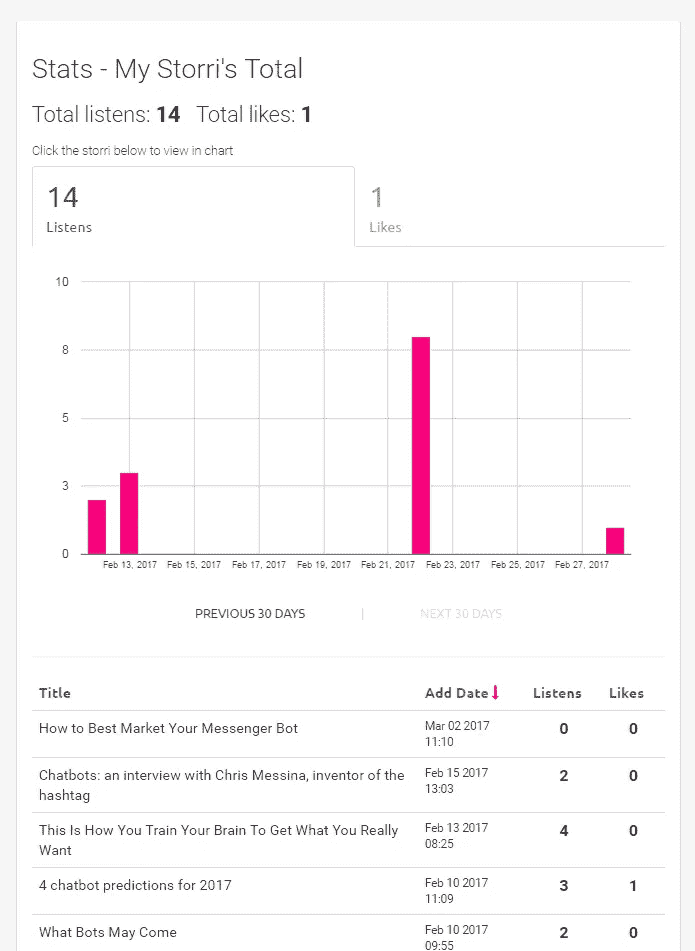

# 通过使用 Amazon Polly 文本到语音转换增加我的输入

> 原文：<https://medium.com/hackernoon/increasing-my-input-by-utilizing-amazon-polly-text-to-speech-62d41631908f>

## 建立一个网络应用程序让它成为可能

每天早上，Medium 好心的给我发邮件，里面有几十个故事让我看。实际上，我每天最多能吃 2-4 个，而且很有可能在白天和晚上睡觉前偶然吃几个。

挑战在于我一天中没有足够的时间去阅读所有我想读的东西。我试过很多像 Instapaper 这样提供文本到语音转换的应用程序，但总觉得它缺少我一直在寻找的功能。所以我造了更好的东西。

Storribook 是一个类似于 Medium 的网站，在这里你可以创建你想要阅读的文章的录制版本，并访问其他人已经录制的文章。当一篇文章结束时，下一篇文章马上开始。

这使我能够在上下班的路上费力地阅读十几篇文章。

←文章本身甚至是 Embed.ly 启用的，可以直接发布到媒体和任何 Wordpress 博客上。

也可以通过创建“书”来整理自己喜欢的文章。

我开始这项工作的一个原因是因为我对聊天机器人日益增长的趋势感兴趣，以及我想深入研究这个主题的愿望。通过创建“聊天机器人”这本书，所有这些文章都存储在一个地方，让我可以比自己阅读更有效地浏览它们。

如果有兴趣，这里有聊天机器人书籍的链接:【https://storribook.com/articles/book/2 

您还可以通过“Stats”链接跟踪每篇记录文章的表现，实现我们都希望看到我们的内容获得关注的愿望。

亚马逊 Polly 并不完美，它听起来仍然像是一台计算机在阅读一篇文章，但它允许我比以前消耗更多的信息。

我还认为，这只是一个更广泛的趋势的开始，即在我们想要的时候，以我们想要的方式消费内容。

下次你在 Medium 上写文章时，创建一个录音版本，接触更广泛的读者，他们可能想看你的文章，但只是时间不够了。

 [## Storribook

### 内容的音频平台

storribook.com](https://storribook.com/) 

> [黑客中午](http://bit.ly/Hackernoon)是黑客如何开始他们的下午。我们是 [@AMI](http://bit.ly/atAMIatAMI) 家庭的一员。我们现在[接受投稿](http://bit.ly/hackernoonsubmission)并乐意[讨论广告&赞助](mailto:partners@amipublications.com)机会。
> 
> 如果你喜欢这个故事，我们推荐你阅读我们的[最新科技故事](http://bit.ly/hackernoonlatestt)和[趋势科技故事](https://hackernoon.com/trending)。直到下一次，不要把世界的现实想当然！

