# 独立创业:成功的要素

> 原文：<https://medium.com/hackernoon/indie-startups-the-ingredients-of-success-74531fe3a019>

独立创业公司是利用我们的空闲时间和闲钱作为副业开始的小企业。“车库”业务可能是一个更熟悉的术语，它让人想起一个可能更个人化的梦想。他们是失败者，是美国梦的化身，是有抱负的企业家的希望堡垒。在这篇文章中，我分析了超过 40 个蓬勃发展的独立企业的故事，以了解他们成功的原因和共同的因素。我将展示图表数据和我个人的分析，但我鼓励每个读者得出自己的结论。

在我们开始之前，我想对 IndieHackers.com[背后的人](http://www.indiehackers.com)[考特兰·艾伦](https://www.twitter.com/csallen)的工作表示深深的感谢。我所有的数据都来自于在 IndieHackers 上阅读采访，我不能推荐你去那里亲自阅读这些故事。这里分析的匿名数据没有捕捉到采访中散布的智慧和建议。

# 方法学

我通过阅读 IndieHackers.com[网站](http://www.indiehackers.com)上的采访来收集所有数据，并对每个采访进行分析，分析的因素包括月收入、业务类型、该领域的以往经验、营销类型等。我最终通读了 40 多个采访！我对分析更多的特征甚至更多的公司抱有很高的期望，但是我大大低估了这种类型的分析所需的时间投入。更有异国情调的特点，比如“这个想法是从哪里来的？”表面上听起来很棒，但在许多公司中进行分析却很困难。虽然我没有收集这些奇特特征的硬数据，但我将在以后的个人分析中以更随意的方式涉及其中一些。

最后一件事。对于大多数分析，我会给出两个数字，一个是基于所有被研究的企业，另一个是基于最成功的企业。我把最成功的定义为基于月收入的前 15 名。这两组数据可以相互比较，看看是否有一些更成功的人所独有的成分。

# 数据

所有业务的平均月收入:**:19，184 美元(stddev:38，829 美元)**

所有业务的平均启动时间: **10 周**

最成功产品的平均上市时间: **11 周**

# 图表数据

## **业务类型**

*注意:任何没有被标记为“面向企业”的类别都是面向大众而不是专门面向 B2B 的创业公司。*

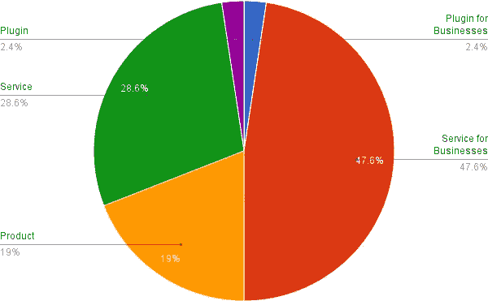

All Businesses

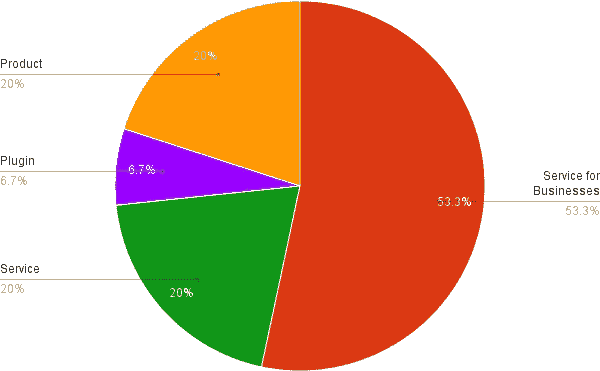

Most Successful

## **支付模式**

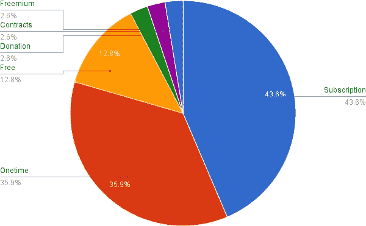

All Businesses

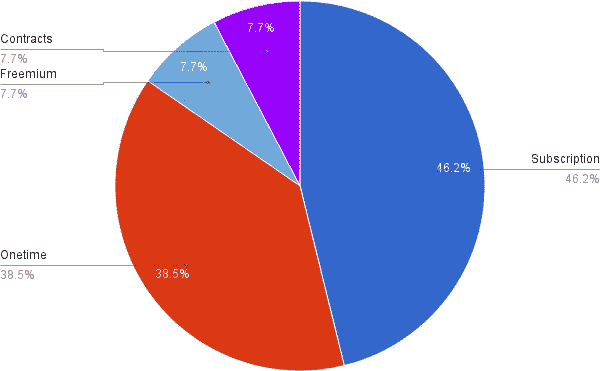

Most Successful

## **创始人之前有该领域的经验吗？**

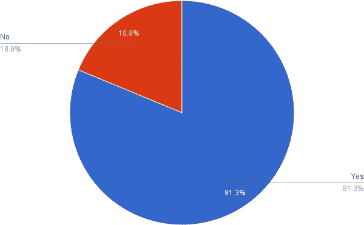

All Businesses

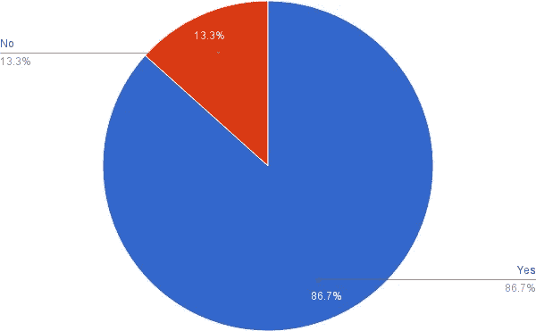

Most Successful

## **广告活动(谷歌广告、推特广告等)成功吗？**

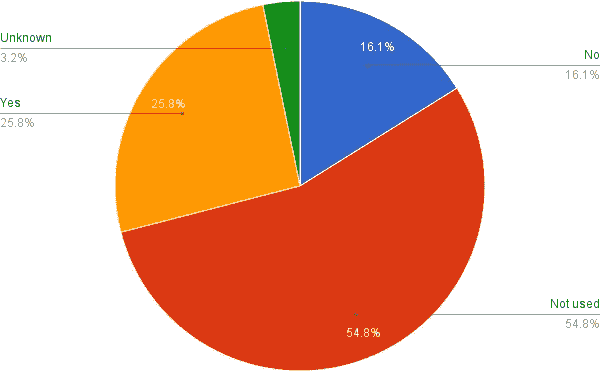

All Businesses

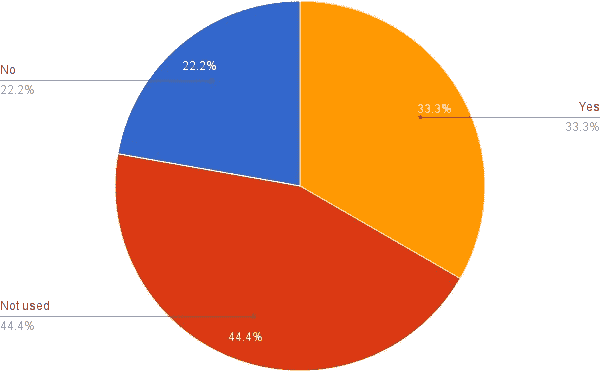

Most Successful

## 他们是从构建 MVP(最小可行产品)开始的吗？

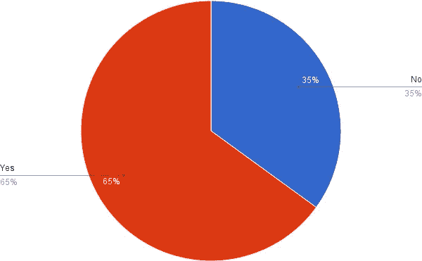

All Businesses

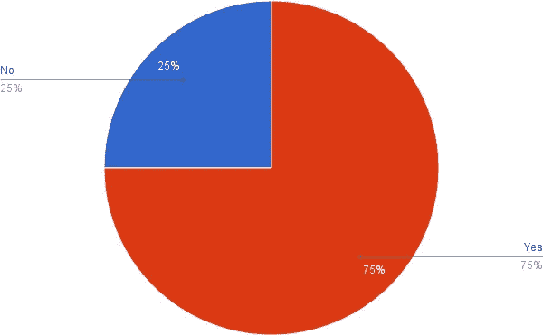

Most Successful

## **他们做什么样的营销？**

*注:这是原始计数，而不是百分比。*

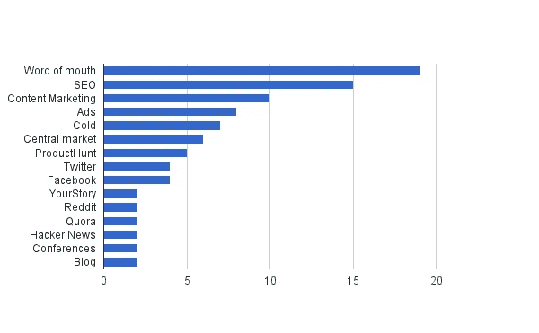

All Businesses

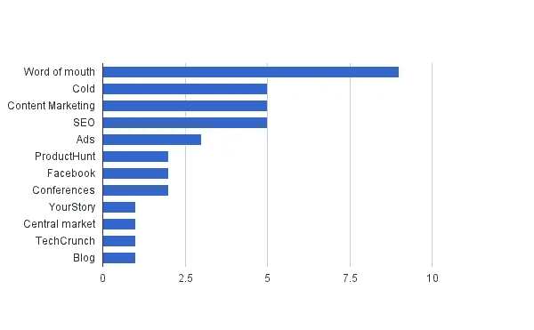

Most Successful

## **他们提供免费计划还是试用计划(如果适用)？**

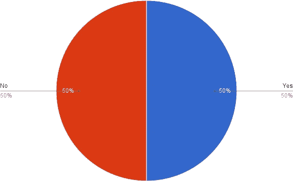

All Businesses

Most Successful

## **创始人白天有工作吗？**

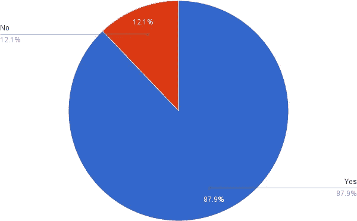

All Businesses

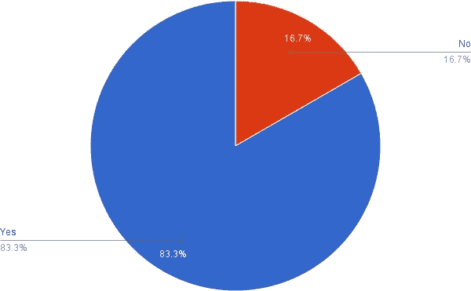

Most Successful

## **支付处理器**

*注意:对于我无法确定付款处理人的任何面试，该字段留空。实际上，这只是支付处理公司的百分比。*

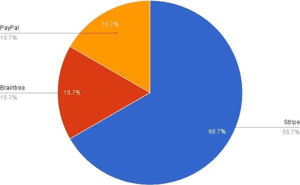

All Businesses

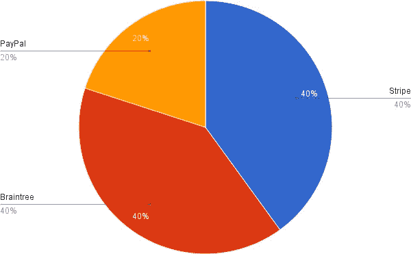

Most Successful

# 个人分析

从开始到推出平均需要 3 个月，这对于最成功的企业来说是一致的。这里的方差相当均匀。一些产品在一周内发布，并不断迭代。其他的则开发了一年，然后慢慢推广给客户。

大多数独立创业公司建立的服务是为其他公司所用的，对于最成功的创业公司来说，B2B 服务的比例略高。大约一半的企业为大众制造产品，但这在产品和服务之间是分开的。插件并不常见，但在我的阅读中，我发现营销插件并不那么具有挑战性。你可以更专注于你的市场营销，通常会有围绕你制作插件的产品而建立的现有社区。

在我看来，B2B 的流行是有道理的。这通常是一个更小，但更有利可图的客户群，这意味着你可以更专注于你的产品。我从个人经验中知道，当向公众销售时，你会面临大量关于如何改进你的产品的意见。企业客户要么更加一致，要么有资金支持定制解决方案的开发，两者都是赢家。

在订阅与一次性付款(客户为产品支付一次，或每次使用支付一次)之间，似乎没有共识。其他模式相当少见(免费、捐赠、合同等)。对于最成功的企业来说，似乎没有什么不同。

绝大多数创始人都有该领域的经验，对于最成功的企业来说更是如此。无论他们是在该领域工作，还是对产品或服务有个人需求，这似乎都是一个非常普遍的因素。

被调查的企业中只有一半使用广告。当它被使用时，不成功是很常见的。根据我的阅读，有针对性的广告往往更成功。Twitter 或其他社交平台往往比普通的谷歌广告表现更好。谷歌广告的普遍情况是，在它们物有所值之前，需要进行大量的微调。所以基本上，了解你的市场，尽可能地锁定他们。这似乎是显而易见的，但对于公司来说，运行 AdWords 并获得糟糕的结果是很常见的。

大多数企业从最低可行产品开始，75%最成功的企业使用 MVP。在这种情况下，您不用先构建完整的产品，而是构建一个仅够用的基本版本。从那里你得到反馈，并重复什么是重要的。MVP 快速测试你的想法，看看它们是否有价值，而不是白白浪费很多努力。这也有助于将你的注意力集中在客户真正关心的事情上。创始人的故事中有一个共同点，那就是他们付出了多少努力来与客户沟通，并利用这些反馈来改进产品。你的顾客买单，所以你的重点应该是让他们开心。另一个显而易见但容易被忽略的建议。此外，这种紧密的沟通建立了关系，并往往导致口碑推荐。

最强有力的营销形式是口口相传。制造出优秀的产品，人们会为你宣传。与你的客户保持密切联系，他们会成为你最直言不讳的盟友。其次是搜索引擎优化和内容营销。内容营销是指你就与你的业务相关的主题撰写内容丰富的文章，然后在文章中提及你的公司，并提供网站链接。这种非侵入性的、有益的营销(如果有品味的话)非常成功，有助于快速建立你在搜索引擎中的排名。这是新闻聚合网站可以获取的素材，为你的业务带来更多的流量，通常几个月后会有一个长长的访客尾巴。

除了口碑、内容营销和搜索引擎优化，下一个最好的策略包括广告和冷打电话/发电子邮件。陌生来电和电子邮件让我感到惊讶，但当你考虑到这些独立创业公司大多是围绕 B2B 建立的，这就更有意义了。向其他公司推销的最佳方式似乎是直接与他们联系并建立关系。

最成功的企业往往注重口碑和电话推销。

我还想提一下 [ProductHunt](https://www.producthunt.com/) ，这是数据中最受欢迎的非传统营销选项。这些独立创业公司中的许多都是在 [ProductHunt](https://www.producthunt.com/) 上获得第一批大客户的。

对于付费服务的免费计划或试用计划是否成功，没有一致的意见。正好是五五开。我见过的创始人提到的大多数专业建议是不要有免费计划，但它高度依赖于你的产品和目标客户。

绝大多数独立创业公司都是从副业或业余爱好开始的，尽管这是由 IndieHackers.com 的本性造成的。创始人通常已经有工作或者正在上学。这些创始人中的一些人获得了足够的成功，可以辞职并在他们的新公司全职工作。为数不多的没有全职工作的创始人的故事，通常都围绕着那些职业企业家或技术人员，他们积累了足够的储蓄，也有足够的欲望从常规工作中“休息一下”。

最后，我还加入了一个支付处理器的指标，我认为这很有趣，但并不十分重要。在那些列出支付处理器的初创公司中，大多数倾向于使用 Stripe，更成功的公司更倾向于 Braintree。我不确定 Braintree 是否是成功的一个因素，数据有限，但欢迎你做出自己的结论。贝宝在国际上更受欢迎。

# 附加注释

有时候，从阅读采访中很难确定特征。在这种情况下，我会在电子表格中将该字段留空，这样它们就不会计入图表中的百分比。这在支付处理器图表中尤其普遍。

很多独立创业公司都是从外部获得灵感的。朋友，同事，客户。有些是基于个人需求，但总的来说，为他人建造东西似乎更成功。这也可能与大多数创业公司在 B2B 服务方面取得成功的事实有关。这并不是说你需要瞄准你经验之外的东西。食谱似乎是从你周围的人那里得到的想法，并把重点放在你有处理经验的人身上。

在任何这些成功的商业中最重要的因素是**营销、营销、营销。**创始人会一遍又一遍地重申他们多么希望做更多的营销，或者他们将如何做更多的营销来实现他们的增长目标。这很有道理，但就像许多“嗯，咄”的结论一样，这在实践中似乎不是常识。这是一个非常罕见的故事，有人将他们的产品发布到世界上，然后在它有机生长的时候坐以待毙。即使在那些“一夜之间”成功的罕见案例中，基于客户反馈的初始营销努力和迭代仍然是常见的。脸变戏法是一个非常成功的脸交换应用程序，它最初挣扎了很长时间，直到创作者发现*只是*合适的功能和价格。从那以后，它像野火一样蔓延开来。

创始人发现他们要价太低是常有的事。每次他们得到关于定价的专业建议时，导师都会说提高价格。当他们这样做时，收入就增加了。从我的挖掘中得到的一条智慧:*算出你认为你的报价应该是多少，然后乘以 3。*

价格更高的一个好处是，你可以把你的客户群过滤掉，只剩下那些真正关心你产品的人。与每月支付 1 美元的人相比，每月支付 20 美元的人会给你更高质量的反馈。当你刚开始的时候，你经常会受到时间和注意力的限制，所以无论如何，最好是有一个较小的客户群。一旦产品被简化，你可以通过降低价格来获得更广泛的受众，从而火上浇油。

# 摘要

*这里是我的 TL；博士，基于这项研究的 1 分钟建议:*

倾听你的朋友、同事和客户。找出他们提到的你也有亲身经历的痛苦，或者你在工作中需要的痛苦。把它包装起来，这样就方便使用了。**建立一个 MVP，获得反馈，迭代。**收取超出你想象的费用。倾听顾客的心声。在 ProductHunt 上启动。**市场见鬼去吧！**利用内容营销，通过陌生电话/电子邮件接触社区、论坛、朋友和企业。如果你做了一些很棒的东西，口碑会发挥它的魔力。你可以在业余时间这样做，也许应该这样做。

# 结论

对我来说，最大的问题是，*一般的企业家能成功吗*？平均每月 19，000 美元的收入肯定足以维持一家小公司。但是这些数据的来源——IndieHackers.com 却倾向于成功。在 IndieHackers 上几乎没有失败(尽管我确实遇到过至少一次)。所以也许更准确的说法是，如果你有一个成功的独立创业，你很可能能够养活自己。但成为成功的独立创业公司的可能性是未知的，普遍的数字是十分之一，相当令人沮丧。这篇文章中的成分能提高你的胜算吗？如果你觉得这项研究有帮助，请告诉我。

> [黑客中午](http://bit.ly/Hackernoon)是黑客如何开始他们的下午。我们是 [@AMI](http://bit.ly/atAMIatAMI) 家庭的一员。我们现在[接受投稿](http://bit.ly/hackernoonsubmission)，并乐意[讨论广告&赞助](mailto:partners@amipublications.com)机会。
> 
> 如果你喜欢这个故事，我们推荐你阅读我们的[最新科技故事](http://bit.ly/hackernoonlatestt)和[趋势科技故事](https://hackernoon.com/trending)。直到下一次，不要把世界的现实想当然！

