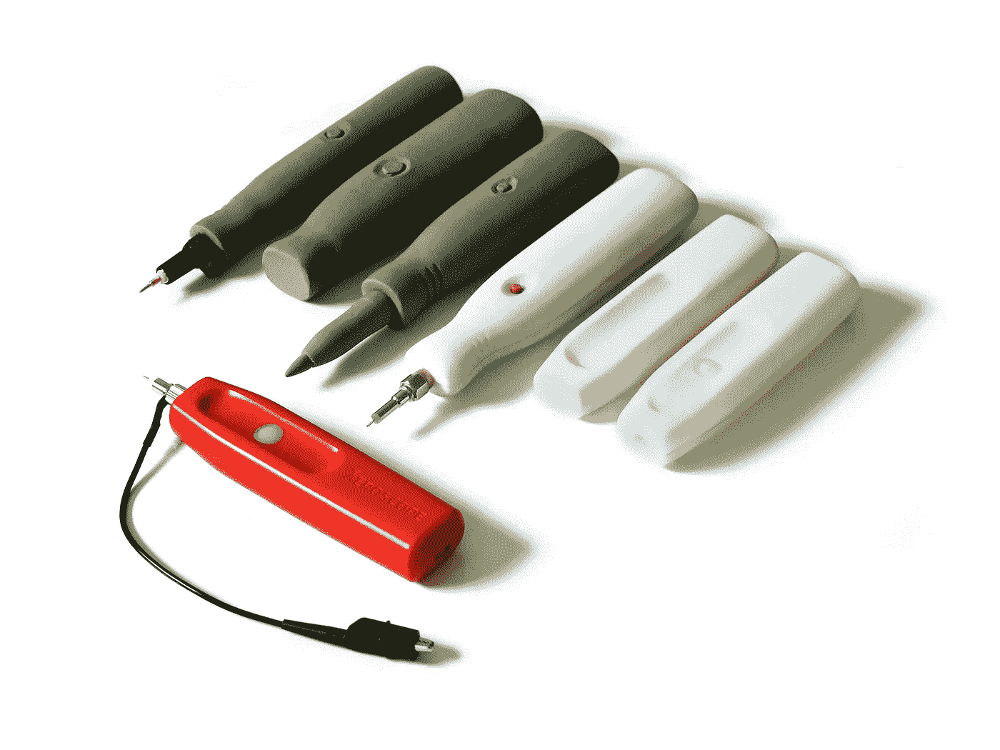
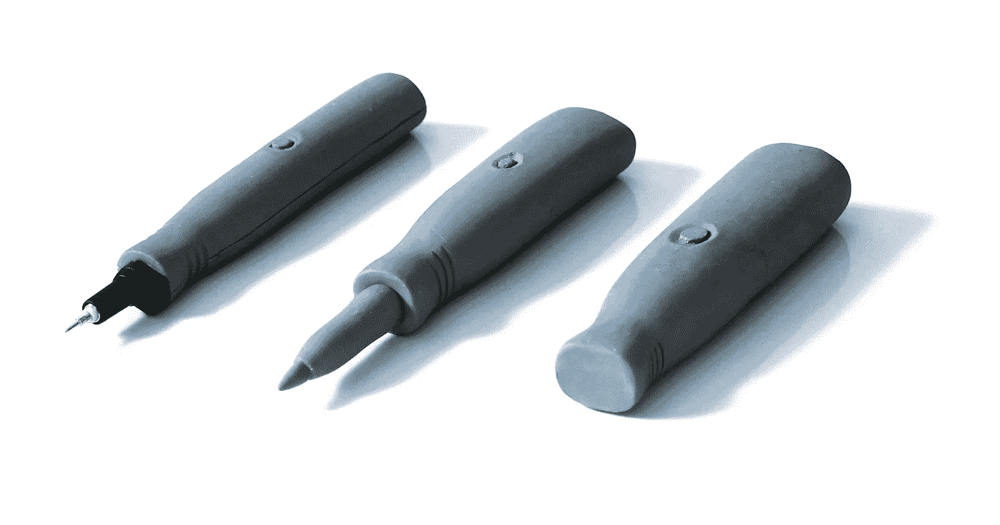
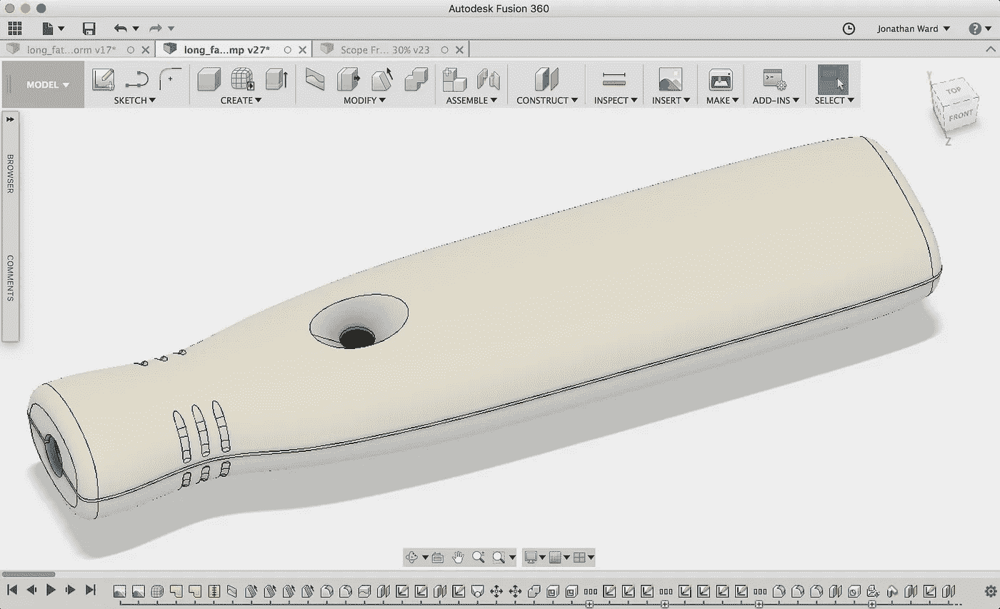
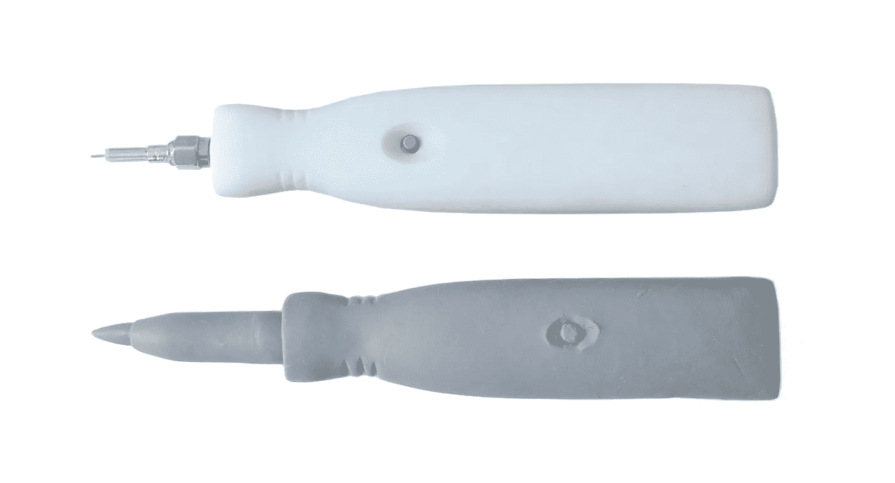
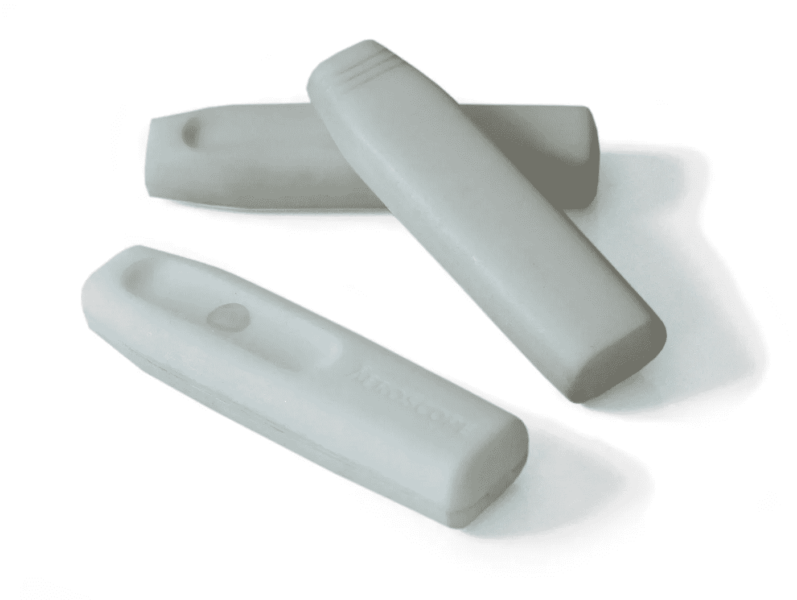
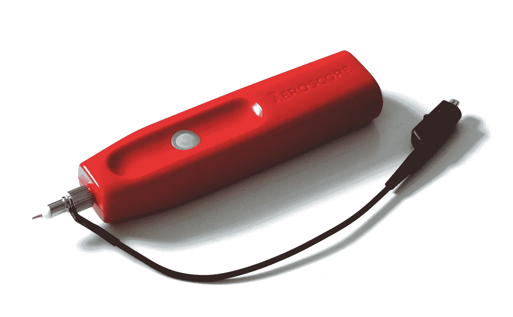

# 工业设计从零到产品

> 原文：<https://medium.com/hackernoon/industrial-design-from-zero-to-product-fe96b605441e>

人们经常问我们，在如此复杂的项目中，只有两名电气工程师，我们是如何制造出 [Aeroscope](http://www.aeroscope.io) 无线示波器探头的。它不仅包括复杂的模拟电子设备，还包括 FPGA、固件、软件、机械和工业[设计](https://hackernoon.com/tagged/design)。我们基本上只是一头扎进去，贪婪地完成任何可用的任务。我接管了 Aeroscope 的机械方面，包括工业设计。

我在整个工业设计过程中学到的一件事就是迭代的重要性。就像在工程中一样，很少能马上找到最佳解决方案。设计的美妙之处在于，你可以比硬件甚至软件迭代得更快。由于这实际上是我的第一次竞技，我的主要缺点是想得太像一个硬件工程师。我过度关注印刷电路板的成本和空间，没有充分考虑“盒子外面”

作为一名电子工程师，我从未真正做过任何非工程设计工作。我对它的主要接触是在几家 T4 消费品公司工作。从我有限的经验来看，我知道要让这个产品发挥作用，它不仅要好看，还要易于使用。最重要的是，我们必须能够用我们微薄的预算制作它。为了获得外观、人体工程学和可制造性的正确组合，我想很快尝试许多设计想法，并选定一个最佳组合。由于示波器探头是你拿在手里与之交互的东西，直接进入 CAD 似乎不是一个好主意。我必须能够感觉到它，所以我选择粘土作为我的原型制作媒介。具体来说，我使用 Sculpey 建模粘土，因为它很容易工作和测试想法。当我玩完一个想法后，我可以把它放在烤箱里烤，让它变硬，变得足够耐用。

Exploring forms with clay models

我的第一个想法只是一个简单的钢笔形状，用粘土建模。然而，这给内部留下了很小的空间。我的工程帽接管了——这也是我在这个过程中的主要弱点——我为接下来的几次迭代增加了额外的内部体积，牺牲了人体工程学。在这个阶段，我有足够的信心尝试构思一些想法。我使用 Autodesk Fusion 360 CAD 软件制作了一个最佳粘土原型的 3D 计算机模型。Fusion 360 的雕刻工具在这里真的帮了大忙。许多 CAD 软件要求你根据 2D 的草图来模拟复杂的有机形态，这一过程非常繁琐，就像建造一艘旧的木制帆船一样。这可以很好地工作，但是当您想要添加参考设计中不存在的特性时，就会遇到麻烦。Fusion 360 包括一个功能，基本上允许您数字化雕刻一个虚拟的粘土块。当我想调整我的粘土模型中没有的某些元素时，这真的很有帮助。我开始导入粘土模型的俯视图和侧视图，并调整虚拟粘土以与之匹配。

Modeling the prototype in Fusion 360

一旦我有了一个 3D 模型，我就从旧金山一家名为 Fictiv 的公司订购 3D 打印品。当照片第二天出现在我的公寓(当时我住在旧金山)并用自行车送来时，我震惊了！它们的质量也比我们用业余打印机所能达到的要高得多。我们使用这个 3D 打印的外壳和我们的第一个外形尺寸 PCB 来制作第一个工作原型。

Clay model and working prototype

从第一个外形尺寸原型的兴奋中，我以为工业设计已经完成了。直到我开始展示它。每个人都非常积极，但压倒性的反馈是，它太笨重和笨拙。我很高兴我得到了他们的反馈，因为他们绝对是对的。

回到绘图板，我想出了一些设计的迭代，并决定采用现有的 CAD 模型并进行调整比从粘土阶段重新开始更容易。这是 Fictiv 真正为我们度过难关的地方。我可以调整 CAD 来做一些不同的选择，然后像以前一样在第二天取回照片。然而，这一次，我继续根据 3D 打印进行调整。在这一点上，短暂的转向至关重要。我能够在一周内完成多个完整的设计周期。

Rapid prototyping with 3D prints

经过几次这样的“CAD 调整、3D 打印、重复”循环后，我们确定了最终的形状。它比我们以前拥有的任何东西都小得多，更好看，也更符合人体工程学。下一步是机械工程，将工业设计概念转化为可以由注射成型塑料制成的完整机械设计。但那是另一个故事了…

The finished product