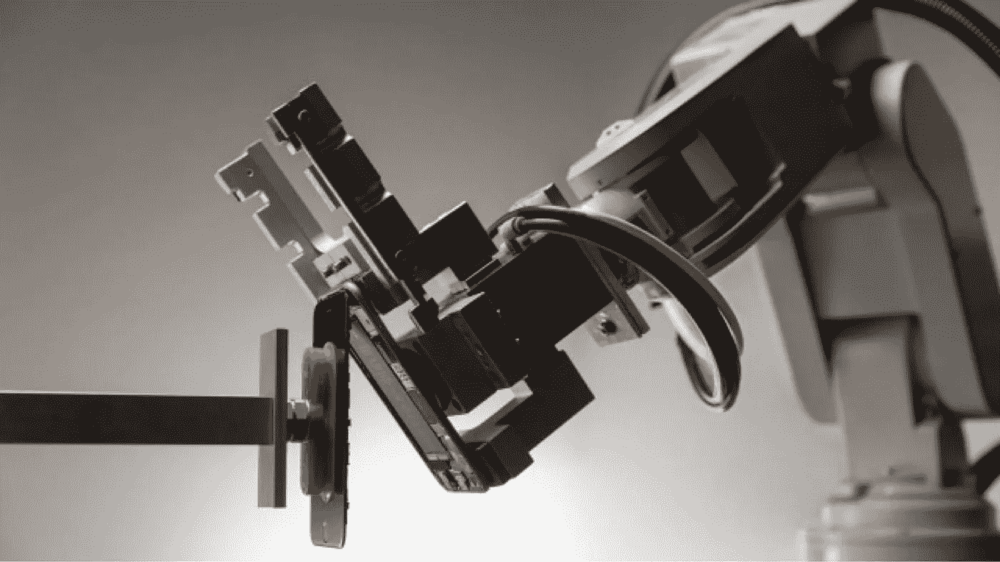
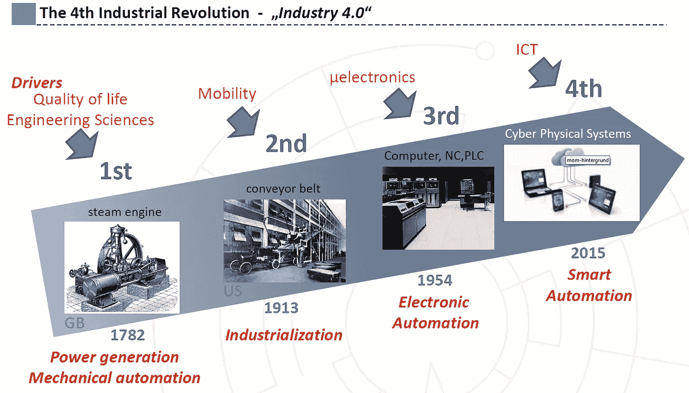
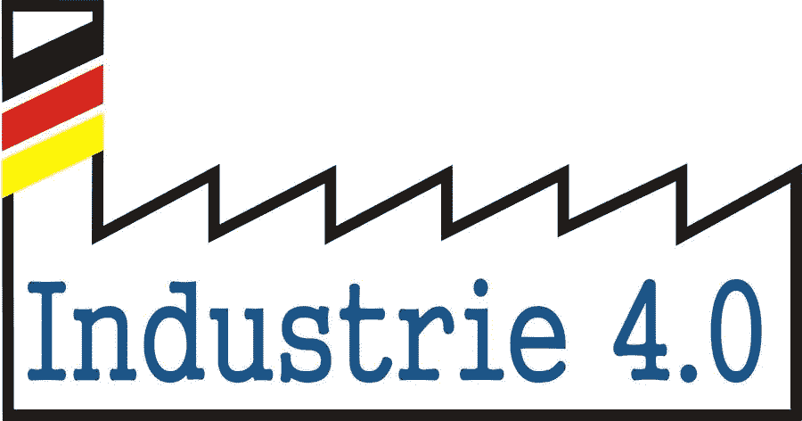
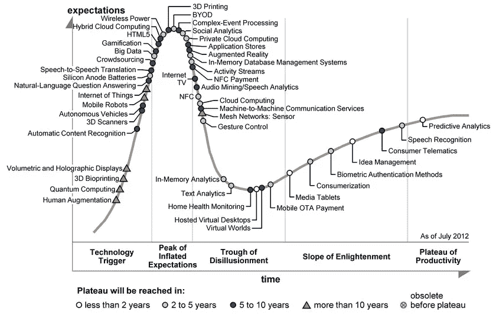
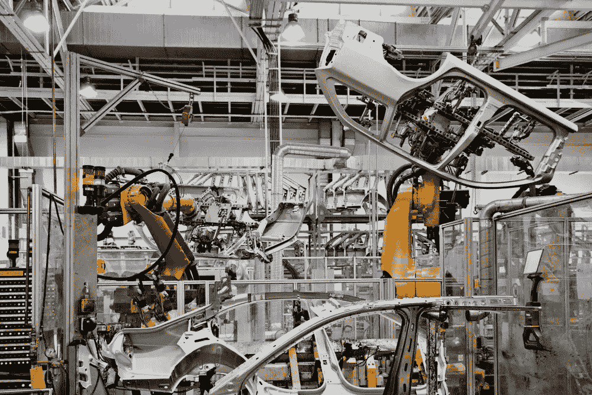
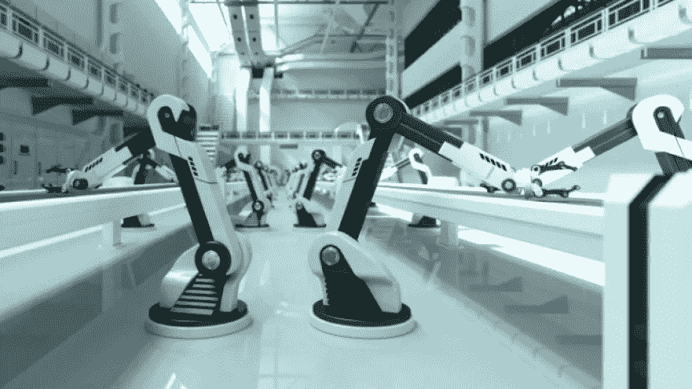

# 虚拟工业 4.0

> 原文：<https://medium.com/hackernoon/industry-4-0-for-dummies-d6301c12ab9f>

工业 4.0 是旨在将我们的制造工厂转变为“智能工厂”的[技术](https://hackernoon.com/tagged/technological)框架，能够将过去十年对我们个人生活产生巨大影响的革命提升到工业规模。今天，我们都在体验智能手机、社交网络、嵌入式人工智能、家庭自动化和应用经济如何改变我们相互联系和*做事的方式*；这些非常相同的技术(以及许多其他技术)将改变我们明天的工作方式。

第一次工业革命发生在十八世纪晚期，伴随着机械化，这要归功于詹姆斯·瓦特的蒸汽机的发明(和应用)。第二次工业革命发生在二十世纪初，第一条装配线的建立支持了亨利·福特汽车工厂的大规模生产。第三次工业革命发生在二十世纪中叶，当时电子技术首次应用于数控机床(NC/PLC)。今天是信息物理系统(CPS)的时代，它是计算、[联网](https://hackernoon.com/tagged/networking)和物理过程的集成，并且有望[改变人们与工程系统交互的方式，正如互联网改变了人们与信息交互的方式](http://www.nsf.gov/funding/pgm_summ.jsp?pims_id=503286)。

工业 4.0 这个术语是由德国政府在 2011 年汉诺威工业博览会上引入的。凭借成为工业 4.0 领先供应商和领先市场的雄心，德国正试图利用其工程专业知识(博世)及其在自动化(西门子)和 ERP(SAP)方面的能力。德国的目标是在竞争中领先一步，通过需要极高的投资和尖端的技术知识来建立防御壁垒。美国和中国(以及世界其他国家)丝毫没有气馁，理所当然地加入了这场竞赛。

当谈到工业 4.0 时，通常提到的一组技术(如上)实际上并不是全新的。事实上，它看起来像是我们在过去十年里听到的所有颠覆性创新的混合体。诚然，当这些技术成熟并大规模应用时，将会有条件从根本上改变我们公司的工作方式和相互关系，以及面向市场、股东和员工的方式。物联网已经进入了我们的口袋(T0 智能手机 ), [正在进入生产阶段](http://www.gtai.de/GTAI/Content/EN/Invest/_SharedDocs/Downloads/GTAI/Brochures/Industries/industrie4.0-smart-manufacturing-for-the-future-en.pdf) ( *智能工厂*)。

如果您对 **Industry 4.0** 感兴趣，您可以尝试以下故事:

> 工业 4.0 如何成为未来复杂性的成本密集型解决方案，以及与精益的关系

 [## 使用行业 4.0 掌握复杂性

### 自从我第一次听到 JIT(准时制)这个术语以来，我就一直是精益的发烧友

medium.com](/p/b9d204bb7009) 

> 工业 4.0 的一天:这听起来像科幻小说，但只要知道就很开心

 [## Life 4.0

### 我的智能手机在早上 5:30 叫醒了我。那天我在米兰有一个工作面试，为此我不得不赶火车…

medium.com](/p/e8a84e4a8d4f) 

> 回到未来:工业 4.0 的遗产和未来的工业革命

 [## 近视眼动物？

### 当我第一次看《银翼杀手》的时候，我还是个七岁的男孩。我仍然记得那种感觉…

medium.com](/p/c6f3bcb4b36a) 

> [黑客中午](http://bit.ly/Hackernoon)是黑客们开始他们下午的方式。我们是 [@AMI](http://bit.ly/atAMIatAMI) 家族的一员。我们现在[接受提交](http://bit.ly/hackernoonsubmission)并很高兴[讨论广告&赞助](mailto:partners@amipublications.com)机会。
> 
> 如果您喜欢这个故事，我们建议您阅读我们的[最新科技故事](http://bit.ly/hackernoonlatestt)和[趋势科技故事](https://hackernoon.com/trending)。直到下一次，不要把世界的现实视为理所当然！

