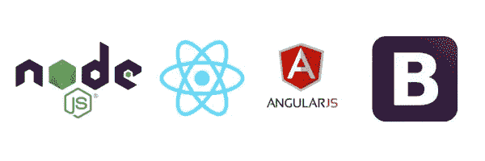
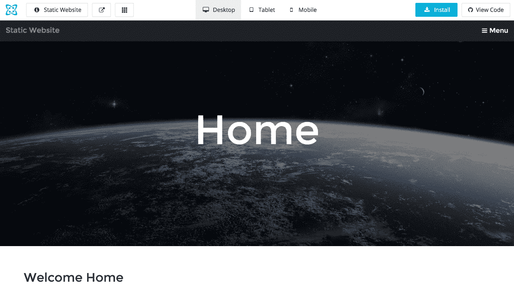
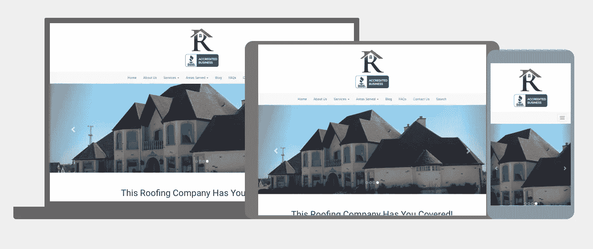

# 行业定制应用示例:node . js | react js | angular js | Bootstrap

> 原文：<https://medium.com/hackernoon/industry-tailored-app-examples-node-js-reactjs-angularjs-bootstrap-3b0d7dbe83cc>

Cosmic JS 让为任何垂直行业或行业构建流畅的应用程序和网站变得容易。Cosmic JS 在 [GitHub](https://github.com/cosmicjs) 上存储了现有的代码库，从标准的 [Node.js 样板](https://github.com/cosmicjs/nodejs-website-boilerplate)到[跨平台 iOS & Android React 原生代码库](https://github.com/cosmicjs/cross-platform-blog)。下面我详细介绍了 5 个专业的 web 应用程序模板，它们记录了它们的编程语言、总体布局、一个演示&以及查看和使用代码库的能力。

如果你还没有注册过，那么[在](https://cosmicjs.com/signup) [Cosmic JS](https://cosmicjs.com) 上注册就像选择一个新的用户名和密码或者简单地通过你的 GitHub 帐户注册一样简单。你可以根据行业、结构或编程语言过滤应用程序，所有这些都以响应演示的方式进行。

# 房地产 App

## Bootstrap | Node.js |多页应用程序模板

这个房地产网站满足一些常见的网站要求，包括动态页面、列表管理、博客文章、作者管理、SEO 能力、联系形式和网站搜索。

> 点击查看演示[。
> 在](http://real-estate.cosmicapp.co/) [GitHub](https://github.com/cosmicjs/cosmicapp-real-estate) 上查看代码库。
> 访问 Cosmic JS [应用页面](https://cosmicjs.com/apps)。

# 摄影 App

## Bootstrap | Node.js |多页应用程序模板

这个漂亮的摄影网站是使用服务器上的 Node.js 和前端的 Bootstrap 构建的。它对手机完全敏感，包括一个联系表单和一个由 [Photoswipe](http://photoswipe.com/) 驱动的图库部分。

> 点击查看演示[。
> 在](http://photography-website.cosmicapp.co/) [GitHub](https://github.com/cosmicjs/cosmicapp-photography-website) 上查看代码库。
> 访问 Cosmic JS [Apps 页面](https://cosmicjs.com/apps)。

# 医疗保健应用

## Node.js | Bootstrap |多页应用程序模板

使用 [Node.js 网站样板](https://github.com/cosmicjs/nodejs-website-boilerplate)构建的网站。充分响应下降到移动，搜索引擎优化准备，包括一个联系形式和完整的网站搜索。

> 点击查看演示[。
> 在](http://medical-professional.cosmicapp.co/) [GitHub](https://github.com/cosmicjs/nodejs-website-boilerplate) 上查看代码库。
> 访问 Cosmic JS [应用页面](https://cosmicjs.com/apps)。

# 屋顶应用程序

## Node.js | Bootstrap |多页应用程序模板

使用 [Node.js 网站样板](https://github.com/cosmicjs/nodejs-website-boilerplate)构建的网站。充分响应下降到移动，搜索引擎优化准备，包括一个联系形式和完整的网站搜索。

> 点击查看演示[。
> 在](http://roofing-site.cosmicapp.co/) [GitHub](https://github.com/cosmicjs/cosmicapp-roofing-site) 上查看代码库。
> 访问 Cosmic JS [应用页面](https://cosmicjs.com/apps)。

# 婚礼 App

## AngularJS |单页应用程序模板

这个棱角分明的 JS 单页婚礼网站可以轻松编辑内容，更新照片和计划大日子。

> 点击查看演示[。
> 查看](http://wedding-site.cosmicapp.co/) [GitHub](https://github.com/cosmicjs/cosmicapp-wedding-site) 上的代码库。
> 访问 Cosmic JS [Apps 页面](https://cosmicjs.com/apps)。

[Cosmic JS](https://cosmicjs.com/) 是一个 [API 第一的基于云的内容管理平台](https://cosmicjs.com/)，使得管理应用和内容变得容易。如果你有关于 Cosmic JS API 的问题，请在 [Twitter](https://twitter.com/cosmic_js) 或 [Slack](https://cosmicjs.com/community) 上联系创始人。

> 卡森·吉本斯是 [*的& CMO 的联合创始人*](https://cosmicjs.com) *，这是一个基于 API 的第一云* [*内容管理平台*](https://cosmicjs.com) *，它将内容从代码中分离出来，允许开发人员用他们想要的任何编程语言构建流畅的应用程序和网站。*

> [黑客中午](http://bit.ly/Hackernoon)是黑客如何开始他们的下午。我们是阿妹家庭的一员。我们现在[接受投稿](http://bit.ly/hackernoonsubmission)并乐意[讨论广告&赞助](mailto:partners@amipublications.com)的机会。
> 
> 如果你喜欢这个故事，我们推荐你阅读我们的[最新科技故事](http://bit.ly/hackernoonlatestt)和[趋势科技故事](https://hackernoon.com/trending)。直到下一次，不要把世界的现实想当然！

