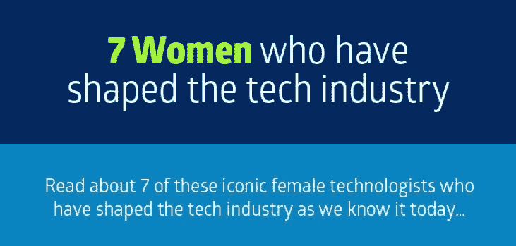
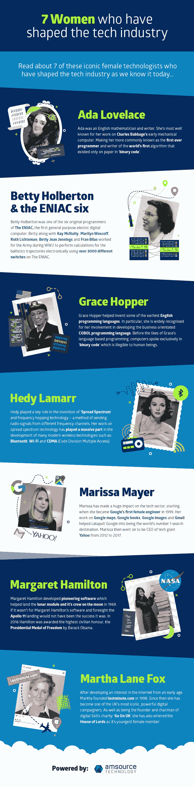

# 信息图表:7 位世卫组织女性塑造了科技产业

> 原文：<https://medium.com/hackernoon/infographic-7-women-who-have-shaped-the-tech-industry-768de98278>

尽管女性仅占科技劳动力的 25%，但从事科技的女性正在产生巨大的影响。[**Lastminute.com 的玛莎·莱恩·福克斯和脸书的雪莉·桑德伯格、Youtube 的苏珊·沃伊基基以及雅虎的玛丽莎·梅耶尔等硅谷首席运营官的数字梦想家正在为年轻女性进入科技领域**](http://www.amsourcetechnology.com/news/7-iconic-women-who-have-shaped-the-technology-industry-72652212243) 铺平道路并给予她们灵感，同时也传达出科技不一定是‘男人的世界’的信息。

随着时间的推移，当我们审视科技产业时，似乎如果没有女性技术专家，它将是一个完全不同的地方。( [**多看我们的博客**](http://www.amsourcetechnology.com/news/7-iconic-women-who-have-shaped-the-technology-industry-72652212243) )

我们制作了一张信息图，以表彰 7 位对科技产业产生影响并将其塑造成今天这个样子的女性。见下文..

[在我们的博客页面上找到更多](http://www.amsourcetechnology.com/news/infographic-7-women-who-have-shaped-the-tech-industry-72752151453)