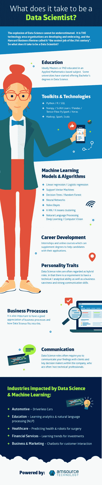

# 信息图:成为数据科学家

> 原文：<https://medium.com/hackernoon/infographic-becoming-a-data-scientist-bc5752187556>

## 在这张信息图中，我们列出了求职者在进入数据科学领域时应该掌握的一些关键技能…

**什么是数据科学和机器学习？**
相比之下 [**数据科学和机器学习**](https://datajobs.com/what-is-data-science) 是一个相对较新的现象，在过去 10 年里席卷了整个职业界。尽管如此，支撑它的统计理论已经存在很久了。简而言之，像 Hadoop 这样的程序等技术的关键进步使我们能够处理大量数据，并通过各种机器学习方法进行分析。在这些进步之前，涉及数据科学的过程是可能的，但最终受到人类缺点的限制。

在一个机器现在可以根据过去数据集的模式进行自我学习的世界里，我们发现自己正在出现一种新的职业，这种职业正在席卷商业世界。公司现在能够利用这种高度详细的洞察力来获得竞争优势，这种优势可以增加真正的价值。

**数据科学家需要哪些技能？**
关于什么是数据科学家，以及他们需要具备什么样的技能和经验才能在该领域获得资格，存在一些争议。我也经常被问到这样的问题，“一个数学专业的毕业生如何步入数据科学的世界？”

首先，数据分析和数据科学的区别在于，分析是关于描述性的。而是描述数据在说什么。然而，数据科学的关键要素是建立模型，在个体层面进行预测。正是这些预测让公司能够更好地专注于营销、金融、欺诈检测、人工智能聊天机器人等方面的方法…

关于进入数据科学，有许多不同的途径可供选择。通常，数据科学家拥有计算机科学、数学、神经科学或相关学科的博士/硕士或更高学位。我发现，也获得了数据科学硕士学位的毕业生，尤其是那些包含大量机器学习元素的毕业生，往往具有进入该行业所需的经验。

除此之外，在整个教育过程中主动完成相关实习，只会帮助你获得所需的技能。数据科学家的另一个重要特征是，他们具有跨多个级别进行沟通的个人特征。通常，他们需要将他们的发现翻译给非技术人员，这些人使用他们的洞察力来做出商业决策。所以，话虽如此，重要的是要有商业头脑，让你能够从更广泛的商业目标的角度去思考。

**许多数据科学工作规范通常需要对以下一些技术的经验和信心…**

**工具包和技术**
-Python/R/SQL
-Numpy/SciKit Learn/Pandas/Tensor Flow/PySpark/Keras
-Hadoop、Spark

**机器学习模型和算法**
-线性回归/逻辑回归
-支持向量机
-决策树/随机森林
-神经网络
-朴素贝叶斯
- K-NN / K 均值聚类
-自然语言处理/深度学习/计算机视觉