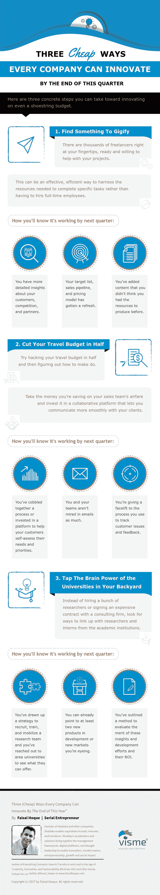

# 信息图:无论公司规模如何，你都是如何进行实践创新的？

> 原文：<https://medium.com/hackernoon/infographic-how-do-you-do-practical-innovation-regardless-of-company-size-946ba74634e0>

[Image: Unsplash user [Helloquence](https://unsplash.com/@helloquence)]

## 想出自己对创新的定义。超越“引入新事物”，弄清楚创新对你的组织真正意味着什么。

可以说，“我的创新”越来越难了。你不能只开发一个应用程序，然后就把它推销出去——软件不再总是有用了。这个障碍一直在稳步上升，现在在许多情况下，清除它需要尖端的硬件、机器学习和其他昂贵的高科技策略。除此之外，高度专业化的领域焦点、即用型内容和专家帮助——这些都是公司为了在市场中脱颖而出而越来越多地求助的功能。

话说回来，*科技*创新并不是唯一的种类。当你进入正题时，“创新”实际上就是改变事物，这样你的团队就可以用新的眼光看待挑战，并加快他们应对挑战的速度。换句话说，它既不像听起来那么模糊，也不像听起来那么遥不可及。

这里有三个具体的步骤，你可以在今年第一季度结束之前，甚至在预算有限的情况下进行创新——以及你如何知道它们在起作用。

**Infographic made with** [**Visme**](http://www.visme.co/)**.**

***版权所有 2017 费萨尔·霍克。保留所有权利。***

我是一名[企业家和作者](http://faisalhoque.com/speaking/)。[沙多卡](http://shadoka.com/)等公司创始人。Shadoka 让抱负成为领导、创新和变革的动力。Shadoka 的加速器和解决方案汇集了管理框架、数字平台和思想领导力，以实现创新、转型、创业、增长和社会影响。

《“ [*《万物互联——如何在创意、创新和可持续发展的时代进行变革和领导》*](http://www.amazon.com/Everything-Connects-Creativity-Innovation-Sustainability/dp/0071830758/ref=sr_1_1?ie=UTF8&qid=1376488798&sr=8-1&keywords=everything+connects%2Bfaisal+hoque) 》(麦格劳·希尔)和《 [*《生存并茁壮成长:弹性企业家、创新者和领导者的 27 种实践*](http://survivetothrive.pub/) 》(励志出版社)的作者。在推特上关注我。*免费使用* [*万物互联*](http://app.everythingconnectsthebook.com/login.php) *领导力 app 和* [*生存茁壮*](http://app.survivetothrive.pub/login.php) *弹性 app。*

> [黑客中午](http://bit.ly/Hackernoon)是黑客如何开始他们的下午。我们是阿美族家庭的一员。我们现在[接受投稿](http://bit.ly/hackernoonsubmission)并乐意[讨论广告&赞助](mailto:partners@amipublications.com)机会。
> 
> 如果你喜欢这个故事，我们推荐你阅读我们的[最新科技故事](http://bit.ly/hackernoonlatestt)和[趋势科技故事](https://hackernoon.com/trending)。直到下一次，不要把世界的现实想当然！

