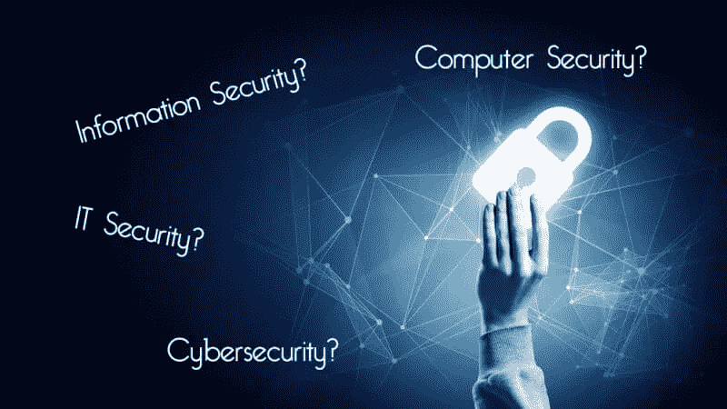

# 信息安全、网络安全、IT 安全、计算机安全……有什么区别？

> 原文：<https://medium.com/hackernoon/information-security-cybersecurity-it-security-computer-security-whats-the-difference-53d2aada285e>

感谢 [Tripwire State of Security](https://www.tripwire.com/state-of-security/featured/information-security-cybersecurity-security-computer-security-whats-difference/) 最初发表我的文章。

如果你喜欢我的写作，请支持我！[我在帕特里翁。](https://www.patreon.com/kim_crawley)非常感谢！

信息[安全](https://hackernoon.com/tagged/security)、[网络安全](https://hackernoon.com/tagged/cybersecurity)、IT 安全、计算机安全都是我们经常互换使用的术语。我知道我有。

在过去的几年里，我写了很多关于这些领域的文章。我注意到，有时我在文章中切换术语，只是为了避免在散文中一遍又一遍地重复相同的短语。

通常，互换使用这两个术语是合理的。计算机处理信息。IT 安全是信息技术的一个方面，通常适用于计算机。计算机安全…同上。网络安全被定义为保护系统免受网络威胁。韦氏词典将“网络”定义为“属于、关于或涉及计算机或计算机网络的”

所以，我说的是几个不同的术语，它们通常表示相同的意思。检查这些术语的来源以更好地理解它们的含义可能是有用的。

我相信军事通信和前数字密码标志着整个信息安全的起源。人类历史上最可悲的一面是战争一直伴随着我们。甚至追溯到公元前，当雷龙在穴居人的厨房里当洗碗工的时候，部落、文明、氏族和国家就已经想杀死其他人来追求权力。(好吧，我是信息安全作家，不是人类学家。也许长毛猛犸象在穴居人的厨房里工作。恐怕我只有汉纳·巴贝拉的历史记录可循。)

战争中成功的关键之一是确保敌人不知道你将在哪里或如何攻击，并弄清楚敌人的计划。所以，密码学比电子计算机早了几千年。密码学是信息安全的一个重要组成部分。加密的目的是保持数据只能被预定的接收者访问。这适用于公元前 600 至 500 年左右使用的单字母替换密码，就像它适用于今天使用的 AES 密码一样。

我们通常认为的密码术，数字密码术，可以追溯到第二次世界大战期间的创新。那个时代的密码机并不是真正数字化的。它们是机电的。英格玛系列机器是最早的机器之一，由德国工程师亚瑟·谢尔比乌斯在第一次世界大战即将结束时发明，并在整个 20 世纪 20 年代投入商业使用。这是纳粹德国在第二次世界大战中使用的主要加密技术，因此同盟国非常努力地破解它。

在第二次世界大战之前，对“谜”的密码分析已经有了进展。1929 年，波兰密码局开始雇用数学家，邀请波兹南大学的学生上密码学课。到 1932 年，波兹南的毕业生[马里安·雷耶夫斯基、亨里克·佐加尔斯基和耶日·罗泽基](http://www.telegraph.co.uk/science/2016/03/15/polish-codebreakers-cracked-enigma-before-alan-turing/)全职为波兰密码局工作。与此同时，一名法国间谍汉斯·希洛·施密特潜入了德国驻柏林的密码办公室。

这让我想起了[社会工程](https://www.tripwire.com/state-of-security/risk-based-security-for-executives/connecting-security-to-the-business/defending-social-engineering/)总是一个重大的信息安全风险。外行人经常会忽略这一点，他们认为“黑客”就是像好莱坞描述的那样，以每分钟 300 字的速度在终端上输入命令。“那个黑客的黑客技术超过了另一个黑客！他的打字速度比他的敌人快得多，而且他穿着帽衫看起来更温和！”

破解英格玛密码需要一些技术和数学上的智慧，但是愚弄纳粹德国，让他们相信有间谍站在他们一边是非常有用的。施密特的间谍活动帮助波兰密码局从德国人那里获得了关键的恩尼格玛文件。Rejewski 利用这些文件，在 1932 年底开始每天花几个小时对 Enigma 进行密码分析。

第二次世界大战期间，英国的军事密码分析工作总部设在布莱奇利公园。艾伦·图灵，著名的计算机科学先驱，在 1938 年战前受雇于英国政府代码和密码学校。他在高级密码破译员迪莉·诺克斯手下工作。1939 年 9 月英国对德宣战的第二天，图灵、诺克斯和 GC & CS 的操作一般都转移到了布莱奇利公园。

英国在此基础上专注于破解英格玛密码，波兰密码局在 20 世纪 30 年代初的突破对这些努力至关重要。破解德国机电之谜和洛伦兹密码可能是盟军在 1945 年赢得战争的关键因素。

ENIAC 在 1946 年的首次亮相预示着数字计算的到来。PDP 大型计算机在 50 年代和 60 年代推动了麻省理工学院的创新。到 20 世纪 70 年代初，许多大公司都是 IBM 大型机技术的客户。公司主机上的数据通常构成行业商业机密和与客户交易相关的敏感数据。此外，美国政府认为有必要保护非机密但敏感的数据。密码学家霍斯特·费斯特尔的工作涉及了这两个领域。他为 IBM 设计的路西法密码是为国家安全局开发 DES 的重要先驱。

所以，信息安全早于数字计算机，但计算机安全和网络安全诞生于二战后刚刚开始的计算机科学创新。

在电子计算机(如古代密码学)出现之前的数据历史中，保持信息安全一直到今天都属于信息安全的范畴。计算机安全和网络安全是完全可以互换的术语，从 1946 年的 ENIAC 到现在都需要数字计算机技术。计算机安全和网络安全都是信息安全的产物。

IT 安全是信息安全，因为它与信息技术有关。信息技术是计算机科学的产物。它是计算机科学在实践中的应用，主要面向行业(大型机、超级计算机、数据中心、服务器、个人电脑和移动设备作为员工交互的终端)和消费者(个人电脑、移动设备、物联网设备和视频游戏控制台终端作为终端用户生活方式的终端)。如果与业务相关，IT 安全可能与网络安全、计算机安全和信息安全互换使用。

例如，碎纸机是一种信息安全措施，但它并不是真正的网络安全或计算机安全设备。如果公司的信息安全政策要求使用碎纸机，那么碎纸机可以被视为 IT 安全的一个因素。

确保电子商务网站或移动应用程序正确实施 HTTPS 属于网络安全和计算机安全范畴，因此也属于信息安全范畴。一家公司的 it 部门负责电子商务网站的 HTTPS 实现，因此也是 IT 安全问题。

在 21 世纪，信息安全、网络安全、计算机安全和 IT 安全通常是可互换的术语，但并不总是可互换的。