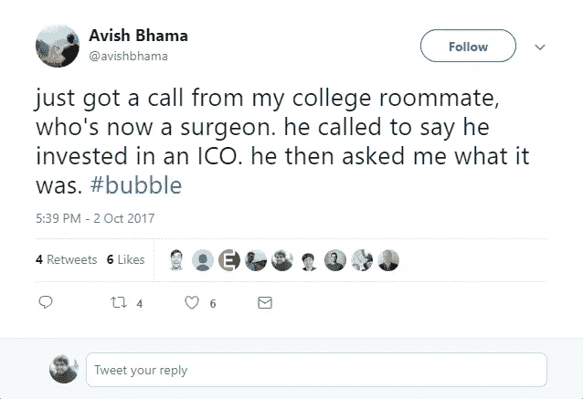
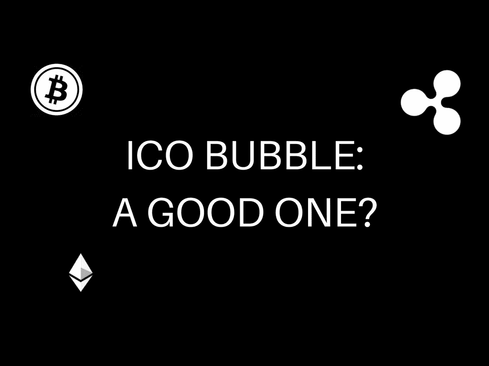

# 最初的硬币发行:我们是在泡沫中吗？

> 原文：<https://medium.com/hackernoon/initial-coin-offerings-are-we-in-a-bubble-fa2e51b2f644>

是的，这是一个好主意。

如果你在过去的几个月里一直在积极关注区块链赛道，那么你一定听说过“初始硬币发行”这个术语。

但在过去几周，谈论 ICO 泡沫的推文和文章比实际的 ICO 还要多。

如果你拿一些像威斯特罗斯科因这样的 ico 来说，它看起来肯定是地狱。

但是看到这条推文就变得 100%清楚了。

神圣的狗屎。是泡沫。

对吗？

为什么不呢？

一个 3 个月大的初创公司获得 1.5 亿美元的估值是相当疯狂的。我是说，这种事情可能发生吗？

现在，让我们回到非常相似的 1998 年网络泡沫，看看那里发生了什么。用伟大的 Erlich Bachman 的话说，

这是巴赫曼式的疯狂。

它始于蒂姆·伯纳斯·李偶然发现了一个神奇的东西，这个东西将永远改变世界，它叫万维网，并在某种程度上获得了牵引力马克·安德烈斯森在 1995 年提出了网景公司。但是没有人真正知道可能性是什么。

这导致硅谷的几乎每个人都认为，他们可以通过虚拟化的方式让所有东西变得触手可及，从而成为下一个独角兽。15 天的初创公司在超级碗上购买广告空间，奢华的发布会是一种惯例，疯狂的是，这些派对的费用是通过向派对组织者出售股票来支付的，这实际上很有效。

那些年的首次公开募股比其他任何时期都多。

有一个故事是由当时创建 Broadcast.com 的马克·库班写的。在该公司 1998 年首次公开募股(IPO)之前，库班会见了很多基金经理。

“绝大多数与会者都不知道我们是谁，也不知道我们做了什么，”库班说。他们的无知“简直是个笑话”，以至于库班和他的搭档“过去常常故意搞砸，看看是否有人注意到”。

尽管“完全不知情”，但每一个见到库班配售的投资者都在发售当天尽可能多地买入了股票，Broadcast.com 在 1999 年以 57 亿美元的价格被雅虎收购之前，在首日交易中上涨了 250%。

似乎是成为企业家的理想时机，不是吗？

但是，

随之而来的是大规模的市场屠杀。在接下来的几年里，纳斯达克市值蒸发了 78%。超过 1 万亿美元的市值在 30 天内从纳斯达克蒸发。

到 2004 年，1995 年以来创立的互联网公司有一半以上已经消失。硅谷的科技投资者经历了漫长的宿醉。

人们并不是不知道这将会发生。他们多少知道，但是

没有人喜欢错过聚会。

投资者、企业家和其他利益相关者对 FOMO(又名“错失良机”的恐惧很感兴趣。

在那之后，有一段时间是硅谷的不确定时期。投资者变得小心翼翼，工作岗位大规模流失，许多企业家又回到了原来的工作岗位。

但是，

向前 15 年，看看我们现在在哪里。硅谷是真正推动世界上几乎所有领域创新的地方。(是的，说出它的名字，你会发现一堆试图在该领域进行革命的初创公司。)

如果不是 1998 年的泡沫，我不认为我们会有脸书，贝宝，谷歌和其他许多公司。因为那时人们意识到他们实际上应该关注的是什么，而不是把所有东西(是的，实际上是所有东西)都放在网上。

真正推动创新的是人们对美好未来的乐观态度。

1998 年的网络繁荣只是人类进化漫长旅程中的一个亮点。

如果你试图将互联网热潮与当前的 ICO 热潮联系起来，你会发现许多相似之处。疯狂，对新范式的不确定性，兴奋，不必要的/愚蠢的冒险，一切看起来都非常相似。

我最喜欢的人之一，Y Combinator 的总裁萨姆·奥尔特曼(Sam Altman)在谈到 ICO 融资模式时表示，整个市场“现在肯定是一个泡沫”——但“它们背后有一些东西，这就是聪明人着迷的原因。”

以太坊创始人 Vitalik Buterin 表示，今天出现的许多 ico 都是不必要的，从长远来看，它们不会给投资者带来任何回报。但他也表示，“低估 ico 的价值或者说它们是坏事，都是错误的”。

从长期来看，市场倾向于保持有效，一旦这种趋势发挥作用，这些不必要的 ico 将被淘汰。

在我看来，未来 10 年将真正决定世界使用区块链的方式。我们仍在完善基础设施的过程中。一旦完成，我们将会看到进化的系统，它将有可能取代像 T2、脸书和谷歌这样的巨头。

## 感谢阅读:)如果你喜欢它，请点击下面的掌声支持。请随意发表评论。

*同样，让我们连线上* [*推特*](http://www.twitter.com/ankitkr0) *进行进一步的讨论:)*