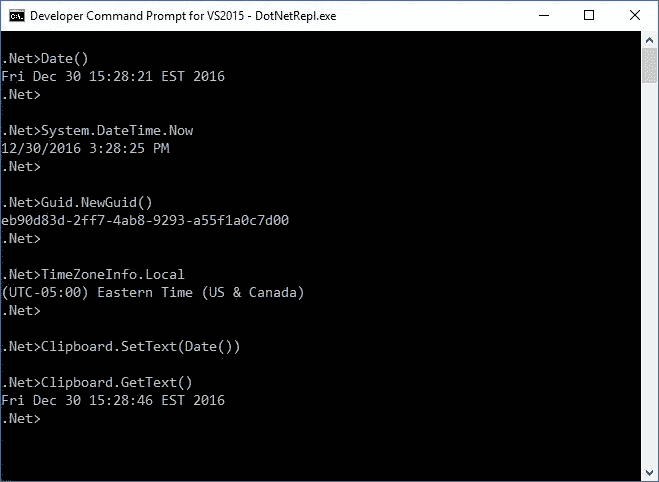
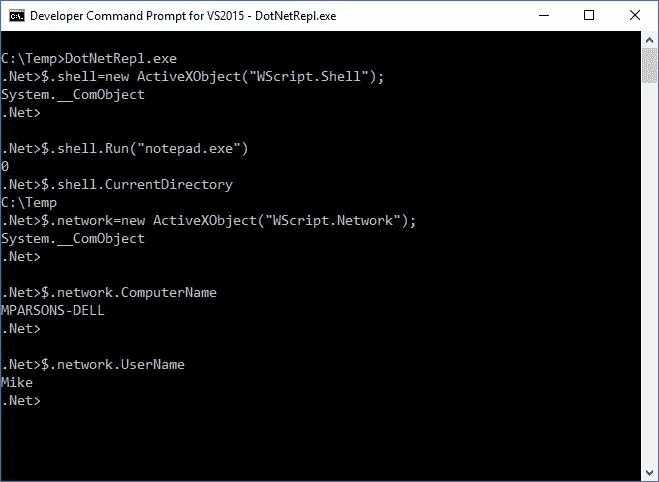
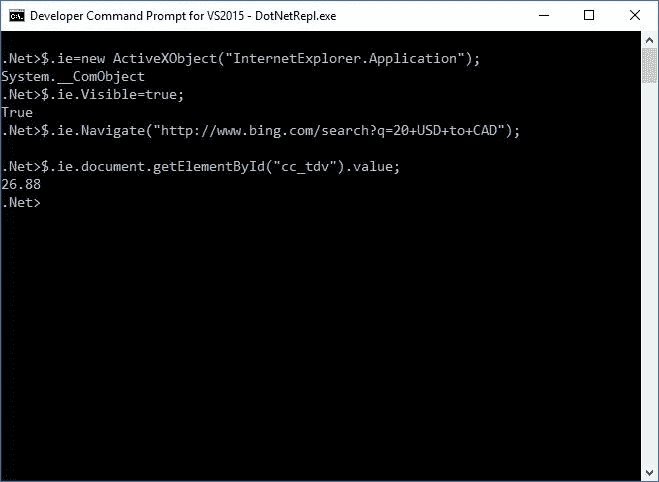
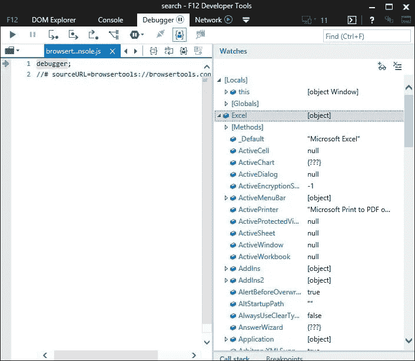

# 注射。Net 框架集成到浏览器中

> 原文：<https://medium.com/hackernoon/inject-the-net-framework-into-the-browser-84803a223b1>

有时你需要浏览器的简单性和成熟的编程框架的强大功能。

在上一篇关于创建简单的。Net REPL，[https://medium . com/@ mikeptweet/making-a-net-repl-57ca 5c 465081 # . w6xvh 925y](/@mikeptweet/making-a-net-repl-57ca5c465081#.w6xvh925y)，我概述了一种快速简单的方法来访问。Net 框架从一个互动 [REPL](https://hackernoon.com/tagged/repl) 。除了能够计算表达式和访问。Net 框架类和库，这个简单的 REPL 提供了一个简单的方法来跨越。Net 和标准 COM 对象。Window 的许多编程，尤其是 LOB(业务线)应用程序都涉及 COM 自动化。对于任何从事复杂的 Microsoft Office 工作的人来说尤其如此。之前。COM 是 Windows 的通用语言，Windows 的许多互操作性都是基于 COM 的。

尽管流行和增长。Net 框架中，相当多的现有窗口应用程序是基于 COM 的，并且在许多情况下，COM 是实现不同供应商的应用程序之间的互操作的唯一可行的方法。而。Net framework 提供了许多创建和访问 COM 对象的方法，这些方法通常需要大量的知识，对于一般的“脚本小子”来说并不容易理解...比如[https://msdn . Microsoft . com/en-us/library/system . runtime . interop services(v = vs . 110)。aspx](https://msdn.microsoft.com/en-us/library/system.runtime.interopservices(v=vs.110).aspx) 。

理想情况下，我们希望混搭。Net 和 COM 对象，并利用两者的力量。这可以通过我们的 REPL 实现，因为它处理 COM 和。作为一等公民平等地上网。如果我们回顾一下我们以前的文章，您会发现访问它是多么容易。Net framework 类:



同样简单的是，我们可以访问 COM 对象:



COM 很容易访问 Window 应用程序生态系统的大部分内容，我们可以使用自动化接口创建一些强大的集成，例如 Microsoft Office:

```
$.excel=new ActiveXObject("Excel.Application");
$.word=new ActiveXObject("Word.Application");
```

或者数据库访问

```
$.conn = new ActiveXObject("ADODB.Connection");
```

能够写剧本。Net Framework 类与 COM 对象的结合提供了一个巨大的工具箱，可以实现大多数业务类型的程序员无法实现的场景。我说的“业务型程序员”指的是应付账款部门的女孩(或男孩)，他们会用 Excel 宏做一些让你头晕目眩的事情:-)

我不止一次发现非常有用的一个场景是能够编写 Internet Explorer 应用程序的脚本来自动执行 web 页面任务。这可能就像关闭一个网站以获取汇率、股票报价或最新天气预报等信息一样简单。在我们 REPL 这样做很简单。在这个简单的例子中，我们编写了 Internet Explorer 脚本，将 20 美元转换为加元:



虽然这是一个微不足道的例子，但它展示了几行脚本代码在一个有创造力的人手中是多么强大。只是重申一下，我们有 COM 的全部功能加上。Net 框架供我们使用。它的美妙之处在于，它提供了无限的灵活性，让你可以根据自己的意愿来完成任务。在另一个场景中，您可能只想从 web 页面获取原始 HTML，并在本地做一些进一步的处理。在这种情况下，您可以调用。Net 系统。Net.WebClient 类来获取原始数据:

```
$.html=(new WebClient()).DownloadString("http://example.com"); 
```

同时能够编写两者的脚本。Net 和 COM 非常有用，有时我希望一个环境的功能在另一个环境的“内部”。例如，能够在内部承载一个 COM 对象。Net，反之亦然，在基于 COM 的应用程序中托管. Net Framework 类/对象/库。同样，这些功能对于经验丰富的程序员来说是存在的，也就是说，我可以在任一种情况下创建一个 Excel 插件。但是它们需要广博的知识以及大量的依赖和限制。由于我的口头禅一直是 ***【少即是多】*** ，所以可以说我希望能够在飞行中做到这一点。使用我们的。Net REPL，我们可以用几行代码来完成。由于在 REPL 内部创建的对象是“通用 COM 对象”，这意味着我们可以简单地通过调用方法或设置属性将. Net 对象“附加”到现有的 COM 对象。例如，下面演示了在 Internet Explorer 中创建调用本机的新方法(函数)是多么容易。Net 类返回一个新的 GUID，这在浏览器中仅仅通过 JavaScript 是不可能的:

```
$.ie.document.parentWindow.CreateGuid=function(){return Guid.NewGuid().ToString()};
```

如果打开 Internet Explorer 开发人员工具(按 F12)，可以看到新函数现在作为 DOM window 对象上的一个方法存在。


因此，只需几行代码，我们就能够提供。Net 框架，浏览器的 JavaScript 引擎可以完全访问它。

事实上，我们可以将这一点发挥到极致，使我们的 REPL 环境中的任何可用内容都可以从浏览器的 Javascript 引擎环境中访问。它只需要一行代码:

```
$.ie.document.parentWindow.Repl=$;
```

这使得我们在 REPL 中定义的任何全局引用(变量、函数等)都可以通过窗口使用。浏览器中的 Repl。REPL 全局$上的简单定义功能，它们可以从浏览器中自动访问。例如，假设我们想使用。Net 在浏览器中…这很简单:

```
$.ie.document.parentWindow.Repl=$;
$.format=System.String.Format;//and from the browser we can dowindow.Repl.format("The date is {0}},Date());
```

当然，我们可以进一步简化，将 Format 方法直接分配给浏览器窗口对象:

```
$.ie.document.parentWindow.format=String.Format;// and from the browserwindow.format("The date is {0}},Date());//or simply
format("The date is {0}}.Date());//since all properties and methods on the window object are global by default.
```

同样，我们可以混合搭配 COM 和。Net，并用很少的几行代码创建了一些非常强大的解决方案。因此，这意味着我们同样可以像下面这样将 Excel 插入到浏览器上下文中:

```
$.window=$.ie.document.parentWindow;
$.window.Excel= new ActiveXObject("Excel.Application");
```



没错，我现在可以从我的浏览器上下文中完整地编写 Excel 脚本了！

我们将把它留给另一篇文章:-)

[](http://bit.ly/HackernoonFB)[](https://goo.gl/k7XYbx)[](https://goo.gl/4ofytp)

> [黑客中午](http://bit.ly/Hackernoon)是黑客如何开始他们的下午。我们是 [@AMI](http://bit.ly/atAMIatAMI) 家庭的一员。我们现在[接受投稿](http://bit.ly/hackernoonsubmission)，并乐意[讨论广告&赞助](mailto:partners@amipublications.com)机会。
> 
> 如果你喜欢这个故事，我们推荐你阅读我们的[最新科技故事](http://bit.ly/hackernoonlatestt)和[趋势科技故事](https://hackernoon.com/trending)。直到下一次，不要把世界的现实想当然！

