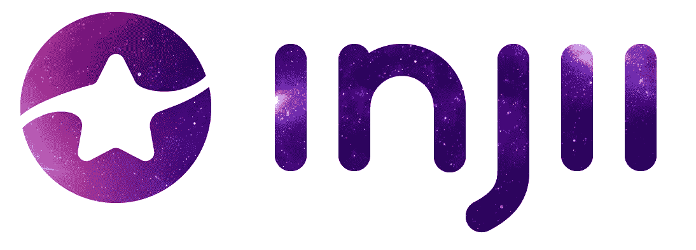
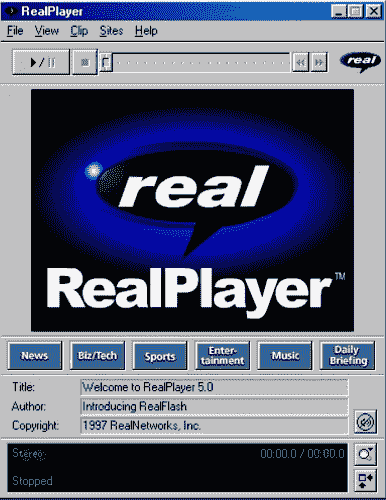
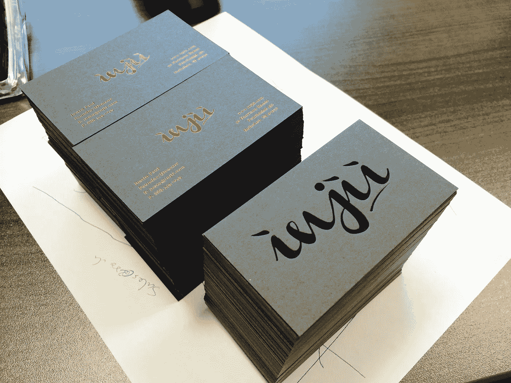
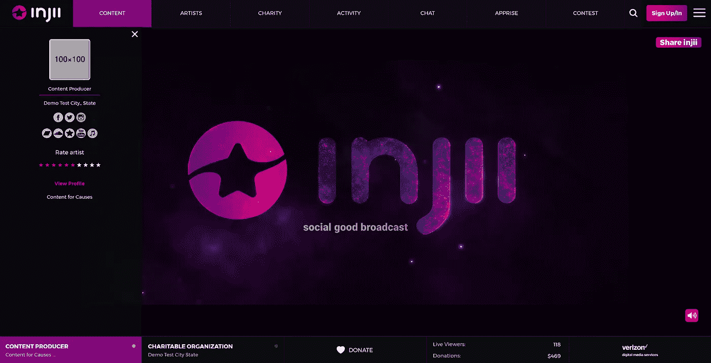
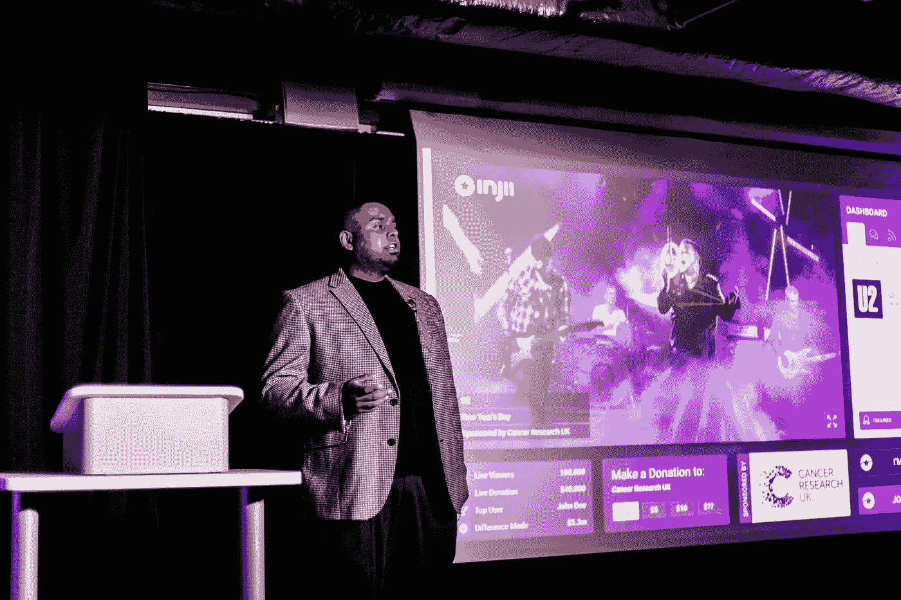

# 改变世界，管理你的播放列表

> 原文：<https://medium.com/hackernoon/injii-access-coin-change-the-world-and-curate-your-playlist-ced991f698df>

## **一个 injii 的故事-** 作者:Justin Paul(injii 创始人/首席执行官)

如果流媒体平台不仅仅是有价值的，会怎么样？在 injii，我们通过开发一个回馈慈善组织的平台来建设一个更美好的世界。在我们为平台发布做准备时，我们想介绍一下自己并分享我们的故事。

我叫贾斯汀·保罗，是 injii.com 的[的创始人，这是一家总部位于区块链的支持公益事业的开放式广播网站。](http://injii.com)

从我记事起，我就迷恋上了 MTV 频道。我喜欢这一切。糟糕的图形，俗气的脱口秀主持人，以及 Yo！MTV 说唱和球——但最重要的是制作视频系列。

音乐录影带不同于所有其他的东西。它们是独立的艺术作品。电影质量的电影，艺术性和音乐视频的制作让我无语。我当时并不知道，但我对这些视频的热爱会激发我更深的激情去做更多的事情。

在 80 年代末，模拟是电影、电视和音乐的全部。当我不看 MTV 的时候，我从收音机里录制音乐，从朋友的磁带上配音，或者听我父母的黑胶唱片。

我对艺术家和电影制作人说的话不太感兴趣，但更关注他们为什么这么做以及如何做。我被这个过程迷住了。

我坚信，当我“长大”时，我会成为一名导演、电影编剧、说唱歌手或摇滚明星。当时我显然不知道抱负和天赋之间有什么区别…

我一点也不知道是我的技术技能让我脱颖而出。

我的第二个爱好是电脑。我的父亲是一名前系统管理员，他给我买了我的第一台帕卡德贝尔电脑。他向我展示了如何使用它，我通过修补和探索找到了剩下的部分。很快就自学了编码(QBasic，VB)。随着时间的推移，我用这些自学的技能为当地企业和组织建立网页，并为我的朋友和家人修理硬件。

一直以来，我都在为一个未知的未来打基础。

当我发现 RealPlayer 程序并开始播放我的第一个音乐视频时，世界为我而停止。我记得就像是昨天一样。它天生淘气——感受我的流动。

RealPlayer Version 5.0 Interface

这让我大吃一惊。我立刻意识到内容流可以改变我们的生活方式。这项技术不容忽视。就在那时，我不再仅仅是一名程序员。我成为了一名科技企业家。

每个创始人都有类似的故事。他们可以确定的时间点是他们的世界改变的时刻。对我来说，我从一个爱好科技的人变成了一个看到科技给世界带来无限可能的人——我想成为其中的一员。

然而，和其他创业公司的创始人一样，我并不总是从事“创业”业务。即使是在那次预感之后，也是花了几十年才帮我找到真正的目的。

我一生中的大部分时间都在经营企业(13 岁时拥有了自己的 Mixtape CD 公司)，甚至当过销售主管、商业银行家和华尔街的见习经纪人。我最终进入了创业领域，花了十几年的时间在一家默默无闻的创业公司中打拼。

我喜欢这次旅行，但在我心里我知道我来到这个世界是为了一些不同的东西。如果你在创业领域，你可能会有同感。

你渴望更有意义的东西。一些你可以因为参与其中而尊重自己的事情。一些你想让你的遗产与之挂钩的东西。

当我在 Injii 上工作的时候，我学到了很多关于什么是建造你可以引以为豪的东西。首先，你必须接受自己是个傻瓜。人们会这么叫你。他们这样称呼史蒂夫·乔布斯，他们也会这样称呼你。

但是你必须克服对失败的恐惧。这种恐惧比失败本身更糟糕。你必须愿意被称为“疯子”，你不能让恐惧阻止你。

例如，15 年前，如果我告诉你，人们不仅会公开分享他们的基本个人信息，还会分享他们的浪漫兴趣、最黑暗的想法和观点，并愿意记录他们的生活，让全世界看到，而从来没有为此支付一分钱，你会告诉我，我疯了。

嗯，这正是 T2、脸书、推特和 Instagram。人们喜欢它。

创建一个人们愿意分享个人信息的平台的愿景不仅取得了成功，还改变了世界的生活方式。

这一切和我们的创业有什么关系？

这与我们的“为什么”有关。我们这样做的原因是。

我和 Injii 团队认为，每个人都应该探索他们来这里是为了做什么。改变世界，毫无畏惧地去做。最重要的是，你做那些让你心跳加速的事情，并坚持你的目标。做你喜欢的事情的一个关键部分是找到到达那里的灵感。

一直激励我全力以赴的一首歌词是 Jay-Z 的沙滩椅:

”*有人说 Hov，你怎么这么飞？*
我说:*从不怕从天而降。”*

当我决定放弃恐惧，投入到改变世界的工作中时，更多的是我对离开这个世界而没有做任何有意义的事情的恐惧激励着我。2014 年，我觉得我快要没有机会做一些不可思议的事情了。所以，我开始忙碌。

我仍然有一份全职的白天工作，但在晚上和清晨，我把工作放在实现我的梦想。大多数创业公司的创始人都会告诉你一个类似的故事。能工作就工作，能做什么就做什么。

最初，我利用业余时间集思广益。这个阶段持续了几个月。我开始真正钻研并弄清楚什么对我来说是最重要的。在最初的几个月结束时，我意识到我想以一种其他人会发现有用和创新的方式建立一种代表我的兴趣的服务——在线媒体流。

The first injii business cards with our original logo, circa 2014

在我想出这个主意后，我花了几百个小时在线框化、制定工作流程、打造品牌、管理法律文件等方面。结果在 2014 年 3 月，injii 成立了。

我想说的是，成为一名创始人并不像 Instagram 账户让你相信的那样浮华和迷人。

纯粹是辛苦。它包括无数个不眠之夜，哭泣，大叫，住院，太多袋浓缩咖啡，转移信用卡余额和错过社交机会。没有办法准确地为此做准备。

这就是为什么我和其他所有创始人都强调你完全热爱你所做的事情。企业家从废墟中崛起、一夜成名的浪漫主义只是一种表象。要熬过这一关需要某种疯狂。

当我开始写这篇博客时，我最初的想法是写“为什么你应该看看 injii”，但忽视这种类型工作的残酷现实对我的同行企业家来说是不公平的。

当你浏览初创企业的版图时，我希望你采纳的一条建议不一定是采用一些疯狂的禅定时间表、液体甘蓝饮食或去攀登珠穆朗玛峰，而是策划一个可靠的播放列表，无论是在 Spotify、Apple Music 还是任何流媒体服务上。

我是认真的。音乐的力量是真实的。

美国心理协会引用的研究表明，音乐疗法可以减少你体内的荷尔蒙皮质醇(这是造成压力的荷尔蒙)。相信我，作为一名初创公司的创始人，你的身体会有很多压力需要消除。

创建一个你喜欢的音乐播放列表会让你度过那些清晨时光，惊天动地的挑战，甚至是那些你觉得自己站在世界之巅的时刻。音乐帮助我们重置思维，让我们专注于我们想要的东西。

尽管听起来微不足道，但音乐播放列表是你启动工具包中的一个工具。

然而，最重要的是，你必须全心全意，用你生命中的每一根纤维，相信你的想法。如果你这样做了，所有的痛苦都是值得的。

对我来说，我对将内容与事业结合起来的热情自然导致了我建立 injii 的想法。我变得清晰起来，意识到我想创造一个地方，让每一种艺人都可以用他们的才华改善其他人的生活，同时将他们的热情货币化。

我的梦想过去是，现在也是，每天 24 小时播放杰出艺术家的作品，与世界分享他们的天赋。

injii Platform Interface (Opus Build)

所有内容都与慈善组织直接相关，因此当我们一起观看时，通过评论和分享来参与我们正在观看的内容，我们可以参与改变生活的慈善活动。

injii 的宗旨是建立一个全球联系，这样我们就能一起让世界变得更美好。通过我们的平台，我们允许人们通过他们喜欢的或大或小的捐赠做出贡献。

这是一件美好的见证，真的。人们聚在一起回馈那些给予他人如此多的事业。

一种简单的方式来看待它作为一个在线慈善义演音乐会，但不是专注于一个单一的原因或仅仅几个艺术家，而是无数的艺术家通过多个慈善机构为全球变化做出贡献。很棒，对吧？

injii Access Coin IAC — ERC-223 Token

最棒的是，通过将区块链技术与以太坊和 ERC-223 兼容硬币相结合，我们还将创建一个生态系统，用户只需向慈善事业捐款或参与我们的内容，就可以获得 injii Access Coin (IAC)。

这枚硬币允许用户参加我们的独家活动，如音乐和电影节，音乐会，现场录音或只是购买纪念品。IAC 作为一个通行证，让你的身体活在当下。

到目前为止，我们已经取得了很大的成功。

自从我们在 2014 年注册 injii 以来，我们已经获得了相当多的关注。2015 年，我们从 IBM SoftLayer Catalyst 孵化器项目毕业，2016 年，我们被 Gig Tank 加速器项目录取。

Pitch Night 2016 at The GigTank Accelerator Program

今天，我们现在是一个有限责任公司，我们已经获得了多种种子资金，推动我们朝着目标前进。我们的全功能测试平台已经过测试，并为下一步做好了准备——通过媒体合作伙伴，如威瑞森数字媒体服务公司和 AOL，进行实时流媒体播放。

我们还与区块链领域的许多合作伙伴合作(请关注未来关于这个主题的博客)，并希望利用它来优化我们的服务和提高用户体验。

在所有这些(美妙的)混乱中，我很幸运在 injii 有一个不可思议的团队站在我这边。和我们的工作人员一起工作真是太棒了。随着我们的发展，您将会听到他们在各自行业中提出自己的精通评估。

我们已经走了很长的路才走到今天。尽管存在于加密货币空间，我们保证我们远不是你以前见过的那样。我们的白皮书让您全面了解我们公司的计划，以及我们打算如何让世界变得更好。我们希望你在旅途中能和我们在一起。

希望你追随梦想，加入我们，让世界变得更美好。