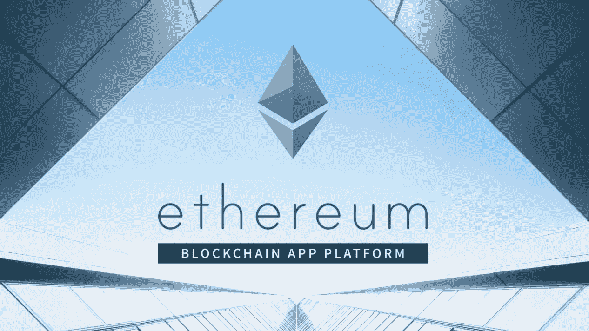
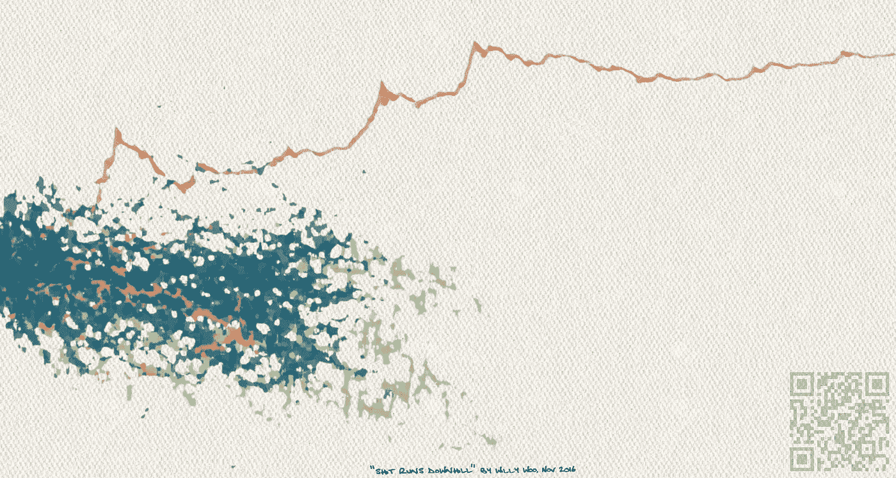

# 投资区块链创新:介绍

> 原文：<https://medium.com/hackernoon/innovation-based-crypto-investing-an-introduction-71b84292bf3a>

Source: Pixabay

最近，由区块链技术支持的另类融资方式越来越受欢迎，媒体称之为“ICO 狂热”，这使得资金有限的个人有可能进入以前被围墙围住的投资工具花园，这些投资工具有可能提供类似风险资本的回报。许多人正确地警告说，市场过热，目前的代币融资方式仍然非常有限，但在这一点上，代币销售需要被视为风险资本和金融的一种破坏性力量。但是[巨大数量的](https://www.smithandcrown.com/icos/)新项目，每周都有多个象征性的销售，以及该领域令人难以置信的创新速度，让人很难不被完全淹没。

有许多有用的评估工具旨在概述在投资给定项目/令牌之前需要考虑的方面(这里的是众包尽职调查框架，这里的你会发现[克里斯·伯尼斯克](/@cburniske)的估值框架)。然而，在深入研究本质细节之前，需要根据具体的投资假设对大量流入的项目进行过滤。一个*投资假设* 是一组基于一定假设的对未来的预测，目标是通过投资与之一致的机会来产生回报。当你遇到有趣的投资机会时，它们有助于提高你的意识，并帮助你建立一个更有针对性的投资组合，为你的投资提供良好的理由，让你有信心度过 HODL 的艰难时期。在这篇文章中，我假设一种高风险、长期、以技术为中心的投资方式，类似于风险投资。

一种方法是从基础开始:*该技术支持哪些创新？*

> 正如安德烈亚斯·安东诺普洛斯 [恰当地表述的那样](https://www.youtube.com/watch?v=SMEOKDVXlUo#t=14m31s)，如果你可以用“数据库”代替“区块链”,而小册子读起来还是一样，那不是一个好现象。相反，如果项目的核心价值主张直接源自区块链的创新特性，那才更有意思。

这篇文章反映了加密货币领域的几个关键创新领域，这些领域可能会导致不同的投资假设，并以当前项目为例进行了说明。我们将逐一研究区块链和智能合约的不同创新能力，看看它们如何导致对未来的不同猜测。到目前为止，这些创新中的大多数只能以非常有限的方式应用，但是这个练习是为了思考如果当前的限制可以被克服，未来可能会是什么样子。

请注意，仅仅战略考虑不会使项目成功，但其他因素，如时机、团队和执行，最终往往是至关重要的(尽职调查是没有办法的)。这些是我自己的投机性思考，无意作为投资建议。这意味着从一个基于创新的战略角度的投入，可以帮助你设计你自己的关于空间的假设，并做出更有信心的投资决定。它也可以被解读为对 cryptoland 的介绍，以及对这个领域未来可能出现的情况的乐观展望。

# **区块链的能力:**

B 锁链是分布式分类账，使互不了解、互不信任的双方能够进行价值交换。它们可靠地跟踪这些交互的状态，同时维护整个数据库的一致性，并提供信息安全性的保证。例如，大多数区块链保证任何一方都不能秘密地对共享账本进行更改，存储在账本中的信息将永久保存，并且每个人都遵循相同的规则。区块链有趣的属性和能力是其颠覆性潜力的来源。因为它们经常重叠并相互依赖，所做的分类并不清晰，当然也不详尽。我们主要谈论的是公共区块链，因为最强大的特征是*直接源自这些系统的开放性*，因此通常不适用于特许(公司或财团)区块链。

Source: strategy-business.com

**去中心化和非中介化**

到目前为止，一个成功的风险投资假说是投资于*集中式网络*，因为在当前的网络客户端-服务器架构中，让许多参与者参与到单一平台的唯一方法是让一个集中式服务商控制该平台。然后，这个强大的中介可以收取交易费用，或者以其他方式提取平台上创造的大部分价值(例如用户数据)。

> 密码术和经济激励的结合使得第一次有可能建立复杂的协作和互动网络，而不需要可信任的第三方。

如果与现有平台相同的功能(多方互动并创造某种价值的地方)可以通过一个分散的架构来实现，那么通过绕过这个中央中介，使用网络的成本就可以大大降低。如果目前的解决方案是免费的(例如:社交媒体)，用户甚至可以付费使用(例如[Steemit](http://steemit.com/))——这被称为[比免费更好的](https://news.earn.com/thoughts-on-tokens-436109aabcbe)模式。

除了降低成本，一些人甚至预计这种平台的质量会提高:因为令牌经济通常不需要“货币化”，因为用户(作为令牌持有者)有发言权(不仅仅是投资者)，用户体验可能会更好(没有烦人的广告、弹出窗口、赞助内容)。

发现这种思路令人信服的投资者会系统地寻找基于区块链的系统，提供相同或更好的功能，而不需要中间人。因此，对于支付用例，例子将是比特币、莱特币、Dash 和其他经典加密货币。一些试图将去中心化的好处引入 P2P 贷款的公司有 [ETHlend](https://ethlend.io/en/) 、 [Ripio](https://ripiocredit.network/) 和 [Bloom](https://hellobloom.io/) 。像 [OpenANX](https://www.openanx.org/en/) 、 [Airswap](https://www.airswap.io/) 和 [0x](https://0xproject.com/) 等项目都在尝试建立去中心化的交易所。在社交领域，我们也有[李罗伊](https://leeroy.io/)、[印多尔](https://indorse.io/)和[阿卡夏](https://akasha.world/)。[基本注意力标志](https://basicattentiontoken.org/)和 [AdEx](http://adex.network/) 试图改造广告业。对于电子商务，有[开放集市](https://www.openbazaar.org/)。就连云也在被脱媒，用[假人](https://golem.network/)和 [SONM](https://sonm.io/) 进行计算，用 [Filecoin](https://filecoin.io/) 、 [Storj](https://storj.io/) 和 [Sia](http://sia.tech/) 进行存储。另一种方法是投资旨在成为分散市场工厂的生态系统，如 [District0x](https://district0x.io/) 。

然而，至少在此时此刻，在用户体验和功能方面，这些系统中的大多数仍然无法与它们的集中式对手竞争。这是由许多问题造成的，从可伸缩性到治理问题以及基础设施的普遍缺乏。

**分布式信任和开放访问**

正如我们所见，区块链使参与者能够相互交流，而不必通过一个集中的平台。然而，当前系统中的中央权威不仅需要提供沟通渠道，更重要的是提供信任。在分散的系统中，信任是通过透明度、加密保证和适当的激励产生的。因为每个参与者都可以访问分类帐，所以每个人都可以自己检查每件事情是否都按预期运行。用于保护资金和跟踪数据的加密技术(主要是[私钥/公钥](https://blog.wetrust.io/why-do-i-need-a-public-and-private-key-on-the-blockchain-c2ea74a69e76)和[哈希函数](/@ConsenSys/blockchain-underpinnings-hashing-7f4746cbd66b))为数据的安全性和完整性提供了数学保证。而适当的激励为其他行为者的行为提供了信任的基础，因为大多数人都喜欢赚钱。这种组合使得互不了解也不信任的参与者能够在没有第三方建立信任的情况下进行交易。区块链的这一核心属性通常被称为“不信任”(尽管该术语被[批评为误导，因为信任仍然是必需的，但基于](/@ntmoney/trustless-is-a-misnomer-956066661b79)[秘密经济学](https://thecontrol.co/cryptoeconomics-101-e5c883e9a8ff)而不是权威)。

正因为如此，分布式账本可以很好地防范可能滥用权力的中间人或想要篡改数据或破坏系统的恶意方，并且可以应用于投票、在公共注册表中跟踪所有权，甚至可以应用于彩票和赌场等可证明公平的游戏。事实上，当数据包含在链中时，总是带有时间戳，这产生了更多的用例，如版权和知识产权证明。

另一个主要的好处是基于区块链系统的彻底开放的性质:目前，人们需要通过将他们的身份绑定到一个帐户并接受条款和条件来请求看门人允许使用大多数服务。为了进行银行转账，我需要银行的许可(一个银行账户)，基于从政府到信用评级机构的一堆其他实体的许可。在(大多数)区块链，情况并非如此——创建一个新地址，然后就可以开始了。对于缺乏基础设施的地区或没有证件的个人来说，这显然是一个大新闻。另一个优势是区块链本质上是全球性的，不仅每个人都可以访问，而且可以从任何地方访问(通过互联网访问)。

利用这些特征进行投资的候选人数不胜数:[地平线州](https://horizonstate.com/)是投票的一个例子，[无边缘](http://edgeless.io/)是一个被证明是公平的赌场。[有人认为](/@ConsenSys/why-how-decentralized-prediction-markets-will-change-just-about-everything-15ff02c98f7c)大规模预测市场可能最终会因为它们而成为可能， [Gnosis](https://gnosis.pm/) 和[audger](https://augur.net/)就是最突出的例子。 [Factom](https://www.factom.com/) 、 [Tierion](https://tierion.com/) 和 [Po.et](https://po.et/) 正在构建有关保护和验证数字资产的用例。一些最著名的旨在为没有银行账户的人提供银行服务的企业是 [Stellar](https://www.stellar.org/) 和 [Humaniq](https://humaniq.com/) (而 [OmiseGo](https://omg.omise.co/) 想要为有银行账户的人提供银行服务)。

**透明度——隐私**

区块链的另一个显著特点是，他们可以在透明度——隐私维度上的任何地方跌倒。到目前为止，大多数区块链对分类账中存储的所有交易都提供了透明度，披露了发送和接收地址以及交易内容。隐私在很大程度上得到了保护，因为任何人都可以随心所欲地创建多个地址(因此这些地址与个人身份没有直接联系，尽管在某些情况下可以通过相关性来推断)。然而，还有一些保证完全隐私，既不透露发送者/接收者地址也不透露其内容。隐私不仅是商业交易所需要的，也是可替代性所需要的，这反过来也是所有“货币”用例所需要的(如果每个硬币都有特定的历史，那么不是所有硬币都有相同的价值)。一些货币通过[混合器和环签名](https://decentralize.today/mixers-and-ring-signatures-51f3f125485b)(通过使用一次性地址进行混淆)或 [zk-snarks](https://decentralize.today/zero-knowledge-proofs-zcash-and-ethereum-f6d89fa7cba8) 提供隐私解决方案。后者是密码学的一个惊人壮举，它使公众可听见性和完全隐私的明显矛盾成为可能:可以从数学上证明一个交易(或代码，就此而言)在不泄露其任何内容的情况下被正确执行。这对于从战略性商业交易到投票的大量应用程序来说非常有用。虽然有些人认为区块链可能会产生隐私权的实际实施，但其他人担心特别关注隐私的货币可能会成为各种犯罪活动的催化剂。虽然非常有趣和相关，但这些困难的道德和法律争议显然超出了这里的范围。

另一方面，区块链的透明度和可听度方面也可以用来使供应链等不透明的流程变得更加透明(尽管这些用例通常需要依赖传感器等可信的信息输入，这限制了它们的效果)，或者在会计等事情上实现默认可听度。

对于只有特定实体(个人、组织或智能合同)能够执行交易或拥有给定资产的用例，需要身份。然而，身份的概念是模糊的，根据上下文，可能意味着许多不同的事情。虽然一些区块链操作系统试图将身份嵌入到他们的产品中，但这个领域的大多数项目都专注于创建一个可以跨多个应用程序使用的身份协议或数据锁(目的是将敏感数据保持在用户的控制之下)，但在具体实现上有很大的不同。许多人首先质疑区块链对身份的适用性:反复出现的论点是，要建立身份——一种链外财产——无论如何都必须依靠可信任的一方，而且永久的身份分类账可能会被滥用。其他人认为，我们所知的身份在开放的系统中不再需要，而是会被分割成特定于上下文的属性。

对这些特征的讨论可能会导致非常不同的投资决策:认为隐私将是未来更加重要的关注点的投资者可能会转向注重隐私的硬币，如 [Monero](https://getmonero.org/) 、 [Zcash](https://z.cash/) 、 [Dash](https://www.dash.org/) 甚至是类似 VPN 的系统，如 [Mysterium](https://mysterium.network/) 或[兰花协议](https://orchidprotocol.com/)。从这个角度来看，最近将零知识证明集成到以太坊中使其成为一项更有趣的投资。在透明性和可闻性方面，像[balance 3](https://www.balanc3.net/#/)这样的应用程序可能对会计感兴趣，或者对供应链感兴趣的[ambroses](https://ambrosus.com/)和 [Modum](https://modum.io/) 。认为身份是一个有趣用例的人应该研究一下 [Blockstack](https://blockstack.org/) 、 [Uport](https://www.uport.me/) 、 [Val:](https://valid.global/) ID 和 [Civic](https://www.civic.com/) 。

# **智能合约的力量**

S *mart 契约*利用区块链的属性创建契约，一旦满足预定义的条件，这些契约就会触发某些事务，并可用于创建分散的应用程序。创造了这个术语的尼克·萨伯提出了一个类似于[自动售货机](http://www.fon.hum.uva.nl/rob/Courses/InformationInSpeech/CDROM/Literature/LOTwinterschool2006/szabo.best.vwh.net/idea.html)的比喻。因为智能合同不属于任何单一实体，所以它们支持所谓的*关系软件*，这对合作的可能性有着令人兴奋的影响。USV 的争议(此处挑战[杰克·布鲁克曼](https://blog.coinfund.io/@jbrukh))[【胖协议】](http://www.usv.com/blog/fat-protocols)假说建议投资[以太坊](https://ethereum.org/)、 [Neo](https://neo.org/) 、 [Qtum](https://qtum.org/en/) 、 [EOS](https://eos.io/) 、 [Cardano](https://www.cardanohub.org/en/home/) 等通用操作系统。它们利用区块链的特性来提供这些智能合约功能，并且处于新兴技术堆栈的基本级别。这样做的好处是，无论最终哪个特定的应用程序胜出，它都有可能构建在这些系统中的一个之上。同样，[截至目前](https://www.coindesk.com/when-is-a-smart-contract-actually-a-contract/)，仍有许多未解决的问题，从如何纳入区块链(oracles)之外的数据，到与不同国家法律体系的关系( [Oracelize](http://www.oraclize.it/) 和 [ChainLink](https://www.smartcontract.com/) 正在致力于此)，但目标是想象未来可能发生的事情。

Source: ethereum.org

**自动化、DAOs 和分布式协作**

智能合约的简单应用，比如一旦付款或其他条件得到满足，就转移一些资产的所有权，似乎还算有用。然而，更有趣的是，我们想象的更复杂的自动售货机——理论上，整个企业可以完全由智能合同管理。这就是 [DAOs](https://en.wikipedia.org/wiki/Decentralized_autonomous_organization) (不是[“道](http://hackingdistributed.com/2016/06/17/thoughts-on-the-dao-hack/))背后的理念，去中心化的自治组织。这些组织不仅能以(交易)成本的一小部分做同样的事情，而且能以前所未有的合作结构做同样的事情。因为他们也将享有不变性、可审计性的属性，并且将以非中介化的方式运作，这似乎是一种令人难以置信的强大组合，导致一些企业家宣布公司的[死亡和](https://thecontrol.co/the-slow-death-of-the-firm-1bd6cc81286b)[不可阻挡的组织](https://blog.aragon.one/introducing-aragon-unstoppable-companies-58c1fd2d00ce)的时代。

那么，什么样的新型组织结构是可能的呢？首先，这些组织可以分布在全球各地，甚至不需要办公室(正如我们已经在该领域的许多项目中看到的那样)，其参与者更直接地与项目的成功挂钩(例如，带锁定期的工资支付)。决策也可以以分布式的方式做出:一个简单的应用是使用 [muli-sig](https://coincenter.org/entry/what-is-multi-sig-and-what-can-it-do) 进行某些事务。然而，关于如何利用区块链使决策更加包容、民主、透明，甚至更好的想法正在出现，例如[流动民主](/organizer-sandbox/liquid-democracy-true-democracy-for-the-21st-century-7c66f5e53b6f)。这种想法变得更加怪异，它基本上将预测市场应用到决策中，通过对拥有有价值知识的个人进行适当的激励来改善其结果——它迫使人们真正地把钱花在他们所说的地方。

另一个可能的影响是关于合作的边界:因为分布式组织的边界是模糊的，参与通常是不需要许可的，任何人都可以做出贡献，如果系统设计得当，可以根据提供给网络的价值得到补偿。这些彻底开放的系统建立在分散信任的基础上，而分散信任又源于上述区块链的特性。如果在组合中加入正确的加密技术，可以设计出这样的系统，它甚至允许竞争者在不泄露任何会损害其竞争地位的数据的情况下进行合作。这种情况是可能的，因为不同的竞争对手都无法控制管理合作的数据或合同，他们都可以验证在什么条件下会发生什么。

交易自动化的一个很好的用例是让能源电网更加智能(见[电网+](https://gridplus.io/) 或[电力分类账](https://powerledger.io/))。专注于建立区块链本土组织的迷人项目有[阿拉贡](https://aragon.one/)和[殖民地](https://colony.io/)。如果你对液态民主感兴趣，请查看 [democracy.earth](http://democracy.earth/) 。敏感数据合作的有趣尝试的例子有[number . ai](https://numer.ai/)、 [Enigma](http://enigma.co) 和[海洋协议](https://oceanprotocol.com/)。

**令牌化&可编程货币**

智能合约的另一个非常强大的应用是在现有区块链的基础上创建各种新的金融/法律工具，统称为代币。令牌可以代表用例要求的任何东西——它是可编程的值。

正如 [Nick Tomaino](https://thecontrol.co/@ntmoney) 所解释的，有许多[种类的令牌](https://thecontrol.co/on-token-value-e61b10b6175e)从不同的权利中获得它们的价值，例如，*使用令牌*授予使用数字服务的权利，而*工作令牌*代表贡献的权利。投票权和收益权也是可能的，但可能属于[法规](https://blog.coinbase.com/2016-12-07-blockchain-token-securities-law-a66ef03c383f)的范畴。许多项目还试图将传统资产令牌化，以允许它们集成到智能合同中，或者使它们更具流动性或可分割性。然而，资产的链上表示(令牌)和资产本身的关系是有问题的，因为当前的解决方案需要依赖可信的中介。

> 这种多样的代币结构使得做出投资决策更加困难，因为除了所有其他参数之外，代币设计的可行性和代币价值的驱动因素都需要仔细分析。最重要的是要理解代币具有可能在不同程度上类似于货币、产品许可/API 或证券的属性，并且它们还可能表现出新颖的特征，例如增加的流动性和可替代性，或者它们与其他智能合约交互的能力。

迄今为止，代币最突出的用例是筹款，通过代币销售筹集的大量资金最近成为头条新闻。代币销售的有趣之处不仅在于全新类别的投资者(散户投资者)可以参与进来，而且筹资的交易成本显著降低，而且代币化可以用于资助公共产品和开源协议，这些产品和协议迄今为止还不能“货币化”(这基本上是通过分配产权来纠正市场失灵)。

有许多项目专注于将传统资产令牌化，例如 [LA token](https://latoken.com/) (其他项目专注于房地产或艺术品等特定行业)或 [Digix](https://digix.global/) 将黄金令牌化。 [Bancor](https://www.bancor.network/) 和他们的“智能代币”瞄准了货币的[长尾和](https://blog.bancor.network/how-the-long-tail-of-cryptocurrencies-spells-massive-opportunity-for-society-c5f474dbd192)提供了一种用户友好的方式为交易量不大的代币提供持续的流动性(通过类似于部分准备金银行的机制)。研究那些渴望成为代币销售催化剂的项目也是有意义的，比如 [Cofound.it](https://cofound.it/en/) 和 [Neufund](https://neufund.org/) (代币化创业股权)。

遵循可编程货币思路的另一种方法是考虑金融业的需求:一个经常被提及的例子是，比特币作为独立的价值储存手段和对冲市场风险的功能，是黄金的替代品。比特币几乎[与其他资产完全不相关](https://www.signalplot.com/what-is-bitcoins-correlation-with-other-financial-assets/)，具有与黄金相似的特征，如证实的稀缺性、国际认可和对变化的抵制，甚至提供了优于黄金的[改进，如更易于存储、访问、转移、验证，以及独立于银行和市场基础设施。然而，唯一真正的问题是比特币的波动性，这种波动性一直在](https://hackernoon.com/we-already-know-blockchains-killer-apps-f2d443eba35)[下降](https://twitter.com/cburniske/status/921794165083648000)。加密领域非常需要的金融工具是 stablecoins，也就是说，具有最小波动性并可用于其他应用的令牌。 [Maker](https://makerdao.com/) 正在酝酿中的稳定币被称为 [Dai](https://github.com/makerdao/docs/blob/master/Dai.md) ，其目标是拥有与加密世界中的欧元/美元等主要货币对相当的波动性。

**网络所有权效应**

网络效应，即新用户加入时现有用户效用的增加，是许多最成功商业模式的核心，如脸书或亚马逊。用户和投资者的合并基本上增加了这些效应，导致了所谓的[网络所有权效应](https://thecontrol.co/the-token-economy-81becd26b9de):除了效用的增加，现有用户(和所有者)也受益于新用户加入时服务所有权价值的增加。想象一下，如果(早期)脸书的用户都持有脸书的股票，他们会有怎样不同的行为。她们会更多地参与到这个平台中，甚至会让她们的祖母也加入进来，因为她们有这样做的直接经济激励，以及强烈的主人翁意识和认同感。正如我们可以从比特币(和其他项目)中观察到的那样，用户群可以变得近乎狂热，以专注的营销人员和开发人员的身份支持项目，并开始正反馈循环，这可能会导致许多企业家的梦想:有机超增长。

这在开始时尤其强大，传统平台在加入新用户以增加平台效用方面面临着鸡和蛋的问题:网络所有权效应可以被用来基本上启动网络效应并解决“冷启动问题”。

如上所述，这也解决了管理理论的经典代理问题(假设代币持有者参与决策过程)，甚至可能消除通过恼人的广告“货币化”的需要。

# **结论**

Picking winners is hard: Woobull’s artsy data visualization of 118 altcoins over time, titled “shit runs downhill”

我们已经看到，区块链的特性使得无数的应用程序能够在任何地方消除中间人或者释放或保护数据。

> 最好的项目创建了一个生态系统，通过一种价值与平台的成功挂钩的共享货币，将不同利益相关者的激励结合起来，将价值分配给创造价值的人。总的来说，区块链的商业模式似乎有一些不公平的优势:交易成本大幅降低，通过透明度和可闻性提高了信任度，通过数据所有权和低进入壁垒赋予用户权力，以及网络所有权效应推动的疯狂扩张速度。

尽管看起来很肯定会有很多创新发生，但很难想象所有这些将走向何方，也很难选出赢家——这就是为什么在投资加密货币时，适当的尽职调查和多样化至关重要。可能最高的风险是执行，使得团队的能力和可信度成为一个需要考虑的关键因素。时机是另一个至关重要的因素(因为代币固有的流动性)，用暂定的时间表来丰富一个人不同的投资假设是最有意义的。此外，仅仅持有比特币等主要货币的机会成本是巨大的，所以建议只投资那些不仅符合你对该领域的假设，而且通过了全面尽职调查的项目。最后，很明显，永远不要投资超过你能承受的损失，并期待沿途的一些重大调整:正如他们所说的那样，在牛市中，每个人都是天才。

. . . . . . . .

*披露:我持有比特币、以太和许多提到的代币*