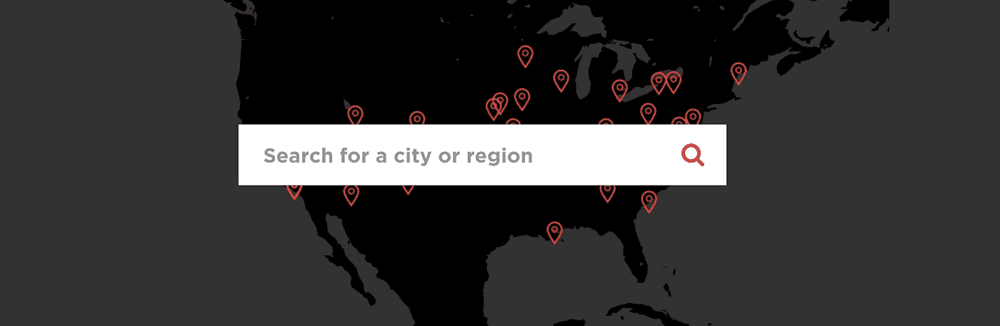
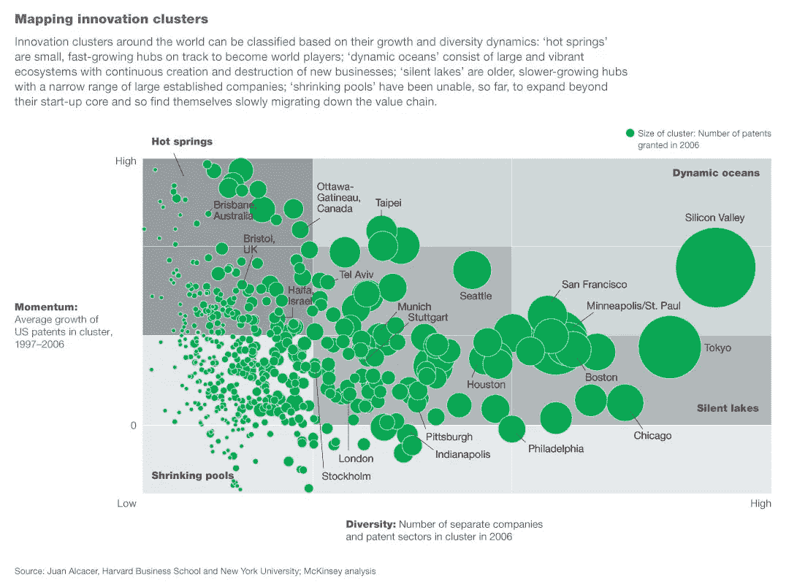
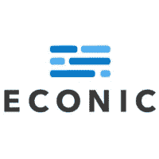

# 创新:来到你附近的城市？

> 原文：<https://medium.com/hackernoon/innovation-coming-to-a-city-near-you-df8376d6ce84>

## 安娜·梅森谈什么推动了美国“其他”城市的创新

The Rise of the Rest tour has already covered cities in every region of the country. Find out what they learned in your city: [https://www.riseofrest.com/chapters/](https://www.riseofrest.com/chapters/)

我们邀请了 [Revolution 的](https://www.revolution.com) Anna Mason 参加内部/外部创新峰会，介绍从[Rest 之旅](https://www.riseofrest.com/chapters/)中获得的经验。

> 我们花时间参与深思熟虑和热烈的讨论，以了解是什么使每个城市独特和成功。我们讨论未来的挑战和机遇。如果我们能够帮助验证和突出每个城市促进创新和创业的努力，这一天就是成功的。

从他们 20 多次的停留中，Revolution 的团队确定了任何创新生态系统的七个基本要素。安娜概述了每一个:

1.  **孵化器、加速器、训练营、共同工作空间**:这些都是社区的物质支持基础设施
2.  地区投资者:专业管理的实体、企业风险部门、天使集团、公共或私人基金
3.  **大学:**多方面——提供人员、场所、技术和家庭网络
4.  **初创公司**:简单地通过现有技术创造创新中心
5.  **媒体—地方&国家:**支持初创公司的早期成功
6.  **地方政府**
7.  **企业:** [这是安娜在演讲中提到的 CB Insights 企业风险报告](https://www.cbinsights.com/research/corporate-venture-capital-active-2014/)

她在下面的视频中详细阐述了每一点。

## 安娜言论的其他注释

*   “高增长公司可以在任何地方起步和扩张，而不仅仅是在我们看到 75%投资资本流向的沿海城市。”
*   财富 500 强的遗产有助于为初创公司创造专门的后院:看看纳什维尔的医疗保健，亚特兰大和圣路易斯的金融科技，底特律的制造业
*   85%的财富 500 强公司位于硅谷、纽约和波士顿之外

非常感谢 Anna、Revolution 以及所有参与“崛起之旅”的人帮助加速新兴创业生态系统的发展。这是最近的一个热门话题，所以我们包含了关于任何城市如何促进和举办创新的最佳讨论和研究的链接。

## **更多关于创新集群/创业生态系统的信息**

*(* [*提示:如果你喜欢这样的列表，请注册我们的简讯*](http://eepurl.com/c0yl81) *)*

[**【下一个硅谷】**](https://itunes.apple.com/us/podcast/9-next-silicon-valley-is-endeavors-linda-rottenberg/id1227971746?i=1000389800240&mt=2)**——**与雷德·霍夫曼的规模化播客:里德号召朋友和同事为下一个硅谷而争论。特拉维夫？纽约？Y Combinator 的萨姆·奥尔特曼说洛杉矶。

(上图) [**麦肯锡&公司全球创新热力图**](https://cohn.files.wordpress.com/2009/03/global-innovation-heat-map.jpg) —大图

[**精益创业&创新生态系统作者特里斯坦·克罗默在 I/O 创新播客**](https://www.acast.com/insideoutsideinnovation/ep.53-summitspeaker-tristankromer)——特里斯坦经常写这些话题。关注他的博客 [GrasshopperHerder。](http://grasshopperherder.com/)

 [## Ep。53 -峰会发言人:特里斯坦·克罗默| acast 上的内外创新

### Tristan Kromer 是全球精益创业运动的精益创业教练。凭借多年的经验和广泛的…

www.acast.com](https://www.acast.com/insideoutsideinnovation/ep.53-summitspeaker-tristankromer) 

[**美国的融资创新**](https://www.amazon.com/Financing-Innovation-United-States-Present/dp/0262122898)——这本书以独立的章节撰写，总是很不错。强烈推荐关于底特律汽车工业和创新集群发展的第二章。(我们有多一份。如果你有兴趣让我们知道，我们可以邮寄它！)

[**史蒂夫·凯斯的“其余者的崛起”倡议**](https://www.riseofrest.com/)**——“我们的观点是，这是全美国创业新时代的开始——高增长公司现在可以在任何地方开始并扩大规模，而不仅仅是在几个沿海城市。”**

**[**迈克尔·波特的 HBR 关于“集群”的文章**](https://hbr.org/1998/11/clusters-and-the-new-economics-of-competition)——集群是特定领域中相互关联的公司和机构的地理集中。集群包括一系列相互关联的产业和其他对竞争重要的实体。**

****

**感谢阅读——我们是 [Econic](http://econic.co) ，我们帮助公司规划和执行创新。如果你喜欢这篇文章，我们希望你能分享它。点击下面的绿心，发微博。**

**给我们发电子邮件，地址是 team@econic.co[https://twitter.com/econicco](https://twitter.com/econicco)**