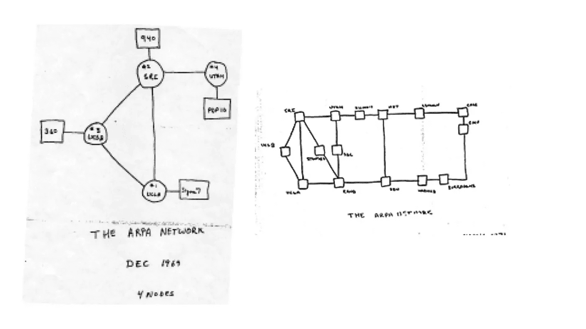

# DARPA(给你互联网的人)的创新经验

> 原文：<https://medium.com/hackernoon/innovation-lessons-from-darpa-the-folk-who-gave-you-the-internet-825a0c084740>

[First Rough Conceptual Design of ARPANET](http://www.darpa.mil/about-us/timeline/modern-internet)

我们大多数人都知道 DARPA(国防高级研究计划局)给我们带来了 GPS、语音识别、无人机、纳米技术、自动驾驶汽车、弹道导弹防御和(当然)互联网。没有得到太多报道的是使政府实体能够大规模创新并为我们今天认为很酷的几乎每一项技术奠定基础的思维和战略。DARPA 是怎么做的？通过提出漂亮的问题，然后围绕回答问题的步骤包装一个可行的策略和操作。

> "总是美丽的答案问一个更美丽的问题."卡明斯

## 问漂亮的问题

Stanley.

[2004 年 DARPA 的第一次大挑战](http://www.businessinsider.com/the-first-self-driving-cars-that-competed-in-darpa-grand-challenge-2015-10)被认为是一次失败。挑战的目标是*开发一个能够穿越未经训练的越野地形的自主机器人*。第一年参赛的*自动驾驶汽车*没有一辆跑完全程。2005 年，斯坦福大学的斯坦利是唯一完成课程的车辆。短短两年后，六辆参赛的赛车完成了比赛。现在的消息是，每个主要的技术公司都在研究自动驾驶汽车，预计到 2020 年我们将拥有完全自动驾驶的汽车。响应 DARPA 大挑战的竞争对手和致力于自动驾驶汽车的领先科技公司都走上了这条发现之路，因为 DARPA 敢于提出一个问题。一个很美的问题。 [**一个催化性的、雄心勃勃的、可操作的问题，让大家对汽车有了不同的思考**](http://amzn.to/2qteOJz) 。美丽的问题就是这样。 *PS:这里的* ***可操作的*** *部分是重点。* [*自动驾驶汽车的前提已经出现了一段时间*](http://www.computerhistory.org/atchm/where-to-a-history-of-autonomous-vehicles/) *，所需的技术(激光雷达、传感器等)直到最近才出现。*

[Image Courtesy of Computer History](http://www.computerhistory.org/atchm/where-to-a-history-of-autonomous-vehicles/).org

## 不仅仅是美丽的问题

然而，仅仅问漂亮的问题是不够的。有些公司问了漂亮的问题，但从来不回答问题。 **DARPA 提出了*中的问题为什么？，如果呢？，怎么会？沃伦·伯杰在“*** [**一个更美丽的问题**](http://amzn.to/2qteOJz) **中建议的格式，除了提出美丽的问题，还围绕回答**的过程包装了良好的策略。2007 年的 DARPA 问题声明证明了这一点，声明称

> "[任何军事研究机构面临的一个基本挑战是将军事问题与技术机遇相匹配](http://www.darpa.mil/our-research) ( **原因**)……(2)一些新兴技术可能会产生深远的军事后果(**“如果……会怎样”**)。DARPA 将其投资(**“如何”**)集中在这个“DARPA-hard”领域——一系列技术挑战，如果解决这些挑战，将会给美国国家安全带来巨大好处，即使技术失败的风险很高"

## 抄袭最好的

甚至谷歌/Alphabet 也借用了 DARPA 的方法，有时还借用了一些想法，谷歌眼镜和 [DARPA 通过计算相机程序](http://www.darpa.mil/program/soldier-centric-imaging-via-computational-cameras)进行的士兵中心成像就是证明，你的公司也可以。

SCENICC by DARPA and Google Glass By Dan Leveille (danlev on Wikimedia) (Own work) [CC BY-SA 3.0 ([http://creativecommons.org/licenses/by-sa/3.0](http://creativecommons.org/licenses/by-sa/3.0))], via Wikimedia Commons

几乎与这个问题同样重要的是 DARPA 采取的战略方法。DARPA 本身不是一个 R&D 实验室，而是一个具有灵活结构的投资公司，使其能够 1)通过 2)寻找高风险-高回报的机会来快速捕捉机会，然后 3)在技术专家的参与下管理计划，这些技术专家现在正在研究机器学习/人工智能系统，使 DARPA 保持 10-15 年的市场领先地位。

你的公司如何做到这一点？作为技术驱动者，您的公司如何在竞争中保持领先？你所在行业的其他参与者在问什么问题？你是在问更好更深刻的问题还是只是在做同样的事情？？你的战略是否侧重于解决行业难题的不同方法？

这是关于问*“为什么？如果呢？又如何？”*雄心勃勃、切实可行的问题，让你的员工能够回答这些问题，相信失败是可以接受的，但成功会让行业突飞猛进。就这么简单。但问题是， ***你/你的公司愿意提出这个美好的问题吗？是吗？***

如果你喜欢这篇文章，请点赞、发微博、分享并用心阅读。报名参加我的博学月刊 [*这里*](http://www.getrevue.co/profile/seyifabo?utm_campaign=Issue&utm_content=forwarded&utm_medium=email&utm_source=Seyi+Fabode) *，你会喜欢的。*

> [黑客中午](http://bit.ly/Hackernoon)是黑客如何开始他们的下午。我们是 [@AMI](http://bit.ly/atAMIatAMI) 家庭的一员。我们现在[接受投稿](http://bit.ly/hackernoonsubmission)并乐意[讨论广告&赞助](mailto:partners@amipublications.com)机会。
> 
> 如果你喜欢这个故事，我们推荐你阅读我们的[最新科技故事](http://bit.ly/hackernoonlatestt)和[趋势科技故事](https://hackernoon.com/trending)。直到下一次，不要把世界的现实想当然！

