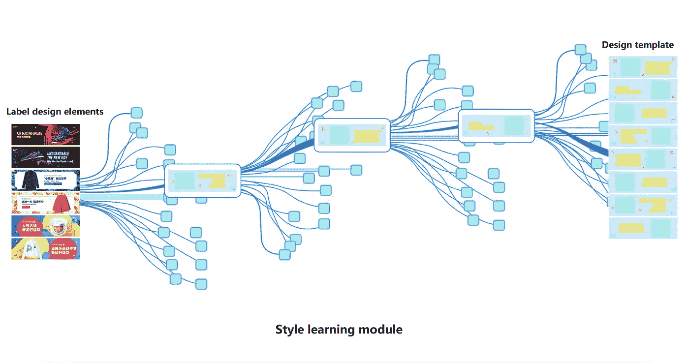

# 4 亿件作品:AI 设计师的购物盛宴

> 原文：<https://medium.com/hackernoon/innovative-new-ai-designer-learns-to-create-own-designs-dffa735d3118>

当你有 4 亿个设计要在 10 天内完成时，拥有人工智能技术真好。

利巴巴开发了一种新的人工智能，它能够向人类设计师学习如何制作自己的原创设计。被称为“鲁班”(以一位传奇的中国工匠命名)，这一创新的新程序每秒钟能够设计多达 8000 个高质量和完全独特的横幅广告。

不仅如此，据负责鲁班开发的首席技术人员乐圣介绍，该程序已经发展到了产生一种超出其所教的设计风格的地步，他说“鲁班花了几周时间研究我们的设计风格，现在已经开始产生人类从未教过它的设计”。

鲁班的创建是对中国最大的电子商务平台(淘宝网)日益增长的需求的直接回应。每年，阿里巴巴的设计师都面临着巨大的压力，要为网站上数以百万计的产品制作源源不断的横幅广告，同时保持成本效益。大量的横幅广告再次出现，部分原因是每个用户都会看到不同的横幅广告，这些横幅广告是为满足他/她的偏好而特别设计的。

尤其是 11 月 11 日，也被称为光棍节，这是中国一年中最大的网上购物日，仅 24 小时内就有数十亿美元的交易额。虽然最初是在 2016 年首次亮相，但鲁班的人工智能在 2017 年光棍节得到了显著改善，在销售期间以每天 4000 万的速度设计了令人难以置信的 4 亿条横幅。这比前一年的总数 1 . 7 亿有所增加。

Every banner was designed differently according to individual user’s preference.

## AI designer 是怎么工作的？

人工智能成功的秘密来自一个三阶段的学习发展计划，在这个计划中，鲁班研究了人类设计师的工作，并审查了数百万份设计草案和数据。

Three-stage learning development program

最终，鲁班的作品是由合适的设计结构和合适的设计元素组合而成的，以产生完整的旗帜形象。

为了产生最好的设计结构，鲁班首先必须开发一个风格学习模块。通过一个神经网络的学习过程，鲁班研究了不同设计元素的构成:背景、蒙版以及设计技巧和风格。通过这样做，鲁班能够对旗帜的构造有一个基本的了解，并能够回忆和应用各种复杂设计过程所需的不同程序。

在这个初始阶段之后，开发了一个设计框架。这就形成了一系列基本的设计知识和规则，鲁班能够从中产生一套设计。这就相当于设计师在动笔之前，脑海中已经有了一个设计的总体概念或愿景。

在开发鲁班风格学习模块的同时，该团队也开始构建元素中心——一个庞大的个人设计元素库，如图像和背景，鲁班可以从中选择合适的组件，以应用于特定的基本结构。在库中，每个设计元素都根据不同的视觉特征和类型进行分类，例如主题、颜色和背景。

在样式学习模块和元素中心都工作的情况下，执行器的作用是最终开始产生设计。执行器的主要功能是根据设计请求的要求，从样式学习模块中选择生成的最佳设计结构，然后从元素中心选择最合适的元素。这使得鲁班可以规划多个最优生成路径并交付旗帜设计。

当这个过程完成时，鲁班产生多个设计，并交付给评估网络。评价网络的目的是输入大量的设计图片和评分数据，经过训练，让机器学习判断设计质量。

AI designer creates suitable flower backgrounds for clothes on display.

## 鲁班成功背后的秘密

鲁班有两个老师每天训练人工智能以提高输出。第一设计师负责帮助鲁班不断学习新的设计模板和方法，让鲁班不断进化。第二个老师评估鲁班的设计结果，向人工智能提供关于哪些设计更好的反馈。通过这种方式，鲁班可以在选择合适的模板和设计元素时将这种反馈纳入到未来的决策中。

设计师的核心职责是把设计变成数据。目前，鲁班已经学习了百万份设计稿，进化出上亿张海报设计能力。

为了做到这一点，阿里巴巴的设计师和算法工程师首先必须研究视觉设计专家如何将设计抽象为风格、技术、模板和元素的数据模型。这使得他们能够将多年的视觉设计经验转化为机器可学习的数据。

定义数据模型后，数据被捕获和标记，数据集被分类和管理。这提出了几个挑战，例如应该使用什么数据来验证这个模型，以及我们如何评估模型的有效性？这些数据问题需要清晰的数据链设计。

最后，需要通过产品设计师和算法科学家之间的讨论来开发算法框架，以将业务场景和数据问题转化为算法。

当然，鲁班的发展并非没有挑战。尤其是这样一个事实，即以前根本没有这样做过，所以没有真正的先例可循，也没有现成的技术或框架可供参考。

此外，还缺少注释数据。今天所有的人工智能都是基于大规模结构化的注释数据，然而在这个领域目前没有大量的数据，而且现有的数据也远远没有标准化和结构化。

最后，这个项目的目标，创造一个具有美感的人工智能，是非常雄心勃勃的。设计是一件非常不确定和主观的事情。评价事物的美丽或视觉吸引力是一种极其人性化的特征。设计是一门艺术，因此传统上与人工智能科学不一致。尽管如此，该项目取得的进展暗示，这一鸿沟仍有可能被弥合。虽然鲁班远不是下一个达芬奇或者梵高，但这绝对是 AI 进步中非常有趣的一步。

(Original article by Wu Chunsong 吴春松)

# 阿里巴巴科技

关于阿里巴巴最新技术的第一手、详细、深入的信息→脸书: [**【阿里巴巴科技】**](http://www.facebook.com/AlibabaTechnology) 。推特: [**【阿里巴巴技术】**](https://twitter.com/AliTech2017) 。