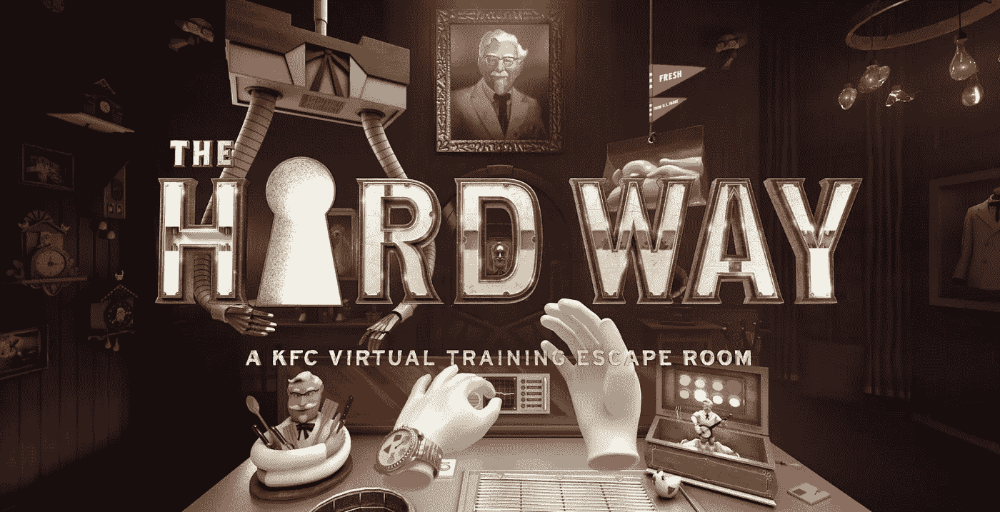
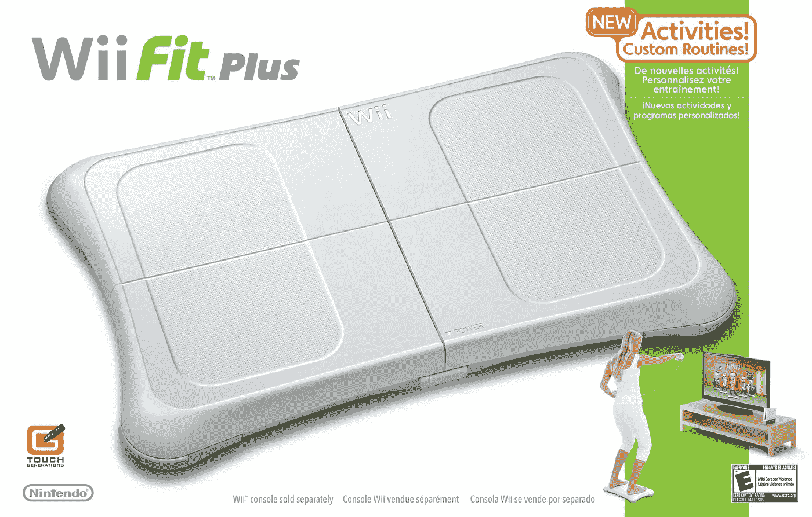
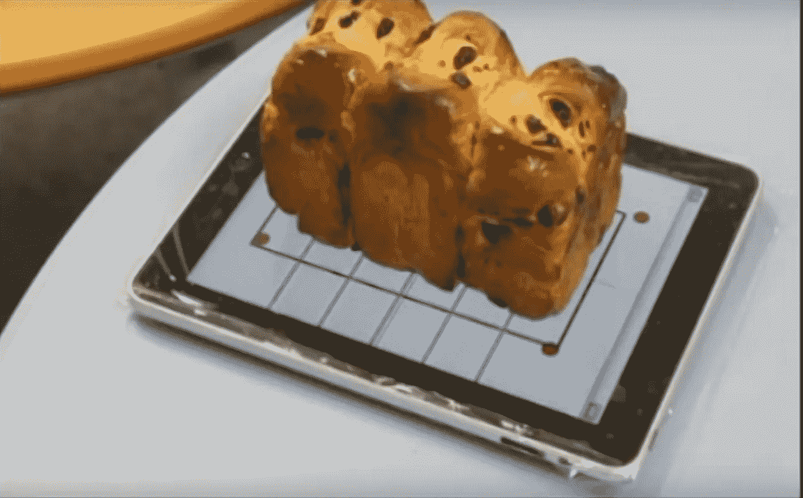
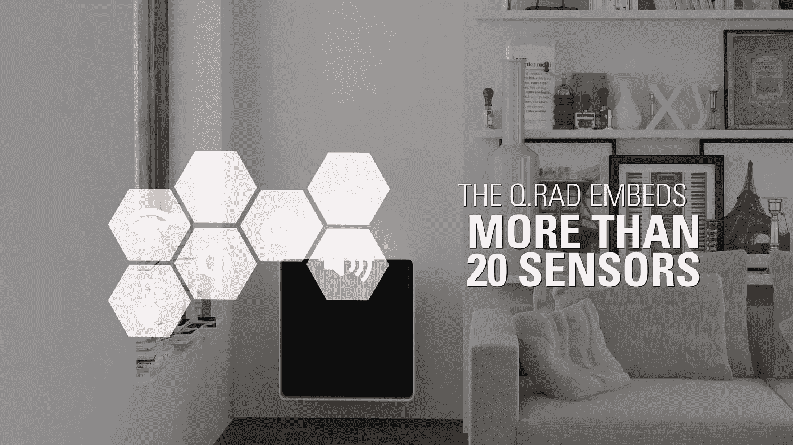

# 技术设计师从未预料到的创新用途

> 原文：<https://medium.com/hackernoon/innovative-uses-of-tech-designers-never-anticipated-644678450a3d>

正如我们从社交[网络](https://hackernoon.com/tagged/network)中了解到的，许多新技术创新与生俱来的功能与我们今天使用它们的功能完全不同。但说到用途，许多技术，无论是旧的、废弃的还是只是在运输途中的，都通过重新利用而获得新生。是最聪明的用户梯队让这种创新成为可能。

我们几乎普遍看到这些用户趋势表明设计师应该关注哪里，以及如何为未来的用户群调整[技术](https://hackernoon.com/tagged/technology)。从营销噱头到改变行业的应用程序，这些都是设计师们从未预见到的最离谱的技术应用。

# 肯德基 VR 培训

Oculus Rift 的最佳用途不是视频游戏。是员工培训视频。嗯，这是一个类似游戏的培训密室，桑德斯上校和他的同事们开始把它作为更传统的员工培训过程的补充活动。一个恶魔般的脱离实体的上校指导(并嘲笑)未来的肯德基工人，因为他们掌握了五步烹饪过程，以逃离房间(或厨房)。记住我的话，噩梦烹鸡模拟人生将在几年内成为新的 MOBA。

“The Hard Way” is maybe not the ideal name

# 汉堡王谷歌主页特技

汉堡王协调了世纪营销噱头。嗯，这是对今年 4 月汉堡王谷歌主页噱头的简单猜测。一个旨在欺骗观众的手机和家庭在维基百科上搜索这个弥天大谎的广告。使用“好吧，谷歌，什么是巨无霸汉堡？”这个 15 秒钟的电视和在线视频宣传片引发了谷歌家用设备在维基百科上搜索该短语并陈述其成分。这一目标与 70 年代的某个[麦当劳活动如出一辙。为什么有人认为这个噱头会增加汉堡王的客流量或者教育观众，这完全是个谜。这是一个伟大而可怕的想法(谷歌肯定不高兴),导致许多维基百科链接，导致广告被撤下，但这是有史以来最巧妙的营销失败之一。这种语音识别技术的使用是创新和聪明的，即使大多数参与者对此不以为然。](https://www.youtube.com/watch?v=dK2qBbDn5W0)

# 把你的 Wii 平衡板变成一个智能秤

有人记得 Wii Fit 吗？Wii 的休闲健身游戏？这并不是一个巨大的成功，也许是因为你必须为所需的平衡板买单，从而将基础价格提高到 90 美元，比典型的 Wii 游戏高出 40 美元。如果你的平衡板在一堆吉他英雄控制器下积灰，不要担心，有一个很酷、很有用的变通方法可以把你的古老外设变成未来的秤。使用开源的 Android 应用程序 [FitScales](https://play.google.com/store/apps/details?id=eu.paulburton.fitscales) ，将你的平衡板连接到互联网是可能的，这肯定是任天堂的设计师们从未想象过的。FitScales 可以将锻炼数据和结果同步到 RunKeeper 或 Fitbit，从而轻松跟踪你的体重和其他健身活动。这些应用程序是免费的，所以你需要的只是你的平衡板和一个安卓设备。

# iPad 切菜板

[日本设计师森英士杉浦设计的切菜板应用程序 iCut](https://www.youtube.com/watch?time_continue=45&v=sCCKGvzj1NY) ，可以把你的 iPad 变成一个智能切菜板。这可能是它从未出现在应用商店的原因，但这个愚蠢的想法非常巧妙。这个应用程序提供了完美的测量方法，可以让你进行均匀的切割，就像你说需要将一个馅饼分成八份一样，在这个过程中消除了所有的估计。iCut 使切面包成为一门精确的科学。PSA:你可能不应该把你的平板电脑用作烹饪工具(除非你在查找食谱)，但也许这个应用程序为智能砧板的到来铺平了道路。

Yum, Challah!

# 作为热源的微处理器

当你的笔记本电脑开始过热时，你可能会担心，并关闭一些标签，确保[蒸汽](http://store.steampowered.com/)没有运行。但我敢打赌，你从来没有想过利用这种力量来创造一种新的热量。Qarnot computing 用 [Q.rad](https://www.qarnot.com/qrad/) 就是这么做的。这种新时代的加热器嵌入微处理器作为热源。它超级安全，环保，而且是免费能源。通过一点点营销和资金使其成为一种消费产品，Q.rad 似乎是未来智能家居的终极设备。

The Q.Rad is V Rad

# 使用 Microsoft Kinect 进行中风恢复

与列表中的其他人形成鲜明对比的是，微软的设计师们对他们的产品被使用感到非常兴奋，他们决定赞助这个想法。Kinect 这样的失败产品可以用来帮助中风患者康复，这简直是一个奇迹。有很多方法可以让个人电脑用户选择 Xbox 配件，但是这个由 T2 微软赞助的项目是最重要的。该系统为用户提供帮助恢复和改善运动功能的练习，同时测量和监控恢复水平。在与首尔国立大学的合作中，这个创新项目旨在提供舒适的家庭治疗。

**By Bryn Gelbart |内容撰稿人** [**助长了**](http://www.fueled.com)

*此处* *阅读原故事* [*。*](https://fueled.com/blog/innovative-uses-of-new-tech-designers-never-anticipated/?utm_source=Medium&utm_medium=referral&utm_campaign=partnership-HackerNoon&utm_content=crazy%20tech&utm_term=crazy%20tech)