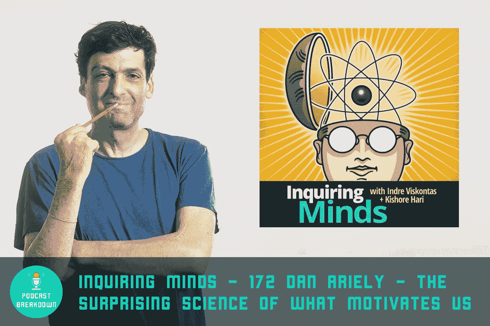
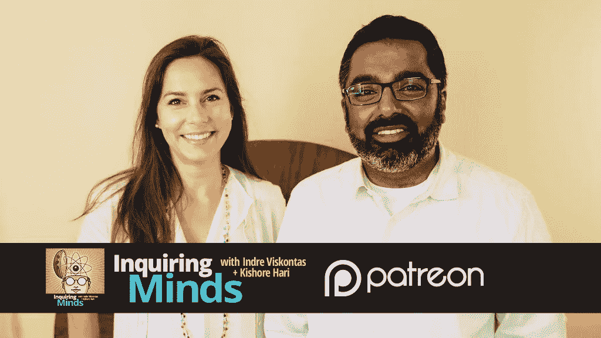
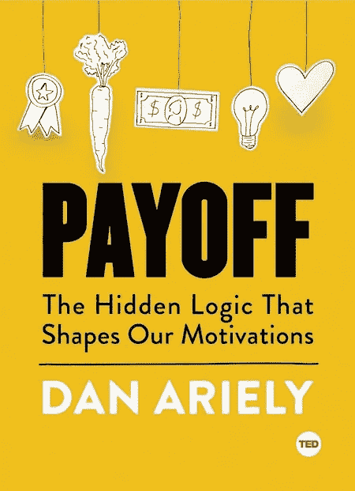
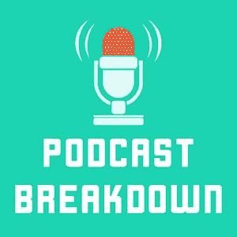

# 好奇的头脑:丹·艾瑞里——激励我们的令人惊讶的科学# 172——播客分类

> 原文：<https://medium.com/hackernoon/inquiring-minds-172-dan-ariely-the-surprising-science-of-what-motivates-us-podcast-breakdown-e9170a11ea86>

## 通过感恩、新年决心、什么鬼效应、量化自我等等来激励自己

# 嘉宾: [iTunes](https://medium.com/u/802fc93f66b2#) 、 [Stitcher](http://www.stitcher.com/podcast/mother-jones/inquiring-minds/e/172-dan-ariely-the-surprising-science-of-what-motivates-us-49562615) 、 [PlayerFM](https://player.fm/series/inquiring-minds/172-dan-ariely-the-surprising-science-of-what-motivates-us) 上听这一集。

**注**:时间戳基于 iTunes 版本。

# 好奇的头脑

我最近发现了《好奇的头脑》,喜欢它对科学和批判性思维的关注。该节目由两个人主持:神经科学家兼歌剧女高音[Indre Viskontas](https://en.wikipedia.org/wiki/Soprano)。她拥有认知神经科学的博士学位和歌剧的硕士学位，现在在 T4 三藩市音乐学院任教。Kishore Hari 是 BayAreaScience 的联合创始人，这是一个门户网站，汇集了整个海湾地区各种科学机构的活动和教育内容。

> “每周，求知播客都会为你带来一次新的、深入的探索，探索科学、政治和社会碰撞的地方。”—琼斯妈妈

**与好奇的头脑联系:** [推特](https://twitter.com/inquiringshow)，[脸书](https://www.facebook.com/inquiringmindspodcast/)或[琼斯妈妈](http://www.motherjones.com/category/secondary-tags/inquiring-minds)

# 与丹联系

**在社交上连接:** [推特](https://twitter.com/danariely)，[脸书](https://www.facebook.com/dan.ariely)， [Instagram](https://www.instagram.com/danariely/)

**丹新书:** [*收益:塑造我们动机的隐藏逻辑*](http://amzn.to/2pBUacJ) :

这是一篇充满知识的长篇文章。希望你成功了。你喜欢吃吗?你想让我记下另一集播客吗？哪一个？给我发邮件到[yoni@podcastbreakdown.com](mailto:yoni@podcastbreakdown.com)或[在这里提出你的建议](http://www.upvoter.co/tallies/hiorb4ja)。

> [黑客中午](http://bit.ly/Hackernoon)是黑客如何开始他们的下午。我们是 [@AMI](http://bit.ly/atAMIatAMI) 家庭的一员。我们现在[接受投稿](http://bit.ly/hackernoonsubmission)，并乐意[讨论广告&赞助](mailto:partners@amipublications.com)机会。
> 
> 如果你喜欢这个故事，我们推荐你阅读我们的[最新科技故事](http://bit.ly/hackernoonlatestt)和[趋势科技故事](https://hackernoon.com/trending)。直到下一次，不要把世界的现实想当然！

