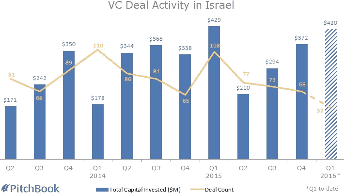
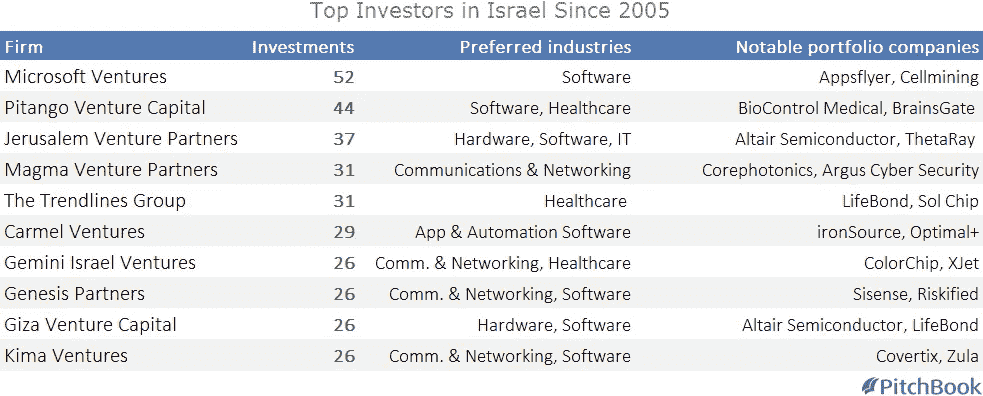

# 硅谷内幕:为什么风险投资在以色列是一个蓬勃发展的行业

> 原文：<https://medium.com/hackernoon/inside-silicon-wadi-why-vc-in-israel-is-a-booming-business-8833bbd4848a>

*最初发表于*[*【pitchbook.com】*](http://pitchbook.com/news/articles/inside-silicon-wadi-why-vc-in-israel-is-a-booming-business#.VuAuhUstVjk.linkedin)*。*

以色列是一个只有 850 万人口的国家，大约相当于新泽西州的人口。但是，这个位于地中海东岸的国家在风险投资领域的影响力远远超过了它的重量，为这个国家以科技为中心的沿海地区赢得了“硅谷”的绰号(Wadi 在阿拉伯语和希伯来语中是“山谷”的意思)。

根据 PitchBook 平台的数据，自 2012 年初以来，美国以外的风险投资交易中有 4%发生在以色列。这在所有国家中排名第七，仅次于中国、印度、英国、德国、法国和加拿大——所有这些国家的 GDP 都让以色列相形见绌。

[2015 年](https://my.pitchbook.com/?pcc=15312-52)以色列完成了 326 笔风险投资，其中一些最大的是由[软件](https://hackernoon.com/tagged/software)公司 ironSource 筹集的 1.05 亿美元融资，以及自由职业市场 Fiverr 的 6000 万美元融资。近 60%的交易发生在信息技术领域，这支持了美国作为高科技创新中心的声誉。

交易总数同比略有下降，从 2014 年的 342 起，但纵观全局，对以色列的投资显然在增加。2013 年至 2015 年，完成的风险投资平均数量为 329 笔，而此前三年为 180 笔，此前三年为 111 笔。虽然红杉资本(Sequoia)和微软风险投资公司(Microsoft Ventures)等一些外国公司正在向以色列注入资金，但支持这一蓬勃发展的行业的国内投资者也不少，包括 Pitango Venture Capital、Jerusalem Venture Partners 和 Carmel Ventures，它们都位列过去十年最活跃的以色列投资者前十名。

那么，这样一个小国是如何在风险投资中扮演如此重要的角色的呢？20 世纪 80 年代中期的减税是早期的推动因素之一，在 1948 年建国后经历了几十年的停滞后，减税促进了经济增长，降低了通胀。1993 年，以色列政府实施了 Yozma 计划，为外国投资者提供税收优惠，并承诺使用政府资金将任何对以色列公司的外部投资翻一番。在 21 世纪初，政府实施了一系列改革，帮助曾经更加集权的经济开放和私有化。总的来说，这些变化使得这个国家对风险投资更加友好。

然而，如果没有投资目标，这些都是无用的。以色列上升的另一个主要因素是大量生产创新理念和产品的公司盛行。

除了 ironSource 和 Fiverr，这些应用还包括导航应用 Waze(2013 年被谷歌以 11.5 亿美元收购)、移动应用平台 Conduit(2012 年估值 13 亿美元)和消息应用 Viber(2014 年以 9 亿美元收购)。

此外，该国作为网络安全中心的声誉，得益于政府投资军事 R&D 的承诺，以及 Check Point(纳斯达克代码:CHKP)等私营公司的努力。Check Point 成立于 1993 年，一直是未来企业家的直接来源——其校友还创办了 Imperva 和 Tufin 等其他网络安全公司。后来的公司接过了衣钵，包括 Aorato 和 Adallom，这两家公司被微软(纳斯达克股票代码:MSFT)以 4.45 亿美元的价格收购。以色列网络安全领域的风险投资活动从未像今天这样受欢迎。2015 年，通过 40 笔交易投资了超过 1.82 亿美元——都是 10 年来的最高水平，都比之前的记录增长了 50%以上。

在这一点上，以色列的高科技市场在某种程度上是一个正反馈循环:公司生产出创新产品和员工，这反过来吸引了更多像苹果和亚马逊这样的公司在以色列建立办事处，这反过来吸引并产生了更多有才华的人，这反过来又建立了新的创新公司，永无止境。

没有人确切知道在以色列投资的前景如何。但考虑到过去 25 年的总体情况，尤其是最近的数据趋势，风投新贵的势头丝毫没有放缓的迹象。

> [黑客中午](http://bit.ly/Hackernoon)是黑客如何开始他们的下午。我们是 [@AMI](http://bit.ly/atAMIatAMI) 家庭的一员。我们现在[接受投稿](http://bit.ly/hackernoonsubmission)，并乐意[讨论广告&赞助](mailto:partners@amipublications.com)机会。
> 
> 如果你喜欢这个故事，我们推荐你阅读我们的[最新科技故事](http://bit.ly/hackernoonlatestt)和[趋势科技故事](https://hackernoon.com/trending)。直到下一次，不要把世界的现实想当然！

