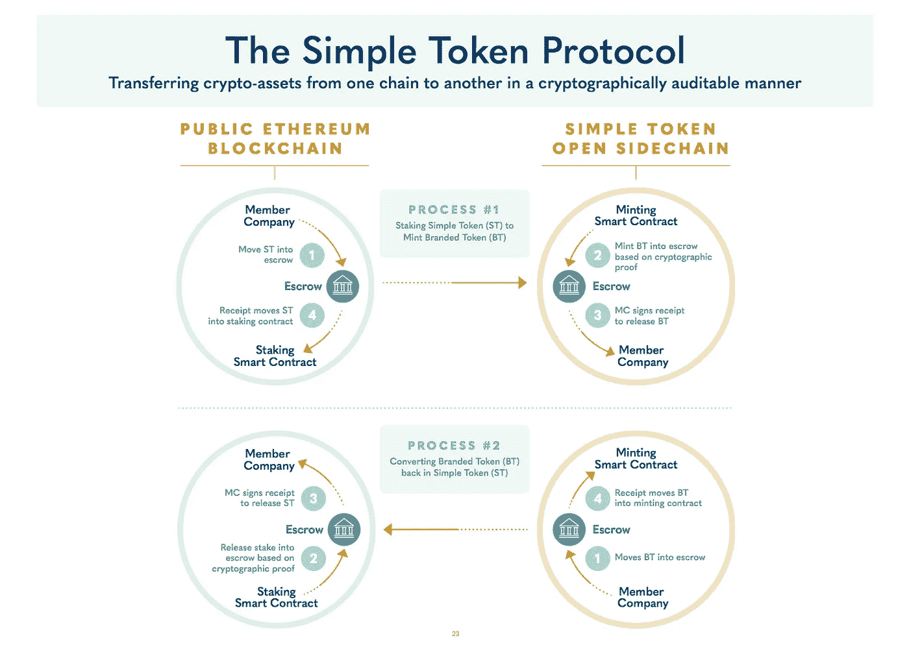
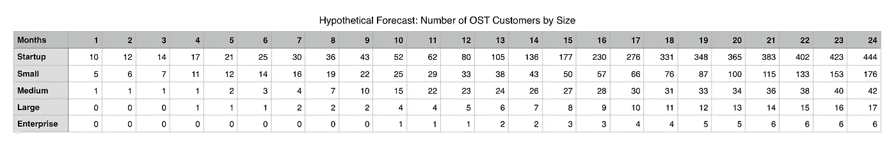
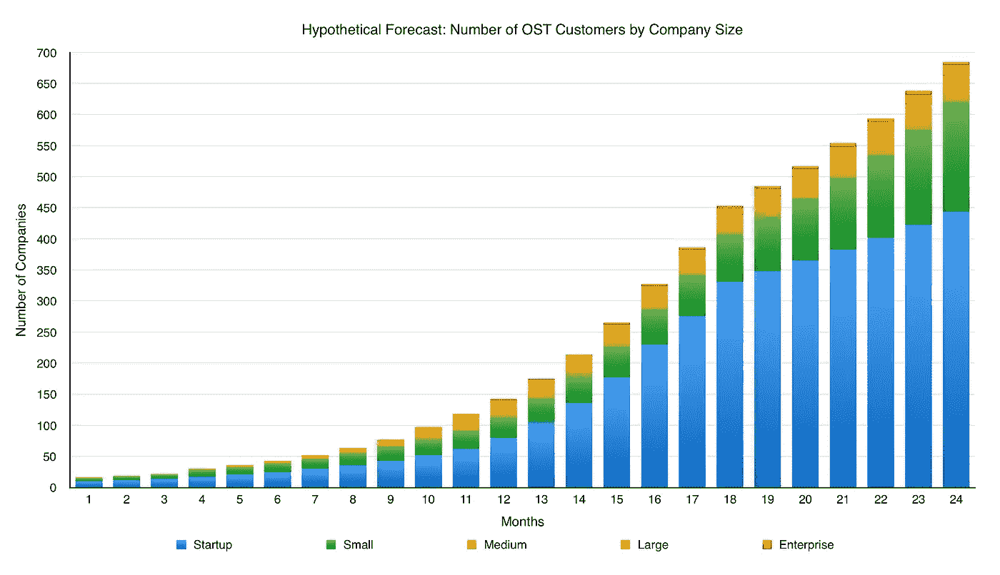
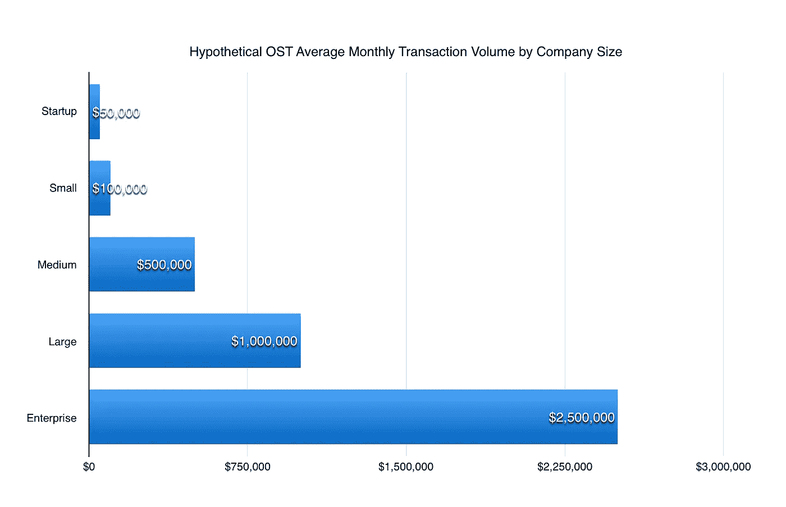
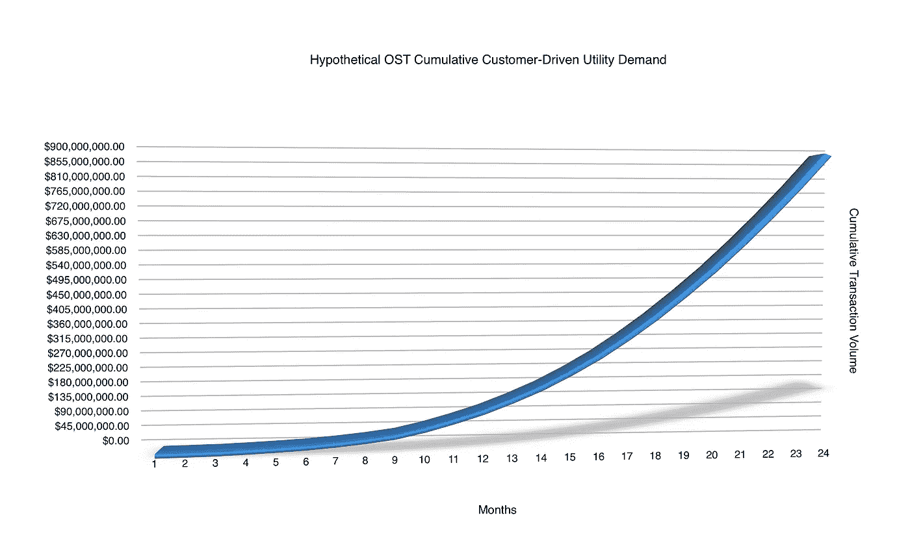

# 内幕反思 ICO 泡沫第三部分:2018 年是加密开始从投机走向实用的时候。

> 原文：<https://medium.com/hackernoon/insider-reflections-on-the-ico-bubble-part-iii-2018-is-when-crypto-begins-to-move-from-speculation-3ab8dbc55eb3>

在本系列第一部分的 [*中，我作为一家公司的首席执行官，在 ICO 进程的中期*](https://hackernoon.com/insider-reflections-on-the-ico-bubble-6304c4d25ed8) *提出了我对 ICO 泡沫的看法。在* [*第二部分中，我在 2017 年*](https://hackernoon.com/insider-reflections-on-the-ico-bubble-part-ii-what-it-takes-to-ico-73a93685197a) *年底提出了关于如何运营一个专业 ICO 的后 ICO 见解。在这最后一部分，第三部分，我将展示我对 2018 年的加密预测以及一个说明性模型。*

在之前的帖子中，我明确表达了我对 2018 年 ICO 市场收紧的希望和预期。我预计市场力量(和监管机构)将推动 ICO 质量而非数量的发展，我预计“良好”、“专业”和符合监管要求的 ICO 行业标准将牢牢占据主导地位。

## **2018 年我最期待的密码发展是密码市场从投机到实用的演变。**

2017 年是每个人和他们的母亲听说过[比特币](https://hackernoon.com/tagged/bitcoin)的一年，并且惊讶地看着投机者将比特币价格推高了近 2000%。2017 年 1 月投资比特币的 6 万美元，如今将价值超过 100 万美元。

2017 年的加密热潮不仅限于比特币:比特币的可编程同胞以太坊(Ethereum)的市值从 6 亿美元增长到 700 多亿美元，整个加密货币市场增长到 6040 亿美元。

截至 2017 年底，ERC-20 令牌在 ICO 中筹集了超过 50 亿美元的资金，实现了约 400 亿美元的总市值，但这些令牌中很少产生任何实际的产品级令牌需求(迄今为止)。相反，2017 年对代币经济的需求几乎完全基于交易员对未来代币需求的猜测。

> 2018 年将是 crypto 开始从推测走向实用的一年。

2018 年将是加密开始从猜测走向实用的一年，这是由基于以太坊的协议和面向企业和最终消费者的 ERC 20 产品推动的。这将改变加密估值的游戏规则，因为实际产品驱动的令牌需求将开始推动令牌价格。代币价格将开始反映代币实际使用者对代币的需求，而不仅仅是交易者的投机性估价。

我希望这也将推动围绕代币的实质性市场分析——类似于股票分析师如何依赖 DCF(贴现现金流)和 FCF(自由现金流)模型。预计 TDF(令牌需求流)或类似模型将成为加密评估的标准。

# **基于需求的令牌经济示例:OST**

下面我举一个例子，说明代币经济中由产品驱动的公用事业需求可能是什么样子。在本例中，我提出了一个假设的 OST 令牌需求模型预测，也称为简单令牌，因为这是我最了解的令牌模型。首先，我概述了简单令牌 OST 模型如何产生产品效用需求。然后，我为 OST 产品驱动的需求提出一个假设的 2 年模型。

这将是伟大的看到其他 ERC 20 代币张贴类似的模型。

## **关于简单代币、“OST”效用和代币经济模型**

“OST”推动了简单令牌解决方案和 OpenST 协议，后者使主流公司能够推出自己的加密货币，(我们称之为“品牌令牌”或“BT”)由 OST 提供支持。

Simple Token 的主要想法是帮助任何公司在不需要他们自己的区块链内部开发人员的情况下，从在[区块链](https://hackernoon.com/tagged/blockchain)上获得部分业务中受益。这类似于公司如何依赖 AWS 进行基础设施建设，Stripe 进行支付，Salesforce 进行 CRM，Shopify 进行电子商务，Twilio 进行消息传递——我们使公司能够专注于其核心业务，并将区块链的基础设施留给我们。

根据 OpenST 协议，为了推出一种简单的令牌驱动的数字货币，公司(从公开市场)获得 OST，并将其放在以太坊主网上，而不是在 OpenST 开放、可扩展的区块链上铸造自己的品牌令牌“BT”。OST 作为“价值”链(以太坊)上的必要储备，对抗“公用事业”链(OpenST)上的品牌代币经济。[OpenST 端区块链提供消费级可扩展性，这是以太坊 mainnet 目前无法实现的](/simple-token/crypto-kitties-a-puuuurfect-use-case-for-simple-token-717f3a58df14)。

OpenST 上的交易是智能合约可编程的、开放的、透明的和不可变的，并且将有第三方验证器——就像在公共以太坊上一样——但是 OpenST 将大容量消费级应用移动到公用事业链上，利用公共以太坊的安全性和生态系统，减去扩展挑战和高交易费用。我们将在未来几周内对 OpenST 侧链进行基准测试；我们为 OpenST 实现的内部最低吞吐率是公共以太坊的 10 倍，只是成本的一小部分。

此外——对于将 crypto 带入主流非常重要——我们的团队正在开发[简单令牌 SaaS](https://simpletoken.com) ,以帮助主流公司启动和管理他们的令牌实现。2018 年初，我们将推出[简单令牌](https://simpletoken.com) alpha，这将是第一个基于 OpenST 协议和平台的简单令牌 SaaS 版本。我们还将推出一系列 OST 驱动的产品，这些产品既可以作为独立产品提供，也可以完全集成到 Simple Token 中，例如 OST-KYC、我们的 KYCaaS 和其他几个正在开发的概念。

## 用 OST 来铸造品牌代币

公司在价值链上投资 OST，在公用事业链上铸造 BT。

OST 对 BT 的转换率是在公司成立时确定的(例如，1 OST = 1000BT)，然后锁定，这样公司就不能更改其客户的规则。

通过简单代币铸造的品牌代币是特殊的 ERC-20 代币，在技术上被锁定，不能在二级市场上交易。BT 唯一可以交换的是 OST(除非公司或第三方希望向用户提供另一个密码或法令，以换取用户放弃他们 BT 的 OST)。

该公司的用户始终有权要求支持他们从该公司赚取/获得的 BT 的 OST。(顺便说一句:锁定交易机制可以在以后关闭。这使得 OST 能够作为 ICO 项目的安全试验场或加速器，使他们能够在以太坊“上市”之前，首先在 OpenST 侧链上证明市场流动性，并且没有 ICO 成本和令人头痛的问题。

(NB1:接下来我们经常会遇到这样的问题:如果 BT 价格与 OST 挂钩，当 OST 上涨或下跌时会发生什么？我将在后续文章中详细介绍这一点，但简短的答案是，价格神谕可用于设定 BT 获得或使用的商品和服务的价格，以便获得或需要的 BT 数量自动调整，因此如果 OST 价格上涨，公司需要获得更少的 OST 来对抗 BT——类似于如果一年前你需要 1 BTC，今天你可以用 1/n BTC 完成同样的事情。公司也可以决定让他们的最终用户免受 BT 所依据的 OST 的波动所带来的价格升值或贬值的影响。这是非常有趣和先进的经济理论，我们建议阅读[我们正在探索的关于价格稳定概念的附带文件](https://docs.google.com/document/d/1V6MZjojOYwVL8xoPQ09Pgzs93FUzBHLapcjcWOMHu18)，以了解更多信息。)

(NB2:我们也在讨论用 OST 的股份对抗 BT 的贷款计划。例如，如果一家公司希望以价值 100 万美元的 BT 启动经济，他们可以在 24 个月内每月支付 5 万美元给第三方来为他们提供股份(也许还有价格稳定功能)，而不是预先投入 100 万美元。

## **简单令牌产品驱动的 OST 需求**

通俗地说，从令牌需求的角度来看，所有这些意味着:

*   借助 Simple Token & OST，主流公司可以在可扩展的区块链上轻松推出加密数字货币，而无需承担持有自己 ICO 的成本和麻烦。
*   每一家推出 OST 加密技术的公司都需要从市场上购买 OST，并将其作为公司提供的白标 BT 的储备，从而使其退出流通。
*   当公司需要铸造更多的 BT 时，他们需要回到市场并获得更多的 OST，所以总是有 OST 的股份来支持他们的 BT。
*   每当他们的用户想要用他们挣来的 BT 来交换另一个密码或许可证时，就需要有人在公开市场上把它卖给买家。因此，OST 循环往复，产品驱动的供应/需求继续。

随着越来越多的公司在 OST 上构建应用程序和经济，令牌经济之间的互操作性也变得非常有趣。例如，代币经济体 A 不想接受代币经济体 B 的代币，但他们非常乐意接受 OST，因为它为双方的经济提供了燃料。这使得消费者能够用代币经济 B 花费他们挣得的代币 A，因为在幕后，实际上被转移的是底层 OST。随着网络效应的倍增，这提供了更多的市场需求和流动性。

此外，Simple Token 将在 OpenST 侧链上收取“汽油”或交易费，以及使用 SaaS 软件模块的费用，这些软件模块可以帮助公司设置、管理、监控和分析他们的令牌经济。这些费用在开始时很低，然后随着公司从其最开放的使用中获得更多价值(并获得收入)而扩大规模，类似于 AWS 或 Stripe 费用。

## **假想简单令牌 OST 产品驱动需求模型**

这是一个假设模型，只是方向性的，随着越来越多的公司推出 OST 驱动的应用程序和经济，可能会产生这种产品驱动的需求。(请注意:这不是一个实际的预测，而是一个模型，旨在表明一旦 2018 年对 cryptos 的产品需求开始形成，可能会发生什么)。

首先，我们假设 Simple Token 吸引了一系列不同规模的客户，起初大多数是创业公司，然后随着时间的推移，更多的小型，中型，大型和企业公司加入。让我们假设 OST 解决方案随着时间的推移变得越来越自助，因此 OST 上的初创公司和小公司的数量以适度的速度增长，而大公司需要更多的时间来采用 OST 技术。

为了这个例子，我们模拟了:

*   第一年有 142 家公司推出 OST 解决方案，第二年增加到 685 家。
*   初创公司和小公司是早期增长的主要原因:第一年 142 家公司中有 113 家是初创公司和小公司，到第二年年底，685 家公司中有 620 家是初创公司和小公司。
*   我们认为较大的公司和企业可能需要更长的时间来采用这些解决方案。

第二，我们假设创业公司和小公司的月交易额比大公司小得多。

假设到第一年年底，品牌代币交易量每月达到 2600 万美元，到第二年年底，每月达到 1 亿美元。

两年来，由 OST 驱动的品牌令牌的累计客户驱动需求总计近 100 亿美元 1B。

上述模型不包括 OST 侧链操作的任何交易费用，也不包括 OST 中其他产品(如我们的 OST-KYC)的任何其他付款。

上述模型是假设性的，不应作为我们的内部预测，而是旨在说明客户驱动的公用事业需求类型，这些需求可能从 2018 年开始在 ERC 20 国供电的令牌经济体中扎根。

CoinMarketCap 榜单上有 162 个代币，目前市值超过 2500 万美元。当许多这些代币在 2018 年及以后开始产生有意义的产品需求时，看看会发生什么将是很棒的。

## 法律免责声明

> 本帖不是招股说明书，也不是招商引资，它与任何司法管辖区的证券发行都没有任何关系。
> 
> 购买、持有或使用加密令牌会带来巨大的潜在财务、监管和其他风险，包括潜在的全部支付价值损失。
> 
> 代币仅面向在数字平台、数字资产、区块链技术和智能合约的功能和风险方面知识丰富、经验丰富的资深购买者。潜在购买者应自行确定本文件和相关材料中所含信息的相关性(在每种情况下都会不时进行补充),以及额外查询、研究和专业建议的必要性。任何参与象征性销售的决定都应基于您认为必要的独立调查和建议。本文档不应被视为任何人参与任何代币销售或数字平台的建议。