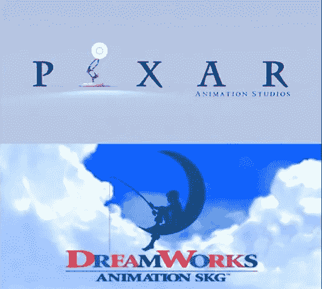
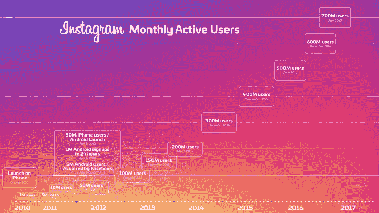

# Instagram 不关心你是否会变胖，所以这里还有两勺 Snapchat。

> 原文：<https://medium.com/hackernoon/instagram-doesnt-care-if-you-get-fat-so-here-s-two-more-scoops-of-snapchat-21dbf37038a1>

## 覆盖在 Snapchat 上，还有…Snapchat 的一面。

Instagram Idea 室洞穴状天花板上的钟乳石滴下的水滴似乎比平时更重，而燃烧尸体的火焰和余烬发出的琥珀色光芒爬上了墙壁。

"你认为人们会使用面部过滤器吗？"

闪电坠落，雷鸣般的吼声从灵魂中涌出，灵魂被吸进一个巨大的颜色惊人，但设计最少的相机，相机位于十二个小海豹的中心，被用作会议桌。

“我们将称之为我们的新想法！”

一桌子长得像高大的 Umpa Lumpas 的橘黄色皮肤的男人，金色的头发像龙卷风中的翼龙窝一样缠绕着，歇斯底里地大笑，背景中一个迷失的小灵魂推动了另一个帖子。

## 他们只是明目张胆地告诉你，他们现在扯掉了

[Josh Constine](https://medium.com/u/a20debc9a770?source=post_page-----21dbf37038a1--------------------------------) [最近在 TechCrunch Disrupt NY 采访了 Instagram 的产品副总裁 Kevin Weil](https://techcrunch.com/2017/05/16/to-clone-or-not-to-clone/)，他直截了当地说，如果他们不复制 Snapchat 的模式，他们就是愚蠢的狗娘养的。他还使用了恶魔般的双关语，称之为与平台模型或应用程序结构相对的“格式”，然后用梦工厂和皮克斯的微弱对比来验证他们的肮脏狗屎。

> “皮克斯是第一家制作电脑动画电影的公司，但我认为我们都变得更好，因为梦工厂这样的人也在制作伟大的电影。”

下面是格兰·基恩的一句话，他是迪士尼的动画制作人，以《小美人鱼》、《美女与野兽》、《风中奇缘》和《阿拉丁》等小电影而闻名，这句话完美地解释了两者的区别，你这个蠢驴:

> “皮克斯和迪士尼是有区别的。如果你把皮克斯简化成一句话，那就是:“如果……不是很酷吗？”就像如果一个孩子看着他们的玩具:如果这个玩具会说话呢？他们所有的电影都是这样的。
> 
> 如果你减少迪斯尼电影的数量，它会是:“从前…”

看到这里发生了什么吗？这两个品牌使用相同的媒介，但产生完全不同的结果。故事情节、主角/对手之外的角色发展以及整个建筑结构本身都是独立的实体。

另一方面，Instagram 甚至不关心用户制作的内容，就利用了 Snapchat 的这些方面:

*   故事格式
*   地理过滤器
*   图像效果(文本、绘图和贴纸)
*   基于故事的广告系列
*   面部识别过滤器

这只是列举了一些相似之处。

## 我们应该添加位置和面部过滤器！

在过去几天里，Instagram 增加了一些新功能，如面部识别过滤器和地理搜索。

你在 Instagram 上的面部过滤器听起来就像是 Snapchat 上面部过滤器的翻版。可能会有一些非常微妙的变化，所以他们可以指着它们说“看！是新东西！”但你不是一块长方形的果冻，滚下一座被泥土覆盖的山，这样你就可以看穿那些狗屎。

新的地理搜索实现有其根源，大多数分支来自 Snapchat 相当新的搜索选项，该选项允许您根据文本通过过滤器或术语查看在特定位置标记的快照。然而，Instagram one 能够根据拍摄地点显示故事，而不是使用分层数据。

## Instagram 和脸书真的会在乎你到底想要什么

Instagram 是不是增长速度惊人，超受欢迎？是的，但那只会助长他们的气焰。

一点创新都没有。

此外，他们的增长和活跃用户数以百万计。这篇两年前的 Business Insider 文章指出[超过 8%的帐户是 bot 帐户，30%是非活动帐户](http://www.businessinsider.com/italian-security-researchers-find-8-percent-of-instagram-accounts-are-fake-2015-7)！让我们考虑他们的增长，然后跳到几年前的今天，你会看到 13%的机器人和将近 50%的不活动机器人。

从相关数据来看， [7 亿的月活跃用户数真的应该低很多。如果所有这些都是活跃账户，那就接近 14 亿用户，你不会听到这个指标的结束。](https://techcrunch.com/2017/04/26/instagram-700-million-users/)

大多数 Instagram 用户只是压倒性地想要一个按时间顺序排列的时间轴。人们厌倦了看不到他们的朋友，当他们看到他们的朋友时，这是三周前的帖子，而不是一个小时前他们刚刚发布的帖子。他们扔得到处都是的这整罐闪光粉只是因为他们可以。

也不要认为我会在毕业舞会期间在我的汽车后座上试图从 Snapchat 那里得到便利，因为他们在过去三年中有足够的时间来解决重大问题。

他们最终实现了一个搜索选项，但这相当于用石头刮胡子。他们的 UX 充其量是沉闷的，很少或没有开发，使其更容易导航，使用或找到功能。如果他们几年前担心增长，他们会为你的曾祖父做一个像彩色按钮冲浪板一样的巨型电视遥控器。

脸书和 Instagram 采用了一个平台，让我们不要称之为它不是什么，并把它放入一个用户友好的氛围中，易于访问的选项。你知道当你“创造”一个产品，让每个人都感到被包含在内，而不是仅仅抓住某一特定人群不放，会发生什么吗？

Instagram。

有用吗？

哦，妈的，成功了。

> [黑客中午](http://bit.ly/Hackernoon)是黑客如何开始他们的下午。我们是 [@AMI](http://bit.ly/atAMIatAMI) 家庭的一员。我们现在[接受投稿](http://bit.ly/hackernoonsubmission)，并乐意[讨论广告&赞助](mailto:partners@amipublications.com)机会。
> 
> 如果你喜欢这个故事，我们推荐你阅读我们的[最新科技故事](http://bit.ly/hackernoonlatestt)和[趋势科技故事](https://hackernoon.com/trending)。直到下一次，不要把世界的现实想当然！

