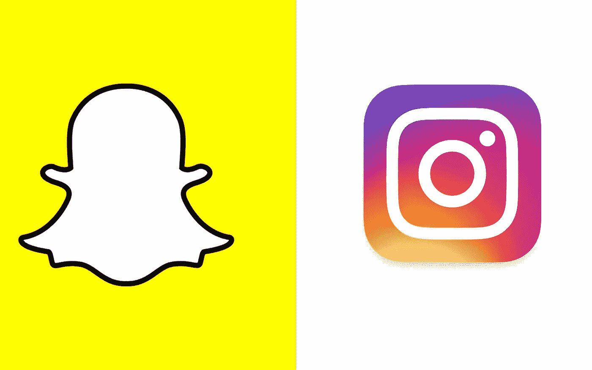
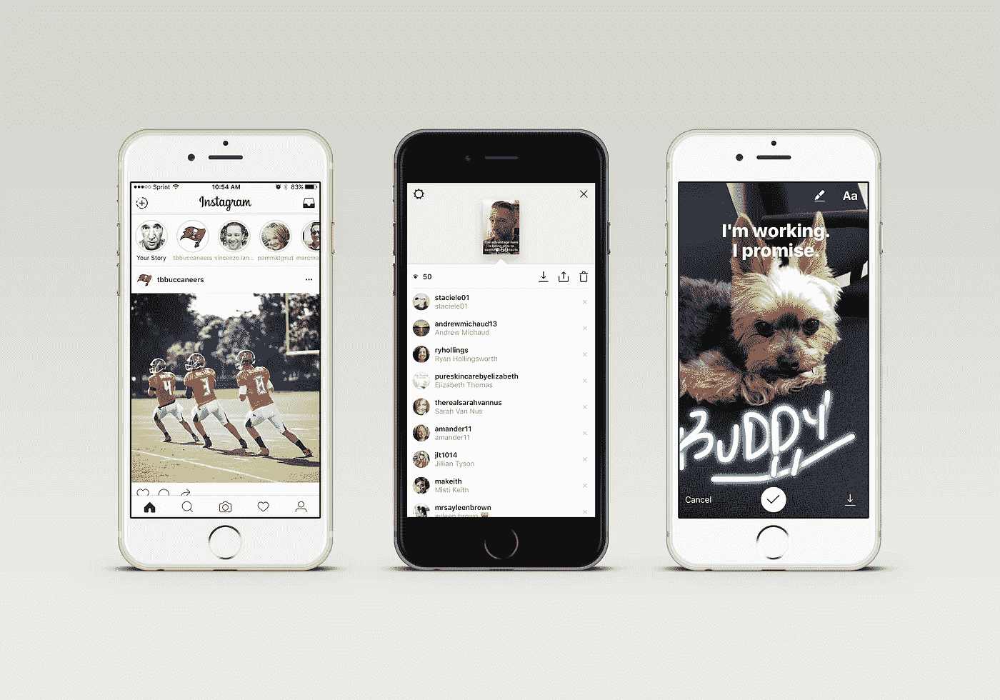

# Instagram 只是扇了 Snapchat 一耳光，踢了它的狗一脚。

> 原文：<https://medium.com/hackernoon/instagram-just-slapped-snapchat-in-the-face-and-kicked-its-dog-5e3135abef06>

## 模仿是最真诚的奉承。

在过去的五年里，脸书一直是社交媒体领域的 DJ Khaled。它有最好的鞋子，最漂亮的女人，和最快的汽车。如果它发现有人有更好的上述身份象征，它只会把一个贴有过于明显的美元符号的大袋子扔向他们的脸。问题解决了。脸书和他的 Whatsapp T1、T2 Oculos T3 和 T4 insta gram T5 团队昂首阔步地走在街上，亲吻婴儿，击掌庆祝周围的一切。

Snapchat 稍微年轻一点，以自己的方式做事，更多地接触流行的东西。所以脸书做了顺其自然的事，抛出了 30 亿镀金乔丹 30 的 T7。Snapchat 就直接跨过他们，继续往前走。就像枕头的另一边一样凉爽，它转过身，给了脸书一个永恒的中指敬礼，然后继续走向夕阳。

脸书疯了，真的疯了。如此疯狂以至于当他们开发出[弹弓](https://www.facebook.com/slingshot)并试图用比一只湿流浪汉鞋更好的东西来冒充时，他们一定是被气瞎了。他们保持激光聚焦，将最优秀的人才聚集在一起，呈现出与我们以前见过的任何东西完全不同的东西…

## 我们来看看 Instagram 的故事。

从 Snapchat 成立之初，或者说 5 年前，脸书就一直在试图挖掘它的用户，无论哪个对你来说更合理。在那段时间，收购 Instagram 是希望推动他们在个人图像领域向前发展，但 Snapchat 总是拥有任何一个大品牌都喜欢的东西。年轻、易受影响的用户群。

实际上，UX 看起来更精致，即使你从来没有接触过 Snapchat，你也应该能够进入 IG 故事的最佳状态。像 Snapchat 一样，这些故事是图像或视频，24 小时可用，可以用文本编辑，或者可以用 3 种不同的标记工具进行艺术化。

您关注的人最近的故事列表将在您的屏幕顶部显示，并有一个 Instagram 彩色圆圈，让您知道还有一些新内容尚未查看。如果你在你自己的故事上滑动，你可以看到有多少你的追随者看过它，并可以通过屏幕上的设置来调整谁可以给你发消息或回复你的故事。

## 好的方面。坏事。丑陋的。

Instagram Stories 给人的感觉非常流畅，对于年龄较大的人群来说确实会更好。我不是在说 25-34 岁的人，因为他们在 Snapchat 上的增长已经放缓，但 35 岁及以上的人群会发现这更容易操作，因为他们不必习惯一个全新的平台。

可以做一些微调来帮助确定某些用户的优先级，或者甚至能够将他们分类到列表中。就像现在这样，如果你在关注 800 个人，而他们都在发布故事，你就要用手指在屏幕上方画 10 分钟，试图把他们都画完。

有很多营销人员称赞这个事实，即没有心脏或评论的故事，因为它只是增加了另一个分析处理。事实是，Instagram 和一般人都很虚荣。它本质上是一个只会大叫“看看我和我在做什么！！!"所以，一定有某种回报或满足感，有人不仅看到你的腿在沙滩上看起来像热狗，还喜欢它们，并有礼貌地给你一些水/冲浪者/太阳表情符号。

它仍然很新，但我会给他们在这方面的努力打个“B”。这已经远远超出了他们过去试图伪装成可用的所有其他垃圾箱火灾。

> [黑客中午](http://bit.ly/Hackernoon)是黑客如何开始他们的下午。我们是 [@AMI](http://bit.ly/atAMIatAMI) 家庭的一员。我们现在[接受投稿](http://bit.ly/hackernoonsubmission)，并乐意[讨论广告&赞助](mailto:partners@amipublications.com)机会。
> 
> 如果你喜欢这个故事，我们推荐你阅读我们的[最新科技故事](http://bit.ly/hackernoonlatestt)和[趋势科技故事](https://hackernoon.com/trending)。直到下一次，不要把世界的现实想当然！

