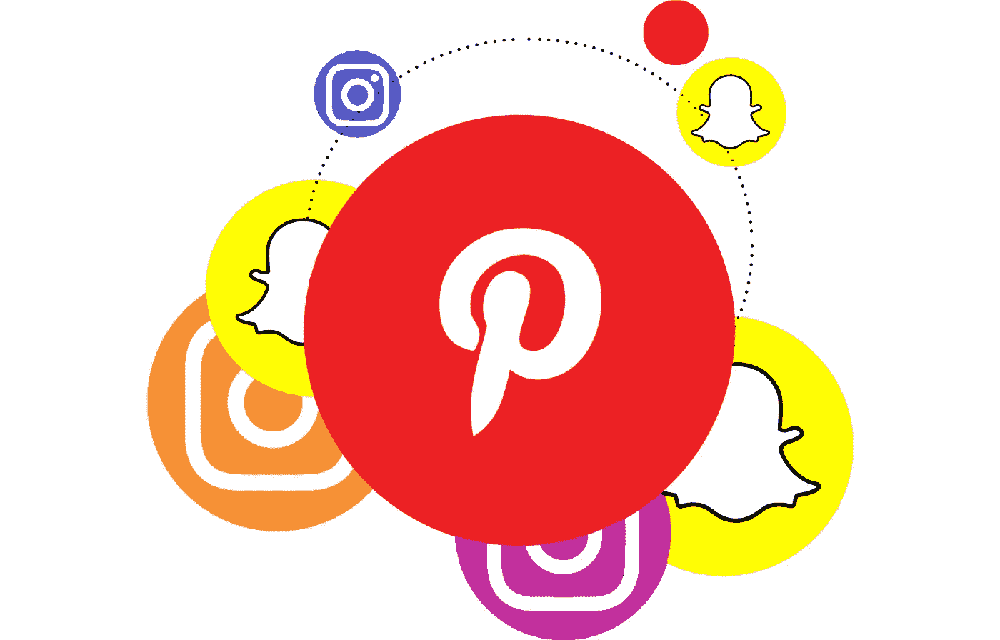
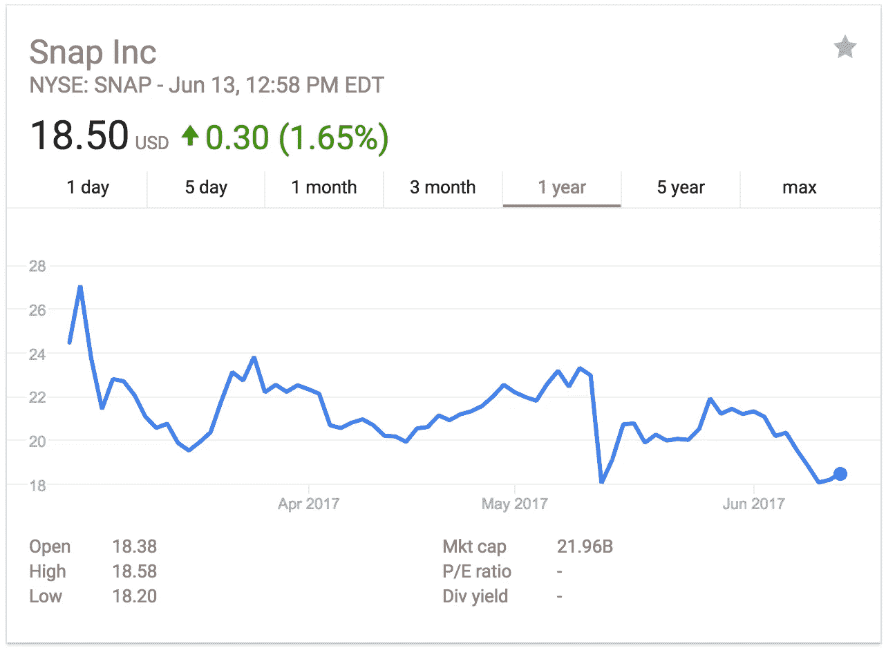
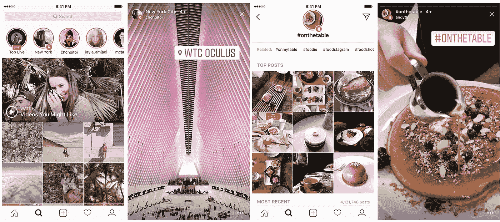
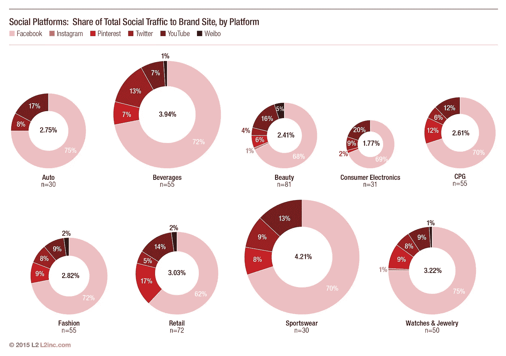

# Instagram 和 Snapchat 在互掐裤裆，而 Pinterest 在数所有的钱

> 原文：<https://medium.com/hackernoon/instagram-snapchat-are-too-busy-crotch-punching-each-other-to-notice-pinterest-counting-all-the-8b0dadfeb84c>

你会认为后街又回来了，人们欢呼着，婴儿在哭，狗在叫，护士们试图挣脱活泼水手的怀抱。

一些重大的事情发生了，它只能被归类为生活的改变。

哦，看，更多的是广告。

Snapchat 广告经理终于发布了，因为看起来我们需要全世界的努力来阻止不断困扰地球的恐怖主义、饥饿和全球变暖。

或者因为他们要破产了。

Instagram 向更多用户推出在你的故事中添加 URL 链接的功能后不久，Snapchat 就推出了各种新的自助广告选项。人们可能会认为，一些玩具眼镜会记录你朋友的快照，并说，“如果我看到那些圆圈再次亮起，你就要去拉屎了”，这并不是推进可持续收入模式的最佳主意。

随着他们的股价徘徊在历史低点，相当于一盒黑市香烟，股东们一直想知道为什么他们自称是一家相机公司，而不生产明显的产品。一台真正的相机。

有传言称增强现实将被引入 [Spectacles 2.0](https://techcrunch.com/2017/06/12/snap-is-developing-a-second-version-of-spectacles-which-may-include-augmented-reality/) ，但在发布六年后，用户群仍能感受到搜索功能在平台上突然出现的刺痛。可以肯定的是，在《星球大战 23》再次惊艳我们之前，我们都将和我们的曾孙们一起在 ar 中享受它。

另一方面，除了可以通过脸书的广告管理器运行的广告设置选项，insta gram[还实现了三种方式](https://www.theverge.com/2017/5/23/15677494/instagram-story-search-hashtags)来获得更多的参与度。

在 stories 中使用标签会将你直接带到一个 feed，添加位置会将你带到活动的中间，还有前面提到的 URL 添加，可以直接从你关注的朋友或品牌打开应用浏览器。

Instagram 的养父母脸书认为，在他们的其他平台上播放他们的故事是一个很棒的主意，希望每个人都喜欢被呕吐。Instagram 的产品副总裁 Kevin Weil 甚至直言不讳地说，如果他们不从 Snapchat 复制一个好主意，那他们就是愚蠢的。不用说，我们都有小轮廓图片鬼城脸书故事和信使日运行在我们的应用程序。

所有这些 Instagram 和 Snapchat 之间的主要共同点是能够在他们的社交平台上提供可操作的链接和更简单的 CTA。另一个原因是[脸书已经耗尽广告空间](https://www.recode.net/2016/7/27/12305002/facebook-ad-load-q2-earnings)有一段时间了，Snapchat 正在大出血，试图确定他们到底是什么样的公司。我可以整天喊着要成为《蓝色线索》里的史蒂夫，但这还是不能让我在尼克国际频道上有个节目和一把舒适的大椅子。

在另一边我们有 Pinterest。

这个社交平台已经通过 Pinterest Lens 添加了一个 [AR 方面，用于在应用程序中查找产品并购买它们。](https://www.theverge.com/2017/2/8/14549798/pinterest-lens-visual-discovery-shazam)

每个 pin 都是反向链接的平台，本质上是它自己的 CTA。

想看更多这样的大头针吗？这是你的选择，看到更多，而不只是因为一些相关的因素扔在你的脸上。

这是唯一一个社交媒体平台，93%的用户计划在每次使用时进行购买。

甚至不要担心千禧一代的使用情况，因为它与 Instagram 差不多，最重要的是，男性人口占新用户的 40%,每年增长 70%。

> “Pinterest 服务于一个明确的目的，让用户获得创造性的灵感。他们还可以购物——这说明了为什么这个平台不仅对消费者更有利，对品牌也更有利。Pinterest 占零售品牌网站社交流量的 17%。

另一个需要考虑的重要方面是，相对于其他平台，Pinterest 与 YouTube 配合得很好。它们让你能够在 Pinterest 内部的链接上，用你的 YouTube 预滚动广告来管理整个视频板。你知道还有哪些社交平台允许你这么做吗？

剧透一下，接近零了。

脸书将 YouTube 上的任何帖子都变得像是被公路撞死的，并根据你的视频链接的位置，使用两种不同的馈送算法来杀死 reach。你必须翻录视频才能在 Snapchat 或 Instagram 上使用，这样那些预卷就一文不值了。

他们已经知道它对某些行业有什么样的零售拉动，他们绝不会让它轻易重叠，从而毁掉他们的市场份额和广告利润。

如果观众是特意来购买的，那么向消费者做广告的时间和创意就会大大减少。Pinterest 不是你第一个去闲逛和与朋友保持联系的地方。这是一个收集、分享和了解更多你感兴趣的东西的地方。

Pinterest 上 84%的人表示，Pinterest 向他们介绍了新事物，70%的人浏览或保存 pin 以了解更多他们感兴趣的话题和产品。

当使你的品牌人性化的关键是与消费者建立情感联系时，没有比收集让他们感觉最人性化的东西更好的地方了。

当其他人都在沃尔玛停车场用 Instagram 和 Snapchat 喊着“世界之星！！!"，Pinterest 将只是在这里它的史高治·麦克老鸭所有互联网推荐流量的 5%堆实际上是创新，而不是看谁穿得最好。

> [黑客中午](http://bit.ly/Hackernoon)是黑客如何开始他们的下午。我们是 [@AMI](http://bit.ly/atAMIatAMI) 家庭的一员。我们现在[接受投稿](http://bit.ly/hackernoonsubmission)并乐意[讨论广告&赞助](mailto:partners@amipublications.com)机会。
> 
> 如果你喜欢这个故事，我们推荐你阅读我们的[最新科技故事](http://bit.ly/hackernoonlatestt)和[趋势科技故事](https://hackernoon.com/trending)。直到下一次，不要把世界的现实想当然！

