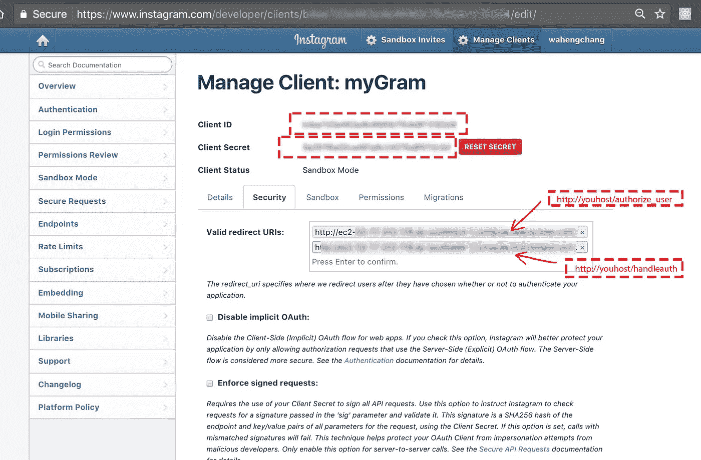
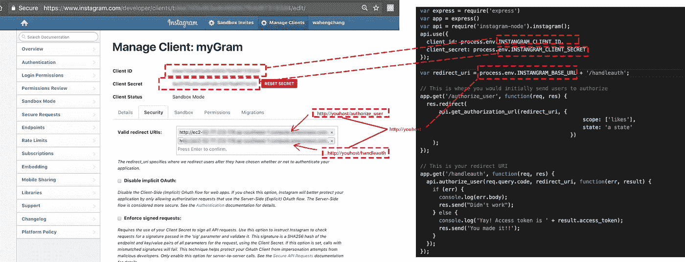
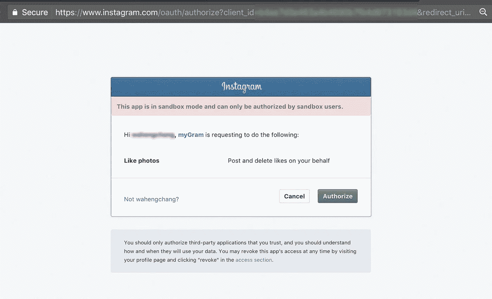
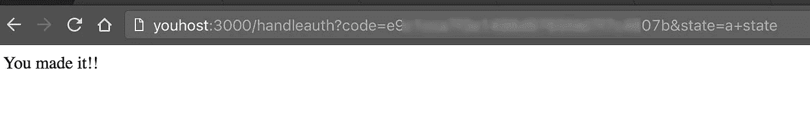

# [InstagramAPI]分三步设置 Nodejs OAuth 服务器

> 原文：<https://medium.com/hackernoon/instagramapi-set-up-nodejs-server-access-token-in-2-step-instagram-oauth-auth-access-token-tutorial-example-34c66039cffc>



作为一名开发人员，在 InstagramAPI 上设置一切比脸书·格拉 API(我喜欢脸书)要花更多的时间，原因如下:

1.  公共内容必填 ***access_token***
2.  公开内容需要一个 ***验证过的帐号(不是沙箱)***
3.  需要一个白名单 ***Oauth 服务器*** 来验证账户并获取 access_token(脸书只需要 ***APP_ID*** 和 ***APP_SECRET*** 而不是服务器，通过 HTTP GET 获取 ***ACCESS_TOKEN***

[Git](https://github.com/wahengchang/instagram-oauth-nodejs-server) 是一个模板，也是设置 ***Node.js 服务器*** 的教程，用于 Intagram-API OAuth 目的。

我们所做的一切都很简单，连接 Instagram 和 Node.js 服务器之间的配置，通过正确的设置，获取 access_token 很容易，它在每个 Intagram-API 请求中作为强制参数使用。

# 1.创建 Instagram 应用程序

在[门户](https://www.instagram.com/developer/clients/register/)中创建 IG 应用程序，填写每一个我们需要的，并完成。


# 2.连接 IG APP 和 Node.js 服务器

([***node . js tempalte on Git***](https://github.com/wahengchang/instagram-oauth-nodejs-server))

创建 IG 应用程序后，接下来是配置 ***ClientID*** ， ***ClientSecret*** 和 ***redirectURL*** ，因为 IG-API 确实需要为任何 API 请求添加 access_token。

## 备注:

下面是需要添加到`***Valid redirect URIs***`上的两个 URL

`http://youhost/authorize_user`

和

`http://youhost/handleauth`



# 3.获取访问令牌

```
https://www.instagram.com/oauth/authorize?client_id={***CLIENT_ID***}&redirect_uri={***http://youhost/authorize_user***}&response_type=code
```



按下授权



喜欢这个故事？对别人有帮助吗？这有助于我知道你是否想看到更多关于他的主题，并帮助人们看到这个故事， ***当点击下面的心*** 。

# 参考:

[https://www.instagram.com/developer/authentication/](https://www.instagram.com/developer/authentication/)

[https://www.npmjs.com/package/instagram-node](https://www.npmjs.com/package/instagram-node)

[https://github . com/wahengcang/insta gram-oauth-nodejs-server](https://github.com/wahengchang/instagram-oauth-nodejs-server)

[](http://bit.ly/HackernoonFB)[](https://goo.gl/k7XYbx)[](https://goo.gl/4ofytp)

> [黑客中午](http://bit.ly/Hackernoon)是黑客如何开始他们的下午。我们是 [@AMI](http://bit.ly/atAMIatAMI) 家庭的一员。我们现在[接受投稿](http://bit.ly/hackernoonsubmission)并乐意[讨论广告&赞助](mailto:partners@amipublications.com)机会。
> 
> 如果你喜欢这个故事，我们推荐你阅读我们的[最新科技故事](http://bit.ly/hackernoonlatestt)和[趋势科技故事](https://hackernoon.com/trending)。直到下一次，不要把世界的现实想当然！

