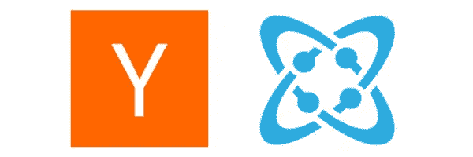
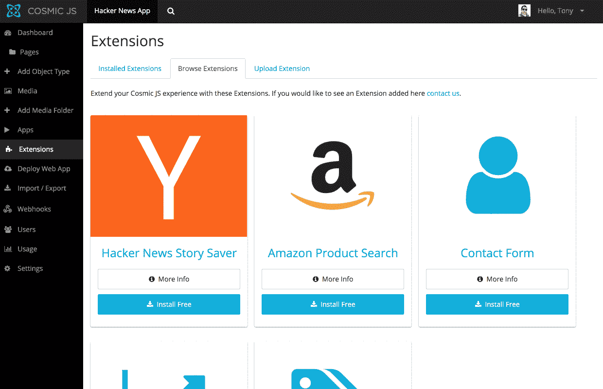
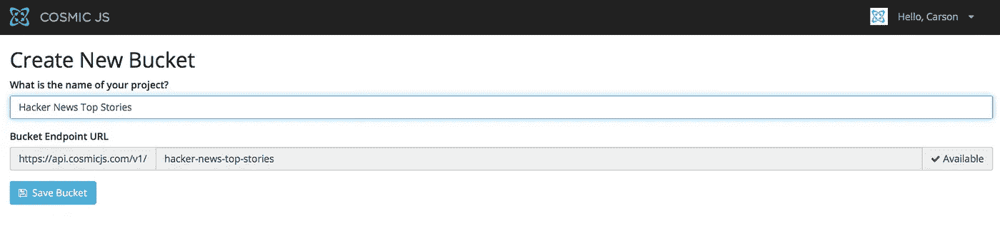
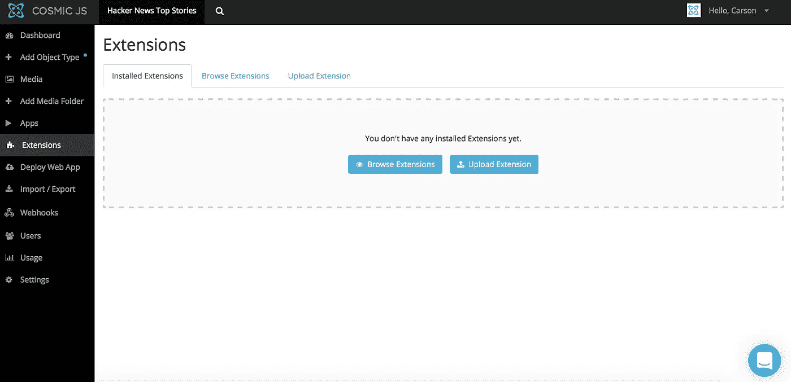
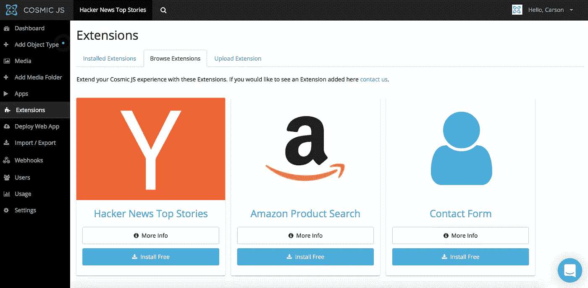
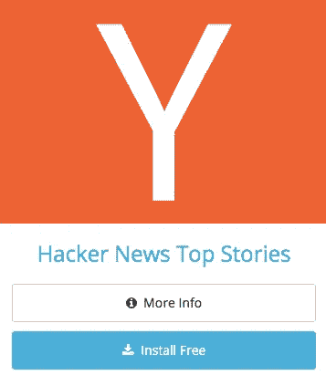
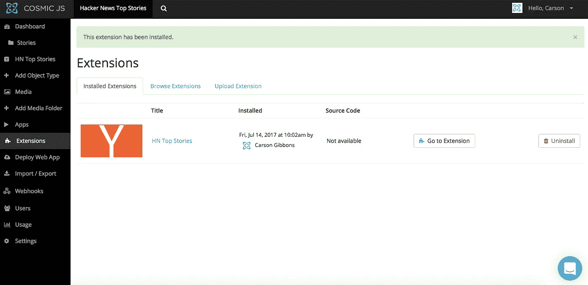
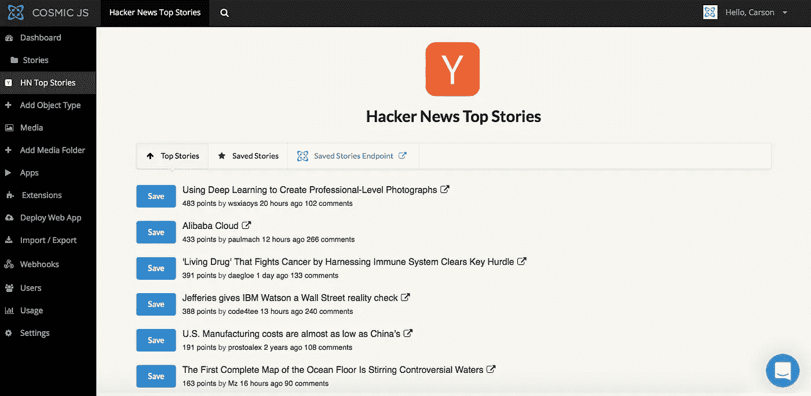
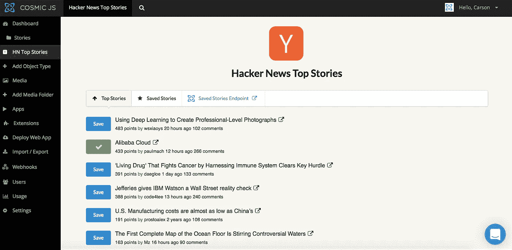
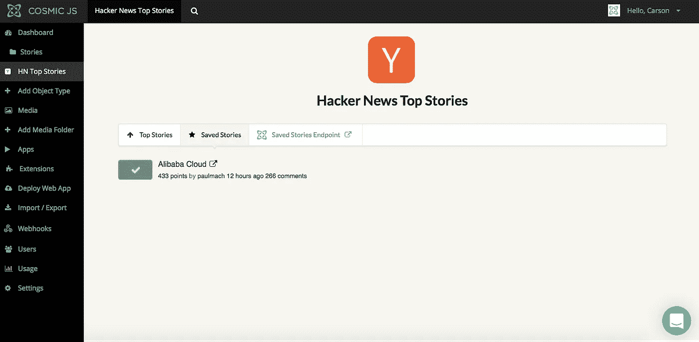

# 分三步安装黑客新闻头条扩展

> 原文：<https://medium.com/hackernoon/install-a-hacker-news-top-stories-extension-in-3-steps-1cbefa98e305>

最近 [Cosmic JS](https://cosmicjs.com/) 首次推出了它的[扩展生态系统](https://cosmicjs.com/extensions/)，使得为开发者和编辑扩展 [Cosmic JS](https://cosmicjs.com/) 的功能成为可能。开发人员可以创建交互式视图、连接第三方 API 和定制编辑器体验。把它想象成你桶里的一个可控应用。在这篇博客中，我将向你展示如何将顶级黑客新闻添加到你的宇宙 JS 桶中。您保存的故事可在一个端点中获得，以便轻松集成到任何应用程序或设备中。

Cosmic JS 是一个 API 第一的 CMS，使得管理和构建网站和应用程序更快更直观。通过将内容从代码中分离出来，Cosmic JS 增强了开发人员的灵活性，同时确保内容编辑人员能够以最适合他们的方式规划和部署内容。我们将使用 Cosmic JS 来安装我们的示例扩展。

> [黑客新闻产品搜索头条](https://www.producthunt.com/posts/hacker-news-top-stories)
> [介绍宇宙 JS 扩展](https://cosmicjs.com/blog/introducing-cosmic-js-extensions)
> [宇宙 JS 扩展](https://cosmicjs.com/extensions/)
> [宇宙 JS 扩展文档](https://cosmicjs.com/docs/extensions)

# 1.创建新的存储桶

# 2.安装黑客新闻头条扩展

一旦你注册并命名了你的 bucket，系统会提示你从头开始或者安装一个应用程序或扩展。对于这个博客，我简单地点击了扩展按钮，开始黑客新闻头条扩展的安装过程。

# 3.浏览热门故事并将其保存到您的桶中

然后，每个故事被保存到你的 [Cosmic JS](https://cosmicjs.com/) 桶中，并使用典型的对象样式和元字段进行布局，比如标题、内容、作者、点数等等。

[Cosmic JS](https://cosmicjs.com/) 是一个 API 首创的基于云的内容管理平台，可以轻松管理应用和内容。如果你对 Cosmic JS API 有任何疑问，请通过 [Twitter](https://twitter.com/cosmic_js) 或 [Slack](https://cosmicjs.com/community) 联系创始人。

[卡森·吉本斯](https://twitter.com/carsoncgibbons)是 [Cosmic JS](https://cosmicjs.com/) 的联合创始人& CMO，这是一个 API 第一的基于云的[内容管理平台](https://cosmicjs.com/)，它将内容从代码中分离出来，允许开发人员用他们想要的任何编程语言构建流畅的应用程序和网站。