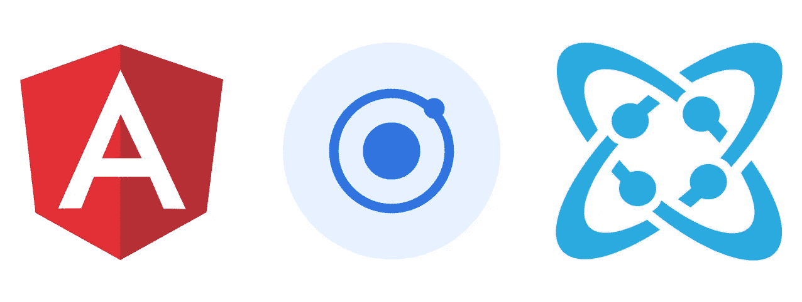
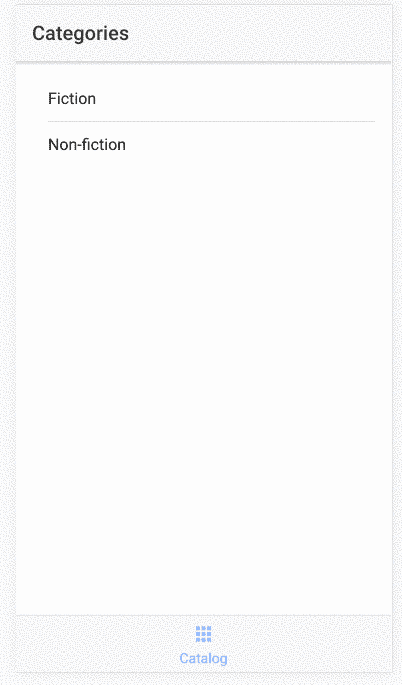
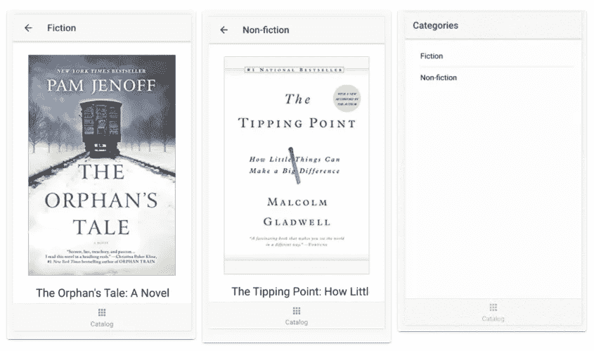
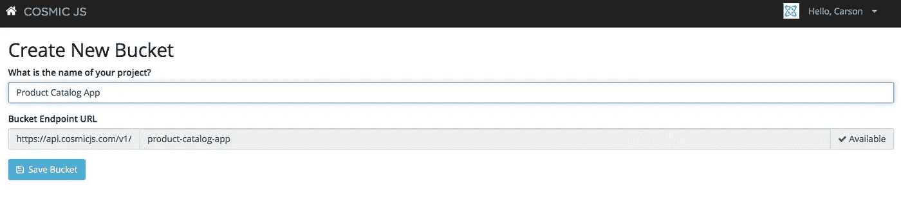
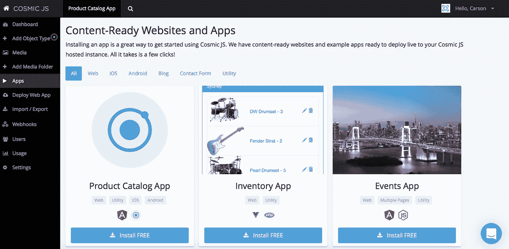
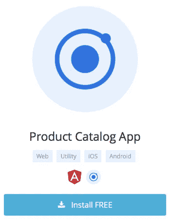
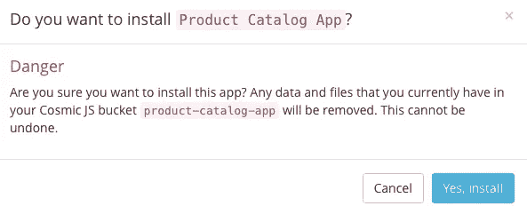
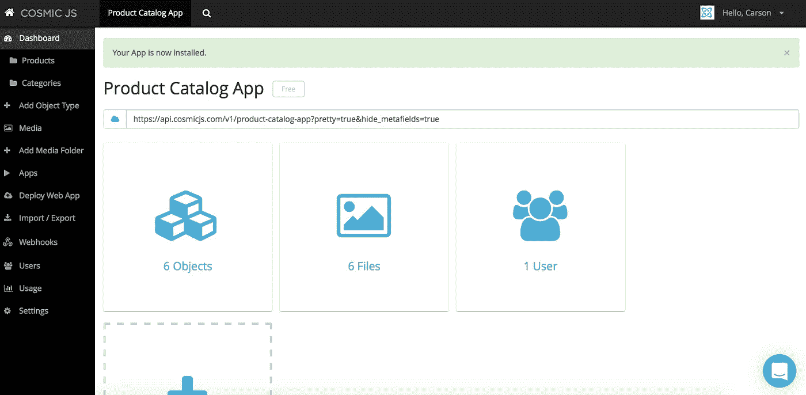

# 分 3 步安装移动产品目录应用程序

> 原文：<https://medium.com/hackernoon/install-a-mobile-product-catalog-app-in-3-steps-419b6bd06c84>

The Mobile Product Catalog App is built using AngularJS, Ionic and Cosmic JS.

在这篇博客中，我将演示如何使用[宇宙 JS](https://cosmicjs.com/) 安装一个[移动产品目录应用](https://cosmicjs.com/apps/product-catelog-app)。这个简单的产品目录移动应用程序是用 Angular JS、Ionic 和 Cosmic JS 构建的。添加/编辑产品并按类别排序。

Mobile Product Catalog App in action.

Cosmic JS

我将在这个部署过程中使用[宇宙 JS](https://cosmicjs.com/) 。Cosmic JS 是一个 [API 优先的 CMS](https://cosmicjs.com/) ，它使得管理和构建网站和应用程序更加快速和直观。通过将内容与代码分离， [Cosmic JS](https://cosmicjs.com/) 增强了开发人员的灵活性，同时确保内容编辑人员能够以最适合他们的方式规划和部署内容。Cosmic JS 允许开发人员使用他们喜欢的工具，如 Node.js、GitHub、Docker 等等。

App Screenshots.

# 1.报名宇宙 JS

Cosmic JS Home Page Demo.

从[报名](https://cosmicjs.com/signup)参加[宇宙 JS](https://cosmicjs.com/) 开始。下面提供了有用的资源。

> [如何使用 AngularJS、Ionic&CosmicJS](https://cosmicjs.com/blog/how-to-build-a-mobile-product-catalog-app-using-angular-js-ionic-and-cosmic-js)
> [产品目录 App](https://cosmicjs.com/apps/product-catelog-app)
> [产品目录 App Codebase on GitHub](https://github.com/cosmicjs/ionic-angular-app)

# 2.创建新的存储桶

I named my bucket “Product Catalog App”.

# 3.安装产品目录应用程序

Cosmic JS lets you filter by utility as well as programming language. App installation options pictured above.

Cosmic JS 给你在实用程序和编程语言之间过滤的能力。

Product Catalog App Thumbnail.

Installation Confirmation

# 应用程序安装确认

Bucket Dashboard after Installation.

就像注册、创建新的存储桶、安装 web 应用程序、编辑对象和部署一样简单！我收到了访问我的 web 应用程序的确认电子邮件，还看到了我的桶升级选项，如[自定义域、一键式 SSL、webhooks 和本地化](https://cosmicjs.com/features)。

[Cosmic JS](https://cosmicjs.com/) 是一个 API 首创的基于云的内容管理平台，可以轻松管理应用和内容。如果你对 Cosmic JS API 有任何疑问，请通过 [Twitter](https://twitter.com/cosmic_js) 或 [Slack](https://cosmicjs.com/community) 联系创始人。

[卡森·吉本斯](https://twitter.com/carsoncgibbons)是[宇宙 JS](https://cosmicjs.com/) 的联合创始人& CMO，宇宙 JS 是一个 API 第一的基于云的[内容管理平台](https://cosmicjs.com/)，它将内容与代码分离，允许开发者用他们想要的任何编程语言构建流畅的应用和网站。

> [黑客中午](http://bit.ly/Hackernoon)是黑客如何开始他们的下午。我们是 AMI 家庭的一员。我们现在[接受投稿](http://bit.ly/hackernoonsubmission)并乐意[讨论广告&赞助](mailto:partners@amipublications.com)机会。
> 
> 如果你喜欢这个故事，我们推荐你阅读我们的[最新科技故事](http://bit.ly/hackernoonlatestt)和[趋势科技故事](https://hackernoon.com/trending)。直到下一次，不要把世界的现实想当然！

