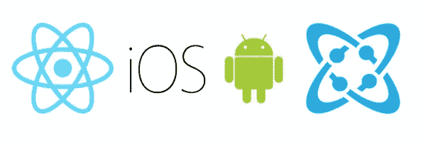
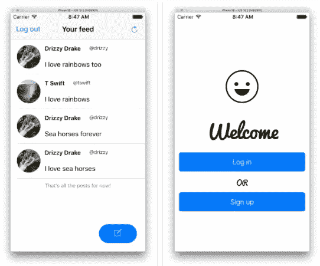
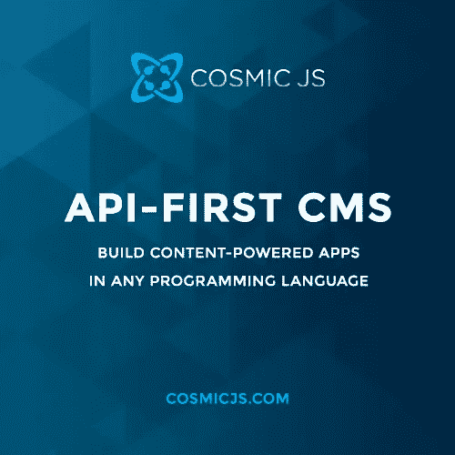
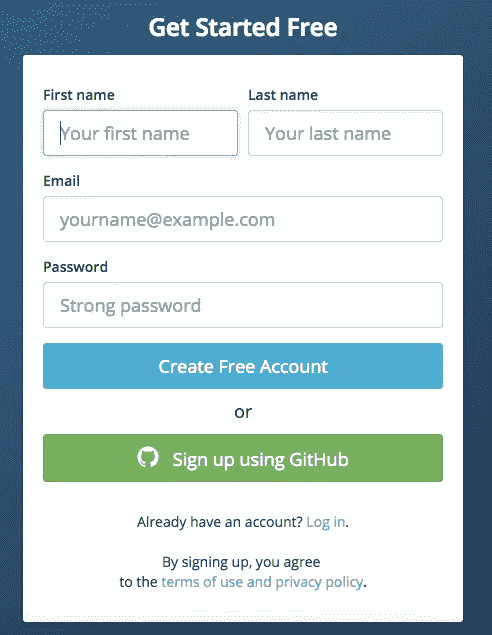
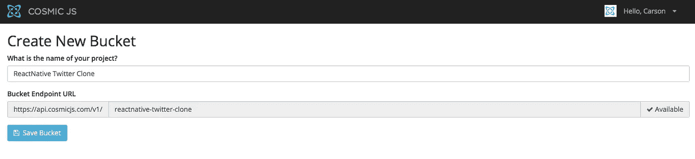
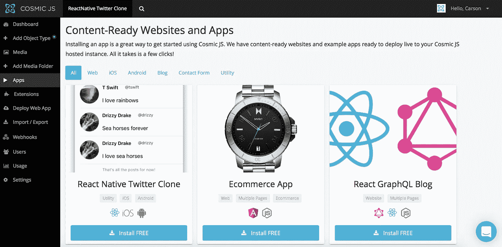
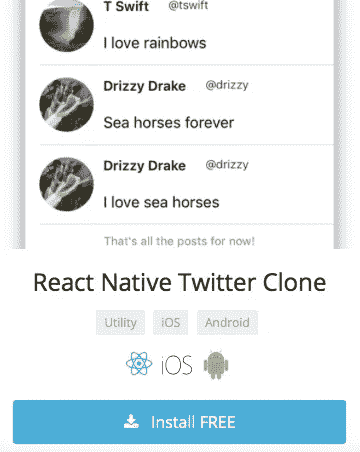
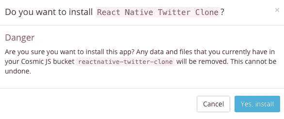

# 分 3 步安装一个 React 本地 Twitter 克隆

> 原文：<https://medium.com/hackernoon/install-a-react-native-twitter-clone-in-3-steps-3f81763fa3ca>

Built using React Native and Cosmic JS for iOS and Android.

React Native 允许您仅使用 JavaScript 构建移动应用程序。它使用与 React 相同的设计，允许您从声明性组件构建丰富的移动 UI。有关 React Native 的更多信息，请访问其[框架页面](https://facebook.github.io/react-native/)。

Screenshot of native mobile app.

在本教程中，我将演示如何安装一个使用 React Native 构建的小型类似 Twitter 的移动应用程序。通过我们的应用程序，用户将能够创建帐户并登录，查看自己和其他用户创建的所有帖子的提要，并将自己的帖子添加到提要中。我们所有用户和帖子的数据将由 [Cosmic JS 管理。](https://cosmicjs.com/)

Sign up for Cosmic JS to start managing content API-first.

我将使用[宇宙 JS](https://cosmicjs.com/) 作为这个博客的例子。Cosmic JS 是一个 [API 优先的 CMS](https://cosmicjs.com/) ，它使得管理和构建网站和应用程序更加快速和直观。通过将内容从代码中分离出来，Cosmic JS 增强了开发人员的灵活性，同时确保内容编辑人员能够以最适合他们的方式规划和部署内容。我们将使用 Cosmic JS 来安装我们的示例应用程序，部署和更新来自[基于云的内容管理平台](https://cosmicjs.com/)的内容。

> [如何用 React Native 制作一个简单的 Twitter 克隆](https://cosmicjs.com/blog/how-to-make-a-simple-twitter-clone-with-react-native)
> 
> [React 原生 Twitter 克隆应用](https://cosmicjs.com/apps/react-native-twitter-clone)
> 
> [在 GitHub 上反应原生 Twitter 克隆应用代码库](https://github.com/cosmicjs/react-native-twitter-clone)

# 1.创建一个免费的宇宙 JS 帐户

我们鼓励用户通过几条联系信息注册，或者简单地将他们的 GitHub 账户与 Cosmic JS 整合。

# 2.创建新的存储桶

# 3.安装 React 原生 Twitter 克隆应用程序

点击左侧导航栏上的 Cosmic JS 仪表盘，进入“应用程序”开始浏览。Cosmic JS 提供按效用过滤的 app，如 Web、iOS、Android、博客、联系人表单等；也能够被 Node.js、PHP、React 等编程语言过滤。

只需点击“免费安装”即可安装 React 原生 Twitter 克隆。

我们刚刚安装了一个 React 原生 Twitter 克隆，它使用 [Cosmic JS](https://cosmicjs.com/) 进行数据存储。注册/登录并向您的订阅源添加帖子。这就像注册、创建一个新的 bucket 并安装 web 应用程序一样简单！

[Cosmic JS](https://cosmicjs.com/) 是一个 API 第一的基于云的内容管理平台，使管理应用程序和内容变得容易。如果你对 Cosmic JS API 有任何疑问，请通过 [Twitter](https://twitter.com/cosmic_js) 或 [Slack](https://cosmicjs.com/community) 联系创始人。

[卡森·吉本斯](https://twitter.com/carsoncgibbons)是 [Cosmic JS](https://cosmicjs.com/) 的联合创始人& CMO，这是一个 API 第一的基于云的[内容管理平台](https://cosmicjs.com/)，它将内容与代码分离，允许开发人员用他们想要的任何编程语言构建流畅的应用程序和网站。

> [黑客中午](http://bit.ly/Hackernoon)是黑客如何开始他们的下午。我们是阿妹家庭的一员。我们现在[接受投稿](http://bit.ly/hackernoonsubmission)并乐意[讨论广告&赞助](mailto:partners@amipublications.com)的机会。
> 
> 如果你喜欢这个故事，我们推荐你阅读我们的[最新科技故事](http://bit.ly/hackernoonlatestt)和[趋势科技故事](https://hackernoon.com/trending)。直到下一次，不要把世界的现实想当然！

