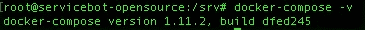
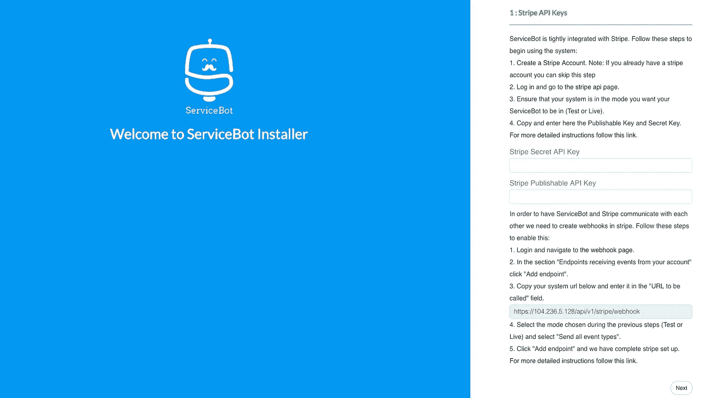
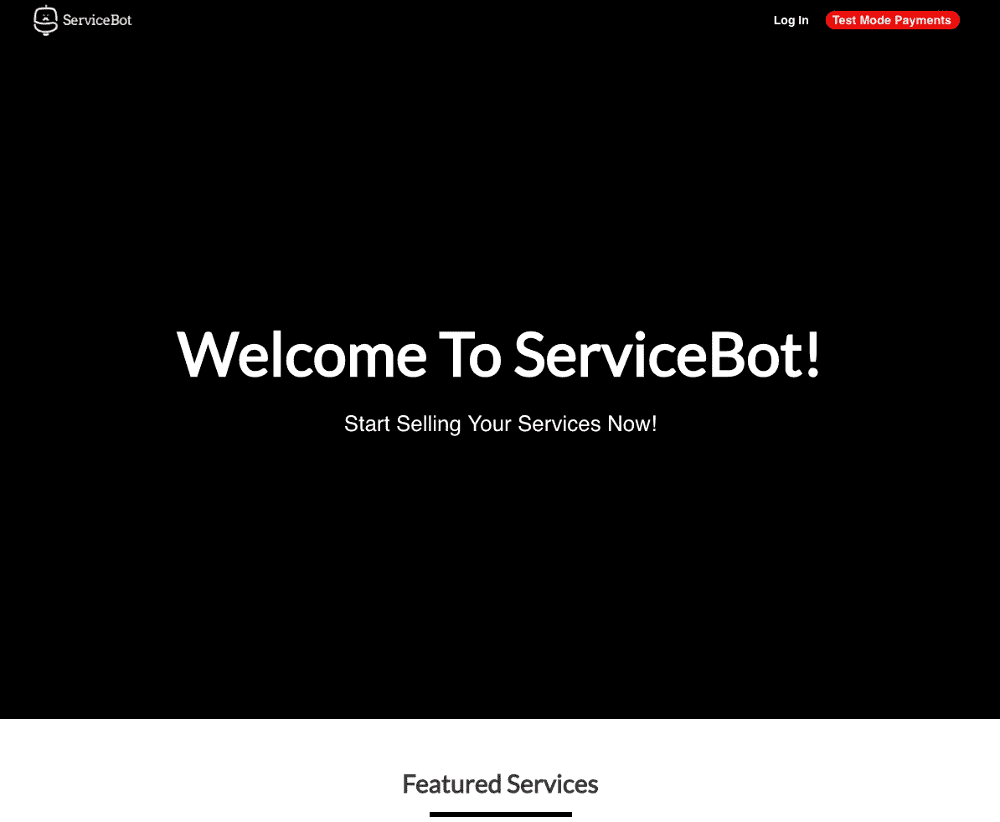

# 为您的 XaaS 企业安装和配置开源 CRM

> 原文：<https://medium.com/hackernoon/install-and-configure-an-open-source-crm-for-your-xaas-business-f976451221f0>

在本文中，我将指导您完成一个完整的安装和设置 [Servicebot](https://servicebot.io) 应用程序的过程。Servicebot 是一个开源平台，可以在线销售任何服务。[这里是我们的 Github 库。](https://github.com/service-bot/servicebot)


Servicebot admin dashboard view

# 先决条件

开始安装前，请确保准备好以下物品:

*   **Linux 服务器。**我这次安装用的是 DigitalOcean 里最小的 Ubuntu 16.04 droplet。您也可以只使用本地服务器来测试这一点。
*   **条纹账户。**它是免费的，你需要它才能用你的 [Servicebot](https://hackernoon.com/tagged/servicebot) 应用程序处理支付。
*   **(可选)邮件服务器。** Servicebot 将使用它向您的客户和您自己发送自动电子邮件。
*   **(可选)SSL 证书**。Stripe 要求使用 SSL 证书进行实时支付。获得 SSL 证书的一种方法是使用[让我们加密](https://letsencrypt.org/)。请确保按照下面提到的方式命名您的证书。

```
Certificates should be named as follows:
- Keyfile : servicebot.key
- Certificate : servicebot.crt
- CA : servicebot_bundle.crt
```

一旦具备了上述先决条件，就可以继续安装了。

# 安装 Servicebot

SSH 进入您的服务器，并运行以下命令来安装您的 Servicebot 应用程序。

**1-如果尚未安装 docker，则安装 docker**

```
sudo wget -qO- https://get.docker.com/ | sh
```

**2-安装 docker-compose**

```
sudo curl -o /usr/local/bin/docker-compose -L "https://github.com/docker/compose/releases/download/1.11.2/docker-compose-$(uname -s)-$(uname -m)"
```

**3-设置 docker-compose 的权限**

```
sudo chmod +x /usr/local/bin/docker-compose
```

**4-通过检查版本**验证 docker-compose 安装是否成功

```
docker-compose -v
```

这将打印出我们安装的版本:



**5-运行 Servicebot docker 部署的 git 克隆**

```
git clone https://github.com/service-bot/servicebot-deploy.git
```

上面的 git 克隆命令应该会在你当前的工作目录中创建一个新的目录。移动到新创建的文件夹:

```
cd servicebot-deploy/
```

**7-[可选]配置 docker yaml 文件。**这个目录下应该有个文件叫“docker-compose.yaml”。该文件获取您的 Servicebot [docker](https://hackernoon.com/tagged/docker) 容器的配置。

**如果您有 SSL 证书和邮件服务器，继续将它们添加到此。yaml 文件，如果没有，跳到第 8 步。**

让我们修改这个文件，添加您的 SSL 证书和邮件服务器(您可以使用任何其他编辑器，我用的是 nano)

```
nano docker-compose.yaml
```

对于 SMTP 邮件服务器，编辑并取消注释以下行以匹配您的 SMTP 服务器信息:

```
SMTP_HOST : "localhost"
SMTP_USER : "postmaster@localhost"
SMTP_PASSWORD : "password"
SMTP_PORT : "587"
```

对于 SSL:取消对这两行 SSL 的注释，并将`/path/to/ssl/certs/on/server`更改为您在服务器上为证书创建的路径:

```
CERTIFICATES: "./ssl/"
  - /path/to/ssl/certs/on/server:/usr/src/app/ssl
```

**8-构建 docker 映像**

```
docker-compose build
```

**9-启动码头集装箱**

```
docker-compose up -d
```

**10——就是这样！您的新 Servicebot 网站现在应该已经上线了。打开您的浏览器，转到您的服务器 IP 地址或 URL，您应该看到以下页面:**



Initial Servicebot open source setup page

# 设置 Servicebot

一旦您安装了 Servicebot 网站，就应该将其连接到您的 Stripe 帐户并添加您的业务信息。

**11-登录到 Stripe，导航到左侧的 API 链接，或者直接转到** [**此链接**](https://dashboard.stripe.com/account/apikeys) **。**您可以使用 live 或 test 密钥连接到您的 Servicebot 网站。如果您还没有配置您的 SSL，您只能使用测试模式键。将来通过 Servicebot 仪表板更新条带密钥非常简单。

只需将您的条带密钥粘贴到您的 Servicebot 安装页面，然后按下一步。

**12-配置好条带密钥后，您应该会看到以下页面:**


输入管理员用户的电子邮件和密码。然后输入您的企业信息并按**提交**。

**恭喜你！你已经完成了。现在，您有了一个全新的 Servicebot 网站，可以用来管理您的客户、服务和自动计费。**



Initial Servicebot page after setup completion

# **替代安装方法**

如果你不想安装自己的服务机器人服务器，你可以通过我们的自动化系统在 [ServiceShop](https://serviceshop.io) 主页上注册一个。只需输入您的电子邮件、密码和企业名称，不到 20 秒钟，您将拥有一个新的 Servicebot 网站。

# 后续步骤

在未来的帖子中，我将重点介绍 Servicebot 的特性和用例，并教您如何使用该平台。如果您有任何问题或想与我们的团队交流，您可以发送电子邮件至 [team@servicebot.io](mailto:team@servicebot.io) 或使用我们的网站即时聊天。