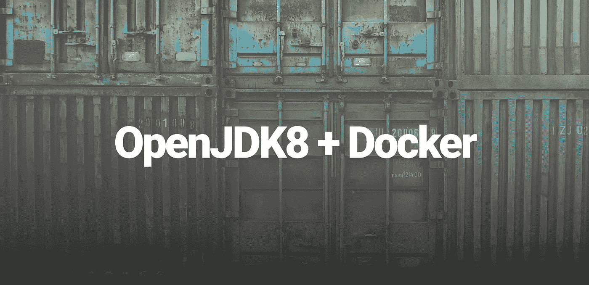

# 快速提示:在 Debian 容器中安装 OpenJDK

> 原文：<https://medium.com/hackernoon/install-java-in-docker-container-1d361e2e027e>



默认的 Debian 源代码不包括最新的 OpenJDK，但是你可以从`jessie-backports`获得。这里有一个在容器中安装它的快速提示。

首先，让`debian:jessie`进入您的 Docker 守护进程:

```
docker pull debian:jessiejessie: Pulling from library/debian10a267c67f42: Pull completeDigest: sha256:476959...c758245937Status: Downloaded newer image for debian:jessie
```

现在运行一个使用`debian:jessie`和的容器，并将`jessie-backports`源添加到我们的源中:

```
docker run -it debian:jessie /bin/bash...echo 'deb [http://deb.debian.org/debian](http://deb.debian.org/debian) jessie-backports main' \
      > /etc/apt/sources.list.d/jessie-backports.list
```

也就是将`deb [http://deb](http://deb) ...`插入到文件`/etc/apt/sources.list.d/jessie-backports.list`中。`deb`表示归档文件包含二进制`.deb`包以及在哪里可以找到这些包(这里你可以指定官方的`debian.org`或者另一个[镜像](https://www.debian.org/mirror/list))。就在 URL 之后，我们指定了一个发行版，可以认为是一个目标版本。在这里，我们的目标是包含更多前沿发布的`jessie-backports`(见[https://backports.debian.org/Instructions/](https://backports.debian.org/Instructions/))。

完成后，用`apt update`更新你的包列表。这实际上是获取关于可以获取的软件包版本的信息(但不会升级您已经安装的软件包)。

```
apt update -yGet:1 http://security.debian.org jessie/updates InRelease [63.1 kB]...Get:3 http://deb.debian.org jessie-backports InRelease [166 kB]...All packages are up to date.
```

现在只需要瞄准`jessie-backports`发行版并安装`openjdk8`即可👌

```
apt install --target-release jessie-backports \
      openjdk-8-jre-headless \
      ca-certificates-java \
      --assume-yes
```

注意`--target-release`的使用。这允许我们从`jessie-backports`(有`openjdk8-jre-headless`存在的地方)瞄准包。使用`--assume-yes`时，不会提示我们进行确认)。

就是这样！现在您已经安装了最新的 OpenJDK👊

```
java -versionopenjdk version "1.8.0_131"OpenJDK Runtime Environment (build 1.8.0_131-8u131-b11-1~bpo8+1-b11)OpenJDK 64-Bit Server VM (build 25.131-b11, mixed mode)
```

下面是一个`Dockerfile`，它按照这里讨论的内容安装 OpenJDK。您可以使用`docker build --tag <image_name> .`来构建它(其中`.`表示放置`Dockerfile`的目录)。

就是这样！

如果你有任何问题，让我知道！

如果你想和我联系并获得一些关于这类事情的最新消息，请在推特上关注我 twitter.com/beld_pro✌️。

🎩

[](http://bit.ly/HackernoonFB)[](https://goo.gl/k7XYbx)[](https://goo.gl/4ofytp)

> [黑客中午](http://bit.ly/Hackernoon)是黑客如何开始他们的下午。我们是 [@AMI](http://bit.ly/atAMIatAMI) 家庭的一员。我们现在[接受投稿](http://bit.ly/hackernoonsubmission)，并乐意[讨论广告&赞助](mailto:partners@amipublications.com)机会。
> 
> 如果你喜欢这个故事，我们推荐你阅读我们的[最新科技故事](http://bit.ly/hackernoonlatestt)和[趋势科技故事](https://hackernoon.com/trending)。直到下一次，不要把世界的现实想当然！

