# 使用 CloudFormation 安装平均堆栈

> 原文：<https://medium.com/hackernoon/install-mean-stack-using-cloudformation-4d16fc2fc1a>

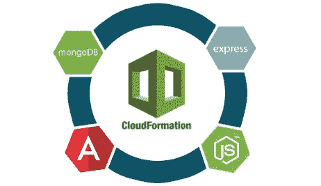

**AWS CloudFormation** 是一项帮助您建模、设置和复制 AWS 资源的服务。它使用一个**模板**文件将资源集合作为单个堆栈。

为了创建模板，我们使用了一个 **JSON 文件**或**AWS cloud formation Designer**。对于本教程，我选择了第一个解决方案。

注:模板在我的 [**Github**](https://github.com/mlabouardy/aws-cloudformation-templates) **上有。**

我们从一个基本模板开始，该模板定义了一个带有**安全组**的 **EC2 实例**，该安全组**允许端口 **22** 上的 SSH 流量**，端口 **27017** 上的 **MongoDB** 流量，以及来自任何地方**的 **3000** 上的 **NodeJS** 应用，如图所示**

除此之外，我们创建两个输入参数，指定*实例类型*和一个*密钥对*，用于 **SSH 访问**。然后，我们使用 *UserData* 属性提供一组 shell 命令来安装 **MongoDB** 、 **NodeJS** 并引导一个简单的 **MEAN** 应用程序。最后，输出部分打印出**意味着**应用程序的公共 URL。

现在我们定义了模板。转到 [**AWS 管理控制台**](https://console.aws.amazon.com/) ，然后导航到 **CloudFormation 仪表板**，并点击**创建堆栈**:

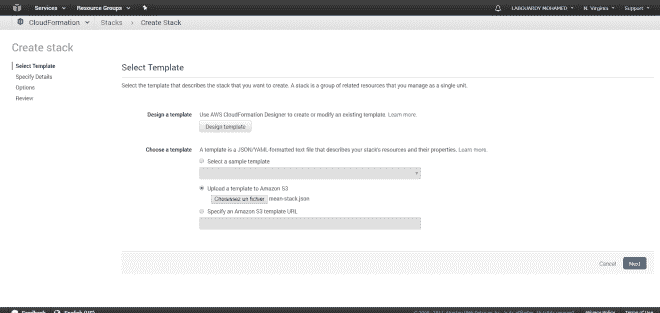

上传 JSON 文件，点击**下一步**:

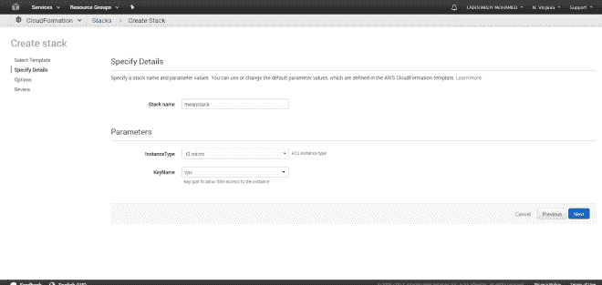

为堆栈指定一个名称，并选择您的实例类型和将用于 ssh 到实例的密钥对。然后，点击**下一个**:

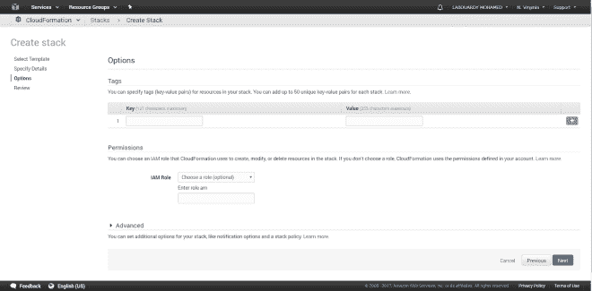

保持所有字段不变，点击下一个的**，然后点击**创建****

启动后，您将看到以下启动流程事件的屏幕:

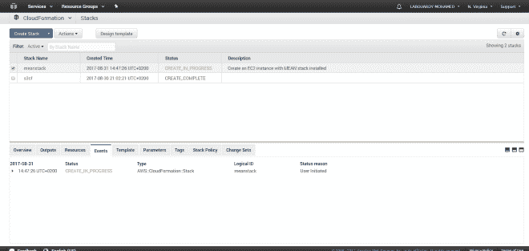

过一会儿，您会在 status 选项卡中看到 CREATE_COMPLETE 消息。

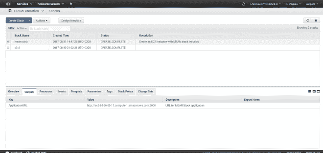

如果您将浏览器指向**输出**选项卡中显示的 **URL** ，您应该会看到:一条简单的 HTML 消息:

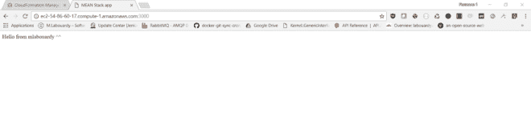

如果我们更改端点，我们应该会看到一个 JSON 响应:

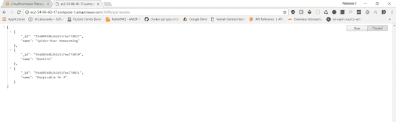

恭喜你！您已经部署了您的**均值堆栈应用程序**。

转到 **EC2 仪表板**，您应该在那里看到您的实例:

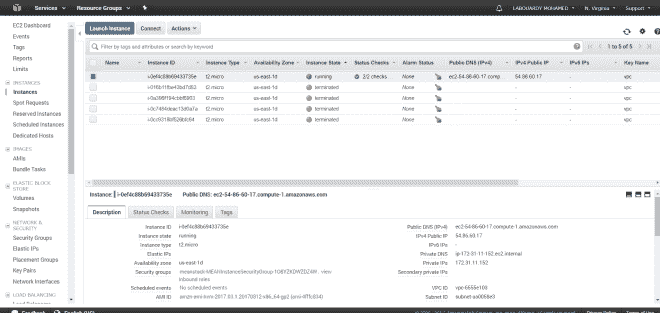

验证**安全组**是否按照模板中的配置进行了设置:

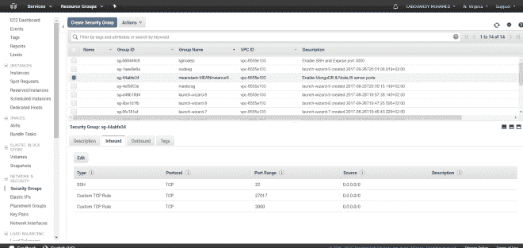

要验证所有软件包和依赖项是否已正确安装，我们可以通过 SSH 连接到服务器:

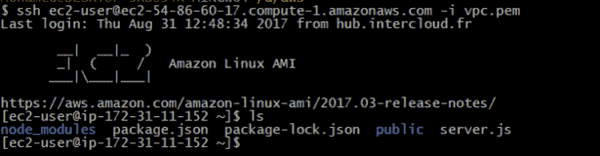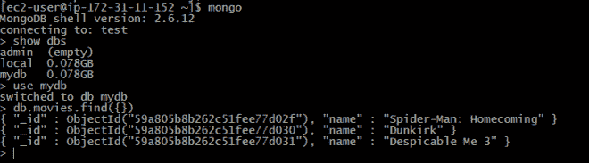

要终止实例，我们可以从**云形成向导**中删除堆栈，删除堆栈将终止堆栈启动的所有实例:

