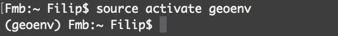
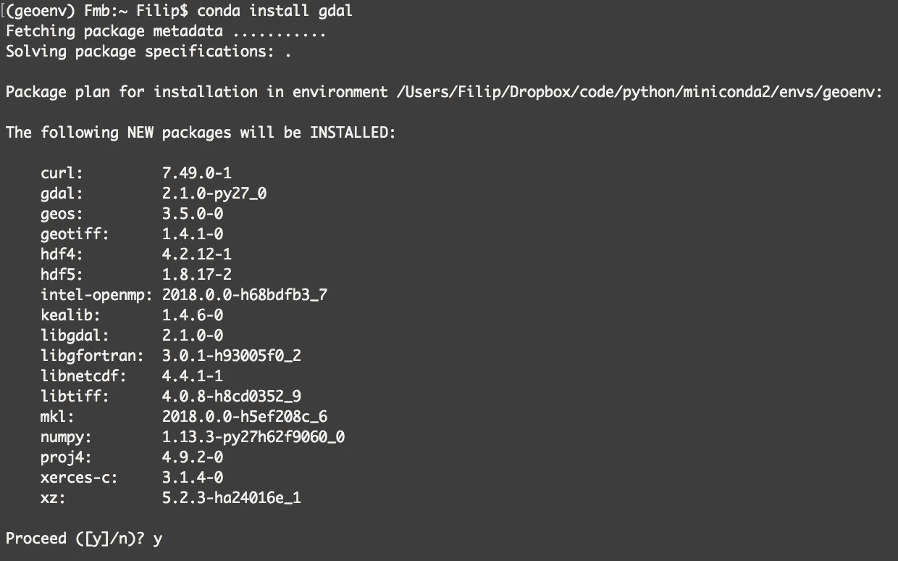
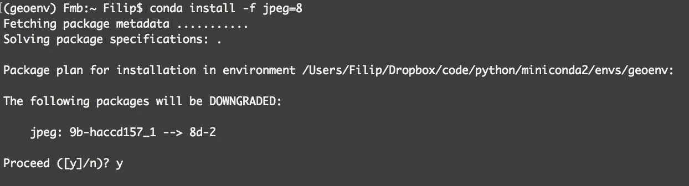
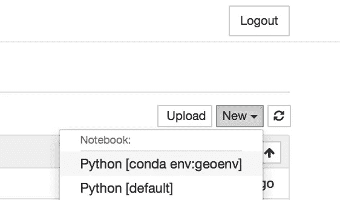
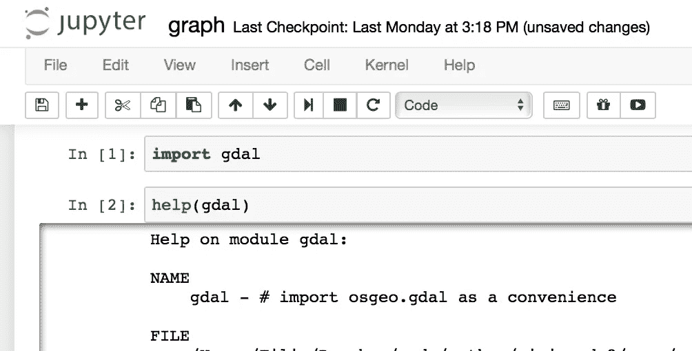
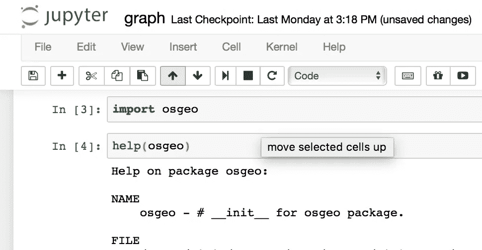
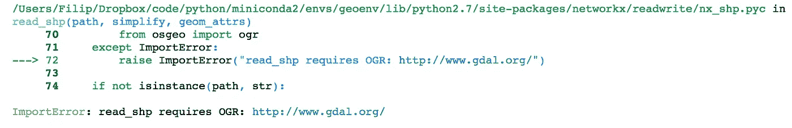
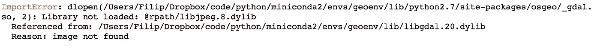
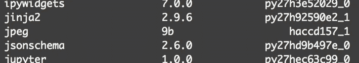
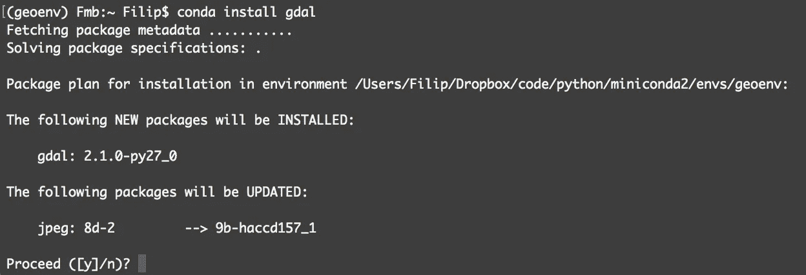

# 今日晦涩的 PSA:使用 Conda 在 Mac 上正确安装 Python GDAL

> 原文：<https://medium.com/hackernoon/install-python-gdal-using-conda-on-mac-8f320ca36d90>

## 不要 pip 安装 gdal，不要在虚拟环境中安装 GDAL。而是用康达。

这些是我关于如何在 Mac 上使用 [Conda](https://conda.io/docs/) 安装 [GDAL](http://www.gdal.org) 的说明。在我们开始之前，让我解释一下为什么我要写这个指南。GDAL 代表“地理空间数据抽象库**，由[开源地理空间基金会](http://www.osgeo.org)发布。对于 Python 来说，GDAL 包也是和名为`**osgeo**`的包一起发布的。碰巧的是，我正在做的一个项目需要这两样东西。我希望它们被整齐地包装在虚拟环境中。**

****

**One Does Not Simply pip install gdal [Source](https://twitter.com/ocefpaf/status/753992589938860032)**

**我开始尝试使用 pip 和 virtual-env。这个晦涩难懂的操作方法(也是媒体上的第一篇帖子！)经过几个小时的谷歌搜索，并试图调试我一路上遇到的错误后，来到你面前。最后，我改变了主意，尝试了一些新的东西，换成了康达。这是我所有问题的解决办法。好吧，除了一些，但是我也修好了。**

**Conda 很棒，因为它是一个像 pip 一样的包管理器，但它也像 virtual-env 一样管理您的虚拟环境。除了这两种方式都做得更好，而且使用起来很愉快。善待自己，换康达。**

**我想让你免受我所经历的麻烦，所以我写下了以下说明。**

## **环境:**

**关于我工作环境的简短说明:**

> ***Mac OS 10 . 12 . 6 Sierra
> miniconda 2 for Python 2(Conda 4 . 3 . 30)*[*info*](https://conda.io/miniconda.html) *Python 2 . 7 . 14***
> 
> **可选 python 包:[*Jupyter 笔记本*](http://jupyter.org/install.html) *，安装有*`$ conda install jupyter`
> [*nb _ conda*](https://github.com/Anaconda-Platform/nb_conda)*，使得 Jupyter 与 Conda、* `$ conda install nb_conda`玩得很愉快**

**如果您在不同的开发环境中工作，您的收获可能会有所不同。**

**现在，我自己几小时前就需要的说明…**

# **如何安装 GDAL🌐使用 Conda🐍在 Mac 上🍎**

**本教程假设您已经安装了 Conda，并且已经创建了 Conda 环境。分别指示[这里](https://conda.io/docs/user-guide/install/macos.html)和[这里](https://conda.io/docs/user-guide/getting-started.html#managing-environments)。**

## **步骤 1:激活您的 Conda 环境🚀**

**打开**终端**，运行:**

```
$ source activate [yourEnvironmentName]
```

**对我来说，[您的环境名称] = `geoenv`。**

****

**Screenshot. We’ve gone from the global shell to the Conda local environment that was just created.**

**(我们可以用命令`$ source deactivate`取消激活。)**

## **步骤 2:好，现在我们开始安装 GDAL。🔧**

**仍然在终端中，运行以下命令:**

```
$ conda install gdal
```

**这是我得到的:**

****

**Screenshot. Output from “conda install gdal”**

**太好了。事实证明，为了让 osgeo 子包工作，我们实际上需要依赖项`**jpeg version 8**`，而不是`**9**`。在这篇文章的末尾，你可以在#诊断下读到更多关于我是如何得出这个结论的。**

**现在，你需要做的就是运行这个:**

```
$ conda install -f jpeg=8
```

**“-f”标志强制安装(这实际上是 jpeg 模块的降级)。**

****

**Screenshot. Install jpeg version 8 with Conda**

**好了，我们现在应该有一个 GDAL 的工作版本了！我们来测试一下以确保。**

## **步骤 3:测试安装🔍**

**您可以在命令行或 Jupyter 笔记本中完成这项工作。由于我想确保 gdal 以后能在 Jupyter 工作，所以我打算在那里测试。**

**打开新的 Jupyter 笔记本📙，返回终端，运行以下命令:**

```
$ jupyter notebook
```

**此命令将使用 Jupyter 笔记本文件查看器在您的 internet 浏览器中打开一个新选项卡。导航到要保存笔记本的目录。现在，我们想开始一个新的笔记本。转到右上角，单击“新建”。**

****

**Screenshot. Jupyter Notebook, creating a new notebook, I select “Python [conda env:geoenv]”**

**确保选择您一直使用的 Conda 环境作为 Python 内核。**

**让我们继续测试吧！在笔记本中运行这些命令。**

```
import gdal
help(gdal)
```

****

**Screenshot. Import gdal and get the help to make sure it works!**

**对 gdal 的帮助起作用了，所以我们出发去比赛。**

```
import osgeo
help(osgeo)
```

****

**Screenshot. Import osgeo and run help(osgeo) to make sure it works!**

**成功！🤗**

**我们终于安装了 GDAL 和 osgeo。一切正常(目前)。写这篇有点长的帖子是一种享受，因为这个问题让我纠结了无数个小时。我希望能让你免遭同样的命运。提前感谢你们的掌声👏🏽如果有什么需要编辑或澄清的地方，请告诉我。说完，我就要和`**networkx**`一起探索图表了！**

**和❤︎一起，**

**菲利普**

**附言**

## **#撰写这篇文章的动机**

**我通常喜欢在项目中使用虚拟环境来保持事情有条理。首先，我尝试在 python **virtual-env** 中安装 GDAL，这是一个巨大的失败。在 Windows 和 Ubuntu 上有如何做到这一点的说明，但我无法让它在 Mac 上工作。虚拟环境更像是虚拟敌人。StackOverflow 上的一些人建议使用 [Conda](https://conda.io/docs/) 来代替。不管怎样，我遇到了一些障碍，所以我决定发布这些如何在 Mac 上使用 Python/Conda 安装 GDAL 的说明。亲爱的读者，我希望这个指南能为你节省一些时间。**

## **#我用 GDAL 做什么**

**我需要 GDAL 有一个非常特殊的原因。它是 [networkx](http://networkx.github.io) Python 模块的`**read_shp()**`函数所必需的，也是其依赖项。该函数读入 ESRI shapefile(地理空间数据)并将其转换为网络/图形对象。很明显，你可能需要 GDAL 做别的事情。**

**为了安装，我首先尝试在 Python 虚拟环境(又名 virtual-env)中使用`**pip install gdal**`。失败了。我想你可以说这只是一个小小的梦想，唉。或者可能与安装了 QGIS via Kyngchaos 有关。该发行版包含的 GDAL 不是 Python 包，而是一个框架。**

**不管怎样，底线是我仍然需要 GDAL 在 Python 虚拟环境中工作。**

## **#诊断 Conda 安装问题:**

**对我来说，使用 pip 将 GDAL 安装在虚拟环境中是不可能的。所以我才换了康达。**

**在 Conda 中运行安装时，我遇到了一些问题。简单地从`**networkx**`运行`read_shp`函数会给我一个一般性错误，就像在 virtual-env 中一样。**

> **I mportError: read_shp 需要 OGR:**

****

**Screenshot. Jupyter notebook. What happens when I try to run the command: G = nx.read_shp(‘file.shp’)**

**在截图中你可以看到代码需要`**from osgeo import ogr**` ，它实际上是 GDAL 模块的一部分。**

**所以当我们尝试`**import gdal**`时，我们可以看到实际发生了什么:**

> **未加载库:@rpath/libjpeg.8.dylib**

****

**Error when I try to run import gdal. The library jpeg.8 is missing.**

**jpeg8 库没有加载。为了调查，我们可以检查康达安装了哪些包:`**$ conda list**`**

****

**Result of the **conda list** command. Sure enough, we have jpeg=9, rather than 8.**

**此外，当我只卸载并重新安装`**gdal**`时，事实上很明显 gdal 本身将 jpeg 更新到了版本 9，只是后来中断了。**

****

**GDAL breaks itself. Or rather, GDAL breaks osgeo which it’s bundled with(!)**

**修复方法是在安装 gdal 后简单地将 jpeg 9 降级为 jpeg 8。你可以在上述#说明的第 3 步中找到配方。谢谢！**

## **我使用的来源:**

*   **egayer 在 gdal GitHub 的这个帖子中的评论**
*   **[“安装 python 的 GDAL 有问题”](https://stackoverflow.com/questions/34408699/having-trouble-installing-gdal-for-python)**
*   **我没有在这个列表中包括我对任何与“pip install GDAL”或“GDAL python install MAC virtual-env”相关的疯狂、详尽的搜索。如果你想走那条路，愿上帝保佑你。**