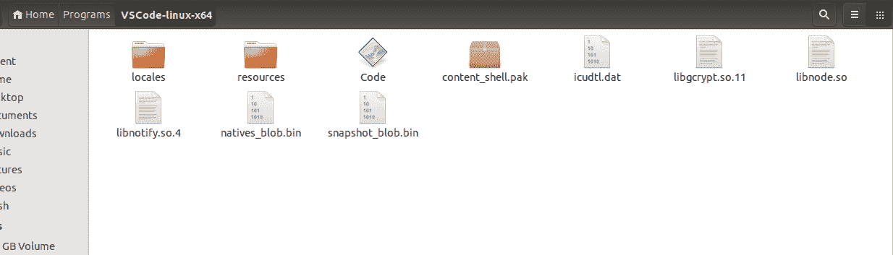
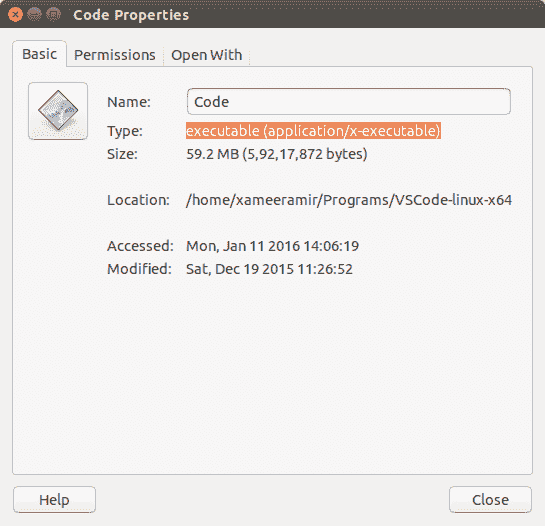
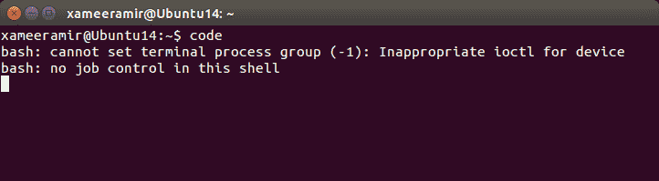
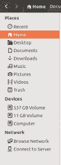
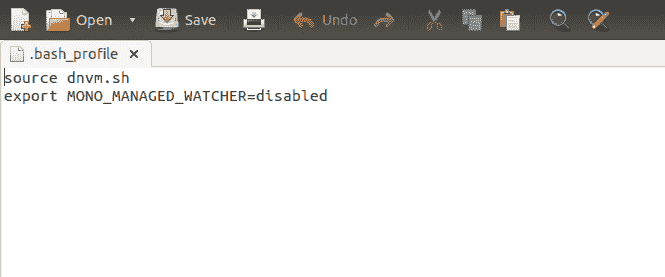
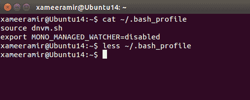
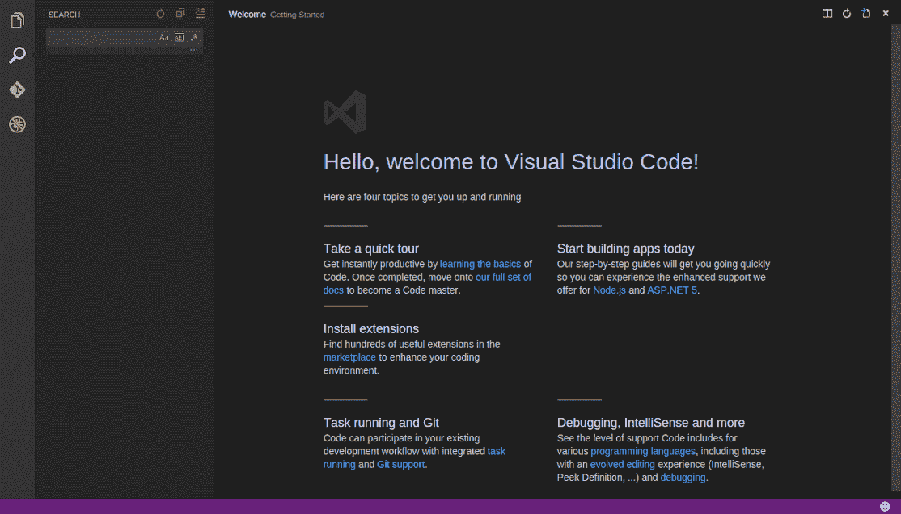

# 在 Ubuntu linux 上安装 Visual studio 代码

> 原文：<https://medium.com/hackernoon/install-visual-studio-code-on-ubuntu-linux-11132dc5ba42>


credit: [http://www.omnisharp.net/](http://www.omnisharp.net/)

如果你想继续努力。NET 之外的 Windows ，你[可能](https://hackernoon.com/tagged/probably)缺少 [Visual studio](https://www.visualstudio.com/) 。子选项是[对代码](https://code.visualstudio.com/)。

现在，我们将在 Ubuntu linux 上设置它

解压缩后的文件夹的内容如下所示:



`code`是我们感兴趣的可执行文件:



*   双击`code`

为了便于组织，我把所有下载的设置放在一个单独的[目录](https://hackernoon.com/tagged/directory)下，名为`Programs`。是的，灵感来自[视窗](https://www.microsoft.com/en-in/windows)

每次从文件夹中运行`code`**太麻烦了。为了最小化它，我们可以使用命令`sudo ln -s /path/to/vscode/Code /usr/local/bin/code`创建一个符号链接**

**在我的例子中，我用`~/Programs/VSCode-linux-x64/Code`替换了`/path/to/vscode/Code`，所以最终的语法是**

**`sudo ln -s ~/Programs/VSCode-linux-x64/Code /usr/local/bin/code`**

**如果已经创建了符号链接，将显示一个错误:**

****

**从下一次开始，我们可以只使用 Ctrl+Alt+T 和键入代码来打开终端**

****

**安装后，[确保始终运行](http://stackoverflow.com/a/35031584/2404470) `[dnvm](http://stackoverflow.com/a/35031584/2404470)` [和](http://stackoverflow.com/a/35031584/2404470) `[dnu](http://stackoverflow.com/a/35031584/2404470)` [命令，使用以下命令添加到](http://stackoverflow.com/a/35031584/2404470) `[.bash_profile](http://stackoverflow.com/a/35031584/2404470)`:**

```
echo 'source dnvm.sh' >> ~/.bash_profile 
echo 'export MONO_MANAGED_WATCHER=disabled' >> ~/.bash_profile
```

**验证是否确实添加了命令:**

*   **转到文件浏览器中的**主页****

****

*   **使用 Ctrl+H 取消隐藏文件**
*   **找到`.bash_profile`文件**
*   **用`gedit`或你最喜欢的编辑器打开它**

****

```
source dnvm.sh 
export MONO_MANAGED_WATCHER=disabled
```

**或者，[使用](http://askubuntu.com/a/261902/219603) `[cat](http://askubuntu.com/a/261902/219603)` [或](http://askubuntu.com/a/261902/219603) `[less](http://askubuntu.com/a/261902/219603)` [命令](http://askubuntu.com/a/261902/219603):**

****

**VS 代码已经可以使用了:**

****

**[照片](https://goo.gl/photos/Mg4vCPgbdUGFsCrm6)**

***原载于*[*xameeramir . github . io*](http://xameeramir.github.io/install-vs-code-ubuntu-linux/)*。***