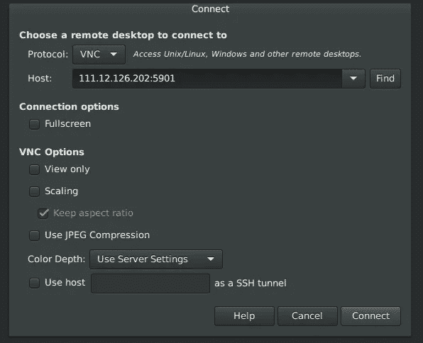
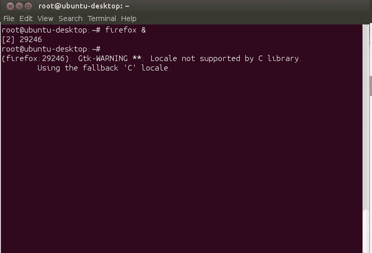
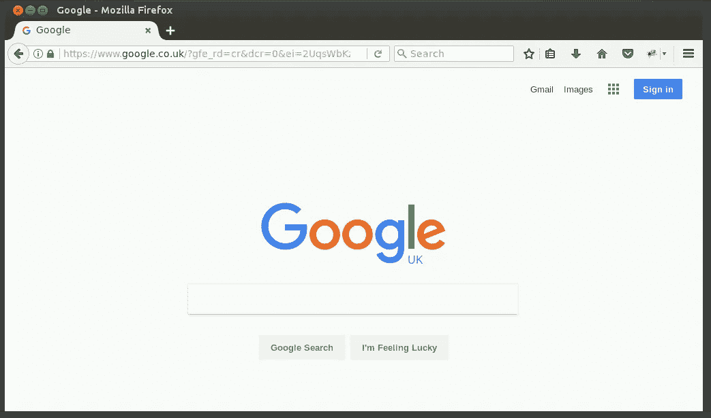

# 在 Ubuntu 上安装 VNC 服务器

> 原文：<https://medium.com/hackernoon/installation-of-vnc-server-on-ubuntu-1cf035370bd3>

> [最初发布于 sunnykrgupta.github.io](https://sunnykrgupta.github.io/installation-of-vnc-server-on-ubuntu.html)

这个博客是为那些想在运行在[云](https://en.wikipedia.org/wiki/Cloud_computing)上的 linux [服务器](https://en.wikipedia.org/wiki/Server_(computing))上安装 GUI 或桌面环境并连接的人准备的。

我们将使用 VNC(虚拟网络计算)协议来访问我们的远程桌面服务器。

## 什么是 VNC？

虚拟网络计算(Virtual network computing)或 VNC(Virtual network computing)是一个图形桌面共享系统，允许你远程控制一台计算机。VNC 服务器传输键盘和鼠标事件，并通过网络连接显示远程主机的屏幕，这允许您操作完整的[桌面环境](https://en.wikipedia.org/wiki/Desktop_environment)。

基本上 ubuntu server 和 ubuntu cloud editions 不包含 GUI，这需要在安装 VNC 服务器之前安装。请注意，服务器和云版本是精心设计的，以利用更少的硬件资源(最小环境)，安装 GUI 可能会导致高硬件利用率。

## 为什么我需要远程服务器的桌面环境？

为了解释一个用例，让我告诉你我最初是如何使用 VNC 的。我正在解决一个与云延迟测试相关的问题。我的朋友[尼拉杰](https://www.linkedin.com/in/neekneeraj/) *(他的工作围绕核心 JS 研究&开发)*开发了一个 javascript 代码，该代码对浏览器地理位置附近的[负载平衡器](https://en.wikipedia.org/wiki/Cloud_load_balancing)进行跨源 [HTTP API](https://sunnykrgupta.github.io/(https://en.wikipedia.org/wiki/Web_API)) 调用，响应将从地理位置邻近的负载平衡器中发出。为了测试这个设置，执行 JS 代码，并使用[开发人员控制台](https://developer.mozilla.org/en/docs/Tools/Browser_Console)来查看网络层下发生了什么，我们需要一个位于不同地理位置的浏览器引擎。我本可以使用一些在线付费或免费服务来租用浏览器，如 [browserstack](https://www.browserstack.com/) 或其他服务，但有免费分钟试用限制。

# 在 Ubtunu 14.04 上安装桌面和 VNC 服务器

## 步骤 1-安装 Ubuntu 桌面

开始安装下面的 *gnome 包*，这有助于 VNC 正确加载。包括 *ubuntu desktop* 在内的所有版本都需要这些包。

```
$ sudo apt-get install --no-install-recommends ubuntu-desktop gnome-panel gnome-settings-daemon metacity nautilus gnome-terminal gnome-core
```

## 步骤 2 —安装 vnc4server 软件包。

```
$ sudo apt-get install vnc4server
```

## 步骤 3 —在 vncserver 中进行配置更改

打开`/usr/bin/vncserver`文件，编辑如下。编辑之前，请制作备份副本。

```
$ sudo cp /usr/bin/vncserver /usr/bin/vncserver.bkp$ sudo vim /usr/bin/vncserver*#Find this line "# exec /etc/X11/xinit/xinitrcnn".*
*#and add these lines like below* "# exec /etc/X11/xinit/xinitrcnn".
       "gnome-panel &n".
       "gnome-settings-daemon &n".
       "metacity &n".
       "nautilus &n".
       "gnome-terminal &n".
```

## 步骤 4 —启动 vncserver

现在键入命令`vncserver`开始 VNC 会话。系统将提示您创建新的 vnc 密码。

```
$ vncserver
You will require a password to access your desktops through VNC Clients.
Password:******
Verify:******xauth: file /root/.Xauthority does not exist
New 'ubuntu-desktop:1 (root)' desktop is ubuntu-desktop:1Starting applications specified in /root/.vnc/xstartup
Log file is /root/.vnc/ubuntu-desktop:1.log
```

## 步骤 5 —要检查 VNC 服务器是否已启动，请执行以下操作

```
$ netstat -tulpnProto Recv-Q Send-Q Local Address           Foreign Address         State       PID/Program name
tcp        0      0 0.0.0.0:6001            0.0.0.0:*               LISTEN      28372/Xvnc4
tcp6       0      0 :::5901                 :::*                    LISTEN      28372/Xvnc4
```

> VNC 服务器正在运行并监听 **5901 端口**。确保你的防火墙允许**入站** TCP 连接到这个端口。

## 步骤 6 —配置您的防火墙

如果**防火墙**处于活动状态，您需要打开入站通信端口。如果没有启用防火墙，您可以跳过这一部分。

```
*#allow SSH*
$ sudo ufw allow OpenSSH*#allowing single port 5901 port*
$ sudo ufw allow 5901/tcp*#To allow series of port 5901 - 5910, follow*
$ sudo ufw allow 5901:5910/tcp*#To check firewall rules*
$ sudo  ufw status verboseStatus: active
Logging: on (low)
Default: deny (incoming), allow (outgoing), disabled (routed)
New profiles: skipTo                         Action      From
--                         ------      ----
22/tcp (OpenSSH)           ALLOW IN    Anywhere
5901:5910/tcp              ALLOW IN    Anywhere
22/tcp (OpenSSH (v6))      ALLOW IN    Anywhere (v6)
5901:5910/tcp (v6)         ALLOW IN    Anywhere (v6)WW
```

> [**在配置 UFW 防火墙上写得好**](https://www.digitalocean.com/community/tutorials/how-to-set-up-a-firewall-with-ufw-on-ubuntu-14-04)

## 步骤 7-连接到 VNC 服务器

使用任何允许 VNC 协议远程桌面连接客户端。使用服务器的 [IP 地址](https://en.wikipedia.org/wiki/IP_address)以及 VNC 服务器监听的端口。



Connect -Remote Desktop Viewer

一旦连接到你的 VNC 服务器，你会看到你安装桌面 GUI 的远程服务器的屏幕。



Launch Firefox from Terminal

在远程服务器上运行的浏览器屏幕。



Google UK

就这样，你的 VNC 服务器开始工作了。

> 在这里，我在英国伦敦创建了我的 linux 服务器。我通过终端打开火狐浏览器，找到了 google.com 的网址。它开辟了基于区域搜索引擎的 google.co.uk 领域。你可以在 VNC 协议上做很多其他的事情来远程完成事情。

**守护博客:**[https://sunnykrgupta . github . io/installation-of-VNC-server-on-Ubuntu . html](https://sunnykrgupta.github.io/installation-of-vnc-server-on-ubuntu.html)

[](https://sunnykrgupta.github.io/installation-of-vnc-server-on-ubuntu.html) [## 守护程序博客-在 Ubuntu 上安装 VNC 服务器

### 桑尼·库马尔的文章和文章

sunnykrgupta.github.io](https://sunnykrgupta.github.io/installation-of-vnc-server-on-ubuntu.html)