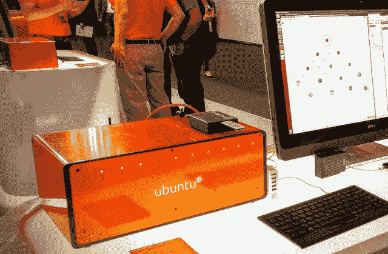
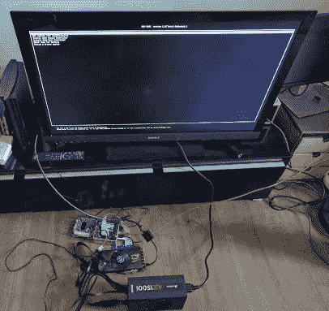
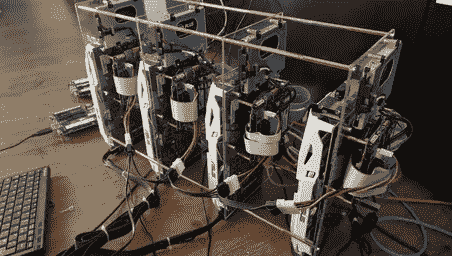
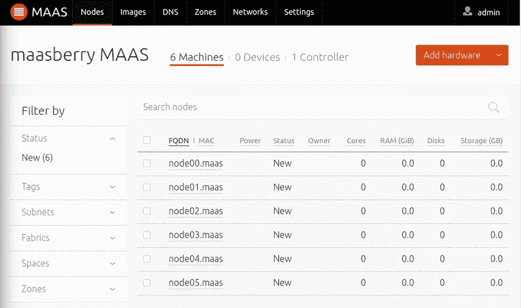
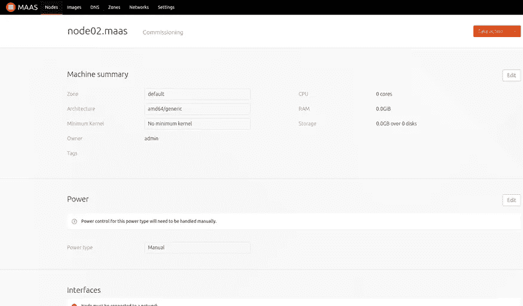
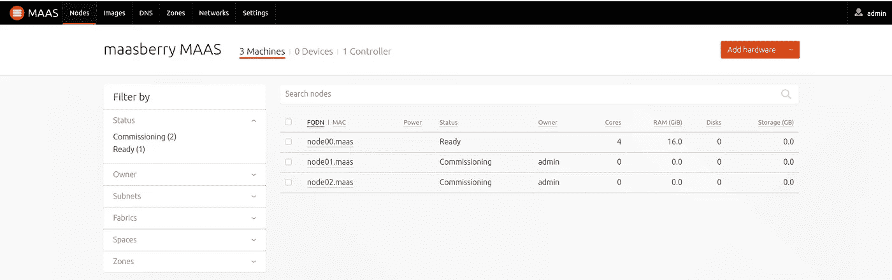
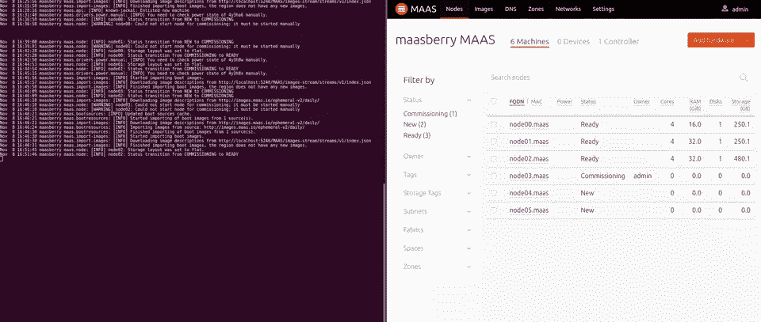
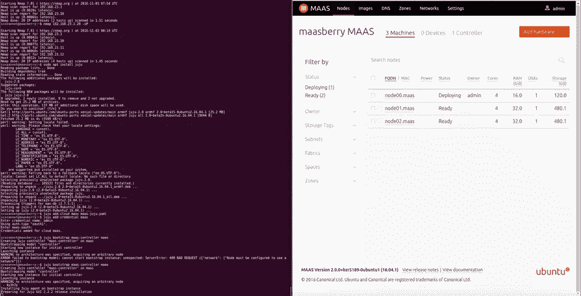
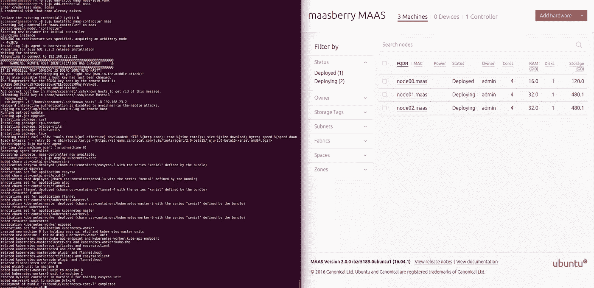
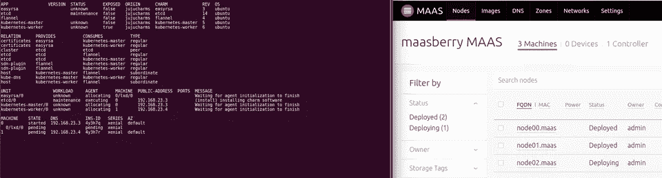

# 为 Kubernetes 安装 DIY 裸机 GPU 集群

> 原文：<https://medium.com/hackernoon/installing-a-diy-bare-metal-gpu-cluster-for-kubernetes-364200254187>

我不知道你是否见过来自 [Canonical](http://www.ubuntu.com) 的橙色盒子



这些机器真的很棒。它们包含 10 个英特尔 nuc，外加第 11 个用于[管理层](https://hackernoon.com/tagged/management)。它们被用作大型软件栈的演示工具，比如 OpenStack、Hadoop，当然还有 Kubernetes。

它们可以从 [TranquilPC](http://cluster.engineering/ubuntu-orangebox-v4-fully-configured/) 免费获得，所以如果你是一个研发团队，或者只是想在家里拥有一个整洁的小集群，我鼓励你去看看。

然而，尽管他们拥有巨大的品质，但他们缺乏深度学习极客所珍视的关键工具:[GPU](https://developer.nvidia.com/cuda-gpus)！！

在这篇博客/教程中，我们将学习如何构建、安装和配置一个使用类似架构的 DIY GPU 集群。我们从硬件选择和实验开始，然后深入研究裸机管理系统 [MAAS](http://maas.io) (金属即服务)。最后，我们看看如何在 Ubuntu 上部署 Kubernetes，添加 CUDA 支持，并在集群中启用它。

# 硬件:为英特尔 NUCs 添加成熟的 GPU？

当你看到它们时，很难说出如何将普通的 GPU 卡插入到英特尔 NUCs 的微小外形中。然而，他们有一个 m2 NGFF 港。这实际上是一个 PCI-e 4x 端口，只是外形不同。

而且，还有把 M.2 转换成 PCI-e 4x 的[这个](https://www.amazon.com/gp/product/B0182NRGYO/ref=pd_sbs_147_4?ie=UTF8&pd_rd_i=B0182NRGYO&pd_rd_r=7132S1GSAF2RZKMY56AA&pd_rd_w=WgCgh&pd_rd_wg=BAWWT&psc=1&refRID=7132S1GSAF2RZKMY56AA)和把 PCI-e 4x 转换成 16x 的[那个](https://www.amazon.com/Express-PCI-E-Female-Riser-Cable/dp/B00CJE0KJ6/ref=sr_1_1?s=pc&ie=UTF8&qid=1478253899&sr=1-1&keywords=pci+4x+to+16x)。

所以…理论上，我们**可以**将 GPU 连接到英特尔 nuc。让我们试试吧！！

# POC:第一节点

让我们从简单的单节点英特尔 NUC 开始，看看我们是否能让 GPU 与之配合工作。

我已经有了一辆上一代的 NUC 和一辆老镭龙 7870，我不得不买了

*   为 GPU 供电的 PSU:为此，我发现 [Corsair AX1500i](http://www.corsair.com/en/ax1500i-digital-atx-power-supply-1500-watt-fully-modular-psu) 是市场上最划算的交易，能够为多达 10 个 GPU 供电！！如果我想用更多的节点来扩展它，这再好不过了。
*   适配器:
    - [M.2 转 PCI-e 4x](https://www.amazon.com/gp/product/B0182NRGYO/ref=pd_sbs_147_4?ie=UTF8&pd_rd_i=B0182NRGYO&pd_rd_r=7132S1GSAF2RZKMY56AA&pd_rd_w=WgCgh&pd_rd_wg=BAWWT&psc=1&refRID=7132S1GSAF2RZKMY56AA)-[转接卡 4x - > 16x](https://www.amazon.com/Express-PCI-E-Female-Riser-Cable/dp/B00CJE0KJ6/ref=sr_1_1?s=pc&ie=UTF8&qid=1478253899&sr=1-1&keywords=pci+4x+to+16x)
*   [黑掉](http://www.instructables.com/id/How-to-power-up-an-ATX-Power-Supply-without-a-PC/)激活 PSU 上的电源，而无需将其连接到“真正的”主板上。感谢 Michael Iatrou (@iatrou)给我指明了方向。
*   很明显是屏幕、键盘、电缆…

把所有东西插在一起，然后…



它还活着！运行速度为 4x 的附加 GPU 的 Ubuntu 启动屏幕

此时，我们已经证明这是可能的，是时候开始构建一个真正的集群了。

# 添加小兄弟

让我们构建一个包含 2 个管理节点和 4 个 GPU 计算人员的 6 节点集群。

## 材料清单

对于每个工人，您需要:

*   [英特尔 NUC6i5RYH](https://www.amazon.es/gp/product/B018Q0GN60/ref=oh_aui_detailpage_o01_s00?ie=UTF8&psc=1) 在性能方面是一个不错的选择，但它没有英特尔 AMT，因此您将无法激活完全自动化的操作。如果您想做一些更接近橙色盒子的事情，实现电源循环的完全自动化，您需要购买较旧的 NUC5i5MYHE，这是唯一一款采用博锐技术的参考产品(除了主板本身)。更多信息[点击此处](http://www.intel.com/content/www/us/en/nuc/nuc-comparison.html)。
*   RAM: [海盗船的 32GB DDR4】](https://www.amazon.es/gp/product/B017UC3O76/ref=oh_aui_detailpage_o02_s00?ie=UTF8&psc=1)
*   固态硬盘: [500GB 闪迪 Ultra II](https://www.amazon.es/gp/product/B00M8ABFX6/ref=oh_aui_detailpage_o02_s00?ie=UTF8&psc=1)
*   显卡: [nVidia GTX1060 6GB](https://www.amazon.es/gp/product/B01IPFN7UQ/ref=oh_aui_detailpage_o06_s00?ie=UTF8&psc=1)
*   适配器:与之前相同，还有 [4x 延长器](https://www.amazon.es/hembra-adaptador-extensi%C3%B3n-cuprof%C3%B3sforo-Flexible/dp/B00UBUCES0/ref=sr_1_cc_2?s=aps&ie=UTF8&qid=1478276213&sr=1-2-catcorr&keywords=pci+4x+extender)

对于管理节点，是上述 nuc 的 2 倍，但没有 GPU，使用更小的 SSD。

现在是整体组件:

*   PSU:海盗船 AX1500i
*   开关[网件 GS108PE](https://www.amazon.es/Netgear-GS108PE-300EUS-ProSAFE-Ethernet-garant%C3%ADa/dp/B00LMXBOG8/ref=sr_1_20?s=computers&ie=UTF8&qid=1478268416&sr=1-20&keywords=8+puertos+gigabit) 。你可以拿一个低端开关，我有一个可用的就是这样。我在网络方面没有做任何稀奇古怪的事情。
*   raspberry Pi:32GB micro SD 的任何 2 或 3 版本
*   间隔器
*   [ATX PSU 开关](https://www.amazon.es/gp/product/B00NB3E2N4/ref=oh_aui_detailpage_o06_s00?ie=UTF8&psc=1)

仅供参考，这是一个昂贵的设置，但 AWS 的 g2 实例的投资回报率约为每个节点 20 天…

## 执行

如果盒子里放不下，就把盒子拿走。所以首先要把 NUC 的主板取出来。使用 3 毫米厚的 PVC 板和垫片，我们可以有一个漂亮的布局。


GPU view

在 PVC 的一侧，我们连接了 GPU，因此电源连接器在底部可见，PCI-e 端口只是稍微高出边缘。孔是 2.8 毫米，以便 M3 垫片通过，但你需要拧他们一点点，他们不会移动。


Intel NUC view

另一方面，我们为 SSD 和 NUC 钻了固定孔，以便 PCI-e riser 电缆在 GPU 的 PCI-e 端口前面对齐。你还需要在固态硬盘的金属支架上钻一点孔。

正如你在图片上看到的，我们把立管放在 PEC 和 NUC 之间，这样看起来更好

我们对每个节点重复操作 4 次。然后使用我们的 50 毫米 M3 六角，我们用 3 个螺丝将它们连接在每个“刀片”之间，将所有东西都预订到网络上，然后…tadaaaaaa！！



Close up view from the NUC side


From the GPU side

# 软件:集群的安装

赋予集群生命需要在软件方面做大量的工作。

我们将利用强大的管理工具，而不是手动流程。这将使我们能够在未来重新规划我们的集群。

管理金属本身的工具是 [MAAS](http://maas.io) (金属即服务)。它是由 Canonical 开发的，用于管理裸机服务器群，并且已经驱动了 Ubuntu Orange Box。

然后为了进行部署，我们将使用 Canonical 的建模工具 [Juju](https://jujucharms.com) ，它有用于部署 Kubernetes 的[规范发行版的包。](https://www.ubuntu.com/cloud/kubernetes)

# 裸机配置:安装 MAAS

首先，我们需要在 Raspberry Pi 2 上安装 MAAS。

对于其余部分，我们将假设您已经准备好:

*   安装了 Ubuntu Server 16.04 的 Raspberry Pi 2 或 3
*   连接到与互联网相连的网络的板载以太网端口，并进行配置
*   额外的 USB 转以太网适配器，连接到我们的集群交换机

## 网络安装程序

默认的 Ubuntu 镜像不会自动安装 USB 适配器。首先，我们将查询 ifconfig 以查看除 eth0 接口之外的 eth1(或其他名称):

```
$ /sbin/ifconfig -a
eth0 Link encap:Ethernet HWaddr b8:27:eb:4e:48:c6 
 inet addr:192.168.1.138 Bcast:192.168.1.255 Mask:255.255.255.0
 inet6 addr: fe80::ba27:ebff:fe4e:48c6/64 Scope:Link
 UP BROADCAST RUNNING MULTICAST MTU:1500 Metric:1
 RX packets:150573 errors:0 dropped:0 overruns:0 frame:0
 TX packets:39702 errors:0 dropped:0 overruns:0 carrier:0
 collisions:0 txqueuelen:1000 
 RX bytes:217430968 (217.4 MB) TX bytes:3450423 (3.4 MB)eth1 Link encap:Ethernet HWaddr 00:0e:c6:c2:e6:82 
 BROADCAST MULTICAST MTU:1500 Metric:1
 RX packets:0 errors:0 dropped:0 overruns:0 frame:0
 TX packets:0 errors:0 dropped:0 overruns:0 carrier:0
 collisions:0 txqueuelen:1000 
 RX bytes:0 (0.0 B) TX bytes:0 (0.0 B)
```

我们现在可以用编辑**/etc/network/interfaces . d/et h1 . CFG**

```
# hwaddress 00:0e:c6:c2:e6:82
auto eth1
iface eth1 inet static
 address 192.168.23.1
 netmask 255.255.255.0
```

然后用以下命令启动 eth1

```
$ sudo ifup eth1
```

现在我们有了第二个接口设置。

## 基础安装

让我们首先安装需求:

```
$ sudo apt update && sudo apt upgrade -yqq
$ sudo apt install -yqq — no-install-recommends \
   maas \
   bzr \
   isc-dhcp-server \
   wakeonlan \
   amtterm \
   wsmancli \
   juju \
   zram-config
```

让我们利用这个机会来修复非常烦人的 Perl Locales bug，它几乎影响了周围的每个 Rapsberry Pi:

```
$ sudo locale-gen en_US.UTF-8
```

现在，让我们激活 zram，通过在 **/etc/rc.local** 中添加以下内容，将我们的 ram 虚拟增加 1GB

```
modprobe zram && \
 echo $((1024*1024*1024)) | tee /sys/block/zram0/disksize && \
 mkswap /dev/zram0 && \
 swapon -p 10 /dev/zram0 && \
 exit 0
```

并通过以下方式立即激活

```
$ sudo modprobe zram && \
 echo $((1024*1024*1024)) | sudo tee /sys/block/zram0/disksize && \
 sudo mkswap /dev/zram0 && \
 sudo swapon -p 10 /dev/zram0
```

## DHCP 配置

DHCP 将由 MAAS 直接处理，所以我们不必处理它。然而，它配置默认设置的方式是相当残酷的，所以你可能想调整一下。下面是一个 **/etc/dhcp/dhcpd.conf** 文件，这个文件可以工作，但是有点花哨

```
authoritative;
ddns-update-style none;
log-facility local7;option subnet-mask 255.255.255.0;
option broadcast-address 192.168.23.255;
option routers 192.168.23.1;
option domain-name-servers 192.168.23.1;
option domain-name “maas”;
default-lease-time 600;
max-lease-time 7200;subnet 192.168.23.0 netmask 255.255.255.0 {
 range 192.168.23.10 192.168.23.49;host node00 {
 hardware ethernet B8:AE:ED:7A:B6:92;
 fixed-address 192.168.23.10;
 }... ...
}
```

我们还需要告诉 dhcpd 只为 eth1 上的请求提供服务，以防止流入我们的其他网络。我们通过编辑**/etc/default/isc-DHCP-server**中的接口选项来做到这一点

```
# On what interfaces should the DHCP server (dhcpd) serve DHCP requests?
# Separate multiple interfaces with spaces, e.g. “eth0 eth1”.
INTERFACES=”eth1"
```

最后，我们用

```
$ sudo systemctl restart isc-dhcp-server.service
```

## 简单的路由器配置

在我们的设置中，Raspberry Pi 是网络的争用点。虽然 MAAS 默认提供 DNS 和 DHCP，但它并不作为网关运行。因此，我们的节点很可能最终看不到互联网，这显然是我们不希望的。

首先，我们在 sysctl 中激活 IP 转发:

```
sudo touch /etc/sysctl.d/99-maas.conf
echo “net.ipv4.ip_forward=1” | sudo tee /etc/sysctl.d/99-maas.conf
sudo sh -c “echo 1 > /proc/sys/net/ipv4/ip_forward”
```

然后，我们需要链接 eth0 和 eth1 接口，以允许它们之间的流量

```
$ sudo iptables -t nat -A POSTROUTING -o eth0 -j MASQUERADE
$ sudo iptables -A FORWARD -i eth0 -o eth1 -m state — state RELATED,ESTABLISHED -j ACCEPT
$ sudo iptables -A FORWARD -i eth1 -o eth0 -j ACCEPT
```

好了，现在我们有流量通过，我们可以通过在局域网接口上插入任何东西并尝试 ping 某个互联网网站来测试流量。

我们保存它是为了让它在重启后仍然存在

```
sudo sh -c “iptables-save > /etc/iptables.ipv4.nat”
```

并将这一行添加到/etc/network/interfaces . d/et h1 . conf 中

```
up iptables-restore < /etc/iptables.ipv4.nat
```

# 配置 MAAS

## 先决条件

首先创建您的管理用户:

```
$ sudo maas createadmin — username=admin — [email=it@madeden.com](mailto:email=it@madeden.com)
```

然后，让我们访问我们的 API 密钥，并从 CLI 登录:

```
$ sudo maas-region apikey — username=admin
```

有了这个命令的结果，只要做:

```
$ # maas login <profile-name> <hostname> <key>
$ maas login admin [http://localhost/MAAS/api/2.0](http://localhost/MAAS/api/2.0) <key>
```

或者你可以只输入一个命令:

```
$ sudo maas-region apikey — username=admin | \
 maas login admin [http://localhost/MAAS/api/2.0](http://localhost/MAAS/api/2.0) -
```

现在，通过 GUI，在网络选项卡中，我们重命名我们的**结构**，以匹配 LAN、WAN 和 WLAN。

然后我们进入局域网，通过**采取行动**按钮，我们在上面启用 DHCP。

我们唯一要做的就是启动节点一次。它们将由 MAAS 直接处理，并在几分钟后出现在 GUI 中。

它们将有一个随机的名称，没有任何配置。

首先，我们将重新命名它们。为了方便起见，在我们的实验中，我们将使用 node00 和 node01 作为第一个非 gpu 节点，然后 node02 到 04 作为 GPU 节点。

命名后，我们还将

*标记它们**仅 gpu * *用于 2 个第一管理节点
*标记它们**gpu**用于 4 个工作节点。
*将电源方式设置为**手动* *

然后我们有类似的东西



## 调试节点

这就是乐趣的开始。我们需要“委托节点”，换句话说，记录关于它们的信息(硬盘驱动器，CPU 计数…)

MAAS 中有一个 [bug](https://bugs.launchpad.net/maas/+bug/1604962) 阻碍了系统的部署。查看注释#14，并通过编辑**/etc/Maas/preseeds/curtin _ user data**来应用它。在重新启动部分添加一个延迟，使其看起来像:

```
power_state:
 mode: reboot
 delay: 30
```

然后，我们通过**采取行动**按钮进行调试，并选择**调试**，并取消选中所有其他 3 个选项。在此之后，我们手动为每个节点通电，MAAS 将完成剩下的工作，包括在流程结束时关闭它们。用户界面将看起来像这样:



MAAS commissioning nodes



MAAS from New To Commissioned

当调试成功时，我们会看到 HDD 大小、nb 内核和已填充内存的所有值，并且节点也变为**就绪**



MAAS Logs at commissiionning

# 使用 Juju 部署

## 引导环境

我们首先要做的是把 Juju 和 MAAS 联系起来。我们为作为提供者的 MAAS 创建一个配置文件 **maas-juju.yaml** ，内容为:

```
maas:
 type: maas
 auth-types: [oauth1]
 endpoint: http://<MAAS_IP>/MAAS
```

将 MAAS_IP 地址理解为 Juju 与 MAAS 交互的地址，包括部署的节点。因此，您可以在我们的设置中使用 eth1 (192.168.23.1)

你可以在[这一页](https://jujucharms.com/docs/devel/clouds-maas)找到更多细节

然后我们需要告诉 Juju 使用 MAAS:

```
$ juju add-cloud maas maas-juju.yaml
$ juju add-credential maas
```

Juju 需要**引导**启动第一个控制节点，该节点将托管 Juju 控制器、初始数据库和各种其他需求。这个节点是我们有两个管理节点的原因。第二个会是我们的 k8s 主。

在我们的设置中，我们的节点只有手动电源，因为 2.0 版的 MAAS 中删除了 WoL。这意味着我们需要触发引导，等待分配节点，然后手动启动它。

```
$ juju bootstrap maas-controller maas
Creating Juju controller “maas-controller” on maas
Bootstrapping model “controller”
Starting new instance for initial controller
Launching instance # This is where we start the node manually
WARNING no architecture was specified, acquiring an arbitrary node
 — 4y3h8w
Installing Juju agent on bootstrap instance
Preparing for Juju GUI 2.2.2 release installation
Waiting for address
Attempting to connect to 192.168.23.2:22
Logging to /var/log/cloud-init-output.log on remote host
Running apt-get update
Running apt-get upgrade
Installing package: curl
Installing package: cpu-checker
Installing package: bridge-utils
Installing package: cloud-utils
Installing package: tmux
Fetching tools: curl -sSfw ‘tools from %{url_effective} downloaded: HTTP %{http_code}; time %{time_total}s; size %{size_download} bytes; speed %{speed_download} bytes/s ‘ — retry 10 -o $bin/tools.tar.gz <[[https://streams.canonical.com/juju/tools/agent/2.0-beta15/juju-2.0-beta15-xenial-amd64.tgz](https://streams.canonical.com/juju/tools/agent/2.0-beta15/juju-2.0-beta15-xenial-amd64.tgz)]>
Bootstrapping Juju machine agent
Starting Juju machine agent (jujud-machine-0)
Bootstrap agent installed
Bootstrap complete, maas-controller now available.
```

和 MAAS GUI:



## 初始捆绑包部署

我们部署下面的包文件 **k8s.yaml** :

```
series: xenial
services:
 “kubernetes-master”:
 charm: “cs:~containers/kubernetes-master-6”
 num_units: 1
 to:
 — “0”
 expose: true
 annotations:
 “gui-x”: “800”
 “gui-y”: “850”
 constraints: tags=cpu-only
 flannel:
 charm: “cs:~containers/flannel-5”
 annotations:
 “gui-x”: “450”
 “gui-y”: “750”
 easyrsa:
 charm: “cs:~containers/easyrsa-3”
 num_units: 1
 to:
 — “0”
 annotations:
 “gui-x”: “450”
 “gui-y”: “550”
 “kubernetes-worker”:
 charm: “cs:~containers/kubernetes-worker-8”
 num_units: 1
 to:
 — “1”
 expose: true
 annotations:
 “gui-x”: “100”
 “gui-y”: “850”
 constraints: tags=gpu
 etcd:
 charm: “cs:~containers/etcd-14”
 num_units: 1
 to:
 — “0”
 annotations:
 “gui-x”: “800”
 “gui-y”: “550”
relations:
 — — “kubernetes-master:kube-api-endpoint”
 — “kubernetes-worker:kube-api-endpoint”
 — — “kubernetes-master:cluster-dns”
 — “kubernetes-worker:kube-dns”
 — — “kubernetes-master:certificates”
 — “easyrsa:client”
 — — “kubernetes-master:etcd”
 — “etcd:db”
 — — “kubernetes-master:sdn-plugin”
 — “flannel:host”
 — — “kubernetes-worker:certificates”
 — “easyrsa:client”
 — — “kubernetes-worker:sdn-plugin”
 — “flannel:host”
 — — “flannel:etcd”
 — “etcd:db”
machines:
 “0”:
 series: xenial
 “1”:
 series: xenial
```

我们可以看到，我们对节点进行了约束，强制 MAAS 为工作节点选择 GPU 节点，为主节点选择 CPU 节点。我们传递命令

```
$ juju deploy k8s.yaml
```

就是这样。这是让 k8s 正常运行所需的唯一命令！

```
added charm cs:~containers/easyrsa-3
application easyrsa deployed (charm cs:~containers/easyrsa-3 with the series “xenial” defined by the bundle)
added resource easyrsa
annotations set for application easyrsa
added charm cs:~containers/etcd-14
application etcd deployed (charm cs:~containers/etcd-14 with the series “xenial” defined by the bundle)
annotations set for application etcd
added charm cs:~containers/flannel-5
application flannel deployed (charm cs:~containers/flannel-5 with the series “xenial” defined by the bundle)
added resource flannel
annotations set for application flannel
added charm cs:~containers/kubernetes-master-6
application kubernetes-master deployed (charm cs:~containers/kubernetes-master-6 with the series “xenial” defined by the bundle)
added resource kubernetes
application kubernetes-master exposed
annotations set for application kubernetes-master
added charm cs:~containers/kubernetes-worker-8
application kubernetes-worker deployed (charm cs:~containers/kubernetes-worker-8 with the series “xenial” defined by the bundle)
added resource kubernetes
application kubernetes-worker exposed
annotations set for application kubernetes-worker
created new machine 0 for holding easyrsa, etcd and kubernetes-master units
created new machine 1 for holding kubernetes-worker unit
related kubernetes-master:kube-api-endpoint and kubernetes-worker:kube-api-endpoint
related kubernetes-master:cluster-dns and kubernetes-worker:kube-dns
related kubernetes-master:certificates and easyrsa:client
related kubernetes-master:etcd and etcd:db
related kubernetes-master:sdn-plugin and flannel:host
related kubernetes-worker:certificates and easyrsa:client
related kubernetes-worker:sdn-plugin and flannel:host
related flannel:etcd and etcd:db
added easyrsa/0 unit to machine 0
added etcd/0 unit to machine 0
added kubernetes-master/0 unit to machine 0
added kubernetes-worker/0 unit to machine 1
deployment of bundle “k8s.yaml” completed
```

在 GUI 中翻译为:



```
$ juju status
MODEL CONTROLLER CLOUD/REGION VERSION
default maas-controller maas 2.0-beta15APP VERSION STATUS EXPOSED ORIGIN CHARM REV OS
easyrsa 3.0.1 active false jujucharms easyrsa 3 ubuntu
etcd 2.2.5 active false jujucharms etcd 14 ubuntu
flannel 0.6.1 false jujucharms flannel 5 ubuntu
kubernetes-master 1.4.5 active true jujucharms kubernetes-master 6 ubuntu
kubernetes-worker active true jujucharms kubernetes-worker 8 ubuntuRELATION PROVIDES CONSUMES TYPE
certificates easyrsa kubernetes-master regular
certificates easyrsa kubernetes-worker regular
cluster etcd etcd peer
etcd etcd flannel regular
etcd etcd kubernetes-master regular
sdn-plugin flannel kubernetes-master regular
sdn-plugin flannel kubernetes-worker regular
host kubernetes-master flannel subordinate
kube-dns kubernetes-master kubernetes-worker regular
host kubernetes-worker flannel subordinateUNIT WORKLOAD AGENT MACHINE PUBLIC-ADDRESS PORTS MESSAGE
easyrsa/0 active idle 0 192.168.23.3 Certificate Authority connected.
etcd/0 active idle 0 192.168.23.3 2379/tcp Healthy with 1 known peers. (leader)
kubernetes-master/0 active idle 0 192.168.23.3 6443/tcp Kubernetes master running.
 flannel/0 active idle 192.168.23.3 Flannel subnet 10.1.57.1/24
kubernetes-worker/0 active idle 1 192.168.23.4 80/tcp,443/tcp Kubernetes worker running.
 flannel/1 active idle 192.168.23.4 Flannel subnet 10.1.67.1/24
kubernetes-worker/1 active executing 2 192.168.23.5 (install) Container runtime available.
kubernetes-worker/2 unknown allocating 3 192.168.23.7 Waiting for agent initialization to finish
kubernetes-worker/3 unknown allocating 4 192.168.23.6 Waiting for agent initialization to finishMACHINE STATE DNS INS-ID SERIES AZ
0 started 192.168.23.3 4y3h8x xenial default
1 started 192.168.23.4 4y3h8y xenial default
2 started 192.168.23.5 4y3ha3 xenial default
3 pending 192.168.23.7 4y3ha6 xenial default
4 pending 192.168.23.6 4y3ha4 xenial default
```

或者



在流程结束时，我们有:

```
$ juju status
MODEL CONTROLLER CLOUD/REGION VERSION
default maas-controller maas 2.0-beta15APP VERSION STATUS EXPOSED ORIGIN CHARM REV OS
cuda false local cuda 0 ubuntu
easyrsa 3.0.1 active false jujucharms easyrsa 3 ubuntu
etcd 2.2.5 active false jujucharms etcd 14 ubuntu
flannel 0.6.1 false jujucharms flannel 5 ubuntu
kubernetes-master 1.4.5 active true jujucharms kubernetes-master 6 ubuntu
kubernetes-worker 1.4.5 active true jujucharms kubernetes-worker 8 ubuntuRELATION PROVIDES CONSUMES TYPE
certificates easyrsa kubernetes-master regular
certificates easyrsa kubernetes-worker regular
cluster etcd etcd peer
etcd etcd flannel regular
etcd etcd kubernetes-master regular
sdn-plugin flannel kubernetes-master regular
sdn-plugin flannel kubernetes-worker regular
host kubernetes-master flannel subordinate
kube-dns kubernetes-master kubernetes-worker regular
host kubernetes-worker flannel subordinateUNIT WORKLOAD AGENT MACHINE PUBLIC-ADDRESS PORTS MESSAGE
easyrsa/0 active idle 0 192.168.23.3 Certificate Authority connected.
etcd/0 active idle 0 192.168.23.3 2379/tcp Healthy with 1 known peers. (leader)
kubernetes-master/0 active idle 0 192.168.23.3 6443/tcp Kubernetes master running.
 flannel/0 active idle 192.168.23.3 Flannel subnet 10.1.57.1/24
kubernetes-worker/0 active idle 1 192.168.23.4 80/tcp,443/tcp Kubernetes worker running.
 flannel/1 active idle 192.168.23.4 Flannel subnet 10.1.67.1/24
kubernetes-worker/1 active idle 2 192.168.23.5 80/tcp,443/tcp Kubernetes worker running.
 flannel/2 active idle 192.168.23.5 Flannel subnet 10.1.100.1/24
kubernetes-worker/2 active idle 3 192.168.23.7 80/tcp,443/tcp Kubernetes worker running.
 flannel/3 active idle 192.168.23.7 Flannel subnet 10.1.14.1/24
kubernetes-worker/3 active idle 4 192.168.23.6 80/tcp,443/tcp Kubernetes worker running.
 flannel/4 active idle 192.168.23.6 Flannel subnet 10.1.83.1/24MACHINE STATE DNS INS-ID SERIES AZ
0 started 192.168.23.3 4y3h8x xenial default
1 started 192.168.23.4 4y3h8y xenial default
2 started 192.168.23.5 4y3ha3 xenial default
3 started 192.168.23.7 4y3ha6 xenial default
4 started 192.168.23.6 4y3ha4 xenial default
```

我们现在需要 kubectl 来查询集群。我们需要把这个 k8s 问题和 Hypriot OS 的方法联系起来

```
$ curl -s [https://packages.cloud.google.com/apt/doc/apt-key.gpg](https://packages.cloud.google.com/apt/doc/apt-key.gpg) | apt-key add -
$ cat <<EOF > /etc/apt/sources.list.d/kubernetes.list
deb [http://apt.kubernetes.io/](http://apt.kubernetes.io/) kubernetes-xenial main
EOF
$ apt-get update
$ apt-get install -y kubectl$ kubectl get nodes — show-labels
NAME STATUS AGE LABELS
node02 Ready 1h beta.kubernetes.io/arch=amd64,beta.kubernetes.io/os=linux,kubernetes.io/hostname=node02
node03 Ready 1h beta.kubernetes.io/arch=amd64,beta.kubernetes.io/os=linux,kubernetes.io/hostname=node03
node04 Ready 57m beta.kubernetes.io/arch=amd64,beta.kubernetes.io/os=linux,kubernetes.io/hostname=node04
node05 Ready 58m beta.kubernetes.io/arch=amd64,beta.kubernetes.io/os=linux,kubernetes.io/hostname=node05
```

## 添加 CUDA

CUDA 还没有正式的魅力，所以我写了一个 hacky bash 脚本让它工作，你可以在 [GitHub](https://github.com/SaMnCo/layer-nvidia-cuda) 上找到

要建立魅力，你需要一台 x86 计算机，而不是 Rpi。你将需要 juju，魅力和魅力工具安装在那里，然后运行

```
$ export JUJU_REPOSITORY=${HOME}/charms
$ export LAYER_PATH=${JUJU_REPOSITORY}/layers
$ export INTERFACE_PATH=${JUJU_REPOSITORY}/interfaces$ cd ${LAYER_PATH}
$ git clone [https://github.com/SaMnCo/layer-nvidia-cuda](https://github.com/SaMnCo/layer-nvidia-cuda) cuda
$ cd juju-layer-cuda
$ charm build
```

这将在 JUJU_REPOSITORY 中创建一个名为 **builds** 的新文件夹，并在那里创建另一个名为 cuda 的文件夹。只需将它 scp 到你家 **charms** 子文件夹中的树莓 Pi 中。

```
$ scp ${JUJU_REPOSITORY}/builds/cuda ${USER}[@raspberrypi](http://twitter.com/raspberrypi):/home/${USER}/charms/cuda
$ git clone [https://github.com/SaMnCo/layer-nvidia-cuda](https://github.com/SaMnCo/layer-nvidia-cuda) cuda
$ cd juju-layer-cuda
$ charm build
```

来展示我们刚刚创造的魅力，

```
$ juju deploy — series xenial $HOME/charms/cuda
$ juju add-relation cuda kubernetes-worker
```

这将需要一些时间(CUDA 下载千兆字节的代码和二进制文件…)，但最终我们会

```
$ juju status
MODEL CONTROLLER CLOUD/REGION VERSION
default maas-controller maas 2.0-beta15APP VERSION STATUS EXPOSED ORIGIN CHARM REV OS
cuda false local cuda 0 ubuntu
easyrsa 3.0.1 active false jujucharms easyrsa 3 ubuntu
etcd 2.2.5 active false jujucharms etcd 14 ubuntu
flannel 0.6.1 false jujucharms flannel 5 ubuntu
kubernetes-master 1.4.5 active true jujucharms kubernetes-master 6 ubuntu
kubernetes-worker 1.4.5 active true jujucharms kubernetes-worker 8 ubuntuRELATION PROVIDES CONSUMES TYPE
juju-info cuda kubernetes-worker regular
certificates easyrsa kubernetes-master regular
certificates easyrsa kubernetes-worker regular
cluster etcd etcd peer
etcd etcd flannel regular
etcd etcd kubernetes-master regular
sdn-plugin flannel kubernetes-master regular
sdn-plugin flannel kubernetes-worker regular
host kubernetes-master flannel subordinate
kube-dns kubernetes-master kubernetes-worker regular
juju-info kubernetes-worker cuda subordinate
host kubernetes-worker flannel subordinateUNIT WORKLOAD AGENT MACHINE PUBLIC-ADDRESS PORTS MESSAGE
easyrsa/0 active idle 0 192.168.23.3 Certificate Authority connected.
etcd/0 active idle 0 192.168.23.3 2379/tcp Healthy with 1 known peers. (leader)
kubernetes-master/0 active idle 0 192.168.23.3 6443/tcp Kubernetes master running.
 flannel/0 active idle 192.168.23.3 Flannel subnet 10.1.57.1/24
kubernetes-worker/0 active idle 1 192.168.23.4 80/tcp,443/tcp Kubernetes worker running.
 cuda/2 active idle 192.168.23.4 CUDA installed and available
 flannel/1 active idle 192.168.23.4 Flannel subnet 10.1.67.1/24
kubernetes-worker/1 active idle 2 192.168.23.5 80/tcp,443/tcp Kubernetes worker running.
 cuda/0 active idle 192.168.23.5 CUDA installed and available
 flannel/2 active idle 192.168.23.5 Flannel subnet 10.1.100.1/24
kubernetes-worker/2 active idle 3 192.168.23.7 80/tcp,443/tcp Kubernetes worker running.
 cuda/3 active idle 192.168.23.7 CUDA installed and available
 flannel/3 active idle 192.168.23.7 Flannel subnet 10.1.14.1/24
kubernetes-worker/3 active idle 4 192.168.23.6 80/tcp,443/tcp Kubernetes worker running.
 cuda/1 active idle 192.168.23.6 CUDA installed and available
 flannel/4 active idle 192.168.23.6 Flannel subnet 10.1.83.1/24MACHINE STATE DNS INS-ID SERIES AZ
0 started 192.168.23.3 4y3h8x xenial default
1 started 192.168.23.4 4y3h8y xenial default
2 started 192.168.23.5 4y3ha3 xenial default
3 started 192.168.23.7 4y3ha6 xenial default
4 started 192.168.23.6 4y3ha4 xenial default
```

太棒了，我们现在有了 **CUDERNETES** ！

我们可以在每个 GPU 节点上单独连接并运行

```
$ sudo nvidia-smi 
Wed Nov 9 06:06:44 2016 
+ — — — — — — — — — — — — — — — — — — — — — — — — — — — — — — — — — — — — — — -+
| NVIDIA-SMI 367.57 Driver Version: 367.57 |
| — — — — — — — — — — — — — — — -+ — — — — — — — — — — — + — — — — — — — — — — — +
| GPU Name Persistence-M| Bus-Id Disp.A | Volatile Uncorr. ECC |
| Fan Temp Perf Pwr:Usage/Cap| Memory-Usage | GPU-Util Compute M. |
|===============================+======================+======================|
| 0 GeForce GTX 106… Off | 0000:02:00.0 Off | N/A |
| 28% 31C P0 27W / 120W | 0MiB / 6072MiB | 0% Default |
+ — — — — — — — — — — — — — — — -+ — — — — — — — — — — — + — — — — — — — — — — — +

+ — — — — — — — — — — — — — — — — — — — — — — — — — — — — — — — — — — — — — — -+
| Processes: GPU Memory |
| GPU PID Type Process name Usage |
|=============================================================================|
| No running processes found |
+ — — — — — — — — — — — — — — — — — — — — — — — — — — — — — — — — — — — — — — -+
```

干得好！！

# 在 Kubernetes 中启用 CUDA

默认情况下，当在 workers 上启动 API 服务器和 Kubelet 时，CDK 不会激活 GPU。我们需要手动完成这项工作(尽管这在路线图上)

## 主更新

在主节点上，更新**/etc/default/kube-API server**以添加:

```
# Security Context
KUBE_ALLOW_PRIV=” — allow-privileged=true”
```

然后通过以下方式重新启动 API 服务

```
$ sudo systemctl restart kube-apiserver
```

所以现在 Kube API 将接受运行特权容器的请求，这是 GPU 工作负载所需要的。

## 工作节点

在每个 worker 上， **/etc/default/kubelet** 来添加 GPU 标签，所以看起来像:

```
# Security Context
KUBE_ALLOW_PRIV=” — allow-privileged=true”# Add your own!
KUBELET_ARGS=” — experimental-nvidia-gpus=1 — require-kubeconfig — kubeconfig=/srv/kubernetes/config — cluster-dns=10.1.0.10 — cluster-domain=cluster.local”
```

然后通过以下方式重新启动服务

```
$ sudo systemctl restart kubelet
```

# 测试设置

现在我们已经在 k8s 中启用了 CUDA GPUs，让我们测试一下是否一切正常。我们采取了一个非常简单的工作，只是从一个 pod 运行 nvidia-smi，并在成功时退出。

工作定义是

```
apiVersion: batch/v1
kind: Job
metadata:
 name: nvidia-smi
 labels:
 name: nvidia-smi
spec:
 template:
 metadata:
 labels:
 name: nvidia-smi
 spec:
 containers:
 — name: nvidia-smi
 image: nvidia/cuda
 command: [ “nvidia-smi” ]
 imagePullPolicy: IfNotPresent
 securityContext:
 privileged: true
 resources:
 requests:
 alpha.kubernetes.io/nvidia-gpu: 1 
 limits:
 alpha.kubernetes.io/nvidia-gpu: 1 
 volumeMounts:
 — mountPath: /dev/nvidia0
 name: nvidia0
 — mountPath: /dev/nvidiactl
 name: nvidiactl
 — mountPath: /dev/nvidia-uvm
 name: nvidia-uvm
 — mountPath: /usr/local/nvidia/bin
 name: bin
 — mountPath: /usr/lib/nvidia
 name: lib
 volumes:
 — name: nvidia0
 hostPath: 
 path: /dev/nvidia0
 — name: nvidiactl
 hostPath: 
 path: /dev/nvidiactl
 — name: nvidia-uvm
 hostPath: 
 path: /dev/nvidia-uvm
 — name: bin
 hostPath: 
 path: /usr/lib/nvidia-367/bin
 — name: lib
 hostPath: 
 path: /usr/lib/nvidia-367
 restartPolicy: Never
```

有趣的是

*   我们没有 nvidia-docker 提供的抽象，所以我们必须手动指定 char 设备的挂载点
*   我们还需要共享驱动程序和 libs 文件夹
*   在资源中，我们必须用 1 个 GPU 来请求和限制资源
*   容器必须在特权下运行

如果我们运行这个:

```
$ kubectl create -f nvidia-smi-job.yaml
$ # Wait for a few seconds so the cluster can download and run the container
$ kubectl get pods -a -o wide
NAME READY STATUS RESTARTS AGE IP NODE
default-http-backend-8lyre 1/1 Running 0 11h 10.1.67.2 node02
nginx-ingress-controller-bjplg 1/1 Running 1 10h 10.1.83.2 node04
nginx-ingress-controller-etalt 0/1 Pending 0 6m <none> 
nginx-ingress-controller-q2eiz 1/1 Running 0 10h 10.1.14.2 node05
nginx-ingress-controller-ulsbp 1/1 Running 0 11h 10.1.67.3 node02
nvidia-smi-xjl6y 0/1 Completed 0 5m 10.1.14.3 node05
```

我们看到最后一个容器已经运行并完成。让我们看看运行的输出

```
$ kubectl logs nvidia-smi-xjl6y
Wed Nov 9 07:52:42 2016 
+ — — — — — — — — — — — — — — — — — — — — — — — — — — — — — — — — — — — — — — -+
| NVIDIA-SMI 367.57 Driver Version: 367.57 |
| — — — — — — — — — — — — — — — -+ — — — — — — — — — — — + — — — — — — — — — — — +
| GPU Name Persistence-M| Bus-Id Disp.A | Volatile Uncorr. ECC |
| Fan Temp Perf Pwr:Usage/Cap| Memory-Usage | GPU-Util Compute M. |
|===============================+======================+======================|
| 0 GeForce GTX 106… Off | 0000:02:00.0 Off | N/A |
| 28% 33C P0 29W / 120W | 0MiB / 6072MiB | 0% Default |
+ — — — — — — — — — — — — — — — -+ — — — — — — — — — — — + — — — — — — — — — — — +

+ — — — — — — — — — — — — — — — — — — — — — — — — — — — — — — — — — — — — — — -+
| Processes: GPU Memory |
| GPU PID Type Process name Usage |
|=============================================================================|
| No running processes found |
+ — — — — — — — — — — — — — — — — — — — — — — — — — — — — — — — — — — — — — — -+
```

完美，我们有相同的结果，就像我们从主机上运行 nvidia-smi 一样，这意味着我们都很好地操作 GPU！

# 结论

那么，我们在这里取得了什么成就呢？Kubernetes 是最通用的集装箱管理系统。它还与 Tensorflow 共享一些基因，tensor flow 本身经常以向外扩展的方式演示为容器。

通过大规模添加 GPU 来加快深度学习工作量是很自然的事情。这个穷人 GPU 集群是一个例子，说明了如果 R&D 的一个小团队想要尝试多节点可扩展性，他们可以做些什么。

我们还有第二个好处。你注意到 k8s 的部署在这里是完全自动化的(除了 GPU 包含)，这要感谢 Juju 和 CDK 背后的团队。嗯，Juju 背后的社区创造了许多魅力，并且有大量可以大规模部署的横向扩展应用程序，如 Hadoop、Kafka、Spark、Elasticsearch (…)。

最终，投资只是 MAAS 和几个命令。Juju 在 R&D 的投资回报率是几天的事。

# 谢谢

非常感谢 Canonical 的 Marco Ceppi、Chuck Butler 和 Matt Bruzek 对 CDK 的出色工作，以及对我(众多)问题的回应。

[](http://bit.ly/HackernoonFB)[](https://goo.gl/k7XYbx)[](https://goo.gl/4ofytp)

> [黑客中午](http://bit.ly/Hackernoon)是黑客如何开始他们的下午。我们是 [@AMI](http://bit.ly/atAMIatAMI) 家庭的一员。我们现在[接受投稿](http://bit.ly/hackernoonsubmission)，并乐意[讨论广告&赞助](mailto:partners@amipublications.com)机会。
> 
> 如果你喜欢这个故事，我们推荐你阅读我们的[最新科技故事](http://bit.ly/hackernoonlatestt)和[趋势科技故事](https://hackernoon.com/trending)。直到下一次，不要把世界的现实想当然！

