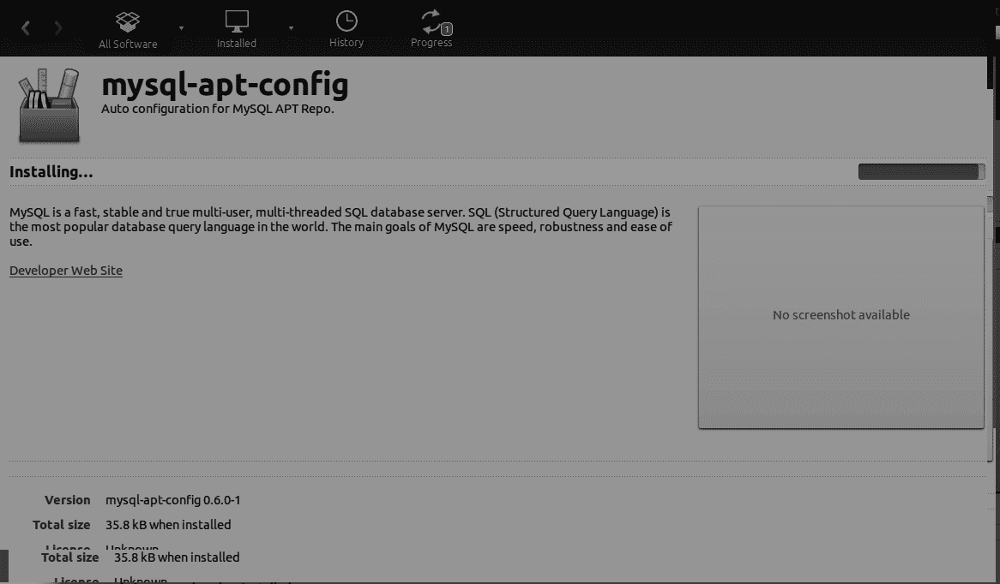
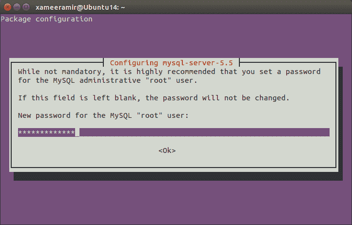
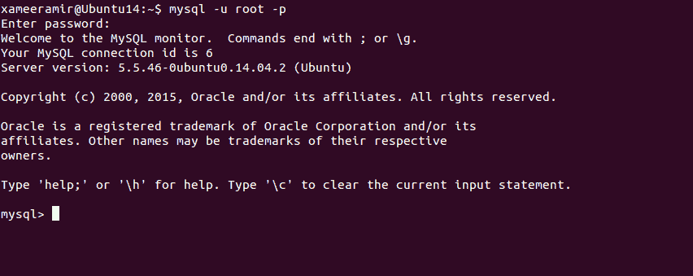
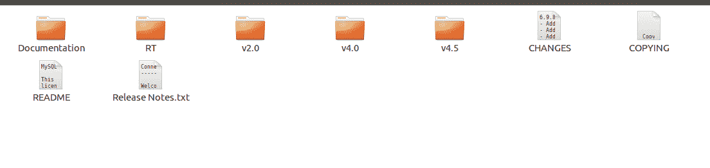
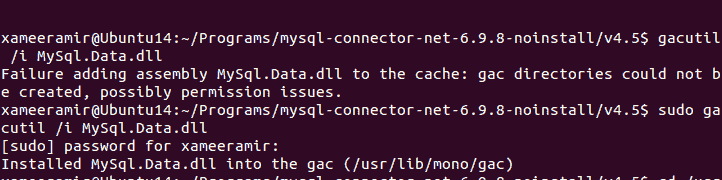
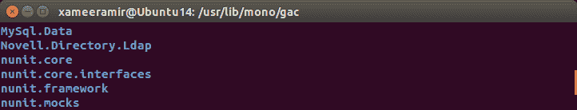

# 在 Ubuntu linux 上安装 Mysql

> 原文：<https://medium.com/hackernoon/installing-mysql-on-ubuntu-linux-86e9b9db1a52>

[SQL server](http://www.microsoft.com/sqlserver/) 被认为是[的最佳数据库。网](https://www.microsoft.com/net)上[窗口](https://www.microsoft.com/en-in/windows)。在我*个人* [意见](https://hackernoon.com/tagged/opinion)中，与 [Mono](http://www.mono-project.com/) 类比的是 [MySql](https://www.mysql.com/) 。

在这篇文章中，我们将看到如何设置它，它是 Ubuntu 上的[连接器](https://www.mysql.com/products/connector/)。

我试着做一些 Mysql 来支持一个需要它并能在 T21 上运行的项目。NET 在 Ubuntu linux 上。努力让所有东西都离开[窗口](https://www.microsoft.com/en-in/windows)。

在此过程中，[软件中心](https://apps.ubuntu.com/cat/applications/software-center/)有些发热:

最初，我尝试了 APT 的[工作台](https://www.mysql.com/products/workbench/)和 [Mysql 的单独安装。然而，由于我不是 100%确定(和上面的月蚀)，我只是](https://dev.mysql.com/downloads/repo/apt/)[清除](http://askubuntu.com/q/151941/219603)一切，并遵循[确定](http://askubuntu.com/a/323715/219603)的方式。

使用命令`sudo apt-get install mysql-server`安装 mysql 服务器

给了密码(*[*忘记了*](http://stackoverflow.com/a/5683179/2404470) ):*

****

*使用`sudo apt-get install mysql-client`设置[终端](http://askubuntu.com/a/183777/219603)客户端，可以使用命令`mysql -u root -p`访问为[根](http://askubuntu.com/a/548703/219603)*

**

*和/或使用`sudo apt-get install mysql-workbench`从[用户界面](https://www.mysql.com/products/workbench/)*

**

# *设置 Mysql 连接器*

*点击[此处](http://dev.mysql.com/downloads/connector/net/)下载连接器。选择`.NET & Mono`平台，启动下载过程。*

*提取下载的文件，并将其移动到您的首选目录。*

*目录的内部视图如下所示:*

**

*使用`ls`命令将`cd`移动到目录中，并确保`MySql.Data.dll`确实存在。我去了`v4.5`以确保我有所有的新补丁。*

*使用命令`sudo gacutil /i MySql.Data.dll`将其注册到全局汇编缓存(GAC)*

**

*要确认注册:*

*   *使用命令`cd /usr/lib/mono/gac`转到目录`/usr/lib/mono/gac`*
*   *使用命令`ls`列出其内容*

*如果注册成功，您会发现`MySql.Data`。*

**

*我试着按照[官方安装说明](https://dev.mysql.com/doc/connector-net/en/connector-net-installation-unix.html)安装，但是[没有发现它很完美](http://stackoverflow.com/questions/34357752/how-to-identify-javascript-undeletable-properties#comment56457971_34357842)，上面的步骤是在 64 位 Ubuntu 14.6 上试的。*

*[照片](https://goo.gl/photos/A3gzYoWUq2LDBq2Q9)*

**最初发布于*[*xameeramir . github . io*](http://xameeramir.github.io/install-mysql-ubuntu-linux/)*。**