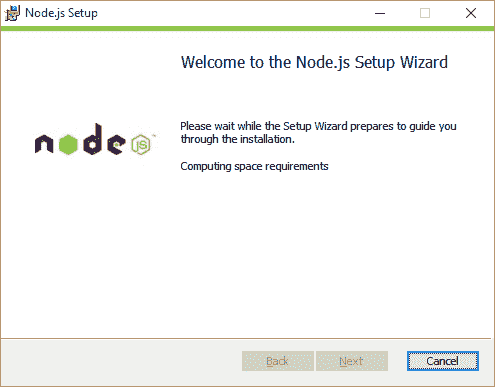
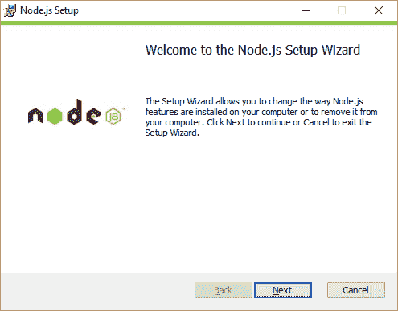
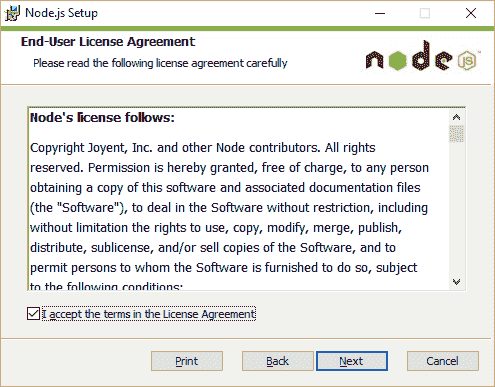
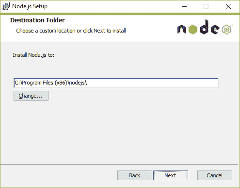
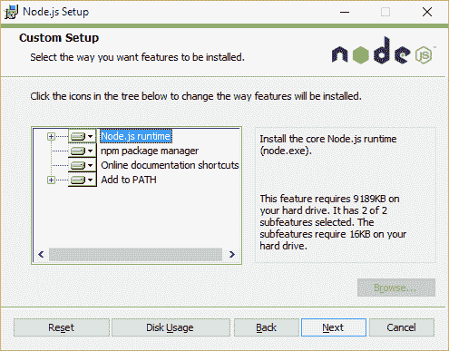
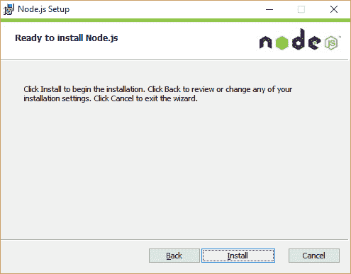
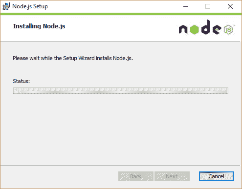
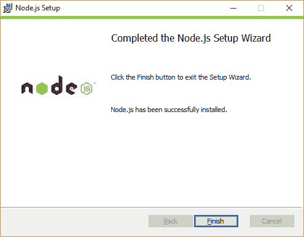

# 在 Windows 和 Ubuntu 上安装 node.js

> 原文：<https://medium.com/hackernoon/installing-node-js-on-windows-and-ubuntu-d5707ace435b>


[礼遇](https://nodejs.org/en/about/resources/)

为了让[获得](http://ionicframework.com/docs/guide/installation.html)最新的 [Apache conrdova](http://cordova.apache.org/) ，需要确保 [node.js](http://nodejs.org/) (和 [npm](https://www.npmjs.com/) )存在。

从[http://nodejs.org/](http://nodejs.org/)下载最新 [node.js](https://hackernoon.com/tagged/nodejs)

打开下载的安装文件后，按照以下步骤操作:

让安装程序计算所需的空间。



因此，如果我们需要空间:



选择安装节点的目标



选择要安装的节点组件—这可能对服务器配置有用



在 [Ubuntu](https://hackernoon.com/tagged/ubuntu) 上安装 node 有多种方式，其中一种是[编译安装](https://thomashunter.name/blog/install-node-js-on-debian-6/)

一行一行地使用下面的命令

```
$ sudo apt-get install build-essential $ wget http://nodejs.org/dist/v0.8.16/node-v0.8.16.tar.gz $ tar -xzf node-v0.8.16.tar.gz $ cd node-v0.8.16/ $ ./configure $ make $ sudo make install
```

要验证安装，请执行以下操作:

```
$ node -v v0.8.16 $ npm -v 1.1.69
```

对，就是这样。任务完成了！

[照片](https://goo.gl/photos/2tKMDYrptwJKJZFN8)

*原载于*[*xameeramir . github . io*](http://xameeramir.github.io/install-node/)*。*