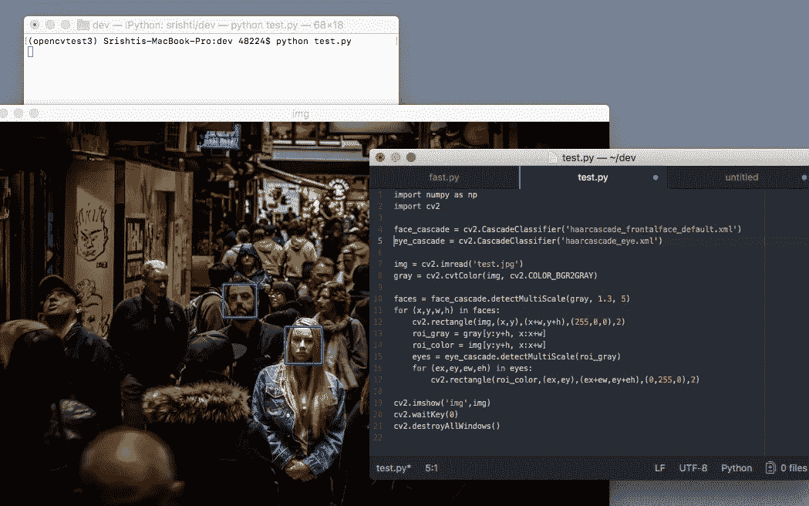

# 在 MacOSX Sierra 上安装 OpenCV 3.1 for Python

> 原文：<https://medium.com/hackernoon/installing-opencv-3-1-for-python-on-macosx-sierra-7f91956bc9cd>

OpenCV 最初由英特尔开发，是一个可跨平台使用的实时计算机视觉编程库。该库是跨平台的，在开源 BSD 许可下可以免费使用。

> “它有 C++、C、 [Python](https://hackernoon.com/tagged/python) 和 Java 接口，支持 Windows、Linux、Mac OS、iOS 和 Android。OpenCV 是为计算效率而设计的，非常注重实时应用。该库用优化的 C/C++编写，可以利用多核处理。借助 OpenCL，它可以利用底层异构计算平台的硬件加速。OpenCV 在世界各地被采用，拥有超过 47，000 人的用户社区，估计下载次数超过 1，400 万次。用途广泛，从互动艺术，到地雷检查，在网上或通过先进的机器人技术拼接地图。”
> — OpenCV Org。

[OpenCV](https://hackernoon.com/tagged/opencv) ，尽管功能强大，但由于安装过程稍长，对初学者来说还是有点吓人。我写这篇简单的指南是为了在 MacOSX Sierra 上开始使用 OpenCV 3.1 for Python，以简化设置过程。欢迎在评论中留下建议。

对于这次安装，我将首先使用简单的 Anaconda (Python 发行版和包管理器)。我在电脑上用的是 Anaconda 4.4.0 for MacOSX 和 Python 3.6。

虽然 Anaconda 附带了主要的科学 Python 模块，但它没有附带 OpenCV 模块。但是 OpenCV 模块(非官方的)在一些 Anaconda 包通道上是可用的。我们在这里将使用 Menpo/OpenCV 3.1 来安装 OpenCV。

**注意。**虽然 OpenCV 的最新稳定版本是 3.2(当我写这篇文章的时候)，但是 OpenCV 3.2 不支持 Anaconda 上的 x64 通道。因此，我们将在这里使用 3.1。

**第一步。**打开终端，创建一个新的 Python 环境。

```
conda create -yn opencvtest python=3.5
```

确保使用 Python 3.5 和 OpenCV 3.1，Python 3.6 会产生一些不兼容性。“opencvtest”是新环境的名称，也可以是其他名称。

**第二步。**切换环境

```
source activate opencvtest
```

进入新环境安装 OpenCV 并使用它。

**第三步。**安装 OpenCV 模块

```
conda search -c menpo --spec 'opencv=3*'
```

您可以搜索 OpenCV 模块的可用版本并安装所需的版本。对于本指南，正如我前面所说，我将使用 OpenCV 3.1。

```
conda install -y -c menpo opencv=3.1
```

这将安装 OpenCV 3.1 及其依赖项，您现在可以使用 OpenCV 了。

您现在可以测试一个简单的 OpenCV 程序。下面的程序使用 Haar 级联分类器来检测任何人脸和眼睛，并在输入图像上绘制一个矩形。

```
import numpy as np
import cv2face_cascade = cv2.CascadeClassifier('path/to/haarcascade_frontalface_default.xml')
eye_cascade = cv2.CascadeClassifier('path/to/haarcascade_eye.xml')img = cv2.imread('image.jpg')
gray = cv2.cvtColor(img, cv2.COLOR_BGR2GRAY)faces = face_cascade.detectMultiScale(gray, 1.3, 5)
for (x,y,w,h) in faces:
    cv2.rectangle(img,(x,y),(x+w,y+h),(255,0,0),2)
    roi_gray = gray[y:y+h, x:x+w]
    roi_color = img[y:y+h, x:x+w]
    eyes = eye_cascade.detectMultiScale(roi_gray)
    for (ex,ey,ew,eh) in eyes:
        cv2.rectangle(roi_color,(ex,ey),(ex+ew,ey+eh),(0,255,0),2)cv2.imshow('img',img)
cv2.waitKey(0)
cv2.destroyAllWindows()
```



Harr-Cascade — Face Detection Example | Photo by Mike Wilson on Unsplash