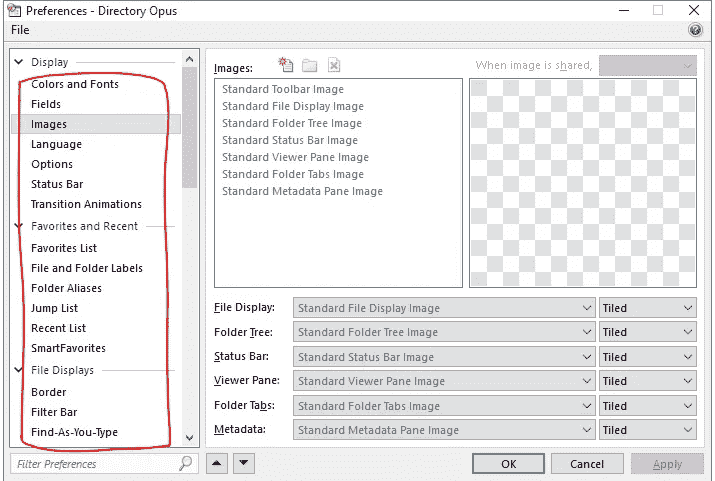
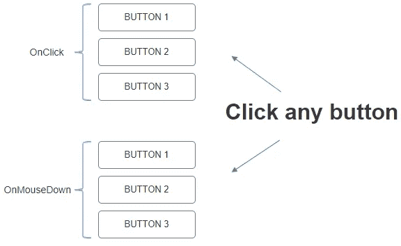

# 即时动作:onMouseDown vs onClick

> 原文：<https://medium.com/hackernoon/instant-actions-onmousedown-vs-onclick-37f20b00eaf0>

首先，速度对大多数用户来说很重要。肯定有用户没有注意到本地桌面软件(我没有计算所有那些基于电子桌面版本的在线软件)和他们的在线对应物之间的区别，但是，通常情况下，大多数用户更喜欢常用软件的本地版本。电子表格、图像编辑器、大文本处理——所有这些任务都可以使用本地软件更快地完成。同时，在线[软件](https://hackernoon.com/tagged/software)由于其奇妙的多平台和协作可能性，对于大多数任务来说是[的未来](https://hackernoon.com/tagged/future)。因此，让它更快是让用户更开心的主要目标之一。

我们可以使用众所周知的技巧，使在线软件用户界面的响应性更接近编译的用户界面。其中一个技巧是当用户按下鼠标左键(释放之前)或轻击手机(移开手指之前)时触发事件执行。我经常想知道为什么在用户界面中使用 onMouseDown 事件，而在 web 界面中却很少使用。它显然不是一个未知属性，在很多地方都有使用。例如，MS Office 使用 onMouseDown 事件来切换菜单选项卡和所有下拉菜单，但仍然对任何按钮使用 click 事件:

Mozilla Thunderbird 对消息列表使用 onMouseDown 事件；Chrome 和 Firefox 用于切换标签页；和 Firefox 的首选项选项卡:

对于[目录 Opus](https://www.gpsoft.com.au/) 文件管理器中的每个标签都是一样的:

有趣的是，Google online 电子表格软件也支持许多操作的 onMouseDown 事件。例如，对于所有下拉菜单和选项卡切换。

和许多其他桌面软件应用程序都使用这一功能。

检查您是否在此样本中看到任何速度差异[:](https://artemsyzonenko.github.io/click-vs-mousedown/home.html)

onMouseDown vs onClick

你可以在这里测试你的平均节省时间:[http://instantclick.io/click-test](http://instantclick.io/click-test)，“点击鼠标”值。

根据罗伯特·米勒(Robert Miller)、“人机对话交易中的[响应时间](http://theixdlibrary.com/pdf/Miller1968.pdf)、study and Card，S. K .、Robertson，G. G .和 Mackinlay，j . d .[“信息可视化工具:信息工作空间](http://www2.parc.com/istl/groups/uir/publications/items/UIR-1991-01-Card-CHI91-IV.pdf)”和其他人的说法，100 毫秒的响应时间被认为是瞬时的。所以当你使用 click 事件时，你几乎不能得到一个即时的界面，即使是预载的内容。当你需要用 AJAX 获取一些内容时，你需要额外增加 50-500 毫秒的延迟。这意味着在最好的情况下，您可能会获得“快速”的界面响应，但这不会是瞬间的。

如果 onDrag 事件正在使用中，您应该避免任何 onMouseDown 事件，因为同时触发 onMouseDown 是不可取的。例如，对于以其他屏幕为目标的块，但是当用户可能只需要拖放时，您不希望将用户切换到其他屏幕。

此外，如果拖动事件可能跟在 onMouseDown 事件之后，这也不是问题。你可以检查任何 Google Sheets 文档以及工作表拖动是如何工作的:onMouseDown + onDrag 工作时没有任何间断。选定的工作表激活，然后拖动。

因此，如果您想提高 web 应用程序的性能，可以考虑使用 onMouseDown 事件。它可以将每个用户操作的速度提高大约 100 毫秒，而无需您付出任何努力。

拿起电视遥控器，测试它是通过按下(onMouseDown)任何按钮启动的，还是通过按下并释放(onClick)启动的。我相信你会发现它只是在推动。

使用触摸屏时要小心，因为 onMouseDown 会阻止滚动，所以它应该只应用于小元素。最好不要为触摸设备实现这些事件。键盘可访问性也有类似的问题，因为不可能使用键盘的空格键或回车键来触发鼠标关闭动作。可能只是你网站的几个用户，但无论如何，你需要知道这个问题(谢谢奥利弗！).您可以使用 [onkeydown](https://www.w3.org/WAI/GL/WCAG20/WD-WCAG20-TECHS-20071102/SCR20.html) JS 事件处理来处理这种情况。