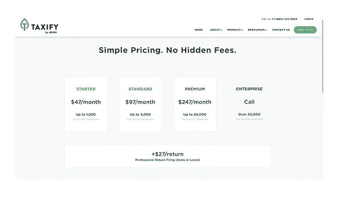
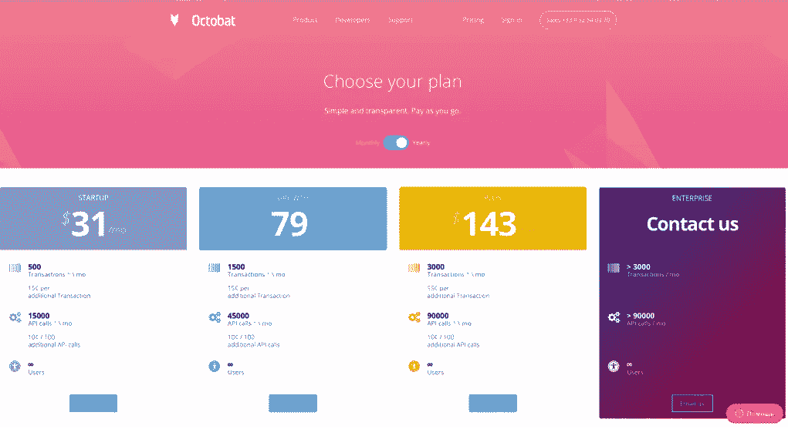
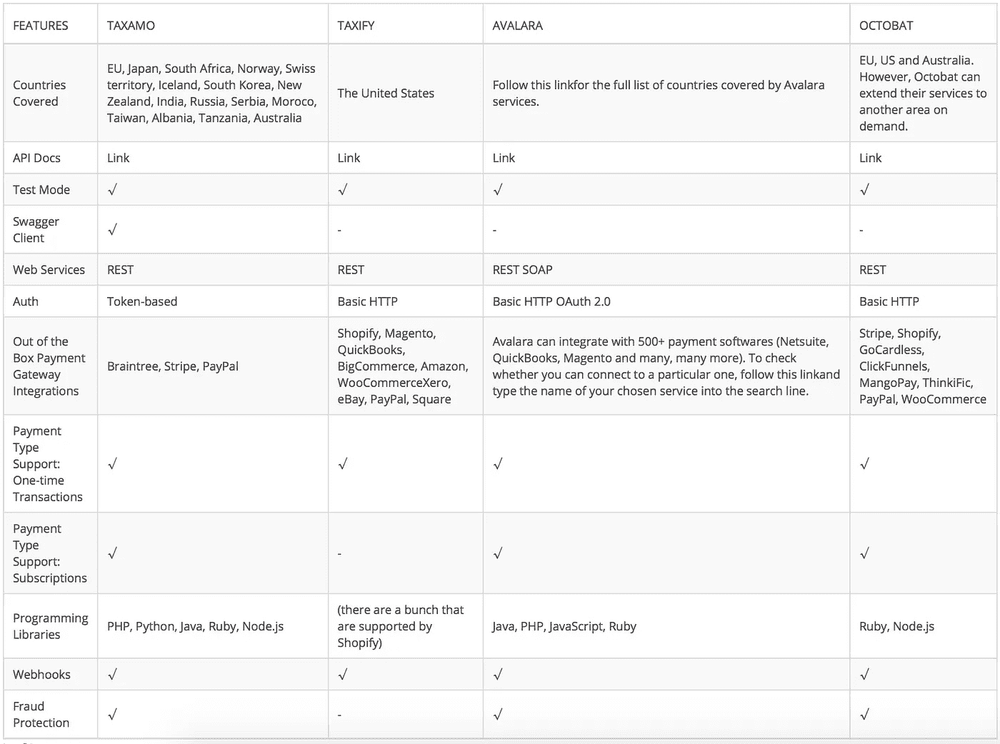

# 集成税务自动化软件

> 原文：<https://medium.com/hackernoon/integrating-tax-automation-software-9c3d9440fff2>

税收是一场噩梦。它们复杂、乏味、难以管理，忽视它们的代价也很高。更糟糕的是，似乎没有简单(合法)的方法可以绕过他们。或者……有吗？

值得庆幸的是，税收是恼人的和例行公事，足以让开发者聚在一起，将它们数字化，创建税务自动化软件(TAS)，该软件收集，计算和归档适当准备的税务文件，有效地为你报税。

现在，如果你是一家企业，选择正确的 TAS 可能有点麻烦。哪些功能是必备的？哪些功能是可选的？在寻找完美的 TAS 时，你应该注意什么？在开发欧洲 GPS 追踪解决方案 Possio 时，我们也不得不面对这些问题。我们与客户一起调查了市场上的一些 TAS，经过广泛的研究，最终决定使用 Taxamo，因为它是欧洲市场的完美解决方案。

然而，我们的选择可能不适合您，因为有些 TAS 可能比其他人更适合您的业务。下面，我们比较四种主要的税务自动化服务: [Taxamo](https://www.taxamo.com/) 、 [Taxify](https://taxify.co/) 、 [Avalara](https://www1.avalara.com/us/en/index.html) 和 [Octobat](https://www.octobat.com/) 。您将了解它们的功能、定价、地理覆盖范围、支付网关集成的可能性以及更多信息，希望能够帮助您为您的公司做出正确的 TAS 选择！

# 税务自动化软件:标准功能

大多数 TAS 系统提供标准水平的功能，包括:与您的在线业务集成(商店、网站、应用程序-无论是什么)，结算交易的税额，准备和归档相关文档，以及存储所有数据以供将来审计。然而，它们之间的差异在所提供服务的广度上最为明显。

一些 TAS 只涵盖一个国家的税收法规，而另一些则跨越几个国家。一些 TAS 可以集成数百个支付网关，而另一些只能运行其中的几个。一些公司有严格的循环定价模式，而另一些公司提供适应性定价结构，更像是一种现收现付的服务。你明白了——各种税务自动化软件之间的主要差异隐藏在最小的细节中。

# 比较 TAS 提供的功能

# 紫杉属

税务计算
实时确定每笔交易最合适的税务处理方式，而不会中断客户结账流程。

税收征收
直接从支付提供商处即时征收增值税(VAT)和一般销售税(GST)。

多种支付方式
支持两种支付方式:订阅和一次性交易。

国际支持
用户可以选择他们希望 Taxamo 承担增值税和商品及服务税责任的国家和地区。

Business2Business (B2B)和 Business2Consumer (B2C)
通过实时验证增值税/企业编号提供多国兼容的 B2B 支持。

# 滑行

实时税率
超过 14，000 个州/地方辖区的准确、最新税率。

报告和审计跟踪
从历史数据到当前调查结果，所有税务记录一目了然。

自助式门户网站
一个非常易于使用的平台，兼容任何人的技能。

自动化申报和汇款
税务流程完全自动化，无需邮票、纸张或支票。

随时可打印的税务表格
随时可签署的表格，包含超过 14，000 个美国司法管辖区的最新准确税率。

政府认证
Taxify 是简化销售税项目的成员。这将使您的企业免受不断变化的美国联邦和州税法的影响。

按需税务研究
taxi fy 始终拥有 20 名税务律师，可以为客户提供最新的税率和规则，使他们能够为未来的业务做出明智的决策。

# 阿瓦拉拉

# Avalara 标准功能

税收计算器
定期更新，精确计算超过 12，000 个美国司法管辖区的税率。

支持复杂的组织
为给定组织的每个位置和/或部门提供多实体支持。

产品税
您的企业销售的每种产品都有数千个销售税率，确保仔细计算每个管辖区的税款。

地址验证
自动验证和更正最高级别逐户计税的地址。

## Avalara 高级功能

增值税计算
超过 190 个国家的增值税计算自动化。

AvaTax 服务与许多全球企业合作，包括:

*   与欧盟公司或消费者进行交易的美国公司；
*   与美国公司或消费者进行交易的欧盟公司；
*   在美国拥有全资子公司的欧盟公司

AvaTax Exemption
用于收集、存储和管理免税证书的合规文件管理解决方案。

有了 AvaTax 免税，用户可以:

*   管理免税客户信息，以确定管辖免税要求；
*   上传和存储免税证书图像，并直接从客户处创建或请求免税证书。
*   通过标准电子邮件模板申请新的豁免或更新证书。
    使用 CertExpress 为客户提供一个移动友好的证书创建向导。

其他集成
与 650 多个会计系统以及 ERP、CRM 和其他电子商务软件的多项标准认证集成。

报税
在一个州或数百个司法管辖区内自动准备销售税报税。为了确保一切计算和归档正确，税务内容定期更新，以包括最新的税务表格和说明。

消费者使用税
简单且经济实惠的解决方案，用于处理应缴纳消费者使用税的免税采购交易的应计使用税。有了这一功能，用户可以:

*   通过批上传流程生成使用税应计额；与应付帐款或总帐(GL)系统集成，用于使用税分析和计算；
*   与应付帐款或总帐(GL)系统集成，用于使用税分析和计算；
*   生成报告，确定在州和地方管辖范围内申报所需的应计使用税。

到岸成本计算
Avalara 的关税和进口税计算器能够准确、实时地计算跨境交易的真实成本。该功能允许用户:

*   减少计算与您合作的国家的正确税率所花费的时间；利用不断更新的云平台，自动处理不断变化的关税和进口法规；
*   利用不断更新的云平台，自动处理不断变化的关税和进口法规；
*   将 API 无缝集成到购物车软件中；
*   轻松地为您目录中的每个产品分配关税代码，涵盖您合作的每个国家。

# 八爪鱼

实时增值税/商品及服务税/销售税计算
通过准确识别适用于每笔在线交易的国际法律，实现多地区税收合规。税款可以在结账时计算，也可以在付款处理后计算。

自动交付发票
通过同步来自支付提供商的数据，Octobat 可以自动向您的客户交付 PDF 税务发票。这些文件严格遵守当地和国际法律。

报告
Octobat 的详细报告可以轻松地与任何会计解决方案同步。它们包括实时和综合收入，以及税务计算拆分。

易于审计的合规性
税务结算报告通过自动货币转换生成。每笔交易都经过彻底分析，以确定适用的税收法律(增值税号、账单国家、购买 IP 地址等。).这些数据将存储 10 年，并且可以随时从应用程序中轻松访问。

收银台无缝集成
Octobat 提供:

*   一个可嵌入的形式，随时可以与任何网站/应用程序集成。这使得用户能够在短短几分钟内以适当的税率向客户收费(包括订阅和一次性付款)；
*   内置表单允许轻松实施可定制的税收定价策略。这些表格包括即时税率计算和定价更新，两者都基于客户类型(最终消费者或增值税注册企业)和地点。

# TAS 定价

## [紫杉属](https://www.taxamo.com/)

Taxamo 的定价结构很大程度上取决于您希望将它的哪些功能与您的业务相集成。因此，我们建议联系他们的销售团队(【sales@taxamo.com】T2)，询问贵公司需求的大概费用。

## [Taxify](https://taxify.co/)

## [阿瓦拉拉](https://www.avalara.com/)

Avalara 提供各种各样的功能和解决方案，其定价结构也在很大程度上取决于您的公司需要使用哪些功能。确定 Avalara TAS 成本的最佳方式是联系他们的[销售代表。](https://www.avalara.com/contact-us/?sessionId=1507542864868&referrer=https://www.google.com.ua/&lastReferrer=www.avalara.com)

## [章鱼](https://www.octobat.com/)

# TAS:技术方面的东西

对于潜在的 TAS 客户来说，以上信息应该足以让他们很好地了解税务自动化软件能为企业做些什么。

然而，对于希望为客户集成 TAS 解决方案的开发人员来说，技术细节更加重要。这就是为什么我们在 SteelKiwi 要求我们自己的开发人员查看分别由 Taxamo、Taxify、Avalara 和 Octobat 提供的四组文档，以确定集成这些 TAS 解决方案的细节。

# **适合您企业的税务自动化软件**

我们希望这篇文章能帮助你更接近于为你的企业选择正确的税务自动化软件！如果您需要帮助将自动 TAS 集成到您公司的工作流程中，请[联系我们的销售团队](https://steelkiwi.com/contacts/)了解更多信息。

最初发表于[https://steelkiwi.com](https://steelkiwi.com)