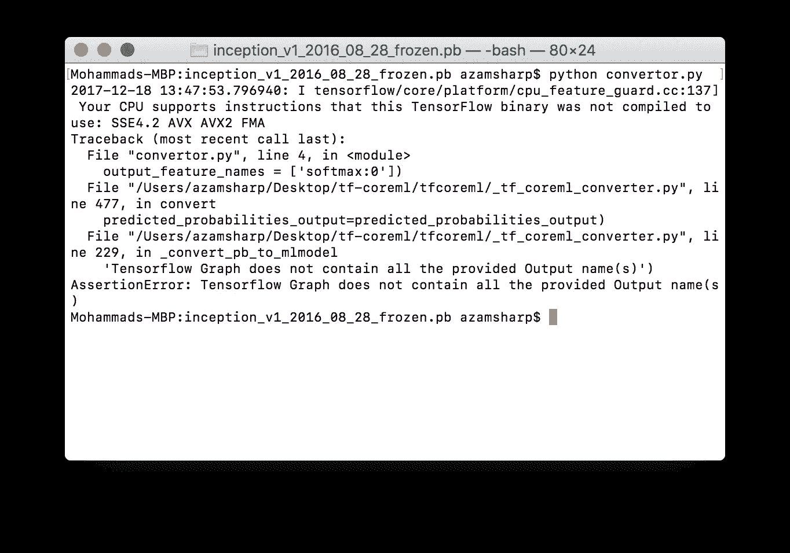
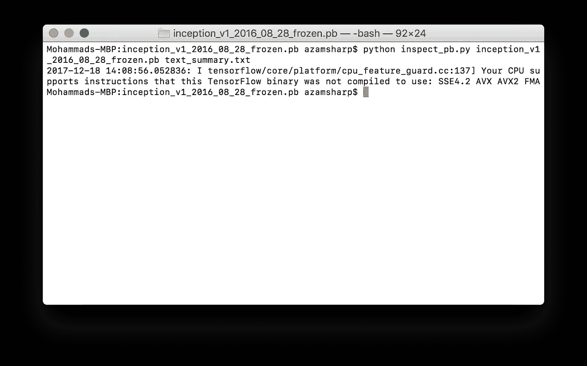
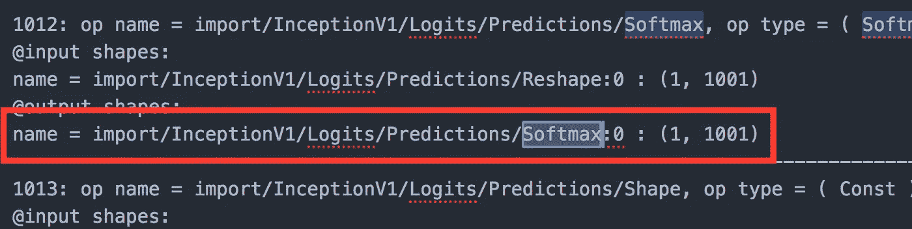
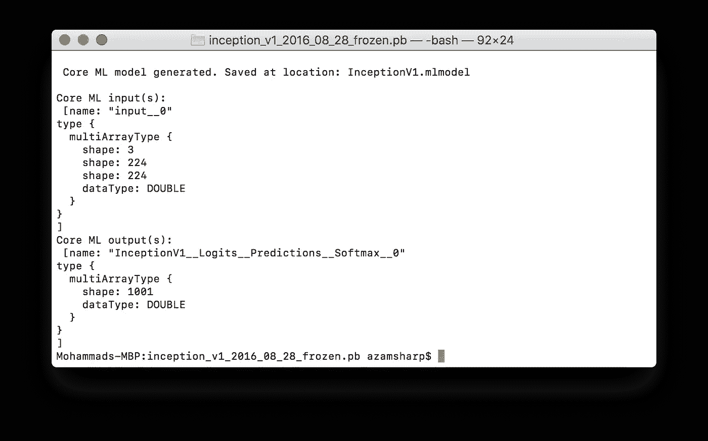
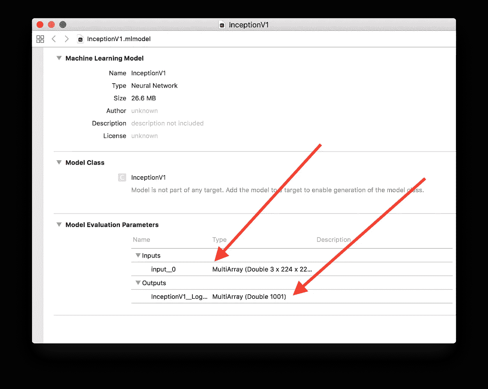
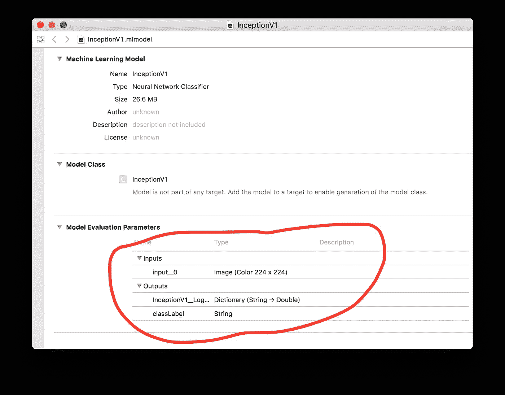
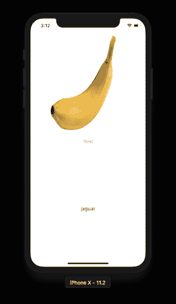
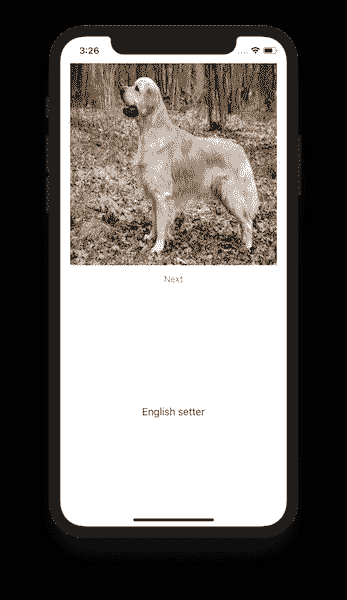

# 在 iOS 应用中集成 TensorFlow 模型

> 原文：<https://medium.com/hackernoon/integrating-tensorflow-model-in-an-ios-app-cecf30b9068d>


[http://tomtunguz.com/images/ml_icons.jpg](http://tomtunguz.com/images/ml_icons.jpg)

苹果在 WWDC 2017 上发布了 Core ML framework，允许开发者将机器学习集成到他们的 [iOS](https://hackernoon.com/tagged/ios) 应用中。为了开始，苹果提供了一份与核心 ML 框架兼容的[列表](https://developer.apple.com/machine-learning/)。这些模型已经可以使用，并且可以集成到 iOS 应用程序中。

但是如果你必须使用深度学习来训练自己的模型呢？幸运的是，谷歌提供了一个名为 [TensorFlow](http://tensorflow.org/) 的开源库，它能够基于数值计算创建深度学习图。这意味着你可以开发一个符合你需求的定制深度学习模型。使用 TensorFlow 已经创建了许多不同的模型，但不幸的是，在 iOS 应用程序中使用它们需要大量的工作。最近，Google 发布了一个工具“ [**tfcoreml**](https://github.com/tf-coreml/tf-coreml) ”，它允许开发者将 TensorFlow 模型转换为 coreml 模型。

在这篇文章中，我将解释如何使用 tfcoreml 工具将 TensorFlow 模型转换成 coreml 模型。这个过程很复杂，我花了几天时间才弄明白。特别感谢 Google tfcoreml 团队的持续支持。

# 安装 tfcoreml

安装 tfcoreml 工具有多种方式。最快的方法是使用 pip 工具来安装它。

```
pip install -U tfcoreml
```

在撰写本文时，我建议不要采用上述方法。原因是在 master branch 中对 tfcoreml 工具的源代码进行了一些修复，这些修复只有在您从源代码构建工具时才可用。

要从源安装，您必须克隆 tfcoreml 存储库。

```
git clone [https://github.com/tf-coreml/tf-coreml.git](https://github.com/tf-coreml/tf-coreml.git)
```

一旦存储库被克隆，进入目录并运行以下命令:

```
python setup.py bdist_wheel
```

最后，使用以下命令安装软件包:

```
pip install -e .
```

恭喜您成功安装了 tfcoreml 工具！

# 转换张量流模型

在执行实际转换之前，让我们先了解一下张量流模型。您可以在[文档](https://github.com/tf-coreml/tf-coreml)的末尾找到几个 TensorFlow 兼容模型。我们将使用“Inception v1 (Slim)”模型进行演示。下载该模型，您会注意到它包含两个文件。

*   inception _ v1 _ 2016 _ 08 _ 28 _ frozen . Pb
*   imagenet_slim_labels.txt

文件“**inception _ v1 _ 2016 _ 08 _ 28 _ frozen . Pb**”是实际模型，“**imagenet _ slim _ labels . txt**”是类标签。您可以将类标签视为将附加到每个预测的标签/标题。

在文档中，您会看到以下转换代码:

```
import tfcoreml as tf_converter
tf_converter.convert(tf_model_path = 'my_model.pb',
                     mlmodel_path = 'my_model.mlmodel',
                     output_feature_names = ['softmax:0'])
```

我创建了一个名为“**converter . py**的文件，并将上述所有代码放在该文件中。如你所见，我已经用正确的文件名替换了变量。

转到 TensorFlow 模型所在文件夹内的终端，执行 [Python](https://hackernoon.com/tagged/python) 脚本。

```
python convertor.py 
```



欢迎来到将 TensorFlow 模型转换为 Core ML 的奇妙世界！我知道你在想什么，这是什么意思。Google 的好心人帮我解释说，要让 tfcoreml 工具工作，我需要传递正确的操作符。为了找到操作符，可以将 TensorFlow 模型转换为文本摘要，并在文本文件中搜索操作符。

TensorFlow 工具已经包含用于将模型转换为基于文本的摘要的 Python 脚本。您可以在以下位置查看该脚本的实现:

```
[tf-coreml](https://github.com/tf-coreml/tf-coreml)/[utils](https://github.com/tf-coreml/tf-coreml/tree/master/utils)/inspect_pb.py
```

我已经将 **inspect_pb.py** 文件复制到我的本地文件夹中，这样会更容易引用它。下面的代码展示了如何将 TensorFlow 模型转换成文本摘要。



生成“ **text_summary.txt** ”文件。在文件的末尾，您将看到特定型号的所有操作符的列表。

```
OPS counts:
Squeeze : 1
**Softmax : 1**
BiasAdd : 1
Placeholder : 1
AvgPool : 1
Reshape : 2
ConcatV2 : 9
MaxPool : 13
Sub : 57
Rsqrt : 57
Relu : 57
Conv2D : 58
Add : 114
Mul : 114
Identity : 231
Const : 298
```

现在，让我们搜索 Softmax，您会发现几个不同的条目。我突出显示了与输出特征名称相对应的名称，如下所示:



现在，使用新的" **output_feature_names** "参数更新转换器文件，如下所示:

从终端再次运行 convertor.py。这一次转换将成功完成，如下所示:



将生成核心 ML 模型“InceptionV1.mlmodel”。继续并双击生成的模型。这将在 Xcode 中打开它，如下所示:



虽然已经成功地创建了模型，但它对我们来说并不真正有用，因为我们希望我们的模型将图像作为图像参数，并且还提供类标签来标识检测到的对象。

幸运的是，我们已经可以访问类标签文件"**imagenet _ slim _ labels . txt**，并且我们可以使用 text_summary.txt 文件来找出提供 **image_input_names** 所需的操作符。更新后的代码“**converter . py**”如下所示:

跳到终端上，运行 convertor.py 文件，如下所示:

```
python convertor.py 
```

查看下面截图中生成的模型:



Wohoo！！！我们以图像的形式获得输入，以预测字典和分类标签的形式获得输出。

让我们将这个模型导入到我们的 iOS 项目中，看看预测结果。我已经有了一个核心的 ML iOS 项目设置，可以从 [Github](https://github.com/azamsharp/TensorFlowToCoreML) 下载。我简单地把这个模型插入，这是我得到的结果。



香蕉！没错。不幸的是，转换后的模型预测相差甚远。在与谷歌开发人员交谈后，他们认为这是因为图像在使用前需要预处理。这意味着我们需要更新我们的“**converter . py**”来包含图像的预处理。如下所示:

从终端再次运行“convertor.py ”,它将生成一个新模型。将模型导入到 iOS 应用程序中，你会发现现在预测正确了。



恭喜您，您已成功将 TensorFlow 模型转换为 Core ML，并将其集成到您的应用中！

如果你想支持我的写作并了解更多关于核心 ML 的知识，请查看我的课程“[掌握 iOS 核心 ML](https://www.udemy.com/mastering-core-ml-for-ios/?couponCode=ILOVECOREMLBONUS)”。请务必对课程进行评分和复习，因为它有助于添加更多精彩的内容。

[Github](https://github.com/azamsharp/TensorFlowToCoreML)

谢谢你，

阿扎姆