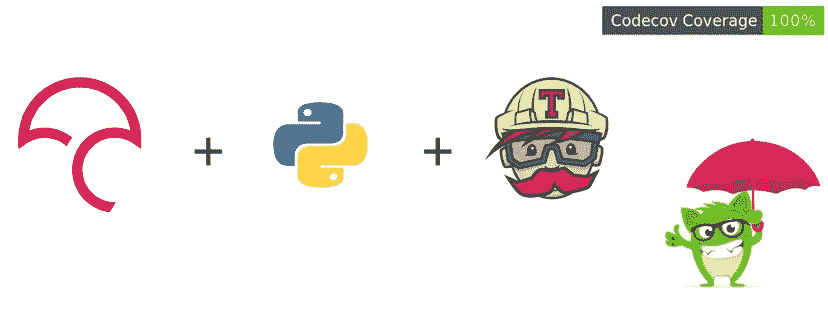

# 将 Travis CI 和 Codecov 集成到基于 Python 的项目中

> 原文：<https://medium.com/hackernoon/integrating-travis-ci-and-codecov-into-a-python-based-project-6f658074ff63>



一点背景:在过去的几个月里，我一直在开源组织 [FOSSASIA](https://github.com/fossasia) 做贡献，在那里我从事一个名为 [BadgeYaY](https://github.com/fossasia/badgeyay) 的项目。这是一个徽章生成器，具有简单的 web 用户界面，可以添加数据并生成 PDF 格式的可打印徽章。BadgeYay 使用 Flask，这是一个基于 Python 的微框架。

我想在我的持续集成流程中包含一个测试覆盖报告器，只要我的 [TravisCI](https://travis-ci.org/) 构建通过，它就会被理想地部署到 [Heroku](https://heroku.com) 。为此，我决定使用 [codecov.io](http://codecov.io) 来集成代码覆盖。

首先，让我们看看什么是“代码覆盖”这个东西；然后我们将继续讨论如何在 Travis CI 的帮助下集成 Codecov。

**什么是代码覆盖率？**

简单地说，代码覆盖率是一种度量，用于表达测试套件运行时源代码被执行的程度。代码覆盖率高的程序意味着测试套件在运行时执行了更多的源代码。因此，这意味着源代码包含未检测到的错误的机会较小。我们使用三个主要术语来描述执行的源代码行。

*   **hit** 表示测试套件执行了给定的源代码。
*   **部分**表示源代码没有被测试套件完全执行；还有未执行的剩余分支。
*   **未命中**表示源代码没有被测试套件执行。

覆盖率是`hits / (hit + partial + miss)`的比值。在总共 12 行代码中，有 5 行由测试执行的代码库将获得 41%的覆盖率。我不是在吹牛，但是在我写这篇文章的时候，[badgeya 已经有了 100%的代码覆盖率！](https://github.com/fossasia/badgeyay#badgeyay)😎


Code coverage is a like tool for building tools, and is integrated to other such tools like Git and Travis CI. Source: [XKCD](https://www.explainxkcd.com/wiki/index.php/1629:_Tools)

**CodeCov 对代码覆盖率有什么帮助？**

Codecov 专注于集成和促进健康的拉请求。它将覆盖度量直接交付或“注入”到现代源代码管理工作流中，以促进更多的代码覆盖。这尤其增加了在新特性和错误修复经常出现的拉请求中检查覆盖率的便利性。

我们可以改变 Codecov 处理报告和表达覆盖率信息的方式。让我们看看我是如何配置它来适应 BadgeYaY 的——通过将它与 Travis CI 集成。

现在，Codecov 使用一行代码就可以很好地处理 Travis CI:

```
bash < (curl -s [https://codecov.io/bash)](https://codecov.io/bash))
```

BadgeYaY 使用 [Python 单元测试](https://docs.python.org/3/library/unittest.html)进行断言，借助 [Selenium](https://github.com/SeleniumHQ/Selenium) 进行 web 浏览器自动化。基本上，这是用来测试代码的。我以这样一种方式配置 CodeCov，它根据这个测试的结果生成覆盖率报告，所以我在`travis.yml`中的`scripts`中添加了以下内容

```
“scripts”: {
 — nosetests app/tests/test.py -v — with-coverage
}
```

现在我创建了一个`codecov.yml`文件，它告诉我们代码覆盖后生成的报告的配置。代码如下:

```
codecov:
 notify:
 require_ci_to_pass: yescoverage:
 precision: 2
 round: down
 range: “70…100”status:
 project: yes
 patch: yes
 changes: nocomment:
 layout: “reach, diff, flags, files, footer”
 behavior: default
 require_changes: no
```

下面是 BadgeYaY 的项目资源库中`travis.yml`的一些代码，这些代码在成功构建后集成了 codecov。

```
Script:
- python app/main.py >> log.txt 2>&1 &
- nosetts app/tests/test.py -v — with-coverage
- python3 -m pyflakes
after_success:
- bash < (curl -s [https://codecov.io/bash)](https://codecov.io/bash))
```

*另外两个脚本与 codecov 集成无关，但是如果您感兴趣的话，可以随意查阅。*

一旦所有这些都设置好了，Codecov 就可以开始行动了。现在，当任何人向 BadgeYaY 发出 pull 请求时，Codecov 都会根据上面的配置对其进行分析，并生成显示其代码覆盖率的报告。

至此，我们已经结束了关于将 Travis CI 和 Codecov 集成到基于 Python 的项目中的讨论。我写这篇文章是为了解决 BadgeYaY 项目中的这个问题。如果你喜欢这篇文章，可以考虑看看我在 GitHub 上的其他作品🙂。

来源: [codecov.io](http://docs.codecov.io) ，[维基百科](https://en.wikipedia.org/wiki/Code_coverage)