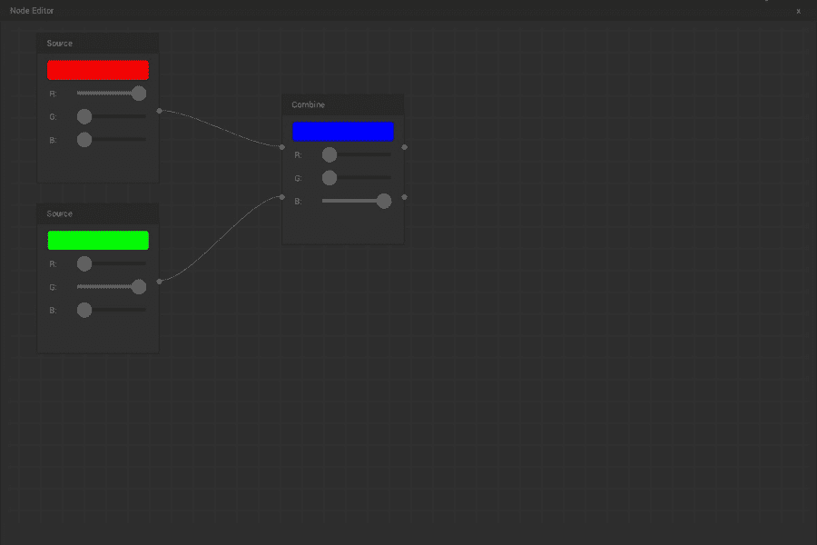
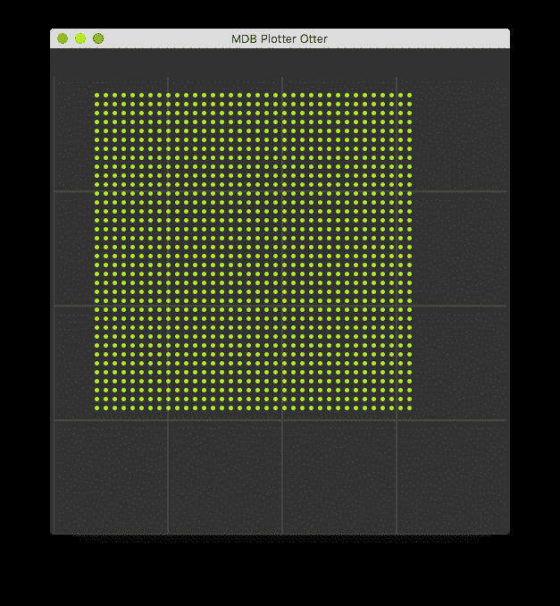
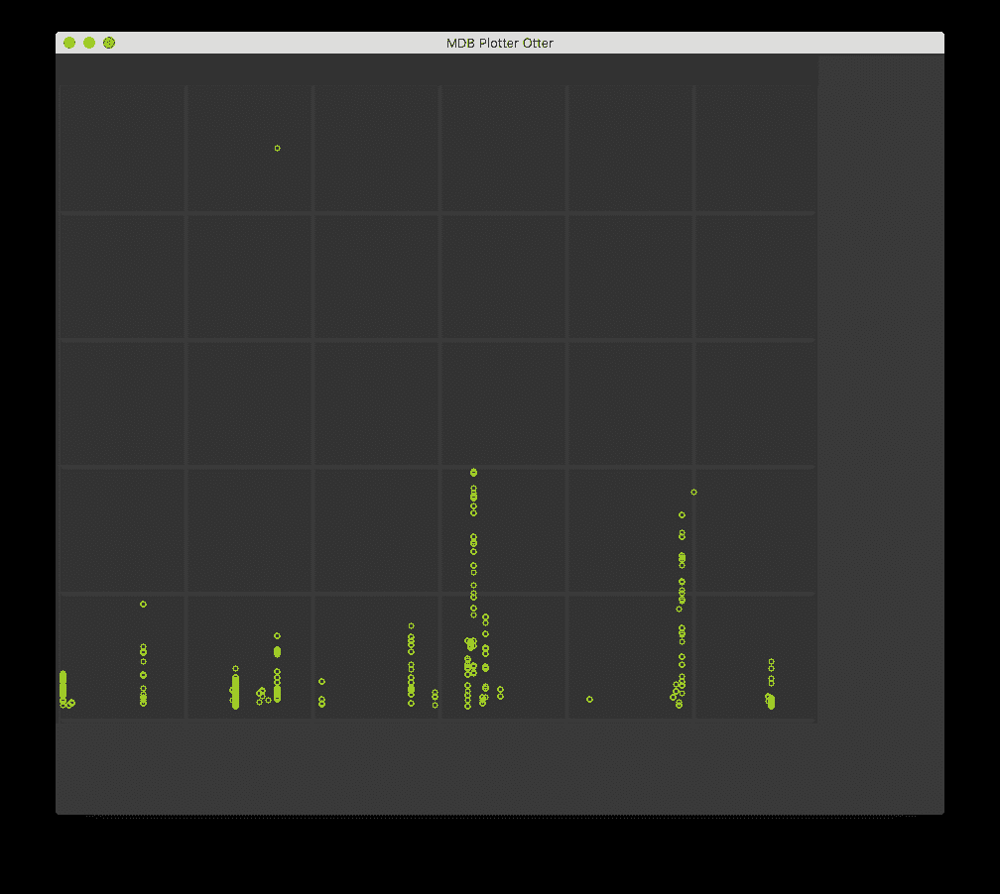
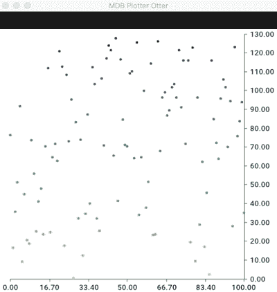

# 带 Go 的交互式图表(GL)

> 原文：<https://medium.com/hackernoon/interactive-charts-with-go-gl-7a30a40162a0>

近年来，自从 [D3.js](https://d3js.org/) 的出现，每当有涉及图表或图形可视化的任务时，我就倾向于 JavaScript 库。这主要是因为 D3.js 提供了一种简单的方法，通过数据驱动的方法，使用 HTML、SVG 和 CSS 实现数据。很容易为您自己的用例进行定制和集成，并且有大量漂亮的交互式图表示例。

然而，有了创建 C++ [Qt](https://www.qt.io/) 用户界面的经验，*有时候*我会怀念一种更本土的方法。有一些关于编译的小型二进制可执行文件，或者一些不必处理不同浏览器的东西。所以作为一个副业，我认为是时候去探索一些新的东西了，去进行一次*冒险*去寻找一个替代品。


Always be curious, have an adventure

在我的工作环境(我所熟悉的东西)中寻找灵感，我决定这个项目的一个合适的主题是可视化 [MongoDB](https://www.mongodb.com/what-is-mongodb) 日志文件中的操作的工具。该工具将使用[散点图](https://en.wikipedia.org/wiki/Scatter_plot)根据操作的时间戳和持续时间绘制日志条目。

MongoDB 日志条目示例(v3.4.9):

```
**2017-11-13T10:22:19.039+1100** I COMMAND  [conn3] command charts.golang appName: "MongoDB Shell" command: find { find: "golang", filter: { a: { $regex: /^d.*/ } } } planSummary: COLLSCAN keysExamined:0 docsExamined:1000 cursorExhausted:1 numYields:7 nreturned:42 reslen:2638 locks:{ Global: { acquireCount: { r: 16 } }, Database: { acquireCount: { r: 8 } }, Collection: { acquireCount: { r: 8 } } } protocol:op_command **1ms**
```

作为 Golang 编程语言的新手，这也是提高我语言流利度的绝佳机会。因为你知道他们说什么:如果你不使用它，你就会失去它。做出这些决定后，现在是时候寻找合适的 Golang 依赖项了。


Keep Looking

启动这个项目(可能)需要两个库:一个用于呈现散点图，一个用于解析 MongoDB 日志文件。

一般来说，我所知道的 Golang 绘图库只是生成静态的，尽管很漂亮的图像；举几个例子:

*   [github.com/gonum/plot](https://github.com/gonum/plot)
*   [github.com/wcharczuk/go-chart](https://github.com/wcharczuk/go-chart)

在这一点上，我决定走上编写自己的自定义交互式小部件的道路。快速搜索后，我找到了 golang-ui/nuklear。这是一个为小型 ANSI C GUI 库提供 Go 绑定的包。参见相关的[github.com/vurtun/nuklear](https://github.com/vurtun/nuklear)。



One of the examples of GUI from the Github repo.

Nuklear 有一些吸引我的特性:

*   小型代码库(约 18k LOC)
*   没有依赖性(如果不需要，甚至没有标准库)
*   低内存占用，可根据需要控制总内存
*   可选字体烘焙器和顶点缓冲输出

首先，我做了一个快速测试来创建入口图:



```
c1 := nk.NkRect(float32(fx), float32(fy), 5.0, 5.0)   nk.NkFillCircle(canvas, c1, nk.NkRgb(171, 239, 29)) if nk.NkInputHasMouseClickDownInRect(input, nk.ButtonLeft, c1, 1) > 0 {   
     log.Println("Receive a click on coordinate: ", fx, fy)   
}
```

上面这个简单例子的完整源代码可以在 gist://[*test _ scatter . go*](https://gist.github.com/sindbach/a21d93c5f11a24665d9d07c05340bad3)上找到

这个二进制可执行文件的大小只有大约 5MB。在没有任何代码优化的情况下，我可以在有一点延迟之前渲染大约 75，000 个点。

通过另一个快速搜索，我找到了一个 Golang 库来解析 MongoDB 日志文件，[github.com/honeycombio/mongodbtools](https://github.com/honeycombio/mongodbtools)，由 [honeycomb.io](https://honeycomb.io/) 编写。通过几行额外的 Golang 代码，我可以解析日志文件并将它们绘制到交互式小部件中:



这个二进制可执行文件的大小约为 10MB。

此时，我可以修复丢失的 X 和 Y 轴信息，缩放输入时间戳和持续时间以适合应用程序窗口的大小，并计算标记点。

我探索的另一条途径是使用许多 Golang 绘图库中的一个来生成 SVG 或 PNG 图像，并在 GL 小部件上将它渲染为纹理/位图，在新数据到达时刷新纹理生成。我很快尝试使用[github.com/wcharczuk/go-chart](https://github.com/wcharczuk/go-chart)生成静态图像来实现这条路径:



这里的挑战是映射小部件上接收到的鼠标点击，并将其关联回纹理/位图上的项目，以找出哪个入口点被点击。


Always learning…

好吧，那么我从这个小小的*冒险*中学到了什么:

*   有很多(有用的)Golang 库。
*   仅使用 GL 编写 Golang 绘图仪应用程序是可行的，您只需编写 X 和 Y 轴缩放比例。
*   使用现有的 Golang 绘图库生成 SVG 输出，并将其映射为 GL 纹理也是可行的，您只需将 GL 上的单击映射回纹理即可。
*   仅使用 GL 的一个优点是可以渲染绘图入口点，而不必先读取所有数据。

也许创建一个 Golang 库来呈现交互式图形是有用的，也许已经有一个我不知道的 Golang 库了。让我知道你的想法。