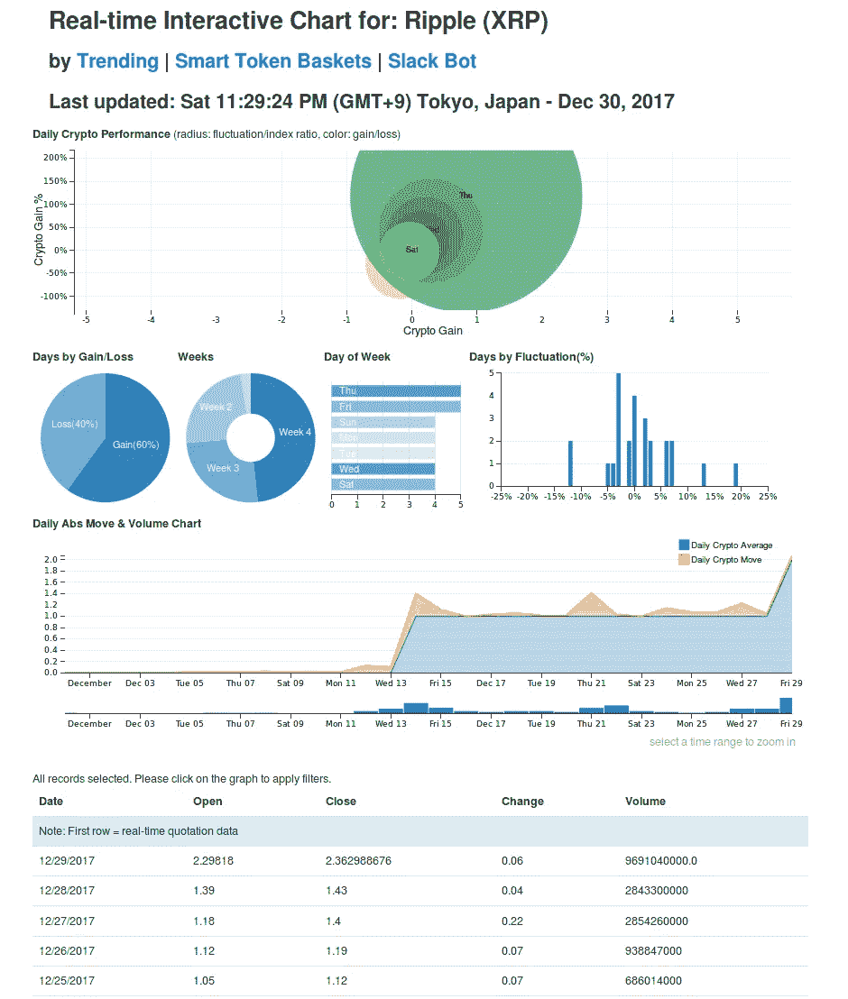
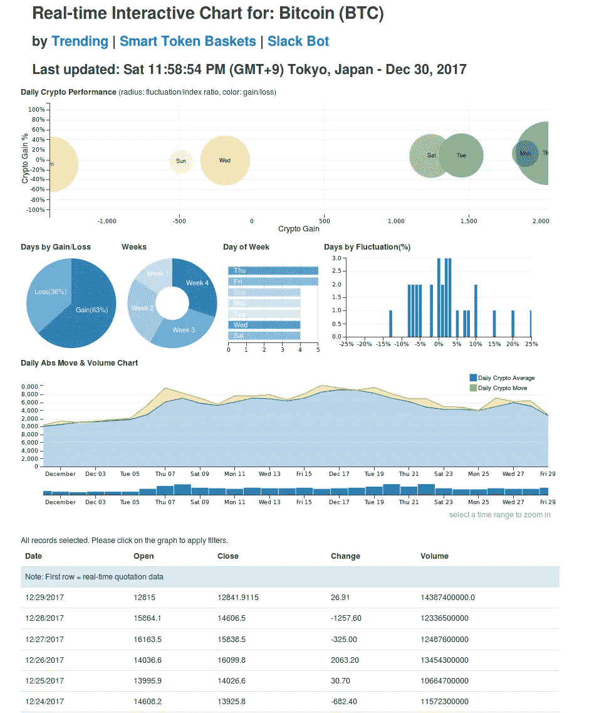
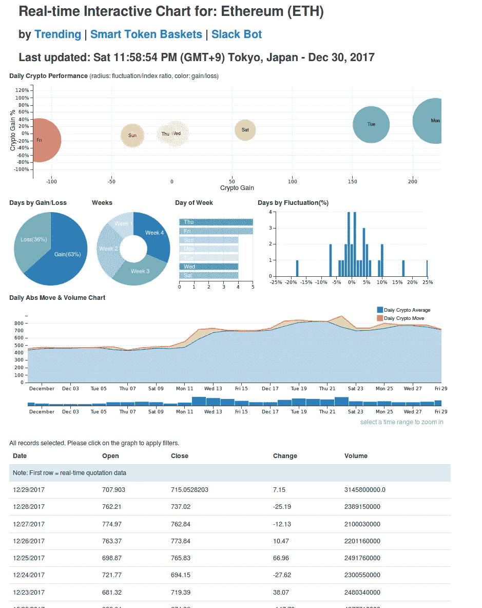
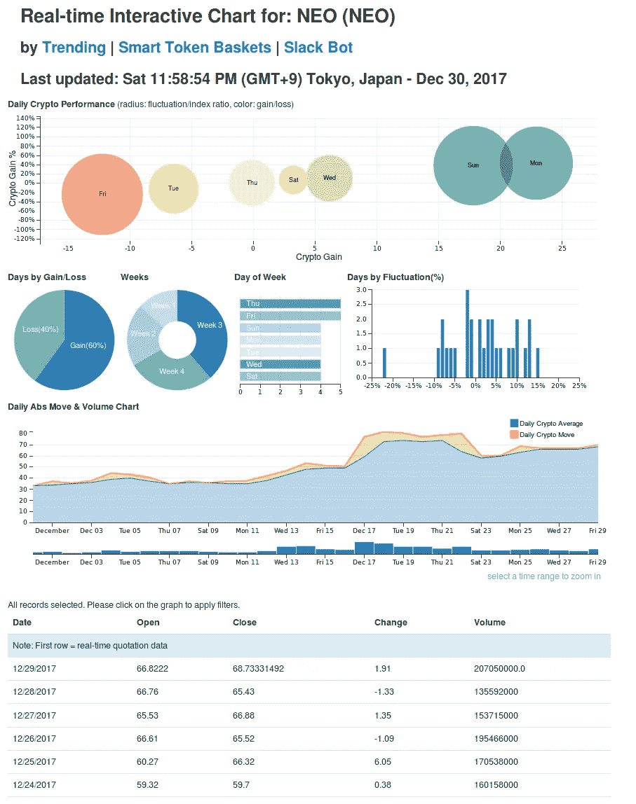
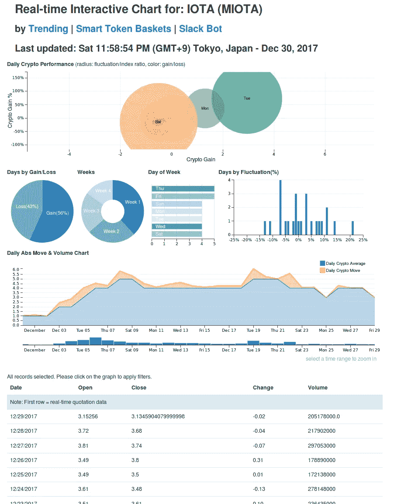
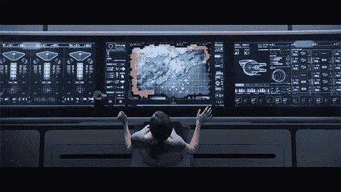

# 交互式图表:Ripple、比特币、以太坊、NEO、IOTA 和 Qtum

> 原文：<https://medium.com/hackernoon/interactive-cryptocurrency-charts-ripple-bitcoin-ethereum-neo-iota-qtum-2a51e3f0ef7>

今天，在加密货币的世界里，如果不想通过建立头寸、摇摆交易、日内交易或在市场上倒卖当前的移动者来参与，就很难忽视势头、价格变动和价格升值。不打带子就是定位在动量方向。

我最近对一些 ico 进行了一些研究，发现其中一个[ [link](http://vectorspace.ai/crowdsale.html#service) ]提供了当前新闻中的 20 大趋势加密货币符号以及他们所谓的“实时互动加密货币图表”，通过这个镜头观察过去 24 小时的热门人物可以获得的洞察力真的让我感到惊讶。我决定根据我一直相当成功地使用的加密货币动量策略，拍摄一些截图。他们在这里:

# 瑞波(XRP)

链接到最近更新的 XRP 互动图表是[ [位于这里](http://vectorspace.ai/recommend/vectorspace-charts/vectorspace-chart-XRP.html)，截图如下:

# 比特币(BTC)

最新更新的 BTC 互动图表的链接是[ [位于此处](http://vectorspace.ai/recommend/vectorspace-charts/vectorspace-chart-BTC.html)，截图如下:

# 以太坊

最新更新的 ETH 互动图表的链接[[位于此处](http://vectorspace.ai/recommend/vectorspace-charts/vectorspace-chart-ETH.html)，截图如下:

# 亚军:

# 近地天体

链接到最近更新的近地天体互动图表是[ [位于这里](http://vectorspace.ai/recommend/vectorspace-charts/vectorspace-chart-NEO.html) ]和截图如下:

# IOTA(米欧塔)

最新更新的 IOTA 互动图表的链接[ [位于此处](http://vectorspace.ai/recommend/vectorspace-charts/vectorspace-chart-MIOTA.html)，截图如下:

# Qtum (QTUM)

将修改后的比特币核心基础设施与以太坊虚拟机(EVM)的兼容版本相结合， [Qtum](https://qtum.org/) 将比特币经久不衰的区块链的可靠性与智能合约提供的无限可能性融合在一起。

Qtum 的设计考虑到了稳定性、模块化和互操作性，它是构建可信的分散应用程序的最重要的工具包，适合现实世界中面向业务的用例。它的混合性质，结合首个同类 PoS 共识协议，允许 Qtum 应用与主要区块链生态系统兼容，同时为移动设备和物联网设备提供原生支持。

最新更新的 QTUM 互动信息图的链接[ [位于此处](http://vectorspace.ai/recommend/vectorspace-charts/vectorspace-chart-QTUM.html)，截图如下:

# 结论

有些秘密游戏有很棒的团队，有些很棒的故事，有些只是很棒的势头和价格波动，有些三者兼而有之。当定位进场点或快速交易时，使用技术分析指标可能会很有效。无论是哪种情况，有一天你可能会想学习如何做空以及做多或对冲。交易愉快！

