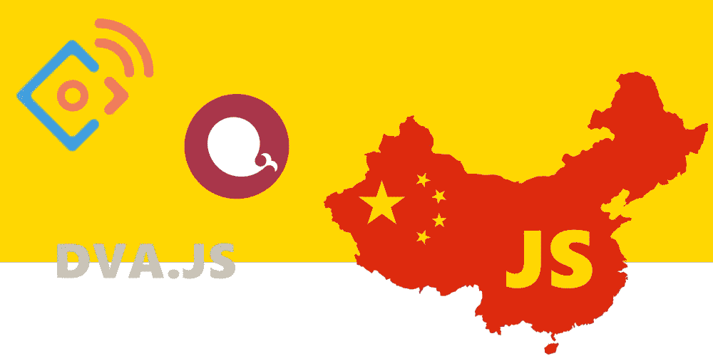
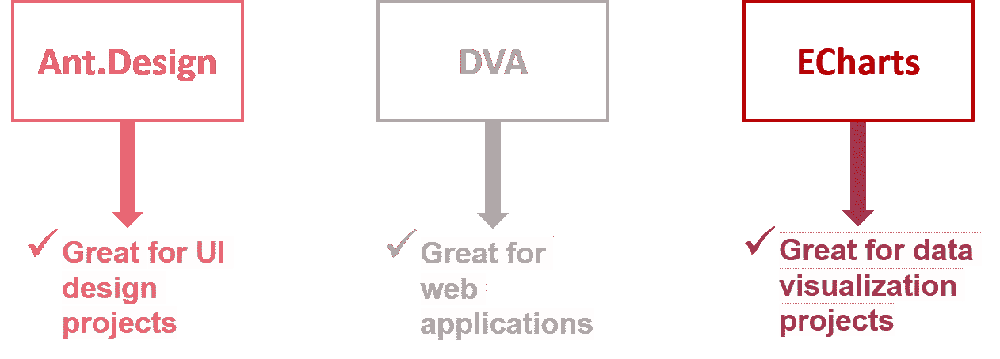

# 中国诞生的有趣的 JavaScript 库

> 原文：<https://medium.com/hackernoon/interesting-javascript-libraries-born-in-china-d50d1bb81355>



JavaScript 社区已经变得越来越大，这种语言逐渐成为世界上使用最多的编程语言。

社区的触角已经伸向中国，中国已经成为信息技术产业中不可忽视的国家。他们已经尝试创建有用的 JavaScript 库。

我们来看看中国诞生的 JavaScript 库。本文中只有三个库，但这并不是说中国人是 JavaScript 社区的新手。还有 Amaze UI 等其他在中国诞生的有趣的库。

然而，为了本文的目的；我们来看看:

1.  蚂蚁。设计库
2.  Dva 库
3.  电子艺术图书馆

这三个库与它们的竞争对手不相上下，并且已经获得了 JavaScript 社区和整个世界的关注。让我们深入了解一下，看看中国人给我们带来了什么:

# 蚂蚁。设计库

蚂蚁。Design 俗称 **antd** 是一个基于 ReactJS 库构建的 UI 设计框架，用于开发 web 和 React JS 应用程序。它由中国蚂蚁设计公司所有，采用材料设计原则建造。

Antd 是一个功能丰富的完整框架，没有太多的复杂性，这让您可以选择直接使用 React 项目。因此，它提供了一组您可能从未注意过的高质量 React 组件:

*   简单而强大的网格系统，
*   导航组件，如步骤、菜单或与 react-router 集成的面包屑，
*   适用于所有情况的大图标包，
*   大量数据实体组件可供选择，如选择器、输入或单选按钮，
*   一组模式窗口，如进度条、微调器和警告，
*   所有这些组件都可以根据您的需要轻松组合、调整或设计。

蚂蚁。Design 是用 TypeScript 编写的，可以很好地与其他技术协作，因为它提供了 npm、webpack 和 dva 前端开发工作流。

Ant Design 的开发者让开发变得更加容易，因为它可以使用 JavaScript 包 **npm** 和 **yarn** 进行安装。

只需在您的终端中键入以下内容:

```
npm install antd --save
```

运筹学

```
yarn add antd
```

它支持几乎所有的现代浏览器，包括 Internet Explorer。可以加 Ant。设计到你的浏览器，使用 **antd** 全局变量的**脚本**和**链接**标签。

还考虑到它支持服务器端渲染，以及电子框架；任何人都会发现使用这个易于使用的框架是一件令人愉快的事情。

你可以更多地了解蚂蚁。在其 [**网站**](http://beta.ant.design/docs/react/introduce) 上设计框架，也可以在 [**GitHub**](https://github.com/ant-design/ant-design) **上查看。**

考虑到这是一个中文图书馆，语言可能会成为绊脚石。然而，这个问题目前正在解决，很快就会完全用英语记录下来。

# DVA 图书馆

DVA 是一个 elm 风格的框架，基于流行的 JavaScript 技术，如 redux、react-router 和 redux saga。

这是一个轻量级的库，因为它是用不到 100 行代码构建的。对于那些喜欢用它来导航的人来说，它还有一个命令行界面。

DVA 遵循轻量级的道路，因为它有一个简单的学习曲线，并且相当容易使用。其他一些好处包括:

*   它对类型脚本的支持
*   插件系统的可用性
*   对负载模型的支持
*   支持移动和本地反应
*   易于理解的 API 的可用性

DVA 库可用于创建 web 应用程序，并与 Ant 无缝协作。为它的用户界面设计。

这个库的主要缺点是它缺乏一个用户社区，这是由它的纯中文文档造成的，说英语的开发者很难绕过它。

然而，这是弥补，因为它很容易学习，没有那么多的复杂性，并且精确的功能。所以，这应该使语言不再是一个问题。

由于这一点，一些开发人员一直在帮助翻译成英语。如果你在使用这个库时遇到任何问题，你可以访问它的 [**GitHub 库**](https://github.com/dvajs/dva)**；很有可能你的问题已经被提出来了。**

这可能是你在开源社区扬名的机会，如果你能帮忙翻译，JavaScript 开发者社区会很感激的。

不管它的语言有什么困难，都可以使用 npm 包轻松安装。

只需键入:

```
npm install dva
```

使用 npm 包，命令行界面也很容易安装。

```
npm install dva-cli -g
```

使用 DVA CLI 超出了本文的范围，但是，您可以从它的 **GitHub 库**中学习使用它。

# 电子艺术图书馆

这是为数据科学家、数据爱好者和数据驱动的企业家准备的。

Echarts library 是一个功能强大的图表和数据可视化库，它提供了一种简单的方法，可以利用交互式和高度可定制的图表在网页上显示数字。

Echarts 由强大的中国公司百度构建，纯 JavaScript 编写，基于 zrender，z render 是该公司的一个轻量级画布库，帮助提供您在 Echarts 上欣赏的 2d 绘图。

安装 ECharts 以供使用非常容易，使用 npm 软件包安装:

```
npm install echarts --save
```

你也可以从 [**这里**](http://echarts.baidu.com/download.html) 获取文件。

与 DVA JS 不同的是，Echarts 有英文文档，也有中文文档。

这鼓励了库的使用，它有一个大的用户社区，你可以很容易地得到支持，无论何时你在使用语言时遇到麻烦。

在众多图表库中，Echart 是最强大的一个；让中国感到骄傲。

在 [**Echart 网站**](https://ecomfe.github.io/echarts-examples/public/index.html) 上查看一些您可以使用该库创建的图表示例，如饼状图、条形图、折线图甚至烛台图。

Echarts 也有一个扩展，不太擅长使用 JavaScript 的企业家可以使用，这个扩展叫做[**Echarts data matic**](http://echarts.datamatic.io/)*。*

# 包装它

这三个库是高质量的，易于使用的库；使用它们应该不会有问题。



然而，中国图书馆的主要问题是语言障碍。Echarts 图书馆完全翻译成英文，DVA 图书馆缺乏高质量的翻译，但正在努力；而蚂蚁。设计库正在变得越来越好，因为许多开发人员正在将工作投入到它的翻译中。

尽管这是一个障碍，但它不应该阻止你在项目中使用它们。外面的某个人很可能已经遇到了你的问题，应该会有英文的答案。

[*安东·沙列尼科夫*](https://www.linkedin.com/in/anton-shaleynikov-45812a1/) 撰写

*想了解更多信息？* [*查看此处*](https://dashbouquet.com/blog)