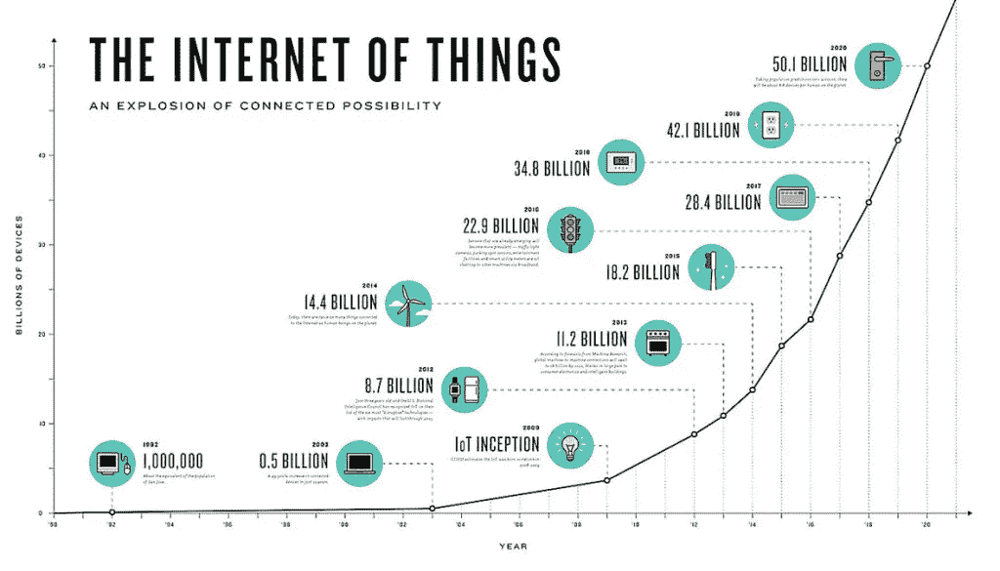
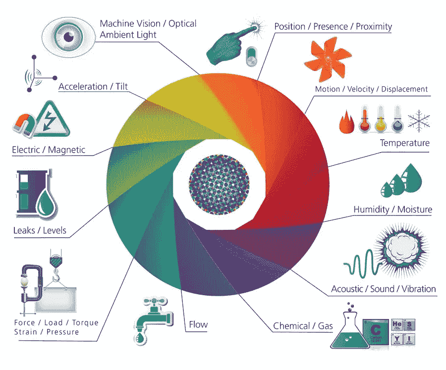
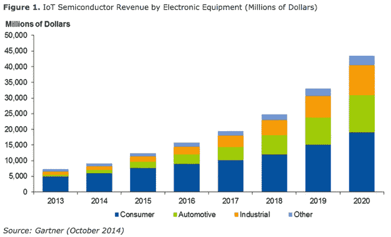
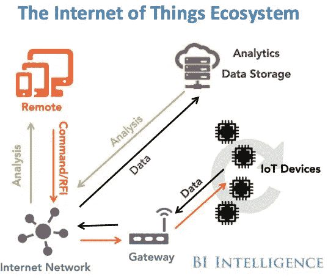

# 万物互联:从 2017 年到 2023 年，物联网市场预计将增长 12 倍

> 原文：<https://medium.com/hackernoon/internet-of-everything-the-iot-market-is-projected-to-expand-12x-from-2017-2023-175f845c2bcf>

## 物联网的指数级增长及其对我们未来的影响

# 1950 亿美元的物联网市场

据[报道的分析师称，物联网驱动设备的激增和“智能化”预计将在 2023 年达到超过**1950 亿美元的市场价值。从 2016 年的 160 亿美元市场开始，这一增长主要是由越来越普遍的智能家居、移动和交通设备制造以及捕获数据和增强通信基础设施的需求推动的。根据**](http://www.reportsnreports.com/reports/944711-internet-of-things-iot-market-shares-strategies-and-forecasts-worldwide-2017-to-2023.html) **[Gartner](https://www.gartner.com/newsroom/id/3165317) 的数据，2016 年超过 64 亿物联网设备被“连接”——这一数字在未来十年将呈指数级增长。**

[*NCTA*](https://www.ncta.com/platform/wp-content/uploads/2014/05/growth-of-internet-of-things-hero-1024x585.jpg)

# 传感器

设备越智能，做出复杂决策所需的数据就越多。传感器和外部数据收集工具正在成为物联网行业增长的重要催化剂。测量地理空间接近度、加速度、温度和运动的传感器和执行器的精度将把行业领先者与落后者区分开来。

[*Postscapes*](http://postscapes.com/what-exactly-is-the-internet-of-things-infographic/)

Gartner 对半导体等实际核心组件进行了更深入的研究，预测到 2020 年，物联网驱动的半导体市场将达到 450 亿美元，消费物联网将占据最大份额，汽车行业(包括自动驾驶汽车)将位居第二。

# **数据&商业智能**

真正互联的技术生态系统的目标也将反映数据和商业智能的平等增长。互联的事物越多，公司就越需要收集数据、推送远程更新和控制现场设备。因此，远程通信需要可靠，数据需要准确，从大数据中提取有意义信息的能力变得至关重要。

[*Business Insider*](http://www.businessinsider.com/how-the-internet-of-things-market-will-grow-2014-10)

# 未知事件

一个成功而稳定的物联网生态系统取决于能够支持它的基础设施。对通信基础设施的巨额投资是否能够支持物联网的增长仍有待观察。出于对网络安全的担忧，该行业将如何处理隐私和安全问题仍有待观察。

据智能城市咨询公司[in neighborhoods](https://ineighborhoods.us/)的创始人大卫·桑德尔称，“随着设备数量的增加，安全性将变得更加重要。一些物联网应用可能还包含机密的实时患者信息，或者需要更高质量的服务，例如部署城域广域网。”因此，随着物联网驱动的数据可靠性的提高，出现了新一轮的隐私担忧和对稳定通信基础设施的新依赖。

可以肯定的是，物联网将继续在我们的日常生活和整个经济中发挥更大的作用。这不是一个行业是否会继续增长的问题，而是以什么速度增长的问题。

[科技阶梯上的*来源文章*](https://thetechladder.com/story/iots-market-projected-grow-16b-2016-195-billion-2023/)