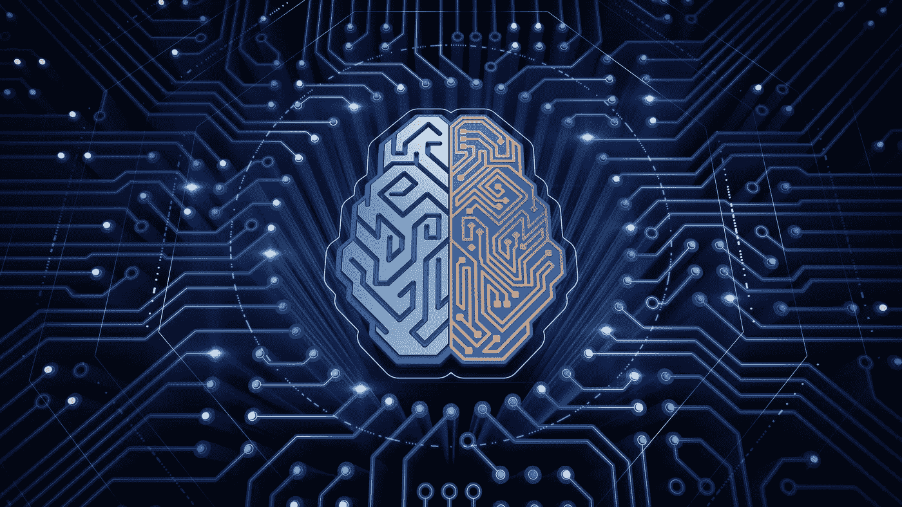
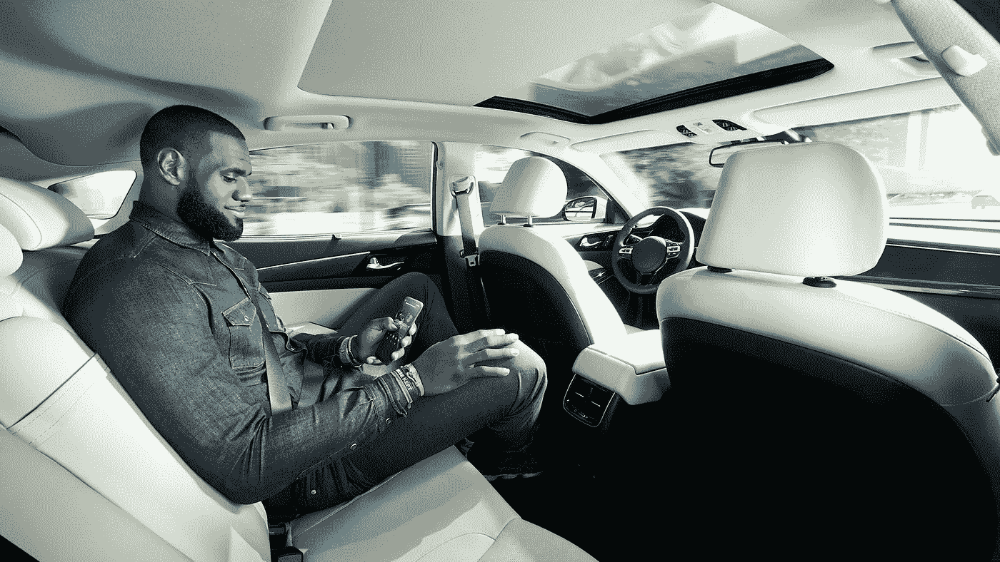

# X 互联网和 11 个推动当今未来的未来趋势

> 原文：<https://medium.com/hackernoon/internet-of-x-and-11-more-futuristic-trends-that-drive-the-future-today-6d82fad147b9>

未来今日研究所每年都会发布一份关于最新科技趋势的报告，这将影响到经济的不同领域。与前一年相比，2017 年预测中提到的创新数量几乎翻了一番。技术发展比以往任何时候都快，为了让你的[业务](https://hackernoon.com/tagged/business)与时俱进，你应该关注最新的技术趋势。2018 年 IT 领域将需要哪些创新，以及如何将新兴技术趋势应用于业务发展？

# 人工智能

斯坦福大学的科学家认为，到 2030 年，城市将使用人工智能(AI)来确保人口的安全。根据预测，人工智能将有助于防止犯罪，甚至在法庭诉讼中充当助手。

基于人工智能的解决方案已经形成了许多创新想法和技术趋势的基础:从智能房屋到人脸识别甚至情感模拟。人工智能的元素——机器和[深度学习](https://stfalcon.com/en/blog/post/deep-learning-benefits-and-challenges)现在被广泛应用于机器人领域。未来今日研究所的研究人员认为，人工智能将很快成为几乎所有技术发明的一部分。

# 语音和视觉产品搜索

根据 Gartner 最近的预测，到 2021 年，领先的贸易公司将在其平台上实现视觉和语音产品搜索。使用人工智能技术，大型在线商店将能够了解消费者的愿望和兴趣。分析师预测，由于这一创新，marketplaces 的收入将增长 30%。

# 事实上，个性化的客户服务方式

实时学习——基于人工智能概念的信息技术的新兴趋势。例如，利用这项技术，大型在线商店将能够根据用户在网站上的行为，为每个用户单独展示产品。这项创新技术将有助于利用连续的实时交易数据流来调整网站的模式。

# 运输行业创新

在特斯拉积极开发自动驾驶汽车的同时，亚马逊首次在公共场所展示了成功的无人机送货。显而易见，新兴技术趋势将很快改变人们对运输和物流的习惯态度。

# 物流自动化

ARC Advisory Group 的分析师认为，送货自动化不仅对承运商来说是一个热门话题，对大型在线商店来说也是如此。ARC 咨询集团董事之一史蒂夫·班克(Steve Banker)指出——当零售交易从 9%增长到 30%时，大公司面临的问题是——他们是否准备好在货物交付方面足够灵活。

未来几年，对基于网络的 TMS 和 SCM 解决方案(系统供应链管理)的需求将会增长。面向物流自动化的云服务将成为一种趋势，它不仅有助于优化第三方物流提供商的货物交付流程，大型在线商店也将受益于这种解决方案。

# 无人驾驶汽车

S 无人驾驶汽车——另一种技术趋势(基于人工智能的概念)，这是最大的公司所押注的。特斯拉已经允许司机在他们的汽车中使用自动驾驶仪，前提是他们将遵循道路。优步最近也在匹兹堡的街道上推出了大约 100 辆自动驾驶汽车。然而，与此同时，创新还处于测试阶段——优步的专家坐在车里，不断监督算法和安全方面的工作。

根据奥纬咨询的预测，到 2030 年，一半的汽车将配备自动驾驶功能。在给《福布斯》的一份[报告中，奥纬咨询的分析师甚至推测，考虑到自动驾驶汽车数量的增长，保险公司将如何评估风险。很明显，自动驾驶汽车很快就会变得相当普遍。](https://www.forbes.com/sites/oliverwyman/2017/05/02/even-before-driverless-cars-hit-the-road-auto-insurance-faces-big-challenges/#2694993dd5c5)

# 移动趋势

# 聊天机器人

Gartner 专家还预测，到 2021 年，最大的企业在聊天机器人上的支出将远远超过移动应用程序开发，聊天机器人的市场份额将接近 35 亿美元。正如我们可以从最新的技术趋势中看到的那样，聊天机器人将获得人类的特征——首先，它们将学习如何交流(就像 Siri 已经在做的那样)，然后识别和模拟人类的情感。

我们正在进入所谓的后应用时代——与特定移动程序无关的虚拟助手将获得领先地位。专家认为，在几年内，聊天机器人将渗透到通讯的所有领域。

# х互联网

1990 年，约翰·罗基把他的烤面包机连上网络，创造了世界上第一个互联网东西。从那时起，通过互联网管理的设备数量大幅增长，并形成了所谓的物联网或物联网。现在，大约有 90 亿个智能对象通过互联网进行管理:移动设备、工业设备、智能家居元素等。据麦肯锡称，智能设备的数量将会增长，并将很快达到一万亿。Gartner 专家建议企业开始投资物联网解决方案:

> 对于消费者和企业买家来说，每个供应商至少都必须制定计划，将物联网技术应用到其产品中。

随着智能设备数量的增加，LPWA 正在开发(低功耗广域网，这是 Wi-Fi 的替代方案)。LPWA 将允许信号传播很远的距离，并克服障碍。LPWA 的演进，以及越来越多的智能设备，将推动物联网的发展。**物联网将演变为 X** 的互联网，这个概念可以应用于几乎所有东西——保证未来的今天研究所。作为一个例子，科学家们引用了一个初创的消费者物理学——使用该应用程序，你可以扫描你的食物，并获得有关它所含卡路里数量的信息。

# 口袋里的教育

几乎每天都有新的技术创新出现，为了保持领先，所有领域的专业人员都需要定期更新他们的知识。考虑到现代生活的节奏，在线教育正在获得动力。此外，为了接触到消费者，教育应该尽可能容易获得，因此未来主义者建议教育移动应用的繁荣。

# 大数据

大量数据的分析已经被各种公司广泛使用。随着信息量的增长和人工智能的发展，大数据将会发展，并将适用于更多的生活领域。大数据将成为在线营销工具之一。这项技术将允许快速处理关于购买行为的大量数据。我们将在下一篇文章中详细介绍这项技术。

# 体验设计

你的 ser 经验有助于在竞争对手中凸显公司。基于用户体验的设计将随着最新技术继续发展。传统的接口会在语音甚至神经(所谓的脑机)方面转型。唯一不变的是——高质量用户体验的主要目标是让技术创新变得方便和用户友好。

*最初发表于*[*【stfalcon.com】*](https://goo.gl/y6AWYF)*。*