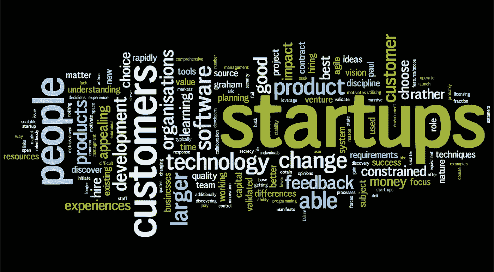

# 对创业的恐吓

> 原文：<https://medium.com/hackernoon/intimidation-of-starting-a-startup-d52458fe236e>

你如何开办一家公司？你最初是从哪里得到这个想法的？

许多初创公司，尤其是湾区的大多数初创公司，都是因为有一些第一世界的问题需要解决而创立的。例如，当特拉维斯·卡兰尼克和加勒特·坎普创建优步时，他们可能在想:“我怎样才能以不到 20 美元的价格从 A 点到达 B 点？”在筹集了数十亿美元的资本后，优步湾区最大的公司之一，各种收入水平的人都使用这项服务，因为它比打车方便得多(也更便宜)。

我的观点是，Kalanick 和 Camp 有这个想法，他们着手开发了一个移动应用程序，并将其部署到所有消费者，同时积极向该领域的投资者筹集资金。有很多人，尤其是在科技中心旧金山湾区，有着惊人的想法；然而，他们被发展成某种东西的整个过程所吓倒。当然，这很难。如果一个想法价值数百万美元，你需要努力工作来赚取这些钱。初级软件工程师的收入约为 10 万美元，相当于工作 10 年才能赚到 100 万美元。这将需要大量的工作，而且没有任何成功的保证；然而，有了正确的团队和正确的方法，你和你的团队就能成功。

你应该采取哪些初步措施？

1.  找到合适的人，你想和他们一起开公司。不幸的是，我与其他两位联合创始人一起创办了我的第一家公司，他们对扩大公司规模不感兴趣，也不像我一样分享公司的未来。结果最后没有成功，我们最初的利润全被榨干了。
2.  找个导师。我再怎么强调这一点的重要性也不为过。尤其是对于最终为投资者创造收入和寻求资本来说，更多的是你认识的人，而不是你想法的质量。我也学会了这第一手。我的公司，Collarship，在我们遇到萨布丽娜·比特梅尔(Sabrina Bitmayl)时起飞了，她是南加州一位著名的航空航天公司首席执行官。她向我们介绍了波音、JPL 和其他公司。
3.  要努力。通过 Skype(甚至面对面)与团队中的每个人安排每周 1 小时以上的通话。为这些拜访创建一个议程。沟通是关键。没有沟通，你的想法将一事无成。
4.  早早开始营销。例如，如果你正在创建一个将在一个月后发布的 iOS 应用程序，那么就创建一个脸书页面来更新这个版本；也许你还会获得一些 beta 测试者。宣传你的想法，利用公众给你的动力来创造更好的想法。
5.  确保你保持所有在线渠道的更新。一个过时的网站，脸书/推特网页等。对公众来说都是巨大的障碍。积极主动。

虽然看起来令人畏惧，但如果有合适的人在你身边，你可以将你的想法变成价值百万美元的东西。你需要有合适的人和你一起工作，需要认识合适的人，并确保你在所有行动中保持勤奋和积极主动。

> [黑客中午](http://bit.ly/Hackernoon)是黑客如何开始他们的下午。我们是 [@AMI](http://bit.ly/atAMIatAMI) 家庭的一员。我们现在[接受投稿](http://bit.ly/hackernoonsubmission)，并乐意[讨论广告&赞助](mailto:partners@amipublications.com)机会。
> 
> 如果你喜欢这个故事，我们推荐你阅读我们的[最新科技故事](http://bit.ly/hackernoonlatestt)和[趋势科技故事](https://hackernoon.com/trending)。直到下一次，不要把世界的现实想当然！

