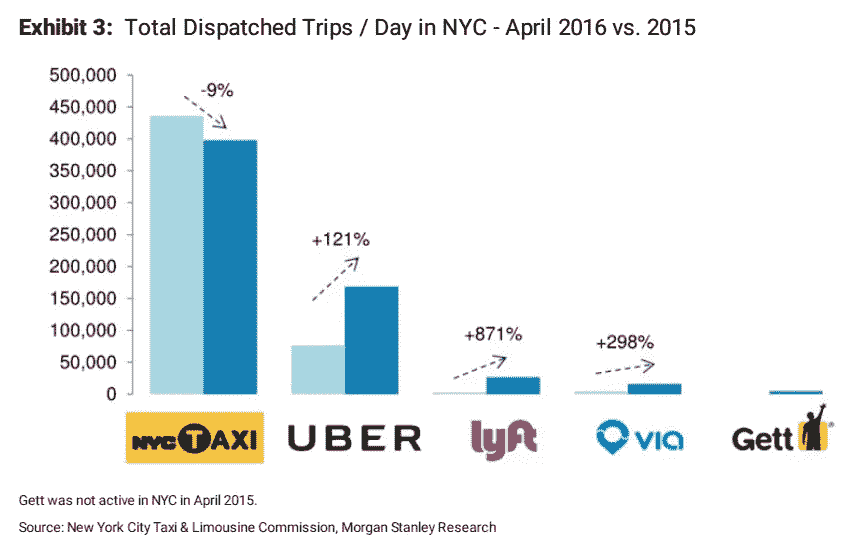

# 走进镜厅:第一部分——比特币的“收费市场”是一种幻觉

> 原文：<https://medium.com/hackernoon/into-the-hall-of-mirrors-part-i-bitcoins-fee-market-is-an-illusion-b367c1049d20>

## 我们发现的是一个街区拍卖室

# 寻找“收费市场”…

在关于比特币的多年争论中，很大一部分都提到了收费市场的利弊和所谓的经济学。比特币交易是要收费的，所以这样想让它看起来像是现实。

# **...而学习区块空间是比特币的商品**

在比特币中，未经确认的交易被点对点传播，存储在每个节点的[内存池](https://hackernoon.com/tagged/mempool)中。交易费用购买区块空间，即矿工激励，允许交易被确认永久进入区块链。收费是买 *blockspace。*

市场总是因交易的商品、产品、货物或服务而为人所知。公开上市股票买卖的股票市场被称为“股票市场”,因为它是股票买卖的地方。房地产市场是房屋买卖的地方…我还需要继续吗？

共同点是钱；产品和服务是用钱来买卖的，因此存在着便利条款。在股票市场中，有一个由相反的买卖指令组成的指令簿。它不被称为“订单市场”，因为订单是市场机制，而不是交易的产品/工具。即使在交易货币的外汇市场，市场也是为了外汇交易，而不是一个“订单市场”。

所以，比特币存在一个*区块空间市场。*这个市场是在 2009 年建立起来的，慢慢变得更加强大，对供给(来自矿商)和需求(来自用户)的经济学做出反应。对于加密货币来说，它是最佳的，因为它支持最多的用户，同时也为矿工获得最多的收入，为非矿业投资者从可支持的最大网络效应中获得最多的资本收益。

然而！一天，奇怪的事情发生了。2016 年 5 月，节点内存池不再能够被经济上可行的事务的矿工耗尽。一个“经济变化事件”发生了，区块空间市场被*人为重组*成了一个固定供应的拍卖室，并一直以这种方式运作。

# 比特币中的区块空间拍卖室

公开市场本质上力求有效，因为它们是一种机制，通过这种机制，大多数买方可以获得最低价格，而大多数卖方可以获得最高价格，无论交易的是什么。许多环境因素都会降低市场的效率:缺乏标准、缺乏流动性、卡特尔和附带交易，以及诸如许可和繁文缛节之类的高压管理，或者是人为的结构。

此外，产品的*类型*在价格决定中起着重要作用，因为每种产品对买方和卖方都有不同程度的弹性。

✦无弹性供给发生在当产品没有可行的替代品时，尽管价格上涨，购买者仍会继续购买——例如:城镇供水、新鲜食品、重大活动门票。

当一种产品**有**的相近替代品时，✦弹性供给就会出现，因此如果该产品价格上涨，消费者就会选择购买替代品——例如:机票、汽车、服装。

比特币的区块空间拍卖室中隐含着固定的供应，可以在固定的时间间隔内获得。blockspace 的买家不得不相互竞价，出价低的买家只能错过机会，不得不等待下一次拍卖。通常买家每次拍卖只有一次出价，尽管一些买家可能会尝试第二次更高的出价(按费用替换)作为这个仍然应该是区块空间*市场*的严重缺陷变化的变通办法。

当购买者不容易从其他地方购买相同的产品时，需求就会失去弹性。机会成本、变化的摩擦增加了需求的不适应性，因为买家可能有其他选择，但面临转向其他选择的挑战。网络效应使得需求缺乏弹性，因为用户互动是产品使用的基础。

比特币的支付网络依赖于拥有比特币钱包和接受比特币的双方。如果比特币可能是唯一的加密货币，那么加密货币领域的需求是无弹性的。当存在多种加密货币时，随着网络效应融入替代品，需求变得越来越有弹性，市场份额从原始货币流失。

# 黄色出租车徽章的教训

在截至 1996 年的 60 年里，纽约市的黄色出租车牌照数量被限制在 12000 个左右，此后又允许增加 1500 个。缺乏弹性的供给导致需求寻求替代出租车服务。然而，在新技术以优步的形式出现之前，对街头叫车的需求缺乏弹性，因为政府监管阻止了竞争性服务。

优步的商业模式已经被克隆，现在的主导者正在不断地与许多竞争者争夺市场份额:

# 加密货币的教训

几年前，比特币交易可以免费发送，因为有一个很好的设施，输出的年龄决定了零费用是否可以接受。因此，如果这些硬币 1 天没有移动，用户可以免费发送 1 BTC，或者如果它们 4 天没有移动，用户可以免费发送 0.25 BTC。这样做的好处是，它给了旧硬币流动的一个小激励，从而通过将更多的硬币分散到更多的手中来增加网络效应。网络效应至关重要，这种早期的支持是明智的想法。然而，它也是区块空间拍卖室出现的早期受害者。

全球对区块空间的需求持续增长——比特币能否提供区块空间已经变得无关紧要。需求是存在的。

随着比特币被克隆成替代品，中本聪发明和开创的革命性突破势头不减。越来越多国家的越来越多的人发现了去中心化、无许可、无边界、你自己的银行、快速点对点支付网络的重要好处。

唯一的问题是，哪些加密货币软件开发商足够聪明、足够敏捷，能够提供吸引矿商接受交易并保护他们所需区块空间的软件。这通过提供用户所需的区块空间来保持用户的满意度，同时保持对矿商的最大市场效率(盈利)——这不是固定供应的区块空间拍卖室的形式。

> [黑客中午](http://bit.ly/Hackernoon)是黑客如何开始他们的下午。我们是 [@AMI](http://bit.ly/atAMIatAMI) 家庭的一员。我们现在[接受投稿](http://bit.ly/hackernoonsubmission)，并乐意[讨论广告&赞助](mailto:partners@amipublications.com)机会。
> 
> 如果你喜欢这个故事，我们推荐你阅读我们的[最新科技故事](http://bit.ly/hackernoonlatestt)和[趋势科技故事](https://hackernoon.com/trending)。直到下一次，不要把世界的现实想当然！

