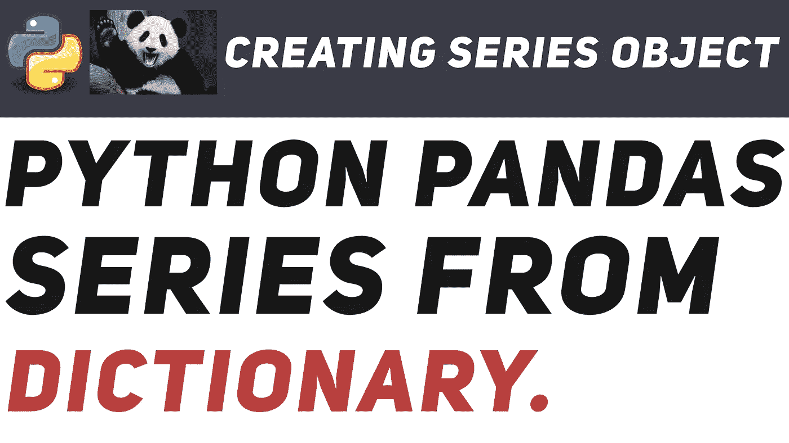

# 熊猫介绍:-1:机器学习和数据科学的绝对初学者指南。

> 原文：<https://medium.com/hackernoon/intro-to-pandas-1-an-absolute-beginners-guide-to-machine-learning-and-data-science-a1fed3a6f0f3>



Pandas 无疑是最好的 python 库之一。它支持读取和写入 excel 电子表格、CVS 和许多操作。如果您正在处理来自 excel 文件和 CSV 文件的数据集，它更像是一个您需要知道的强制库。即机器学习和数据科学。

这是熊猫教程的第一部分。我不会涵盖熊猫的所有可能，但是，我想让你体验一下它是什么，以及你如何开始接触它。这篇教程将会非常短，只是向你介绍熊猫系列的物体。

与其他库一样，您可以导入 pandas 并将其引用为 pd。

```
import pandas as pd
```

我们正式向 python 表明熊猫肯定是第四个被称为 pd 的。

如果你喜欢恍惚音乐，我敢肯定你听说过这个列表中提到的歌曲。

```
# lets create a list of songs.
songs = ['In the name of love','Scream','Till the sky falls down','In and out of Love']# lets also create a list of corresponding artists. FYI: 'MG' stands # for Martin Garrix, 'TI' for Tiesto, 'DB' for Dash Berlin, 'AV'for # Armin Van Buuren.
artists = ['MG','TI','DB','AV']# likewise lets create a dictionary that contains artists and songs.
song_arts = {'MG':'In the name of love','TI':'Scream','DB':'Till the sky falls down','AV':'In and out of Love'}
```

# 我如何使用这些列表创建一个类似表格的结构？警察。系列()

警察。Series()是一个从传递的数据创建 series 对象的方法。数据必须定义为参数。

```
# create a Series object whose data is coming from songs list.
ser_num = pd.Series(data=songs)
ser_num====================================================================
0        In the name of love
1                     Scream
2    Till the sky falls down
3         In and out of Love
dtype: object
```

# 那么，熊猫中的“系列”对象是什么呢？

它是由熊猫定义的数据结构。基本上它看起来像一个有行和列的表格。

```
0        In the name of love
1                     Scream
2    Till the sky falls down
3         In and out of Love
```

请注意，第一列中的这些数字是熊猫自动添加的。它们充当索引。

这里的第一列是系列的索引，第二列是系列的值。

假设你想进入“爱与爱之外”。你会怎么做？

```
# get the element that corresponds to index 3.
ser_num[3]
====================================================================
'In and out of Love'
```

# 如果您希望艺术家的名字成为歌曲的索引，该怎么办？

```
# make artists the index this time.
ser_art = pd.Series(data=songs,index=artists)
ser_art
====================================================================
MG        In the name of love
TI                     Scream
DB    Till the sky falls down
AV         In and out of Love
dtype: object
```

这次不是用数字，而是用艺术家的名字作为索引。但是怎么做呢？注意，这一次我们将艺术家作为索引参数传递给 pd。系列()。

# 如何通过定义的自定义索引进行访问？例如，如何通过艺术家的名字来获得歌曲？

只需传递艺术家的名字，就可以得到他们的歌曲。

```
ser_art['MG']
====================================================================
'In the name of love'ser_art['AV']
====================================================================
'In and out of Love'ser_art['DB']
====================================================================
'Till the sky falls down'
```

这有点像通过字典访问元素。在这里，您传递“key”，在这里，您传递“index”来检索元素。

更不用说偶数还能当索引。

```
ser_art[0]
====================================================================
'In the name of love'ser_art[2]
====================================================================
'Till the sky falls down'
```

# 太好了！似乎很有趣。但是如何从 dictionary 创建一个 series 对象呢？

这就像将 dictionary 元素传递给 pd 一样简单。系列()，像这样:

```
ser_dict= pd.Series(song_arts)
ser_dict
====================================================================
AV         In and out of Love
DB    Till the sky falls down
MG        In the name of love
TI                     Scream
dtype: object
```

熊猫优雅地创建了系列对象，将键作为系列的索引，将值作为系列的值。

访问仍然像以前一样正常工作。

```
ser_art['TI']
====================================================================
'Scream'ser_art['DB']
====================================================================
'Till the sky falls down'
```

# 如果我想从一个 Series 对象中分别获取所有的索引和值，该怎么做？

Series 对象具有索引和值属性，该属性只能抽取特定序列的索引和值。

```
# get the indices only
ser_art.index
====================================================================
Index(['MG', 'TI', 'DB', 'AV'], dtype='object')# get only values of the series
ser_art.values
====================================================================
array(['In the name of love', 'Scream', 'Till the sky falls down',
       'In and out of Love'], dtype=object)
```

这只是使用 series 可以做的事情的冰山一角。在接下来的教程中，我们将会介绍更多关于熊猫的内容。

这里有一个视频教程，解释了我所做的一切，如果你有兴趣通过视频消费。

敬请关注。将会有一个后续教程涉及更多关于熊猫的内容。

如果你想学习 numpy，我写了一篇文章，标题是[“Numpy-1 简介:机器学习和数据科学的绝对初学者指南。”看看这个。](https://hackernoon.com/introduction-to-numpy-1-an-absolute-beginners-guide-to-machine-learning-and-data-science-5d87f13f0d51)

# 如果你喜欢这篇文章，请鼓掌/推荐。它帮助我写更多这样的文章。